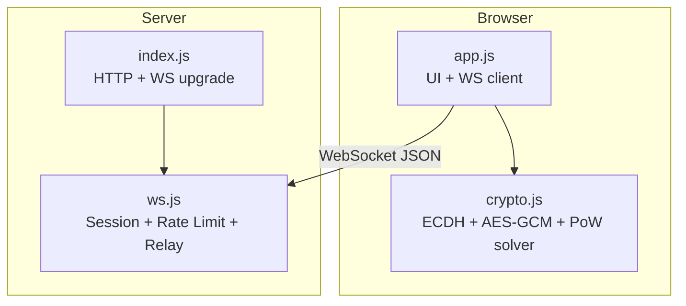
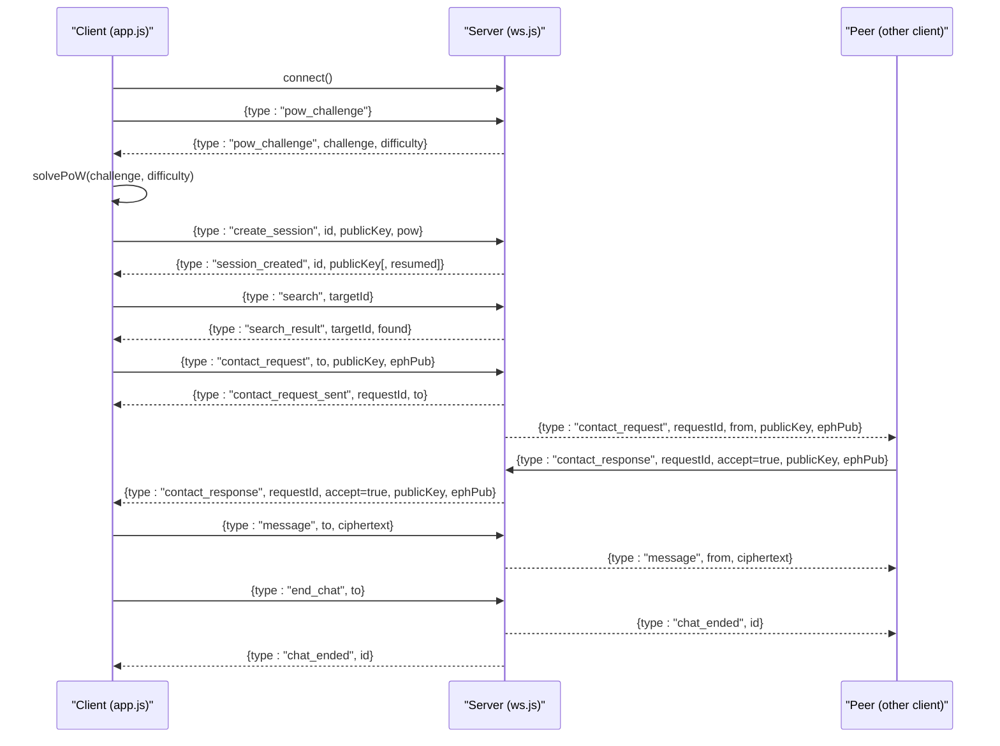
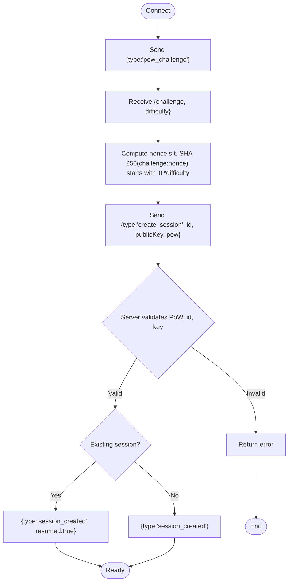
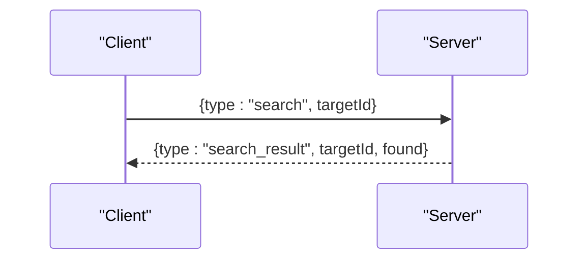
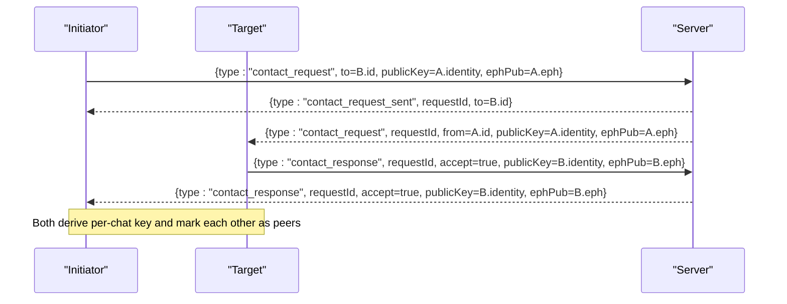
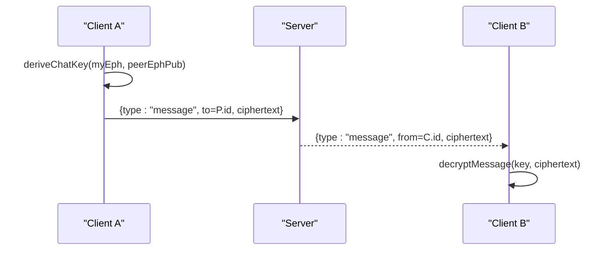
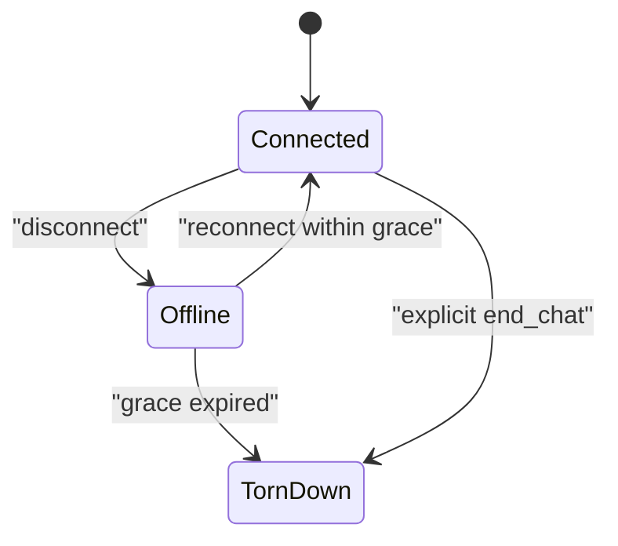
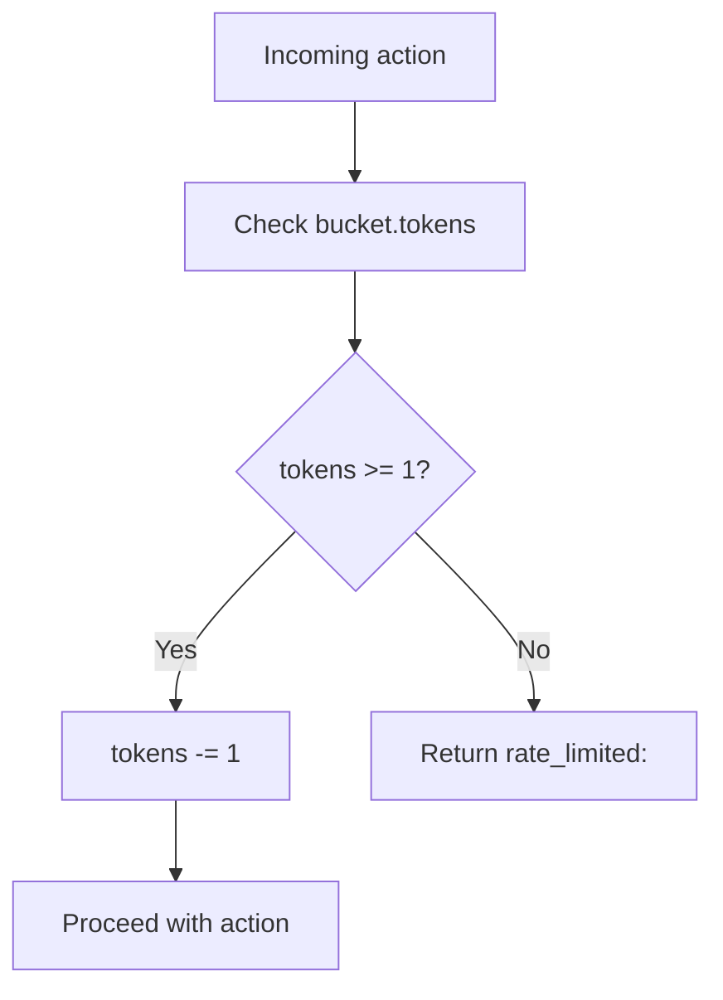
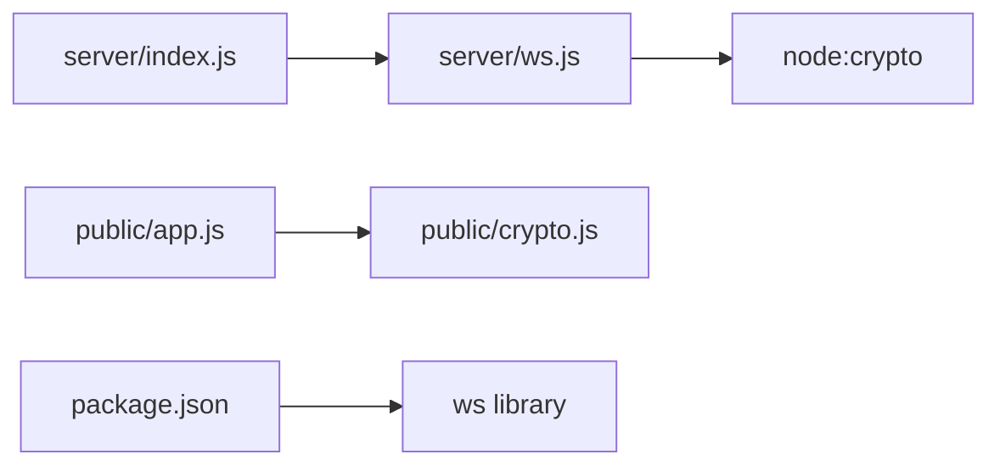

# API Reference

<cite>
**Referenced Files in This Document**
- [server/index.js](file://server/index.js)
- [server/ws.js](file://server/ws.js)
- [public/app.js](file://public/app.js)
- [public/crypto.js](file://public/crypto.js)
- [package.json](file://package.json)
</cite>

## Table of Contents
1. [Introduction](#introduction)
2. [Project Structure](#project-structure)
3. [Core Components](#core-components)
4. [Architecture Overview](#architecture-overview)
5. [Detailed Component Analysis](#detailed-component-analysis)
6. [Dependency Analysis](#dependency-analysis)
7. [Performance Considerations](#performance-considerations)
8. [Troubleshooting Guide](#troubleshooting-guide)
9. [Conclusion](#conclusion)
10. [Appendices](#appendices)

## Introduction
This document specifies the Shh V1.0 application programming interface for real-time, end-to-end encrypted messaging over WebSocket. The server is a privacy-focused relay that never sees plaintext or keys and stores no logs or persistent state. Clients authenticate via proof-of-work (PoW), establish sessions with identity public keys, perform peer discovery, exchange contact requests/responses to negotiate per-chat encryption keys, and then send encrypted messages through the server.

The protocol uses JSON-over-WebSocket frames. All payloads are UTF-8 JSON strings. There is no binary framing beyond base64-encoded ciphertexts inside JSON fields.

Key design goals:
- No server-side storage of content or keys.
- In-memory only session state with grace periods for reconnects.
- Rate limiting on sensitive operations.
- Forward secrecy per chat using ephemeral ECDH keypairs.
- Client-side cryptography with X25519/P-256 negotiation.

**Section sources**
- [package.json:1-19](file://package.json#L1-L19)
- [server/index.js:1-116](file://server/index.js#L1-L116)
- [server/ws.js:1-313](file://server/ws.js#L1-L313)
- [public/app.js:1-624](file://public/app.js#L1-L624)
- [public/crypto.js:1-242](file://public/crypto.js#L1-L242)

## Project Structure
The project consists of:
- A Node.js HTTP server that serves static assets and upgrades WebSocket connections.
- A WebSocket relay module implementing authentication, session management, rate limiting, and message routing.
- A browser client implementing UI, connection lifecycle, PoW solving, and end-to-end encryption.

**Diagram sources**
- [server/index.js:73-109](file://server/index.js#L73-L109)
- [server/ws.js:258-312](file://server/ws.js#L258-L312)
- [public/app.js:74-120](file://public/app.js#L74-L120)
- [public/crypto.js:113-127](file://public/crypto.js#L113-L127)

**Section sources**
- [server/index.js:1-116](file://server/index.js#L1-L116)
- [server/ws.js:1-313](file://server/ws.js#L1-L313)
- [public/app.js:1-624](file://public/app.js#L1-L624)
- [public/crypto.js:1-242](file://public/crypto.js#L1-L242)
- [package.json:1-19](file://package.json#L1-L19)

## Core Components
- Server HTTP entrypoint: serves static files, enforces security headers, and upgrades WebSocket connections.
- WebSocket relay: implements PoW challenge issuance/verification, session creation/resumption, presence, search, contact request/response, encrypted message relay, chat termination, and rate limiting.
- Browser client: manages WebSocket lifecycle, solves PoW, performs ECDH-based key negotiation, encrypts/decrypts messages, and renders UI.
- Cryptography module: provides PoW solver, identity/ephemeral key generation, curve detection, shared key derivation, fingerprinting, and AES-GCM encryption/decryption.

**Section sources**
- [server/index.js:41-109](file://server/index.js#L41-L109)
- [server/ws.js:36-120](file://server/ws.js#L36-L120)
- [public/app.js:74-120](file://public/app.js#L74-L120)
- [public/crypto.js:12-242](file://public/crypto.js#L12-L242)

## Architecture Overview
The protocol follows this sequence:
1. Client connects via WebSocket.
2. Client requests a PoW challenge.
3. Server issues a challenge; client computes a nonce.
4. Client sends create_session with identity public key and PoW solution.
5. Server validates PoW and creates or resumes a session.
6. Client searches for peers by ID.
7. Client initiates a contact request; target accepts or rejects.
8. Both sides derive a per-chat key and optionally verify fingerprints.
9. Client sends encrypted messages; server relays them.
10. Either side can end the chat; both receive chat_ended.

**Diagram sources**
- [public/app.js:99-120](file://public/app.js#L99-L120)
- [public/app.js:124-176](file://public/app.js#L124-L176)
- [public/app.js:237-310](file://public/app.js#L237-L310)
- [public/app.js:344-359](file://public/app.js#L344-L359)
- [public/app.js:362-382](file://public/app.js#L362-L382)
- [server/ws.js:94-105](file://server/ws.js#L94-L105)
- [server/ws.js:150-179](file://server/ws.js#L150-L179)
- [server/ws.js:181-255](file://server/ws.js#L181-L255)

## Detailed Component Analysis

### WebSocket Connection Lifecycle
- Handshake:
  - Client opens WebSocket to the same origin.
  - On open, client sends a PoW challenge request.
- Authentication via Proof-of-Work:
  - Server responds with a hex challenge and difficulty.
  - Client computes SHA-256(challenge:nonce) until it has the required leading zeros.
  - Client submits create_session with id, publicKey, and pow.challenge/pow.nonce.
- Session Establishment:
  - Server validates PoW, id format, and public key length.
  - If an existing session exists within the grace window and keys match, the client resumes.
  - Otherwise, a new session is created.
  - Server emits session_created with optional resumed flag.

**Diagram sources**
- [public/app.js:99-120](file://public/app.js#L99-L120)
- [public/crypto.js:113-127](file://public/crypto.js#L113-L127)
- [server/ws.js:94-105](file://server/ws.js#L94-L105)
- [server/ws.js:150-179](file://server/ws.js#L150-L179)

**Section sources**
- [public/app.js:74-120](file://public/app.js#L74-L120)
- [public/crypto.js:113-127](file://public/crypto.js#L113-L127)
- [server/ws.js:94-105](file://server/ws.js#L94-L105)
- [server/ws.js:150-179](file://server/ws.js#L150-L179)

### Message Types and Binary Formats
All messages are JSON objects sent over WebSocket text frames. There is no separate binary frame type. Fields used across messages include:
- type: string identifying the message kind.
- payload: varies by message type; not all messages use a single payload object.
- timestamp: not part of the wire protocol; timestamps are local to clients when rendering messages.
- signature: not part of the wire protocol; integrity is provided by AES-GCM and out-of-band fingerprint verification.

Message types:
- pow_challenge (client -> server): requests a new PoW challenge.
- pow_challenge (server -> client): includes challenge (hex string) and difficulty (integer).
- create_session (client -> server): includes id (base32 string), publicKey (base64), pow.challenge, pow.nonce.
- session_created (server -> client): includes id, publicKey, and optional resumed boolean.
- search (client -> server): includes targetId.
- search_result (server -> client): includes targetId and found boolean.
- contact_request (client -> server): includes to, fromId (injected by server), publicKey, ephPub.
- contact_request_sent (server -> client): includes requestId, to.
- contact_request_failed (server -> client): includes to, reason.
- contact_request (server -> target): includes requestId, from, publicKey, ephPub.
- contact_response (client -> server): includes requestId, accept, and if accepted publicKey and ephPub.
- contact_response (server -> requester): includes requestId, from, accept, and if accepted publicKey and ephPub.
- message (client -> server): includes to, ciphertext (base64).
- message (server -> peer): includes from, ciphertext.
- chat_ended (server -> both): includes id.
- peer_offline (server -> peers): includes id.
- peer_online (server -> peers): includes id.
- error (server -> client): includes message (error code string).
- ping/pong: keepalive; client may send ping, server replies pong.

Notes:
- Timestamps are not transmitted; clients attach local time when displaying messages.
- Signatures are not transmitted; confidentiality and integrity are ensured by AES-GCM.
- Public keys are base64-encoded raw points; lengths indicate curve: 44 chars for X25519, 88 chars for P-256 uncompressed point.

**Section sources**
- [server/ws.js:258-312](file://server/ws.js#L258-L312)
- [public/app.js:124-176](file://public/app.js#L124-L176)
- [public/app.js:237-310](file://public/app.js#L237-L310)
- [public/app.js:344-359](file://public/app.js#L344-L359)
- [public/app.js:362-382](file://public/app.js#L362-L382)

### Request/Response Patterns

#### Peer Discovery
- Client sends search with targetId.
- Server returns search_result indicating whether the target is online.
- Presence is limited to online/offline; no additional metadata is exposed.

**Diagram sources**
- [server/ws.js:181-186](file://server/ws.js#L181-L186)
- [public/app.js:227-235](file://public/app.js#L227-L235)

**Section sources**
- [server/ws.js:181-186](file://server/ws.js#L181-L186)
- [public/app.js:227-235](file://public/app.js#L227-L235)

#### Contact Management
- Initiator sends contact_request with its identity public key and an ephemeral public key.
- Server acknowledges with contact_request_sent and forwards contact_request to target.
- Target responds with contact_response (accept/reject).
- If accepted, both sides derive a per-chat key using their own ephemeral private key and the other’s ephemeral public key, then establish adjacency.

**Diagram sources**
- [server/ws.js:188-229](file://server/ws.js#L188-L229)
- [public/app.js:237-310](file://public/app.js#L237-L310)

**Section sources**
- [server/ws.js:188-229](file://server/ws.js#L188-L229)
- [public/app.js:237-310](file://public/app.js#L237-L310)

#### Chat Initialization and Messaging
- After contact acceptance, both clients compute the same AES-256-GCM key using ECDH and HKDF.
- Clients encrypt messages locally and send ciphertext to the server.
- Server relays the ciphertext to the recipient without seeing plaintext.
- Recipient decrypts locally and appends to chat history.

**Diagram sources**
- [public/crypto.js:191-211](file://public/crypto.js#L191-L211)
- [public/crypto.js:228-241](file://public/crypto.js#L228-L241)
- [public/app.js:344-359](file://public/app.js#L344-L359)
- [server/ws.js:231-240](file://server/ws.js#L231-L240)

**Section sources**
- [public/crypto.js:191-241](file://public/crypto.js#L191-L241)
- [public/app.js:324-359](file://public/app.js#L324-L359)
- [server/ws.js:231-240](file://server/ws.js#L231-L240)

#### Disconnection Handling
- When a client disconnects, the server marks the session offline and notifies peers.
- A grace period allows reconnection to resume the same session if the identity key matches.
- If the client does not reconnect within the grace period, the session is torn down.

**Diagram sources**
- [server/ws.js:123-148](file://server/ws.js#L123-L148)
- [server/ws.js:150-179](file://server/ws.js#L150-L179)

**Section sources**
- [server/ws.js:123-148](file://server/ws.js#L123-L148)
- [public/app.js:86-93](file://public/app.js#L86-L93)

### Error Codes and Failure Handling
Error codes returned in {type:"error", message}:
- bad_id: invalid session identifier format.
- bad_key: invalid public key length or encoding.
- bad_pow: invalid or expired PoW solution.
- id_taken: session already active with a different key or still connected.
- too_large: message exceeds maximum size.
- no_session: operation attempted without an established session.
- bad_request: malformed or unauthorized request context.
- rate_limited:<action>: throttled responses for actions like search, contact, message, create.

Client handling:
- For rate-limited errors, the client shows user-friendly messages and waits before retrying.
- For too_large, the client prevents sending oversized messages.
- For id_taken/bad_pow, the client prompts the user to retry session creation.

**Section sources**
- [server/ws.js:89-91](file://server/ws.js#L89-L91)
- [server/ws.js:150-179](file://server/ws.js#L150-L179)
- [server/ws.js:181-240](file://server/ws.js#L181-L240)
- [public/app.js:178-193](file://public/app.js#L178-L193)

### Rate Limiting API
Rate limiting uses token buckets per action:
- search: burst capacity and refill rate tuned to prevent ID enumeration.
- contact: low burst to prevent spam requests.
- message: higher burst for normal chat usage.
- create: strict limits on session creation attempts.

Throttling behavior:
- If allow(conn, action) fails, the server returns a rate_limited:<action> error.
- Clients should back off and retry after a delay, showing appropriate feedback.

**Diagram sources**
- [server/ws.js:37-65](file://server/ws.js#L37-L65)
- [server/ws.js:150-186](file://server/ws.js#L150-L186)
- [server/ws.js:231-240](file://server/ws.js#L231-L240)

**Section sources**
- [server/ws.js:37-65](file://server/ws.js#L37-L65)
- [public/app.js:178-193](file://public/app.js#L178-L193)

### Debugging Techniques, Logging Strategies, and Monitoring
Server-side:
- The server intentionally avoids logging IPs and request details.
- It writes minimal startup output and swallows connection errors.
- To debug locally, enable verbose logging in development environments and inspect WebSocket frames using browser developer tools.

Client-side:
- Use browser DevTools Network/WebSocket tabs to inspect JSON frames.
- Monitor toast notifications for error feedback.
- Verify cryptographic support via detectCurve and ensure ECDH availability.

Monitoring approaches:
- Track connection states (online/offline) and presence events.
- Observe rate-limited errors to tune client retry strategies.
- Measure message sizes against the 2 KB limit.

**Section sources**
- [server/index.js:1-116](file://server/index.js#L1-L116)
- [server/ws.js:299-312](file://server/ws.js#L299-L312)
- [public/app.js:178-193](file://public/app.js#L178-L193)
- [public/app.js:559-567](file://public/app.js#L559-L567)

### Protocol Versioning, Backwards Compatibility, and Migration
- The crypto module uses info label "shh-chat-v1" for HKDF derivation, indicating versioned key derivation.
- Curve negotiation supports X25519 and P-256 fallback based on browser capabilities.
- Public key length determines curve; clients must handle both 32-byte (X25519) and 65-byte (P-256) raw points.
- Future updates should:
  - Increment the info label and/or add a protocol version field in handshake messages.
  - Maintain backward compatibility by supporting older curves and formats during migration windows.
  - Clearly deprecate obsolete message types and provide graceful fallbacks.

**Section sources**
- [public/crypto.js:13-14](file://public/crypto.js#L13-L14)
- [public/crypto.js:135-157](file://public/crypto.js#L135-L157)
- [public/crypto.js:174-180](file://public/crypto.js#L174-L180)
- [public/crypto.js:191-211](file://public/crypto.js#L191-L211)

## Dependency Analysis
The system components depend on each other as follows:
- server/index.js depends on ws.js for WebSocket handling.
- server/ws.js depends on Node crypto for hashing and randomization.
- public/app.js depends on public/crypto.js for cryptographic operations and UI logic.
- package.json declares ws dependency and Node engine requirements.

**Diagram sources**
- [server/index.js:1-10](file://server/index.js#L1-L10)
- [server/ws.js:1-4](file://server/ws.js#L1-L4)
- [public/app.js:4-8](file://public/app.js#L4-L8)
- [package.json:14-16](file://package.json#L14-L16)

**Section sources**
- [server/index.js:1-10](file://server/index.js#L1-L10)
- [server/ws.js:1-4](file://server/ws.js#L1-L4)
- [public/app.js:4-8](file://public/app.js#L4-L8)
- [package.json:14-16](file://package.json#L14-L16)

## Performance Considerations
- Max payload size is set to 16 KB at the server level; message payloads are capped at 2 KB plaintext plus overhead.
- Rate limiting protects against abuse while allowing bursts for normal usage.
- Grace periods reduce churn during page refreshes and transient network issues.
- Client-side PoW solver yields to the event loop to keep UI responsive.
- Avoid storing large amounts of data in memory; chats are kept in RAM only.

[No sources needed since this section provides general guidance]

## Troubleshooting Guide
Common issues and resolutions:
- Browser lacks ECDH support:
  - The client detects unsupported curves and disables creation. Update the browser or ensure Web Crypto API supports X25519/P-256.
- Session creation fails:
  - Check for bad_id, bad_key, bad_pow, or id_taken errors. Regenerate identity or wait for grace period.
- Messages not delivered:
  - Ensure the target is online; otherwise, peer_offline is returned.
  - Verify message size does not exceed 2 KB.
- Rate-limited responses:
  - Back off and retry after a short delay. The client displays user-friendly messages for throttling.

Operational tips:
- Inspect WebSocket frames in browser DevTools.
- Monitor toast notifications for error feedback.
- Confirm presence events (peer_online/peer_offline) to diagnose connectivity.

**Section sources**
- [public/app.js:559-567](file://public/app.js#L559-L567)
- [public/app.js:178-193](file://public/app.js#L178-L193)
- [public/app.js:324-359](file://public/app.js#L324-L359)
- [server/ws.js:181-240](file://server/ws.js#L181-L240)

## Conclusion
Shh V1.0 provides a secure, privacy-first real-time messaging API over WebSocket. Clients authenticate via proof-of-work, establish sessions with identity keys, negotiate per-chat encryption keys, and exchange encrypted messages through a non-logging relay. The protocol emphasizes forward secrecy, rate limiting, and graceful disconnection handling. Future versions should introduce explicit protocol versioning and maintain backwards compatibility during migrations.

[No sources needed since this section summarizes without analyzing specific files]

## Appendices

### Example Scenarios

#### Establishing a New Chat
- Connect and solve PoW.
- Search for peer by ID.
- Send contact_request with identity and ephemeral public keys.
- Accept or reject incoming requests.
- Derive per-chat key and start exchanging encrypted messages.

**Section sources**
- [public/app.js:99-120](file://public/app.js#L99-L120)
- [public/app.js:227-310](file://public/app.js#L227-L310)
- [server/ws.js:188-229](file://server/ws.js#L188-L229)

#### Sending Encrypted Messages
- Encrypt plaintext locally using derived chat key.
- Send ciphertext to server with target peer ID.
- Server relays ciphertext to recipient.
- Recipient decrypts and displays message.

**Section sources**
- [public/crypto.js:228-241](file://public/crypto.js#L228-L241)
- [public/app.js:344-359](file://public/app.js#L344-L359)
- [server/ws.js:231-240](file://server/ws.js#L231-L240)

#### Handling Disconnections
- On close, client schedules quick reconnect.
- Server marks session offline and notifies peers.
- Within grace period, reconnection resumes session if identity matches.

**Section sources**
- [public/app.js:86-93](file://public/app.js#L86-L93)
- [server/ws.js:133-148](file://server/ws.js#L133-L148)