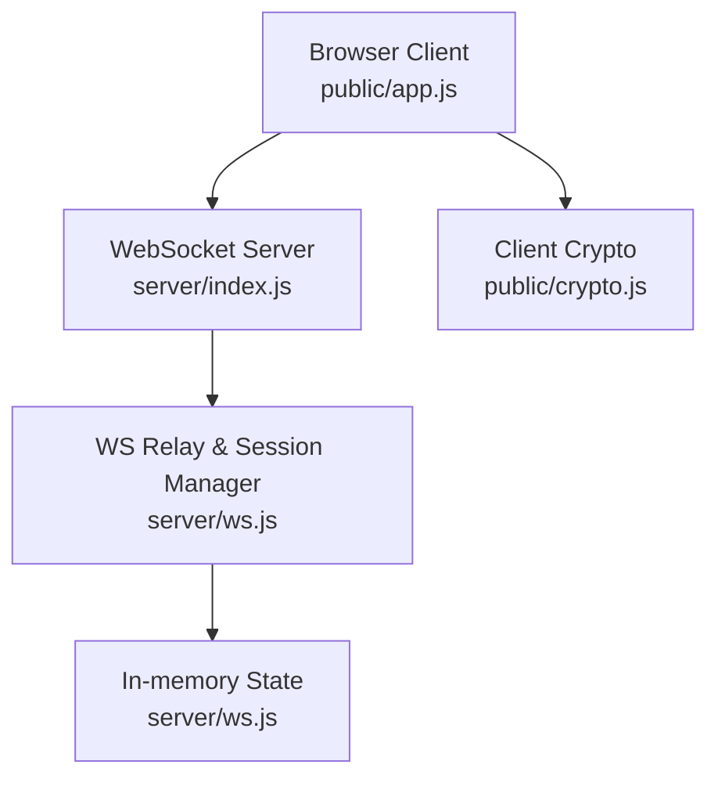
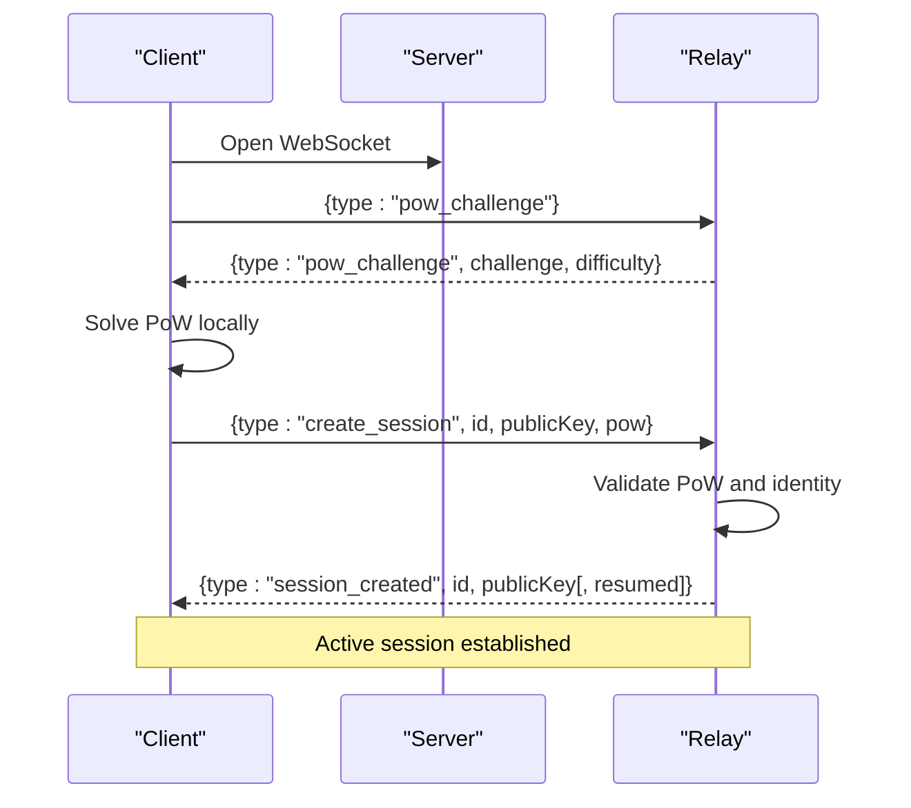
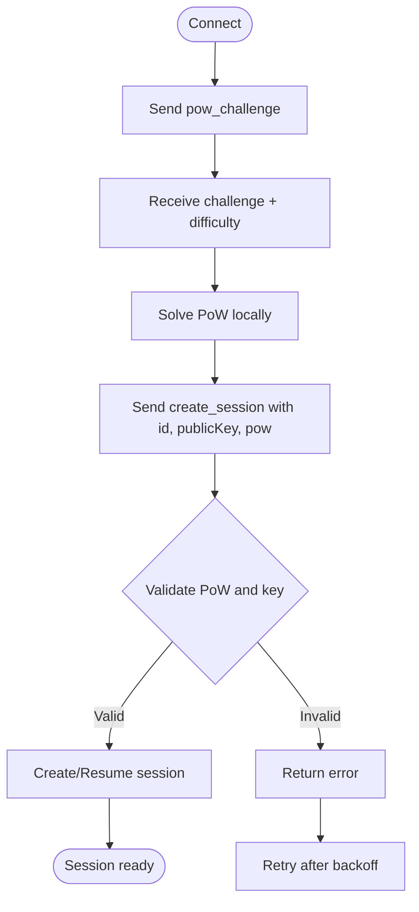
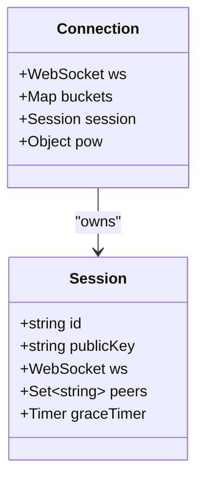
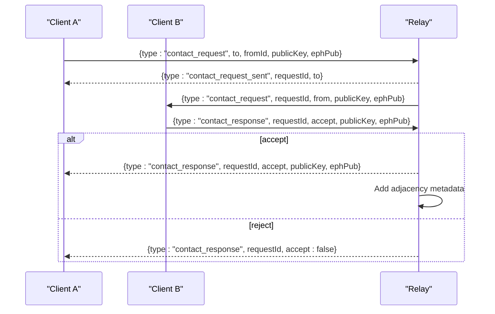
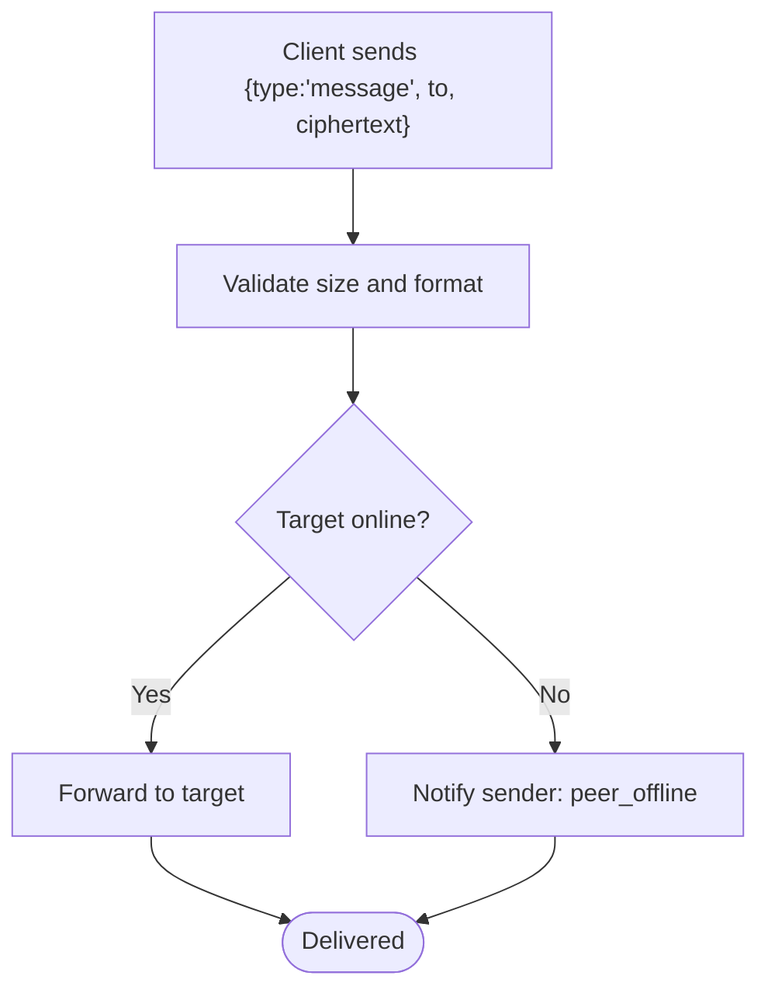
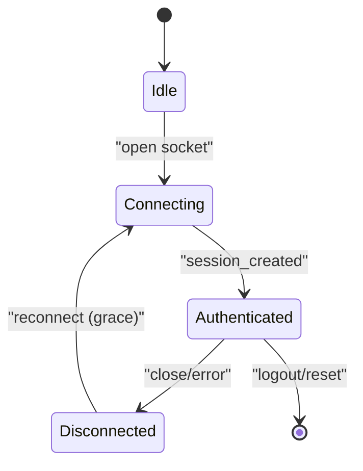
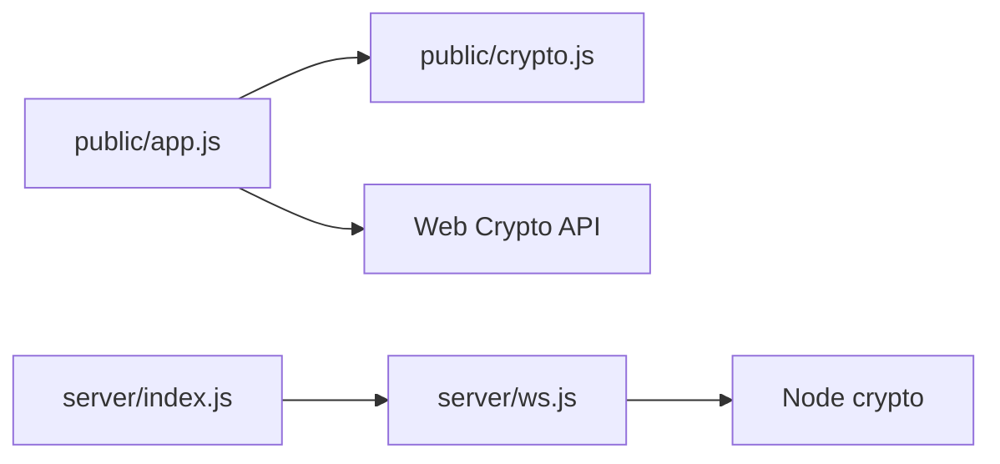

# Connection Protocol

<cite>
**Referenced Files in This Document**
- [server/index.js](file://server/index.js)
- [server/ws.js](file://server/ws.js)
- [public/app.js](file://public/app.js)
- [public/crypto.js](file://public/crypto.js)
- [package.json](file://package.json)
</cite>

## Table of Contents
1. [Introduction](#introduction)
2. [Project Structure](#project-structure)
3. [Core Components](#core-components)
4. [Architecture Overview](#architecture-overview)
5. [Detailed Component Analysis](#detailed-component-analysis)
6. [Dependency Analysis](#dependency-analysis)
7. [Performance Considerations](#performance-considerations)
8. [Troubleshooting Guide](#troubleshooting-guide)
9. [Conclusion](#conclusion)

## Introduction
This document describes the WebSocket connection protocol used by Shh V1.0, focusing on the complete connection lifecycle: initial handshake, proof-of-work (PoW) authentication, and session establishment. It explains how a client initiates a connection, how the server validates PoW and identity, and how an active encrypted chat session is created. It also covers connection parameters, tokens, identifiers, error handling, state management, reconnection strategies, graceful disconnection, and security considerations for connection establishment and protection against connection-based attacks.

## Project Structure
Shh V1.0 consists of a Node.js HTTP server that upgrades to WebSocket and a browser client that implements the protocol and end-to-end encryption. The server exposes static assets and wires the WebSocket upgrade; the client handles connection, PoW solving, session creation, messaging, and UI state.

**Diagram sources**
- [server/index.js:73-115](file://server/index.js#L73-L115)
- [server/ws.js:258-312](file://server/ws.js#L258-L312)
- [public/app.js:74-120](file://public/app.js#L74-L120)
- [public/crypto.js:113-127](file://public/crypto.js#L113-L127)

**Section sources**
- [server/index.js:1-116](file://server/index.js#L1-L116)
- [server/ws.js:1-313](file://server/ws.js#L1-L313)
- [public/app.js:1-624](file://public/app.js#L1-L624)
- [public/crypto.js:1-242](file://public/crypto.js#L1-L242)
- [package.json:1-19](file://package.json#L1-L19)

## Core Components
- WebSocket server and upgrade handler: Accepts HTTP requests, serves static files with strict security headers, and upgrades to WebSocket when requested.
- WebSocket relay and session manager: Validates messages, enforces rate limits, issues and verifies PoW challenges, manages sessions, presence, contact requests, and message relaying.
- Client application: Establishes WebSocket connections, solves PoW challenges, creates/resumes sessions, performs ECDH key exchange per chat, encrypts/decrypts messages, and manages UI state including reconnection and graceful disconnect.
- Cryptography module: Implements PoW solver, ECDH curve negotiation (X25519/P-256), HKDF-based key derivation, AES-GCM encryption, and fingerprinting.

**Section sources**
- [server/index.js:24-84](file://server/index.js#L24-L84)
- [server/ws.js:5-21](file://server/ws.js#L5-L21)
- [public/app.js:74-120](file://public/app.js#L74-L120)
- [public/crypto.js:129-211](file://public/crypto.js#L129-L211)

## Architecture Overview
The connection flow proceeds as follows:
1. Client opens a WebSocket to the server.
2. Client immediately sends a pow_challenge request.
3. Server responds with a challenge and difficulty.
4. Client solves the PoW locally and sends create_session with its identity public key and PoW nonce.
5. Server validates PoW and identity, then creates or resumes a session and returns session_created.
6. Client enters the app and can search for peers, send contact requests, and exchange encrypted messages.

**Diagram sources**
- [public/app.js:74-120](file://public/app.js#L74-L120)
- [server/ws.js:94-179](file://server/ws.js#L94-L179)

## Detailed Component Analysis

### Initial Handshake and Proof-of-Work
- Client initiates connection and requests a PoW challenge immediately after opening the socket.
- Server issues a random challenge and difficulty level.
- Client computes a nonce such that SHA-256(challenge:nonce) has the required leading zeros.
- Client submits create_session with its base64-encoded identity public key and the PoW solution.

Key behaviors:
- Challenge issuance and verification are enforced server-side with bounds on nonce values.
- The PoW is single-use per challenge; the server clears it after successful session creation.
- Rate limiting applies to session creation attempts.

**Diagram sources**
- [public/app.js:99-120](file://public/app.js#L99-L120)
- [server/ws.js:94-105](file://server/ws.js#L94-L105)
- [server/ws.js:150-179](file://server/ws.js#L150-L179)

**Section sources**
- [public/app.js:99-120](file://public/app.js#L99-L120)
- [public/crypto.js:113-127](file://public/crypto.js#L113-L127)
- [server/ws.js:94-105](file://server/ws.js#L94-L105)
- [server/ws.js:150-179](file://server/ws.js#L150-L179)

### Session Establishment and Parameters
- Identifier: A base32 string of 12–16 characters generated by the client.
- Identity key: Base64-encoded X25519 or P-256 public key negotiated via curve detection.
- PoW token: Contains challenge and nonce submitted with create_session.
- Session response: Returns id, publicKey, and optionally resumed flag if reconnecting within grace window.

Validation rules:
- Identifier format must match the expected pattern.
- Public key length must correspond to supported curves.
- PoW must be valid and within allowed nonce range.
- If the identifier is already taken by another active session or mismatched key, creation fails.

**Diagram sources**
- [server/ws.js:23-34](file://server/ws.js#L23-L34)
- [server/ws.js:150-179](file://server/ws.js#L150-L179)

**Section sources**
- [server/ws.js:10-13](file://server/ws.js#L10-L13)
- [server/ws.js:150-179](file://server/ws.js#L150-L179)
- [public/app.js:108-120](file://public/app.js#L108-L120)

### Presence, Contact Requests, and Chat Adjacency
- Search: Clients can check if a target ID is online; only presence is exposed.
- Contact request: Initiator sends toId, fromId, publicKey, ephPub; server forwards to target if online.
- Contact response: Target accepts or rejects; if accepted, both sides establish adjacency metadata (no content).
- End chat: Both sides receive chat_ended and clear adjacency.

**Diagram sources**
- [server/ws.js:188-229](file://server/ws.js#L188-L229)
- [public/app.js:237-310](file://public/app.js#L237-L310)

**Section sources**
- [server/ws.js:181-229](file://server/ws.js#L181-L229)
- [public/app.js:227-310](file://public/app.js#L227-L310)

### Message Relaying and Encryption
- Messages are base64-encoded ciphertexts limited to a maximum size.
- Server validates payload size and relays to the target if online; otherwise notifies sender that peer is offline.
- No store-and-forward: messages are not queued.
- Client encrypts using per-chat AES-GCM keys derived via ECDH and HKDF.

**Diagram sources**
- [server/ws.js:231-240](file://server/ws.js#L231-L240)
- [public/app.js:344-359](file://public/app.js#L344-L359)

**Section sources**
- [server/ws.js:231-240](file://server/ws.js#L231-L240)
- [public/app.js:344-359](file://public/app.js#L344-L359)

### Connection State Management and Reconnection
- Grace period: After a tab closes, the server retains the session briefly to allow resume within a short window.
- Reconnect strategy: Client retries quickly after close; if resumed, it resends create_session with the same id and a fresh PoW.
- Presence updates: On disconnect, server informs peers that the user is offline; on resume, peers are notified online again.

**Diagram sources**
- [public/app.js:86-106](file://public/app.js#L86-L106)
- [server/ws.js:133-148](file://server/ws.js#L133-L148)
- [server/ws.js:150-179](file://server/ws.js#L150-L179)

**Section sources**
- [public/app.js:86-106](file://public/app.js#L86-L106)
- [server/ws.js:133-148](file://server/ws.js#L133-L148)
- [server/ws.js:150-179](file://server/ws.js#L150-L179)

### Graceful Disconnection Procedures
- Client-initiated logout resets all local state and closes the socket intentionally without reconnection.
- Server cleans up session references and notifies peers of offline status; after grace period, teardown removes session data.

**Section sources**
- [public/app.js:532-554](file://public/app.js#L532-L554)
- [server/ws.js:123-148](file://server/ws.js#L123-L148)

## Dependency Analysis
- The server depends on the ws library for WebSocket support and uses Node’s crypto module for hashing and randomness.
- The client relies on Web Crypto API for ECDH, HKDF, AES-GCM, and a custom PoW solver.
- Security headers and CSP restrict resource loading and WebSocket origins.

**Diagram sources**
- [public/app.js:4-8](file://public/app.js#L4-L8)
- [server/index.js:3-9](file://server/index.js#L3-L9)
- [server/ws.js:3](file://server/ws.js#L3)
- [public/crypto.js:1-11](file://public/crypto.js#L1-L11)

**Section sources**
- [package.json:14-16](file://package.json#L14-L16)
- [server/index.js:3-9](file://server/index.js#L3-L9)
- [public/app.js:4-8](file://public/app.js#L4-L8)

## Performance Considerations
- PoW difficulty and nonce limits balance anti-spam protection with usability.
- Rate limiting uses token buckets per action type to prevent abuse while allowing bursts.
- Message payloads are capped to protect server resources and reduce bandwidth usage.
- In-memory state avoids disk I/O overhead but means no persistence across restarts.

[No sources needed since this section provides general guidance]

## Troubleshooting Guide
Common errors during connection and session establishment:
- bad_pow: PoW solution invalid or expired; retry with a new challenge.
- bad_key: Public key length unsupported; ensure correct curve and encoding.
- bad_id: Identifier format invalid; generate a compliant base32 ID.
- id_taken: Another active session holds the ID or key mismatch; choose a different ID or wait for grace expiry.
- rate_limited:create/search/contact/message: Too many requests; wait for bucket refill.
- too_large: Message exceeds maximum size; split or shorten content.
- no_session: Attempted operation before session creation; complete handshake first.

Recovery steps:
- For transient network issues, rely on automatic reconnection; the client will request a new PoW and attempt resume if within grace window.
- For persistent failures, regenerate identity and ID, then reconnect.

**Section sources**
- [public/app.js:178-193](file://public/app.js#L178-L193)
- [server/ws.js:89-91](file://server/ws.js#L89-L91)
- [server/ws.js:150-186](file://server/ws.js#L150-L186)

## Conclusion
Shh V1.0 implements a secure, privacy-focused WebSocket protocol with PoW-based authentication, ephemeral per-chat encryption, and minimal server state. The connection lifecycle emphasizes fast recovery through grace periods and robust error handling. Security measures include strict CSP, rate limiting, payload caps, and end-to-end encryption with forward secrecy. By following the documented flows and error handling strategies, developers can integrate clients that reliably connect, authenticate, and communicate securely.