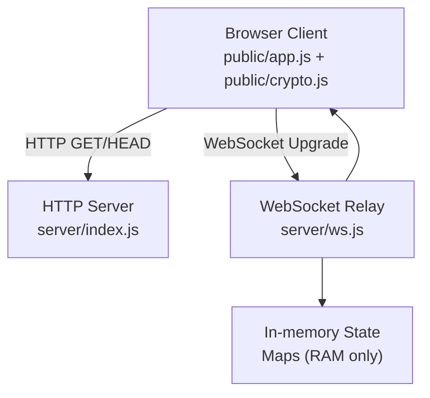
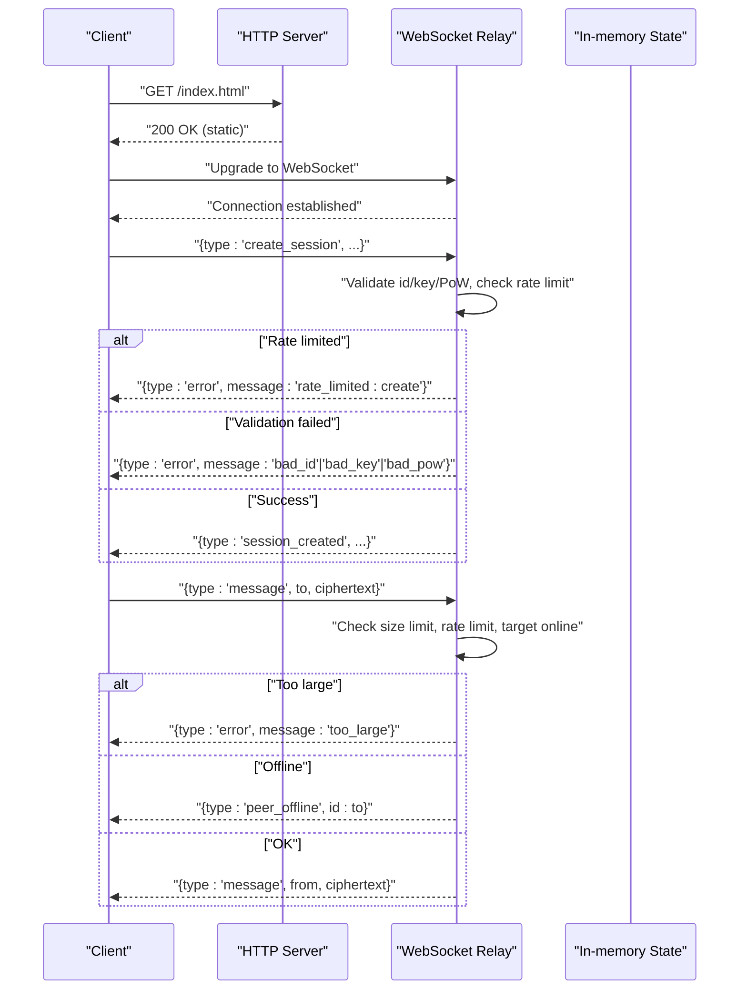
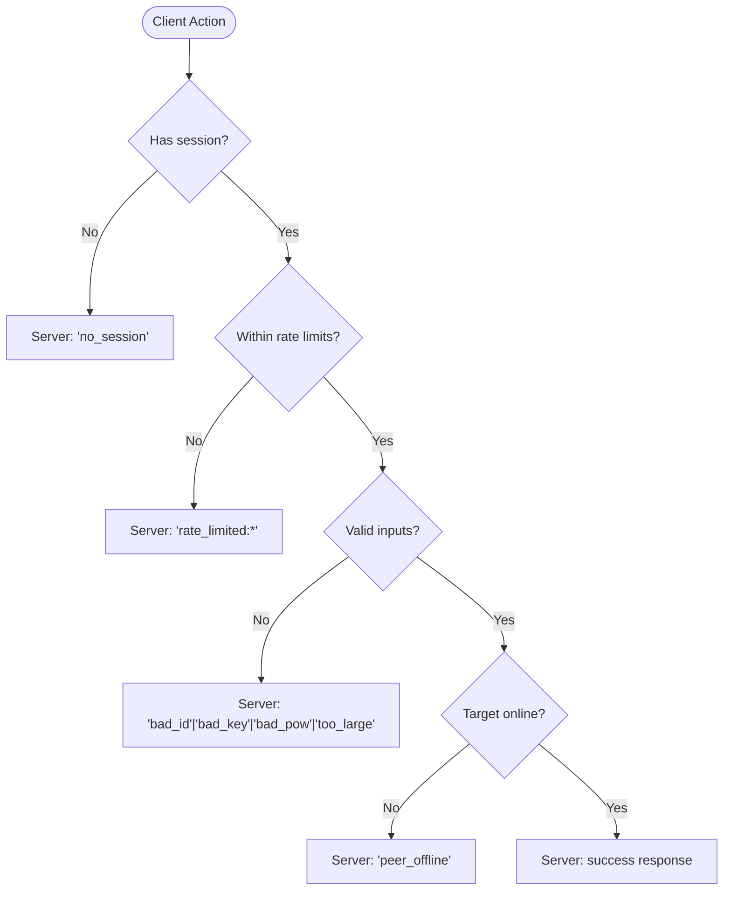

# Error Handling

<cite>
**Referenced Files in This Document**
- [server/index.js](file://server/index.js)
- [server/ws.js](file://server/ws.js)
- [public/app.js](file://public/app.js)
- [public/crypto.js](file://public/crypto.js)
- [package.json](file://package.json)
</cite>

## Table of Contents
1. [Introduction](#introduction)
2. [Project Structure](#project-structure)
3. [Core Components](#core-components)
4. [Architecture Overview](#architecture-overview)
5. [Detailed Component Analysis](#detailed-component-analysis)
6. [Dependency Analysis](#dependency-analysis)
7. [Performance Considerations](#performance-considerations)
8. [Troubleshooting Guide](#troubleshooting-guide)
9. [Conclusion](#conclusion)
10. [Appendices](#appendices)

## Introduction
This document explains error handling and status behavior for the Shh V1.0 API. It covers:
- All server-side error types and messages returned to clients
- Rate limiting errors with specific codes
- Validation errors and their meanings
- Client-side error handling patterns and recovery strategies
- Timeout, connection loss, and graceful degradation approaches
- Common error scenarios and recommended client responses

The protocol is WebSocket-based; HTTP is used only to serve static assets. Errors are delivered as JSON messages over the WebSocket channel.

## Project Structure
Shh consists of a small Node.js server that serves static files and relays encrypted messages via WebSockets, and a browser client that performs all cryptography locally.

**Diagram sources**
- [server/index.js:41-89](file://server/index.js#L41-L89)
- [server/index.js:91-109](file://server/index.js#L91-L109)
- [server/ws.js:23-34](file://server/ws.js#L23-L34)
- [public/app.js:74-106](file://public/app.js#L74-L106)

**Section sources**
- [server/index.js:1-116](file://server/index.js#L1-L116)
- [server/ws.js:1-313](file://server/ws.js#L1-L313)
- [public/app.js:1-624](file://public/app.js#L1-L624)
- [public/crypto.js:1-242](file://public/crypto.js#L1-L242)
- [package.json:1-19](file://package.json#L1-L19)

## Core Components
- Server HTTP layer: Serves static assets, enforces security headers, rejects non-GET/HEAD methods, and upgrades WebSocket connections.
- WebSocket relay: Validates messages, enforces rate limits and proof-of-work, manages sessions, presence, contact requests, and message relay.
- Client application: Connects to the server, solves PoW, creates/resumes sessions, handles search/contact/message flows, and renders UI feedback for errors.

Key responsibilities relevant to error handling:
- Server validates inputs and enforces limits; returns structured error messages.
- Client interprets error messages and updates UI accordingly.

**Section sources**
- [server/index.js:41-89](file://server/index.js#L41-L89)
- [server/ws.js:36-65](file://server/ws.js#L36-L65)
- [server/ws.js:89-120](file://server/ws.js#L89-L120)
- [public/app.js:178-193](file://public/app.js#L178-L193)

## Architecture Overview
The error flow begins when the client sends a request or the server detects an invalid state. The server responds with a JSON object containing a type and a message. The client’s message handler routes these to a unified error handler that displays user-friendly feedback and adjusts UI state.

**Diagram sources**
- [server/index.js:91-109](file://server/index.js#L91-L109)
- [server/ws.js:150-179](file://server/ws.js#L150-L179)
- [server/ws.js:231-240](file://server/ws.js#L231-L240)
- [public/app.js:125-176](file://public/app.js#L125-L176)

## Detailed Component Analysis

### Server-Side Error Types and Messages
The server emits structured error messages using a consistent shape:
- type: "error"
- message: one of the defined error codes

Defined error codes and when they occur:
- "rate_limited:create": Creating a session too frequently.
- "rate_limited:search": Searching too frequently.
- "rate_limited:contact": Sending contact requests too frequently.
- "rate_limited:message": Sending messages too frequently.
- "bad_id": Invalid session identifier format.
- "bad_key": Invalid public key base64 length or content.
- "bad_pow": Proof-of-work challenge not solved correctly or expired.
- "too_large": Message payload exceeds maximum allowed size.
- "no_session": Attempted an action without an active session.
- "id_taken": Session ID already taken during reconnect window.
- "offline": Contact request target is offline (returned as part of a different message type).

Where these are produced:
- Rate limiting checks per action use token buckets and return the corresponding rate-limited code.
- Input validation checks for id, key, and PoW validity.
- Message size validation rejects oversized payloads.
- Missing session guards reject actions without a session.
- Presence and delivery logic inform about offline peers.

**Section sources**
- [server/ws.js:15-21](file://server/ws.js#L15-L21)
- [server/ws.js:36-65](file://server/ws.js#L36-L65)
- [server/ws.js:150-179](file://server/ws.js#L150-L179)
- [server/ws.js:181-186](file://server/ws.js#L181-L186)
- [server/ws.js:188-205](file://server/ws.js#L188-L205)
- [server/ws.js:231-240](file://server/ws.js#L231-L240)
- [server/ws.js:257-303](file://server/ws.js#L257-L303)

### Client-Side Error Handling Patterns
The client centralizes error handling in a single function that:
- Disables controls temporarily and resets hints
- Displays contextual toasts for rate limits and validation errors
- Ignores expected non-fatal protocol errors like no_session in normal flows

Behavior highlights:
- Rate-limited errors show localized messages indicating which operation was throttled.
- Oversized messages prompt users to reduce content size.
- Session creation failures suggest retrying after a short delay.
- Non-fatal errors such as no_session are suppressed to avoid noisy UI.

Recovery strategies:
- For rate limits: wait and retry later; the client does not queue retries automatically but can be designed to do so with backoff.
- For offline peers: present presence indicators and allow reattempt once the peer comes online.
- For connection drops: auto-reconnect within a grace period; resume session if possible.

**Section sources**
- [public/app.js:178-193](file://public/app.js#L178-L193)
- [public/app.js:125-176](file://public/app.js#L125-L176)
- [public/app.js:227-249](file://public/app.js#L227-L249)
- [public/app.js:344-359](file://public/app.js#L344-L359)

### Rate Limiting Details
Token buckets enforce per-action limits:
- create: low burst to prevent abuse during identity setup
- search: anti-enumeration protection
- contact: anti-spam for contact requests
- message: burst then steady rate for messaging

When exceeded, the server returns the corresponding rate_limited:<action> error. Clients should:
- Show a friendly message
- Disable the offending action briefly
- Optionally implement exponential backoff before retrying

**Section sources**
- [server/ws.js:15-21](file://server/ws.js#L15-L21)
- [server/ws.js:36-65](file://server/ws.js#L36-L65)
- [server/ws.js:150-179](file://server/ws.js#L150-L179)
- [server/ws.js:181-186](file://server/ws.js#L181-L186)
- [server/ws.js:188-205](file://server/ws.js#L188-L205)
- [server/ws.js:231-240](file://server/ws.js#L231-L240)
- [public/app.js:178-193](file://public/app.js#L178-L193)

### Validation Errors
- bad_id: Identifier must match the required base32 pattern and length.
- bad_key: Public key must be a valid base64 string of supported lengths.
- bad_pow: Challenge must match and nonce must satisfy difficulty constraints.
- too_large: Encrypted message exceeds maximum size.
- no_session: Action requires an authenticated session.

Clients should:
- Validate inputs on the client side where possible (e.g., message size)
- Display clear guidance when validation fails
- Avoid retry loops for invalid inputs; require user correction

**Section sources**
- [server/ws.js:150-179](file://server/ws.js#L150-L179)
- [server/ws.js:188-205](file://server/ws.js#L188-L205)
- [server/ws.js:231-240](file://server/ws.js#L231-L240)
- [server/ws.js:257-303](file://server/ws.js#L257-L303)
- [public/app.js:344-359](file://public/app.js#L344-L359)

### Presence, Offline, and Graceful Degradation
- When a peer goes offline, the server notifies peers with a presence event.
- If a message cannot be delivered because the recipient is offline, the sender receives a presence notification rather than a queued failure.
- There is no store-and-forward; messages are not persisted.

Client behavior:
- Update presence indicators immediately
- Allow users to retry sending after confirming the peer is online
- Provide clear messaging that messages are not stored server-side

**Section sources**
- [server/ws.js:133-148](file://server/ws.js#L133-L148)
- [server/ws.js:188-205](file://server/ws.js#L188-L205)
- [server/ws.js:231-240](file://server/ws.js#L231-L240)
- [public/app.js:164-169](file://public/app.js#L164-L169)
- [public/app.js:390-396](file://public/app.js#L390-L396)

### Connection Loss and Reconnection
- On close, the client clears online indicators and schedules a quick reconnect within the server’s grace window.
- If a session exists, the client attempts to resume it by re-authenticating with the same identity and solving a fresh PoW.
- Intentional closes skip reconnection.

Graceful degradation:
- UI reflects offline state until reconnection succeeds
- Users can continue composing messages; send occurs after reconnect
- Presence updates reflect real-time changes

**Section sources**
- [public/app.js:74-106](file://public/app.js#L74-L106)
- [public/app.js:86-93](file://public/app.js#L86-L93)
- [public/app.js:108-120](file://public/app.js#L108-L120)
- [server/ws.js:133-148](file://server/ws.js#L133-L148)

### Timeouts and Backpressure
- No explicit HTTP timeouts are configured; the server relies on underlying transport timeouts.
- WebSocket frames are hard-capped to protect against large payloads.
- Proof-of-work limits brute-force work per attempt to mitigate abuse.

Recommendations:
- Implement client-side timeouts around critical operations (e.g., PoW solving)
- Use exponential backoff for retries after transient errors
- Respect server rate limits to avoid repeated failures

**Section sources**
- [server/index.js:91-95](file://server/index.js#L91-L95)
- [server/ws.js:6-9](file://server/ws.js#L6-L9)
- [public/crypto.js:113-127](file://public/crypto.js#L113-L127)

### Common Error Scenarios and Recommended Responses
- Rate limited on create: Show “Too frequent,” disable create button briefly, allow retry after cooldown.
- Rate limited on search: Show “Too many searches,” disable search input briefly.
- Rate limited on contact: Show “Too many requests,” disable contact button briefly.
- Rate limited on message: Show “Too many messages,” disable send button briefly.
- bad_id: Prompt user to generate a new ID or correct the format.
- bad_key: Inform user that the provided key is invalid; regenerate or re-share.
- bad_pow: Retry authentication; ensure PoW solver runs without blocking UI.
- too_large: Ask user to shorten the message; show current size vs. limit.
- no_session: Silently ignore in normal flows; if persistent, reconnect and re-authenticate.
- id_taken: Retry with a new ID or wait for grace window to expire.
- offline: Present presence indicator; allow retry when online.

**Section sources**
- [server/ws.js:150-179](file://server/ws.js#L150-L179)
- [server/ws.js:181-186](file://server/ws.js#L181-L186)
- [server/ws.js:188-205](file://server/ws.js#L188-L205)
- [server/ws.js:231-240](file://server/ws.js#L231-L240)
- [public/app.js:178-193](file://public/app.js#L178-L193)
- [public/app.js:227-249](file://public/app.js#L227-L249)
- [public/app.js:344-359](file://public/app.js#L344-L359)

## Dependency Analysis
Errors originate in the server’s validation and rate-limiting logic and propagate to the client via WebSocket messages. The client depends on consistent message shapes to handle errors uniformly.

**Diagram sources**
- [server/ws.js:150-179](file://server/ws.js#L150-L179)
- [server/ws.js:181-186](file://server/ws.js#L181-L186)
- [server/ws.js:188-205](file://server/ws.js#L188-L205)
- [server/ws.js:231-240](file://server/ws.js#L231-L240)
- [server/ws.js:257-303](file://server/ws.js#L257-L303)

**Section sources**
- [server/ws.js:15-21](file://server/ws.js#L15-L21)
- [server/ws.js:36-65](file://server/ws.js#L36-L65)
- [server/ws.js:89-120](file://server/ws.js#L89-L120)
- [server/ws.js:150-179](file://server/ws.js#L150-L179)
- [server/ws.js:181-186](file://server/ws.js#L181-L186)
- [server/ws.js:188-205](file://server/ws.js#L188-L205)
- [server/ws.js:231-240](file://server/ws.js#L231-L240)
- [server/ws.js:257-303](file://server/ws.js#L257-L303)

## Performance Considerations
- Rate limits protect against abuse and maintain responsiveness under load.
- Hard caps on message sizes prevent memory pressure.
- In-memory state ensures fast lookups but means no persistence across restarts.
- Client-side PoW offloads CPU work to the browser while keeping the server secure.

[No sources needed since this section provides general guidance]

## Troubleshooting Guide
Common issues and resolutions:
- Frequent “rate_limited” errors: Reduce request frequency; implement backoff; avoid rapid retries.
- “too_large” errors: Shorten messages; consider splitting into multiple messages if necessary.
- “bad_pow” errors: Ensure PoW solver completes successfully; verify network stability during authentication.
- “no_session” errors: Reconnect and re-authenticate; ensure session lifecycle is managed properly.
- Persistent offline peers: Wait for presence updates; avoid spamming send attempts.

Operational notes:
- The server intentionally avoids logging IPs and payloads to preserve privacy.
- Connections are closed gracefully; clients should handle disconnects and reconnect within the grace window.

**Section sources**
- [server/index.js:1-10](file://server/index.js#L1-L10)
- [server/ws.js:133-148](file://server/ws.js#L133-L148)
- [public/app.js:86-93](file://public/app.js#L86-L93)
- [public/app.js:178-193](file://public/app.js#L178-L193)

## Conclusion
Shh V1.0 uses a concise, consistent error model over WebSockets. Errors are categorized into rate limiting, validation, and operational states. Clients respond with user-friendly feedback and resilient recovery strategies, including reconnection and presence-aware retries. By adhering to these patterns, applications can provide a robust, privacy-focused messaging experience even under adverse conditions.

[No sources needed since this section summarizes without analyzing specific files]

## Appendices

### Error Response Schema
- type: "error"
- message: string (one of the documented codes)

Examples of usage contexts:
- Create session: "rate_limited:create", "bad_id", "bad_key", "bad_pow", "id_taken"
- Search: "rate_limited:search"
- Contact request: "rate_limited:contact", "offline" (via separate message)
- Message: "rate_limited:message", "too_large", "peer_offline" (via separate message)

**Section sources**
- [server/ws.js:150-179](file://server/ws.js#L150-L179)
- [server/ws.js:181-186](file://server/ws.js#L181-L186)
- [server/ws.js:188-205](file://server/ws.js#L188-L205)
- [server/ws.js:231-240](file://server/ws.js#L231-L240)
- [public/app.js:178-193](file://public/app.js#L178-L193)