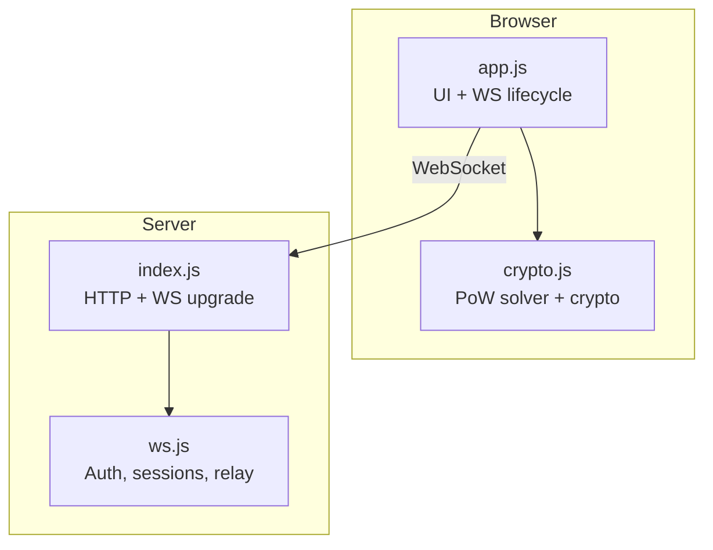
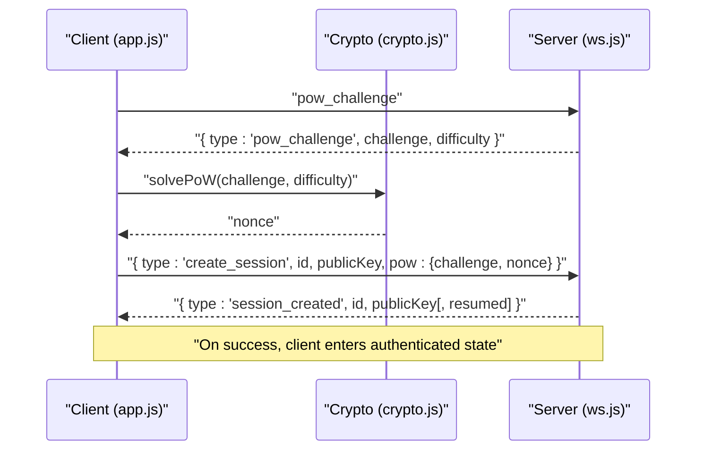
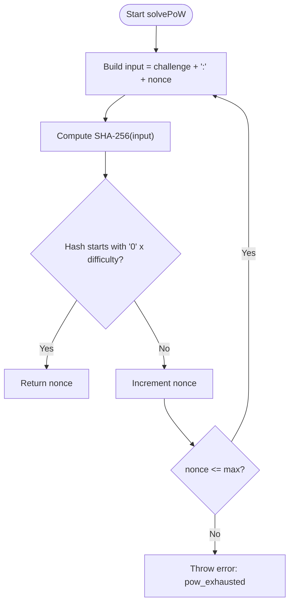
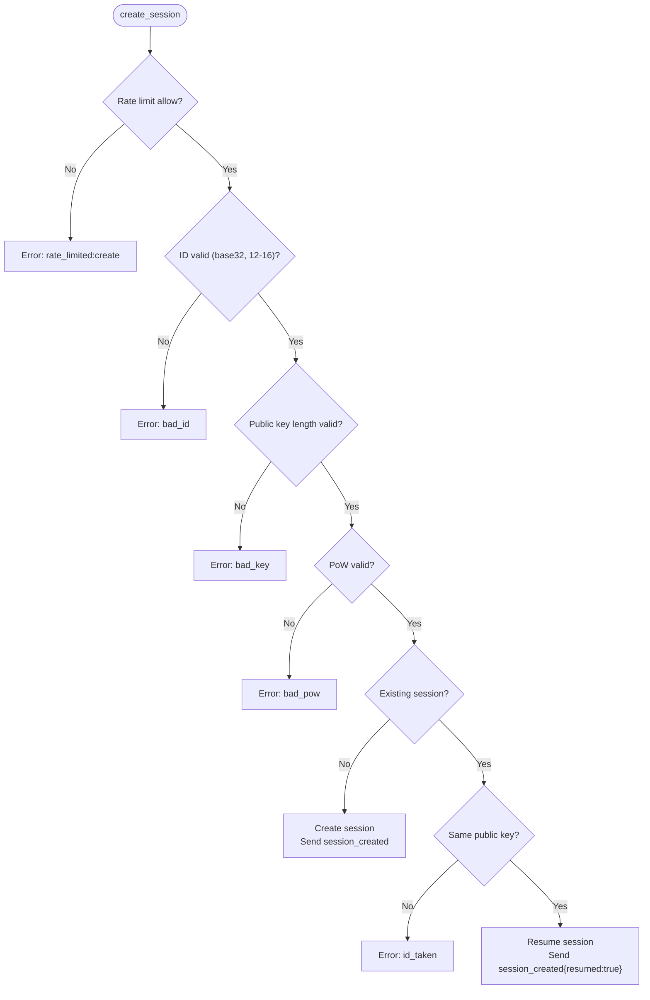
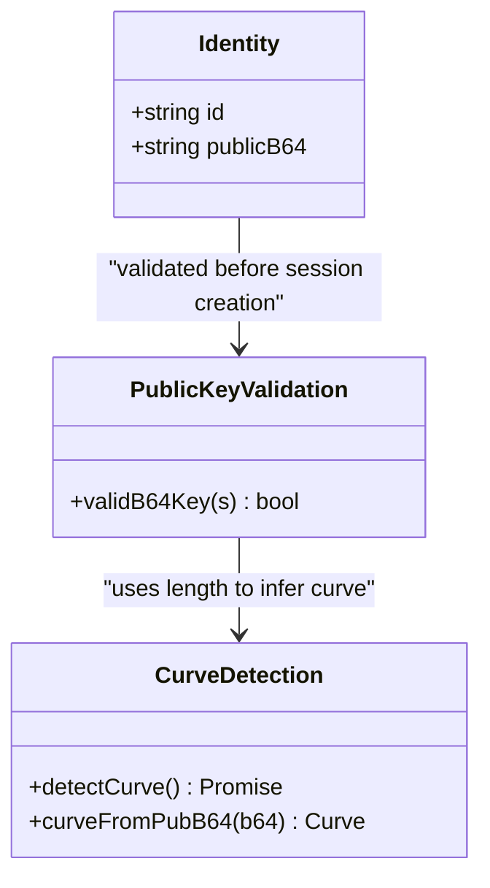
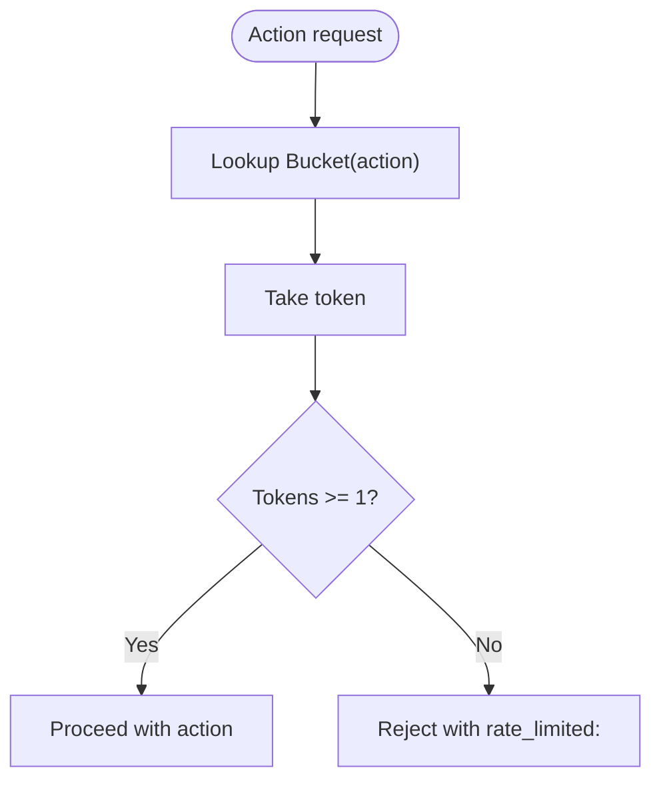
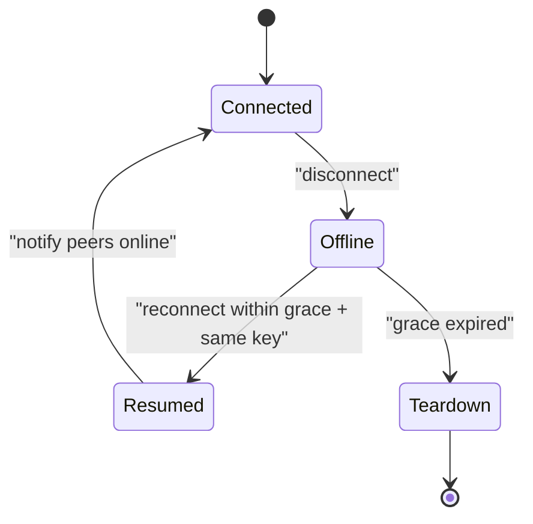
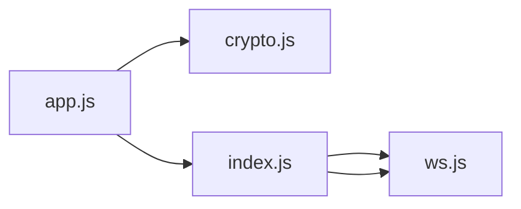

# Authentication Messages

<cite>
**Referenced Files in This Document**
- [ws.js](file://server/ws.js)
- [crypto.js](file://public/crypto.js)
- [app.js](file://public/app.js)
- [index.js](file://server/index.js)
</cite>

## Table of Contents
1. [Introduction](#introduction)
2. [Project Structure](#project-structure)
3. [Core Components](#core-components)
4. [Architecture Overview](#architecture-overview)
5. [Detailed Component Analysis](#detailed-component-analysis)
6. [Dependency Analysis](#dependency-analysis)
7. [Performance Considerations](#performance-considerations)
8. [Troubleshooting Guide](#troubleshooting-guide)
9. [Conclusion](#conclusion)

## Introduction
This document explains the authentication-related WebSocket messages used by Shh V1.0, focusing on the proof-of-work (PoW) challenge-response flow and session establishment. It covers:
- The PoW challenge issuance and response using SHA-256 hashing
- Difficulty levels and nonce validation
- Identity validation with base32 identifiers and public key validation for X25519/P-256 curves
- Rate limiting for session creation and other operations
- Grace period and reconnection handling for session recovery
- Error responses such as bad_pow, bad_key, id_taken, and rate_limited:create

The goal is to provide a clear, code-grounded understanding of how clients authenticate and establish sessions over WebSockets without exposing plaintext or keys to the server.

## Project Structure
Shh V1.0 consists of a Node.js HTTP + WebSocket server and a browser-based client:
- Server:
  - index.js: HTTP server, static file serving, security headers, and WebSocket upgrade wiring
  - ws.js: WebSocket message routing, PoW challenge issuance/validation, session lifecycle, presence, and rate limiting
- Client:
  - app.js: UI logic, WebSocket lifecycle, authentication flow, and message dispatch
  - crypto.js: Cryptographic utilities including PoW solver, ECDH curve negotiation, AES-GCM encryption/decryption, and fingerprinting

**Diagram sources**
- [index.js:91-109](file://server/index.js#L91-L109)
- [ws.js:258-312](file://server/ws.js#L258-L312)
- [app.js:74-120](file://public/app.js#L74-L120)
- [crypto.js:113-127](file://public/crypto.js#L113-L127)

**Section sources**
- [index.js:1-116](file://server/index.js#L1-L116)
- [ws.js:1-313](file://server/ws.js#L1-L313)
- [app.js:1-624](file://public/app.js#L1-L624)
- [crypto.js:1-242](file://public/crypto.js#L1-L242)

## Core Components
- Proof-of-work challenge and verification:
  - Server issues a random challenge and difficulty; client computes a nonce so that SHA-256(challenge:nonce) starts with a required number of leading zeros
- Session creation:
  - Client sends create_session with identity ID, public key, and PoW solution; server validates inputs and establishes an in-memory session
- Identity and key validation:
  - IDs must be base32 strings of length 12–16
  - Public keys are validated by base64-encoded raw byte lengths corresponding to X25519 (32 bytes -> 44 chars) or P-256 uncompressed point (65 bytes -> 88 chars)
- Rate limiting:
  - Token-bucket rate limiters protect against abuse for create, search, contact, and message actions
- Grace period and reconnection:
  - On disconnect, the server marks the session offline and waits a grace window before teardown; if the same identity reconnects within this window with the same public key, the session resumes

**Section sources**
- [ws.js:6-13](file://server/ws.js#L6-L13)
- [ws.js:94-109](file://server/ws.js#L94-L109)
- [ws.js:150-179](file://server/ws.js#L150-L179)
- [ws.js:133-148](file://server/ws.js#L133-L148)
- [crypto.js:39-45](file://public/crypto.js#L39-L45)
- [crypto.js:113-127](file://public/crypto.js#L113-L127)

## Architecture Overview
The authentication flow uses a two-phase handshake:
1. Challenge issuance: Client connects and requests a PoW challenge
2. Response and session creation: Client solves the challenge and submits create_session with identity and public key

**Diagram sources**
- [app.js:99-120](file://public/app.js#L99-L120)
- [crypto.js:113-127](file://public/crypto.js#L113-L127)
- [ws.js:94-109](file://server/ws.js#L94-L109)
- [ws.js:150-179](file://server/ws.js#L150-L179)

## Detailed Component Analysis

### Proof-of-Work Challenge and Response
- Challenge issuance:
  - Server generates a random hex challenge and returns it along with the difficulty level
  - The client must find a nonce such that SHA-256(challenge:nonce) begins with a specified number of leading zero hex digits
- Nonce computation:
  - The client iterates nonces up to a maximum bound, computing SHA-256 hashes until the prefix condition is met
  - To keep the UI responsive, the solver yields control periodically during iteration
- Verification:
  - Server checks that the provided challenge matches the issued one and that the nonce is within bounds
  - It recomputes SHA-256(challenge:nonce) and verifies the leading-zero prefix

**Diagram sources**
- [crypto.js:113-127](file://public/crypto.js#L113-L127)
- [ws.js:94-109](file://server/ws.js#L94-L109)

**Section sources**
- [ws.js:94-109](file://server/ws.js#L94-L109)
- [crypto.js:113-127](file://public/crypto.js#L113-L127)

### Session Creation and Validation
- Inputs:
  - id: base32 string of length 12–16
  - publicKey: base64-encoded raw public key; accepted lengths correspond to X25519 (32 bytes -> 44 chars) or P-256 uncompressed point (65 bytes -> 88 chars)
  - pow: object containing challenge and nonce from the PoW step
- Validation order:
  - Rate limit check for create action
  - ID format validation
  - Public key length validation
  - PoW verification
- Session establishment:
  - If no existing session exists, create a new session and respond with session_created
  - If an existing session exists within the grace window and the public key matches, resume the session and notify peers

**Diagram sources**
- [ws.js:150-179](file://server/ws.js#L150-L179)

**Section sources**
- [ws.js:150-179](file://server/ws.js#L150-L179)

### Identity and Public Key Validation
- Identity format:
  - Base32 characters only, length between 12 and 16 inclusive
  - Clients generate random base32 identifiers of length 12
- Public key validation:
  - Accepted base64 lengths: 44 (X25519 raw 32 bytes) or 88 (P-256 uncompressed point 65 bytes)
  - Curve negotiation is implicit based on public key length; both sides derive chat keys accordingly

**Diagram sources**
- [ws.js:10-13](file://server/ws.js#L10-L13)
- [crypto.js:39-45](file://public/crypto.js#L39-L45)
- [crypto.js:150-180](file://public/crypto.js#L150-L180)

**Section sources**
- [ws.js:10-13](file://server/ws.js#L10-L13)
- [crypto.js:39-45](file://public/crypto.js#L39-L45)
- [crypto.js:150-180](file://public/crypto.js#L150-L180)

### Rate Limiting
- Token bucket implementation:
  - Each connection maintains per-action buckets with capacity and refill rates
  - Actions include search, contact, message, and create
- Limits:
  - create: low burst allowance to prevent rapid session creation
  - search/contact/message: tuned to reduce enumeration and spam
- Errors:
  - When rate-limited, the server responds with specific codes like rate_limited:create, rate_limited:search, etc.

**Diagram sources**
- [ws.js:15-21](file://server/ws.js#L15-L21)
- [ws.js:37-65](file://server/ws.js#L37-L65)

**Section sources**
- [ws.js:15-21](file://server/ws.js#L15-L21)
- [ws.js:37-65](file://server/ws.js#L37-L65)

### Grace Period and Reconnection Handling
- On disconnect:
  - The server immediately marks the session offline and notifies peers
  - A grace timer is set; if the session does not reconnect within the grace window, it is torn down
- Reconnect within grace:
  - If the same identity reconnects with the same public key, the server resumes the session and notifies peers that the peer is online again
- Client behavior:
  - On socket close, the client attempts quick reconnection within the grace window
  - If session_created includes resumed flag, the client indicates session recovery

**Diagram sources**
- [ws.js:133-148](file://server/ws.js#L133-L148)
- [ws.js:150-179](file://server/ws.js#L150-L179)
- [app.js:86-93](file://public/app.js#L86-L93)

**Section sources**
- [ws.js:133-148](file://server/ws.js#L133-L148)
- [ws.js:150-179](file://server/ws.js#L150-L179)
- [app.js:86-93](file://public/app.js#L86-L93)

### Complete Message Examples

- Challenge issuance:
  - Client sends: { type: "pow_challenge" }
  - Server responds: { type: "pow_challenge", challenge: "<hex>", difficulty: <number> }

- Nonce computation:
  - Client computes nonce such that SHA-256(challenge:nonce) starts with difficulty leading zeros
  - Client stores lastPow = { challenge, nonce }

- Successful session establishment:
  - Client sends: { type: "create_session", id: "<base32>", publicKey: "<base64>", pow: { challenge, nonce } }
  - Server responds: { type: "session_created", id: "<base32>", publicKey: "<base64>" }
  - For resumption: { type: "session_created", id: "<base32>", publicKey: "<base64>", resumed: true }

- Error responses:
  - bad_pow: invalid or mismatched PoW
  - bad_key: invalid public key length
  - id_taken: identity already taken outside grace or key mismatch
  - rate_limited:create: too many session creation attempts

**Section sources**
- [app.js:99-120](file://public/app.js#L99-L120)
- [ws.js:94-109](file://server/ws.js#L94-L109)
- [ws.js:150-179](file://server/ws.js#L150-L179)

## Dependency Analysis
- Client dependencies:
  - app.js depends on crypto.js for PoW solving, key generation, and encryption
  - app.js manages WebSocket lifecycle and message dispatch
- Server dependencies:
  - index.js wires HTTP and WebSocket upgrades and serves static assets
  - ws.js implements all authentication, session management, and relay logic

**Diagram sources**
- [app.js:4-8](file://public/app.js#L4-L8)
- [index.js:8-9](file://server/index.js#L8-L9)

**Section sources**
- [app.js:4-8](file://public/app.js#L4-L8)
- [index.js:8-9](file://server/index.js#L8-L9)

## Performance Considerations
- PoW solver:
  - Iterative brute-force up to a fixed nonce bound; yields to event loop to avoid blocking UI
  - Complexity is linear in nonce attempts; difficulty controls expected work
- Server-side verification:
  - Single SHA-256 hash per create_session attempt; constant-time overhead relative to input size
- Rate limiting:
  - Token buckets provide O(1) amortized cost per operation; prevents resource exhaustion
- Memory usage:
  - All state is in-memory; no persistence or logging reduces I/O overhead but limits durability

[No sources needed since this section provides general guidance]

## Troubleshooting Guide
Common errors and their causes:
- bad_pow:
  - Cause: Mismatched challenge or invalid nonce range
  - Resolution: Ensure client uses the latest challenge and recomputes nonce
- bad_key:
  - Cause: Public key not in accepted base64 length (44 or 88)
  - Resolution: Verify curve support and export raw public key correctly
- id_taken:
  - Cause: Another active session exists for the same ID, or key mismatch during reconnect
  - Resolution: Use a different ID or ensure reconnect within grace with same key
- rate_limited:create:
  - Cause: Exceeded session creation rate limit
  - Resolution: Wait for token refill; reduce retry frequency

Grace period and reconnection:
- If the tab closes unexpectedly, the server marks the session offline and waits for grace period
- Client should reconnect quickly; if successful within grace, session resumes automatically

**Section sources**
- [ws.js:150-179](file://server/ws.js#L150-L179)
- [ws.js:133-148](file://server/ws.js#L133-L148)
- [app.js:178-193](file://public/app.js#L178-L193)

## Conclusion
Shh V1.0’s authentication mechanism combines a client-side PoW challenge-response with strict identity and key validation to secure session creation. The server enforces rate limits and supports graceful session recovery via a short grace period. By keeping all cryptographic operations in the browser and relaying only opaque ciphertexts, the system minimizes exposure of sensitive data while providing a robust, privacy-focused messaging experience.

[No sources needed since this section summarizes without analyzing specific files]