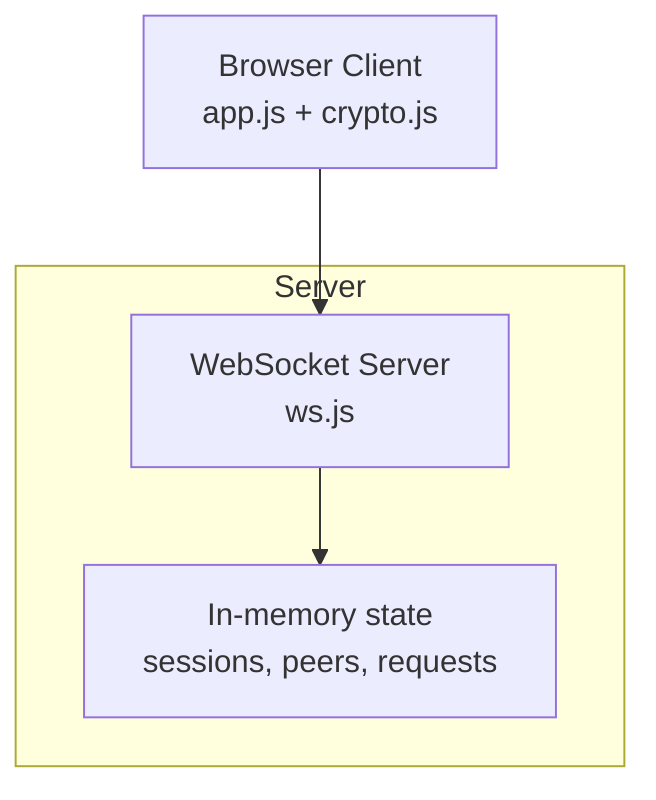
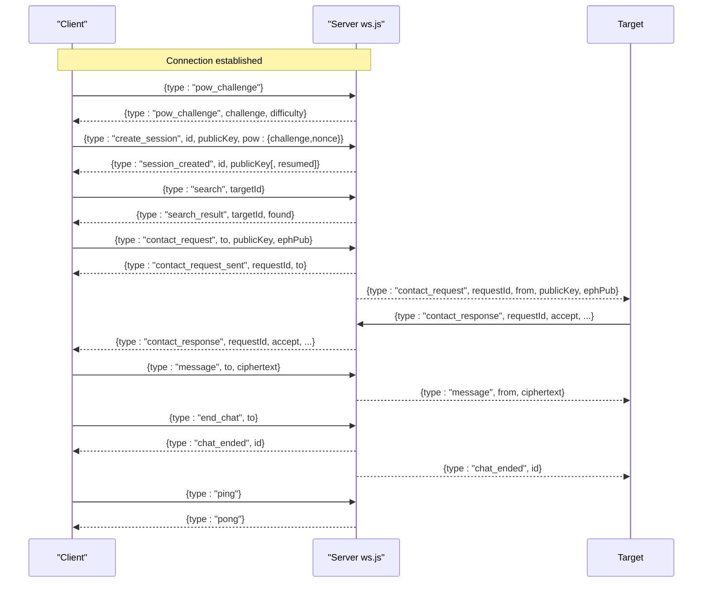
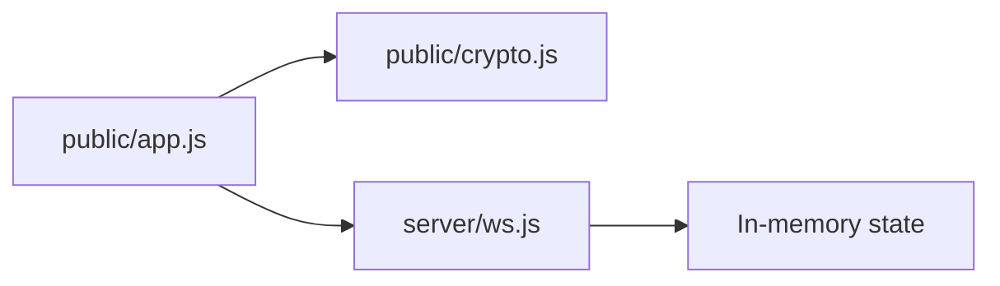

# Message Types

<cite>
**Referenced Files in This Document**
- [server/ws.js](file://server/ws.js)
- [server/index.js](file://server/index.js)
- [public/app.js](file://public/app.js)
- [public/crypto.js](file://public/crypto.js)
- [package.json](file://package.json)
</cite>

## Table of Contents
1. [Introduction](#introduction)
2. [Project Structure](#project-structure)
3. [Core Components](#core-components)
4. [Architecture Overview](#architecture-overview)
5. [Detailed Component Analysis](#detailed-component-analysis)
6. [Dependency Analysis](#dependency-analysis)
7. [Performance Considerations](#performance-considerations)
8. [Troubleshooting Guide](#troubleshooting-guide)
9. [Conclusion](#conclusion)
10. [Appendices](#appendices)

## Introduction
This document specifies all WebSocket message types used by Shh V1.0, including request/response pairs, validation rules, size limits, encoding formats, and delivery semantics. It is intended for developers integrating with or extending the system. The protocol uses a simple JSON-over-WebSocket transport with strict server-side validation and rate limiting. All payloads are UTF-8 JSON; ciphertexts are base64-encoded binary blobs.

## Project Structure
Shh V1.0 consists of:
- A Node.js HTTP + WebSocket server that relays encrypted messages and manages sessions, presence, and contact requests.
- A browser client that performs end-to-end encryption and drives the UI.

**Diagram sources**
- [server/ws.js:1-313](file://server/ws.js#L1-L313)
- [public/app.js:1-624](file://public/app.js#L1-L624)
- [public/crypto.js:1-242](file://public/crypto.js#L1-L242)

**Section sources**
- [server/index.js:1-116](file://server/index.js#L1-L116)
- [server/ws.js:1-313](file://server/ws.js#L1-L313)
- [public/app.js:1-624](file://public/app.js#L1-L624)
- [public/crypto.js:1-242](file://public/crypto.js#L1-L242)

## Core Components
- Proof-of-work (PoW) challenge/nonce exchange to mitigate abuse.
- Session creation and resumption with identity public key validation.
- Presence search to check if a target ID is online.
- Contact request/response handshake to establish chat adjacency.
- End-to-end encrypted message relay with strict size limits.
- Chat termination signaling.
- Ping/pong keepalive.

**Section sources**
- [server/ws.js:94-120](file://server/ws.js#L94-L120)
- [server/ws.js:150-255](file://server/ws.js#L150-L255)
- [public/app.js:99-176](file://public/app.js#L99-L176)
- [public/crypto.js:113-127](file://public/crypto.js#L113-L127)

## Architecture Overview
The server is a pure relay: it never sees plaintext or keys. It maintains ephemeral in-memory state for sessions, peer adjacency, and pending contact requests. Clients perform all cryptographic operations locally.

**Diagram sources**
- [server/ws.js:94-255](file://server/ws.js#L94-L255)
- [public/app.js:99-368](file://public/app.js#L99-L368)

## Detailed Component Analysis

### Global constraints and validation
- Transport: JSON over WebSocket, UTF-8 encoded frames.
- Size limits:
  - Plaintext maximum: 2048 bytes per message.
  - Ciphertext maximum on wire: approximately 2 KB plaintext plus overhead (IV and tag), enforced via base64 length checks.
- Identity IDs: Base32 strings of 12–16 characters matching a specific character set.
- Public keys: Base64-encoded raw public keys; accepted lengths correspond to X25519 (32 bytes -> 44 chars) or P-256 uncompressed point (65 bytes -> 88 chars).
- Rate limiting: Per-action token buckets limit search, contact, message, and create actions.

**Section sources**
- [server/ws.js:5-21](file://server/ws.js#L5-L21)
- [server/ws.js:107-120](file://server/ws.js#L107-L120)
- [public/crypto.js:14](file://public/crypto.js#L14)

### Proof-of-work
- Purpose: Deter automated abuse by requiring clients to solve a SHA-256 puzzle before creating sessions.
- Challenge issuance: Server sends a random hex challenge and difficulty.
- Nonce bounds: Nonces must be integers within a defined maximum range.
- Verification: Concatenation of challenge and nonce hashed with SHA-256 must start with a number of leading zeros equal to difficulty.

Message types:
- Request:
  - type: "pow_challenge"
  - fields: none
- Response:
  - type: "pow_challenge"
  - fields:
    - challenge: string (hex)
    - difficulty: number (leading zero count)

Notes:
- Clients compute nonce asynchronously to keep UI responsive.
- Challenges are single-use; after session creation, PoW state is cleared.

**Section sources**
- [server/ws.js:94-105](file://server/ws.js#L94-L105)
- [public/app.js:99-131](file://public/app.js#L99-L131)
- [public/crypto.js:113-127](file://public/crypto.js#L113-L127)

### Session creation and resumption
- Request:
  - type: "create_session"
  - required fields:
    - id: string (base32, 12–16 chars)
    - publicKey: string (base64, valid length for X25519 or P-256)
    - pow: object
      - challenge: string (must match most recent issued challenge)
      - nonce: integer (within allowed range)
- Responses:
  - Success:
    - type: "session_created"
    - fields:
      - id: string
      - publicKey: string
      - resumed: boolean (present when reconnecting within grace window)
  - Errors:
    - type: "error"
    - fields:
      - message: string (e.g., "bad_id", "bad_key", "bad_pow", "id_taken", "rate_limited:create")

Behavior:
- If an existing session exists and is within a short grace period after disconnect, and the provided public key matches, the session is resumed.
- Otherwise, a new session is created.
- On resume, peers are notified that the user is back online.

**Section sources**
- [server/ws.js:150-179](file://server/ws.js#L150-L179)
- [public/app.js:109-137](file://public/app.js#L109-L137)

### Search
- Purpose: Check whether a target ID is currently online.
- Request:
  - type: "search"
  - required fields:
    - targetId: string (base32, 12+ chars)
- Response:
  - type: "search_result"
  - fields:
    - targetId: string
    - found: boolean (true if the target has an active connection)

Validation and limits:
- Requires an active session.
- Subject to rate limiting for search actions.

**Section sources**
- [server/ws.js:181-186](file://server/ws.js#L181-L186)
- [public/app.js:596-601](file://public/app.js#L596-L601)

### Contact request
- Purpose: Initiate a private chat with another user.
- Request:
  - type: "contact_request"
  - required fields:
    - to: string (target ID)
    - publicKey: string (identity public key, base64)
    - ephPub: string (ephemeral public key, base64)
- Responses:
  - To requester:
    - type: "contact_request_sent"
    - fields:
      - requestId: string
      - to: string
  - To target (if online):
    - type: "contact_request"
    - fields:
      - requestId: string
      - from: string
      - publicKey: string
      - ephPub: string
  - Failure to requester (if target offline):
    - type: "contact_request_failed"
    - fields:
      - to: string
      - reason: string ("offline")

Validation and limits:
- Requires an active session.
- Both publicKey and ephPub must be valid base64 public keys.
- Subject to rate limiting for contact actions.
- Pending requests have an expiry and are pruned periodically.

**Section sources**
- [server/ws.js:188-205](file://server/ws.js#L188-L205)
- [server/ws.js:305-311](file://server/ws.js#L305-L311)
- [public/app.js:237-255](file://public/app.js#L237-L255)

### Contact response
- Purpose: Accept or reject a contact request.
- Request:
  - type: "contact_response"
  - required fields:
    - requestId: string
    - accept: boolean
    - publicKey: string (identity public key, base64; present when accept is true)
    - ephPub: string (ephemeral public key, base64; present when accept is true)
- Response:
  - type: "contact_response"
  - fields:
    - requestId: string
    - from: string
    - accept: boolean
    - publicKey: string (optional, present when accept is true)
    - ephPub: string (optional, present when accept is true)

Behavior:
- Only the recipient of a contact request can respond.
- If accepted and both parties are online, chat adjacency is established on both sides (metadata only).

**Section sources**
- [server/ws.js:207-229](file://server/ws.js#L207-L229)
- [public/app.js:257-310](file://public/app.js#L257-L310)

### Encrypted message relay
- Purpose: Deliver end-to-end encrypted messages between peers.
- Request:
  - type: "message"
  - required fields:
    - to: string (peer ID)
    - ciphertext: string (base64-encoded AES-GCM output including IV and tag)
- Response:
  - No explicit acknowledgment. If the target is offline, the sender receives:
    - type: "peer_offline"
    - fields:
      - id: string (target ID)
  - If delivered, the target receives:
    - type: "message"
    - fields:
      - from: string
      - ciphertext: string

Validation and limits:
- Requires an active session.
- Ciphertext must be a non-empty base64 string whose decoded length does not exceed the configured maximum (approximately 2 KB plaintext plus overhead).
- Subject to rate limiting for message actions.
- No store-and-forward: messages are not queued; they are delivered only if the target is connected at that moment.

**Section sources**
- [server/ws.js:231-240](file://server/ws.js#L231-L240)
- [public/app.js:324-359](file://public/app.js#L324-L359)
- [public/crypto.js:223-241](file://public/crypto.js#L223-L241)

### End chat
- Purpose: Terminate a chat relationship and notify both sides.
- Request:
  - type: "end_chat"
  - required fields:
    - to: string (peer ID)
- Responses:
  - To initiator:
    - type: "chat_ended"
    - fields:
      - id: string (peer ID)
  - To peer:
    - type: "chat_ended"
    - fields:
      - id: string (initiator ID)

Behavior:
- Removes adjacency metadata on both sides.
- Ensures both UIs reset notification state.

**Section sources**
- [server/ws.js:242-255](file://server/ws.js#L242-L255)
- [public/app.js:361-382](file://public/app.js#L361-L382)

### Ping/Pong
- Purpose: Keepalive and liveness probe.
- Request:
  - type: "ping"
- Response:
  - type: "pong"

Behavior:
- Simple echo; no additional payload.

**Section sources**
- [server/ws.js:292-293](file://server/ws.js#L292-L293)

### Error responses
- Type: "error"
- Fields:
  - message: string describing the failure reason
- Common error codes:
  - "no_session": action attempted without an active session
  - "bad_id": invalid session identifier format
  - "bad_key": invalid public key format
  - "bad_pow": invalid proof-of-work
  - "id_taken": session ID already taken or key mismatch during resume
  - "too_large": ciphertext exceeds maximum size
  - "rate_limited:<action>": exceeded rate limit for the specified action

**Section sources**
- [server/ws.js:89-91](file://server/ws.js#L89-L91)
- [public/app.js:178-193](file://public/app.js#L178-L193)

## Dependency Analysis
- Client depends on server for session management, presence, and message relay.
- Server depends on in-memory maps for sessions, sockets, and pending requests.
- Cryptographic operations are isolated to the client; server only validates and forwards ciphertexts.

**Diagram sources**
- [public/app.js:1-624](file://public/app.js#L1-L624)
- [public/crypto.js:1-242](file://public/crypto.js#L1-L242)
- [server/ws.js:1-313](file://server/ws.js#L1-L313)

**Section sources**
- [server/ws.js:23-27](file://server/ws.js#L23-L27)
- [public/app.js:26-35](file://public/app.js#L26-L35)

## Performance Considerations
- Rate limiting: Token buckets prevent abuse and ensure fair usage across search, contact, message, and create actions.
- Payload sizing: Strict ciphertext size enforcement protects server resources and prevents oversized frames.
- Graceful reconnection: Short grace window allows session resumption without full teardown, reducing churn.
- Background pruning: Expired pending contact requests are periodically removed to free memory.

[No sources needed since this section provides general guidance]

## Troubleshooting Guide
Common issues and their indicators:
- "no_session": Attempted to use search, contact, message, or end_chat without establishing a session first.
- "bad_id": Identifier does not match expected base32 pattern or length.
- "bad_key": Public key is not a recognized base64 length for supported curves.
- "bad_pow": Nonce or challenge mismatch; verify PoW computation and timing.
- "id_taken": Another instance holds the same ID or key mismatch during resume.
- "too_large": Message exceeds 2 KB plaintext; split or reduce content.
- "rate_limited:<action>": Too many requests; back off and retry later.

Client-side handling:
- Errors are surfaced via toast notifications and UI state resets where appropriate.
- Reconnection logic attempts quick reconnect within the grace window.

**Section sources**
- [public/app.js:178-193](file://public/app.js#L178-L193)
- [server/ws.js:89-91](file://server/ws.js#L89-L91)

## Conclusion
Shh V1.0 defines a concise, secure WebSocket protocol focused on privacy and simplicity. All sensitive data remains client-side; the server acts as a minimal relay with robust validation, rate limiting, and ephemeral state. The message types cover the full lifecycle from discovery through secure messaging to chat termination, with clear error signaling and keepalive support.

[No sources needed since this section summarizes without analyzing specific files]

## Appendices

### Encoding and size details
- Identifiers: Base32 uppercase letters and digits 2–7, minimum 12 characters.
- Public keys: Base64-encoded raw public keys; accepted lengths correspond to X25519 (32 bytes) or P-256 uncompressed points (65 bytes).
- Messages: Base64-encoded AES-GCM ciphertext including a 12-byte IV prepended to the encrypted payload.
- Maximum plaintext: 2048 bytes per message; server enforces a corresponding ciphertext size limit.

**Section sources**
- [server/ws.js:5-13](file://server/ws.js#L5-L13)
- [server/ws.js:111-120](file://server/ws.js#L111-L120)
- [public/crypto.js:14](file://public/crypto.js#L14)
- [public/crypto.js:223-241](file://public/crypto.js#L223-L241)

### Delivery semantics and ordering
- Delivery: Best-effort, immediate relay while both peers are connected. No persistence or queueing; offline recipients do not receive messages.
- Ordering: Within a single WebSocket connection, messages are delivered in order. Cross-peer ordering is not guaranteed beyond per-connection guarantees.
- Presence: Online/offline status is reflected via peer_online and peer_offline events.

**Section sources**
- [server/ws.js:133-148](file://server/ws.js#L133-L148)
- [server/ws.js:231-240](file://server/ws.js#L231-L240)

### Retry mechanisms
- Client-side: Automatic reconnection with exponential backoff is not implemented; a fixed quick reconnect delay is used within the grace window.
- Server-side: No automatic retries; clients should implement application-level retry logic for critical actions like contact requests if needed.

**Section sources**
- [public/app.js:86-93](file://public/app.js#L86-L93)
- [server/ws.js:144-148](file://server/ws.js#L144-L148)