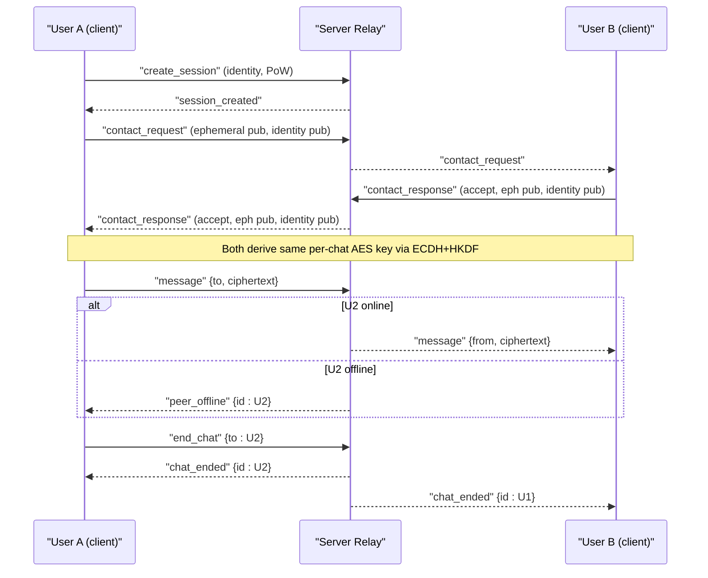
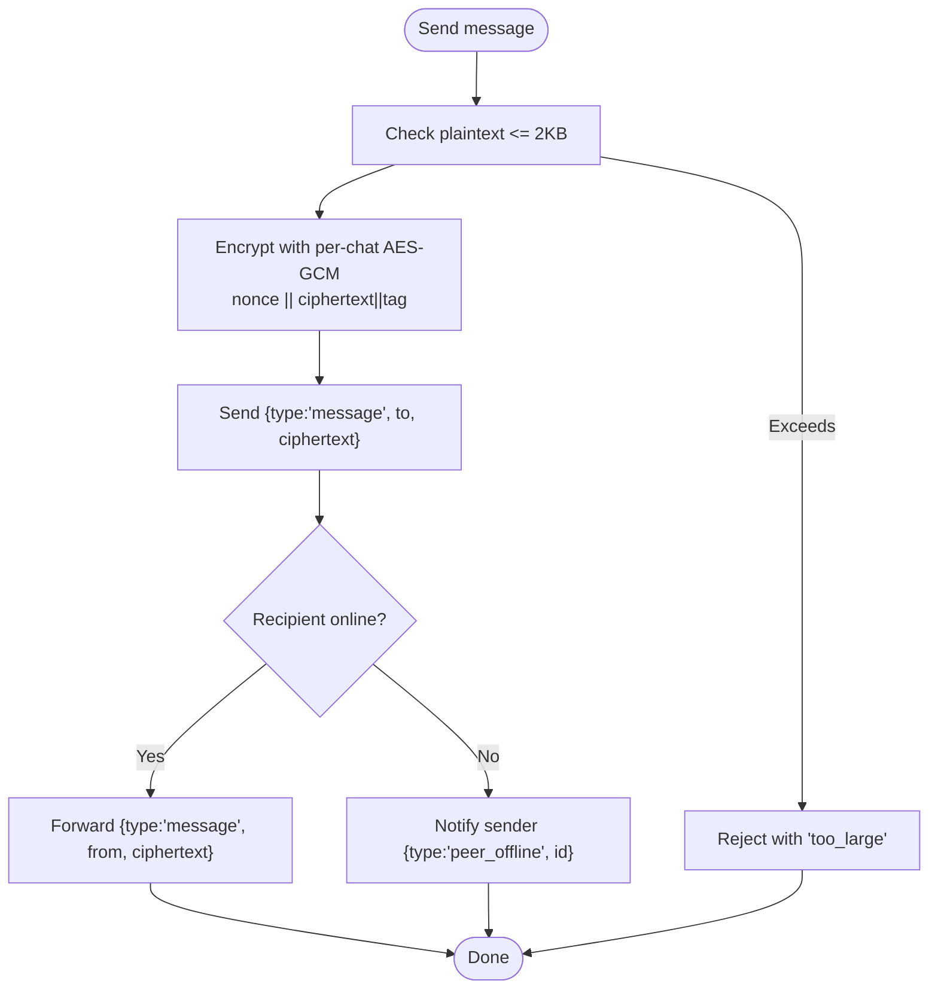
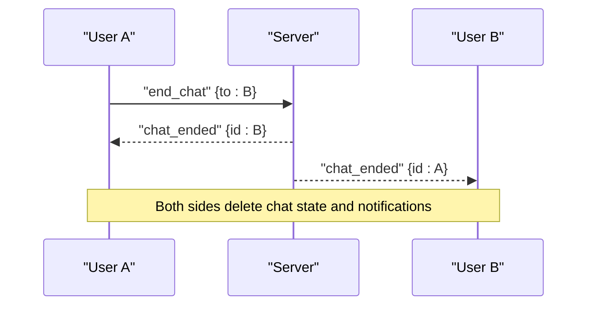
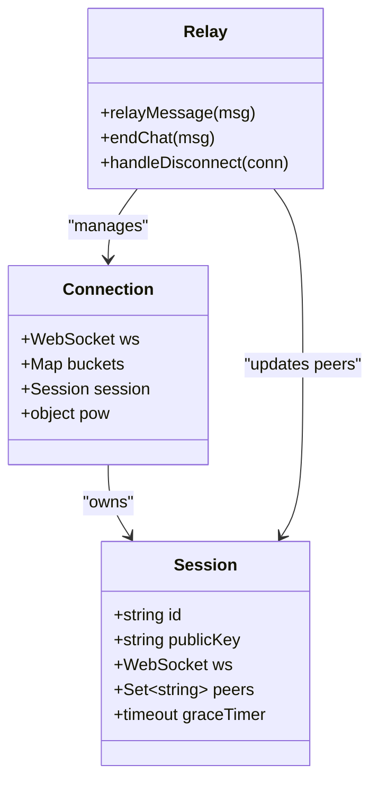
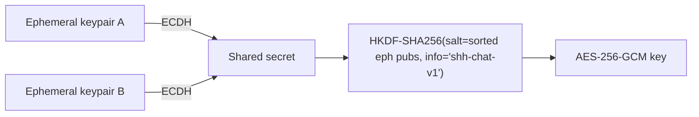
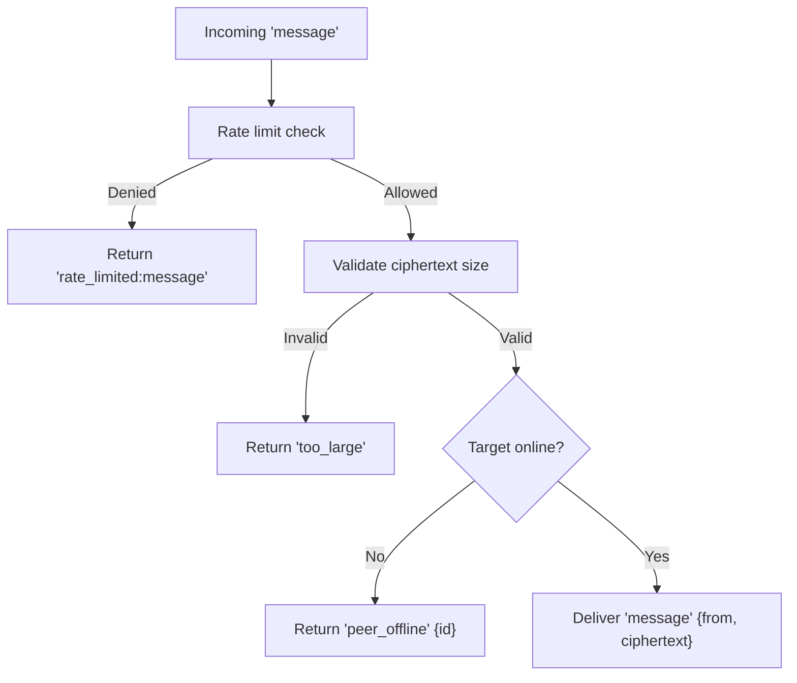
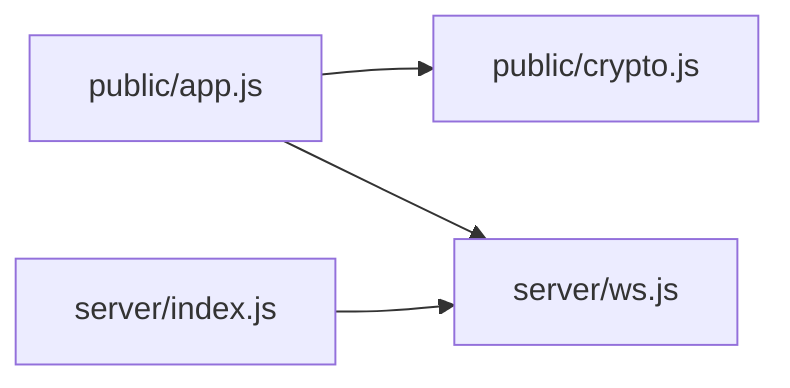

# Messaging Messages

<cite>
**Referenced Files in This Document**
- [app.js](file://public/app.js)
- [crypto.js](file://public/crypto.js)
- [index.js](file://server/index.js)
- [ws.js](file://server/ws.js)
</cite>

## Table of Contents
1. [Introduction](#introduction)
2. [Project Structure](#project-structure)
3. [Core Components](#core-components)
4. [Architecture Overview](#architecture-overview)
5. [Detailed Component Analysis](#detailed-component-analysis)
6. [Dependency Analysis](#dependency-analysis)
7. [Performance Considerations](#performance-considerations)
8. [Troubleshooting Guide](#troubleshooting-guide)
9. [Conclusion](#conclusion)

## Introduction
This document explains the real-time messaging protocol used by Shh V1.0 over WebSocket, focusing on:
- The encrypted message delivery using the 'message' type
- Chat termination via the 'end_chat' message and cleanup semantics
- The relay architecture where the server forwards only opaque ciphertext without inspecting content
- Message size limits (2 KB plaintext plus overhead), offline peer handling ('peer_offline'), and rate limiting
- Ordering guarantees, delivery confirmation patterns, and the zero-persistence design (no messages stored on the server)

The system is end-to-end encrypted in the browser; the server never sees plaintext or keys.

## Project Structure
- Client-side application logic and UI are implemented in the public directory. Encryption/decryption and key management live in a dedicated module.
- Server-side HTTP and WebSocket handling are implemented in the server directory. A lightweight relay enforces rate limits, presence, and adjacency metadata without storing message content.

```mermaid
graph TB
subgraph "Client"
A["public/app.js"]
B["public/crypto.js"]
end
subgraph "Server"
C["server/index.js"]
D["server/ws.js"]
end
A --> |"WebSocket JSON frames"| C
C --> |"Upgrade to WS"| D
A <- --> |Encrypted payloads| D
A --> |"Key ops, PoW"| B
```

**Diagram sources**
- [app.js:1-120](file://public/app.js#L1-L120)
- [crypto.js:1-120](file://public/crypto.js#L1-L120)
- [index.js:73-109](file://server/index.js#L73-L109)
- [ws.js:258-313](file://server/ws.js#L258-L313)

**Section sources**
- [index.js:1-116](file://server/index.js#L1-L116)
- [app.js:1-120](file://public/app.js#L1-L120)

## Core Components
- Encrypted message transport: Clients encrypt messages with per-chat AES-GCM keys derived via ECDH + HKDF. The server relays base64-encoded ciphertext between peers.
- Chat lifecycle: Contact requests establish ephemeral shared secrets and chat adjacency metadata on the server. End-of-chat signals tear down adjacency and notify both sides.
- Presence and discovery: Search returns online/offline status for target IDs; presence updates propagate when peers connect/disconnect.
- Rate limiting and anti-abuse: Token-bucket rate limits protect search, contact, message, and session creation endpoints.
- Zero persistence: All state is in-memory; no logs, no disk writes, no message storage.

**Section sources**
- [ws.js:15-21](file://server/ws.js#L15-L21)
- [ws.js:231-255](file://server/ws.js#L231-L255)
- [app.js:324-388](file://public/app.js#L324-L388)
- [crypto.js:191-241](file://public/crypto.js#L191-L241)

## Architecture Overview
The server acts as a pure relay: it validates message shape and size, enforces rate limits, and forwards ciphertext to the intended recipient if online. It maintains minimal metadata (session identity, peer adjacency set) but never stores message content.



**Diagram sources**
- [app.js:108-120](file://public/app.js#L108-L120)
- [app.js:237-310](file://public/app.js#L237-L310)
- [app.js:324-388](file://public/app.js#L324-L388)
- [ws.js:150-255](file://server/ws.js#L150-L255)

## Detailed Component Analysis

### Encrypted Message Delivery ('message')
- Encryption scheme: Per-chat AES-256-GCM with a fresh random 96-bit nonce per message. The ciphertext payload sent over the wire is base64-encoded concatenation of nonce and AEAD output.
- Size limit: Plaintext is limited to 2 KB. The server accepts ciphertext up to 2 KB plaintext plus IV/tag overhead. Oversized messages are rejected.
- Delivery semantics: If the recipient is online, the server forwards the ciphertext immediately. If offline, the sender receives a 'peer_offline' notification; there is no store-and-forward queue.
- Ordering: Messages are delivered in FIFO order per connection since they are forwarded as received. No cross-peer ordering guarantees beyond per-connection FIFO.
- Delivery confirmation: There is no explicit ACK from the receiver. Successful relay is indicated by absence of an error or 'peer_offline'. Offline recipients do not receive delayed delivery.



**Diagram sources**
- [app.js:344-359](file://public/app.js#L344-L359)
- [crypto.js:223-241](file://public/crypto.js#L223-L241)
- [ws.js:231-240](file://server/ws.js#L231-L240)

**Section sources**
- [app.js:324-359](file://public/app.js#L324-L359)
- [crypto.js:223-241](file://public/crypto.js#L223-L241)
- [ws.js:231-240](file://server/ws.js#L231-L240)

### Chat Termination ('end_chat')
- Initiating end: A client sends 'end_chat' to the peer. The server removes adjacency metadata for both parties and notifies both clients with 'chat_ended'.
- Cleanup: On receiving 'chat_ended', clients remove chat state, clear pending notices, and reset UI. The server does not retain any message history.



**Diagram sources**
- [app.js:361-388](file://public/app.js#L361-L388)
- [ws.js:242-255](file://server/ws.js#L242-L255)

**Section sources**
- [app.js:361-388](file://public/app.js#L361-L388)
- [ws.js:242-255](file://server/ws.js#L242-L255)

### Relay Architecture and Zero Persistence
- Content inspection: The server never decrypts or inspects message content. It validates ciphertext format and size, then forwards it.
- State model: In-memory maps track sessions, sockets, and adjacency sets. No database, no logs, no disk writes.
- Graceful disconnect: When a client disconnects, presence is updated to offline immediately. After a short grace period, the session is torn down and adjacency removed.



**Diagram sources**
- [ws.js:23-34](file://server/ws.js#L23-L34)
- [ws.js:122-148](file://server/ws.js#L122-L148)
- [ws.js:231-255](file://server/ws.js#L231-L255)

**Section sources**
- [ws.js:1-14](file://server/ws.js#L1-L14)
- [ws.js:122-148](file://server/ws.js#L122-L148)
- [ws.js:231-255](file://server/ws.js#L231-L255)
- [index.js:1-10](file://server/index.js#L1-L10)

### Key Derivation and Fingerprinting
- Per-chat key derivation: ECDH between ephemeral keypairs followed by HKDF-SHA256 with a salt built from sorted ephemeral public keys and a fixed info string. Produces identical AES-256 keys on both sides.
- Curve negotiation: X25519 preferred; falls back to P-256 if unavailable. Curve is implied by public key length, so no extra handshake is needed.
- Fingerprint: Deterministic hash over identity and ephemeral public keys to allow out-of-band verification against MITM.



**Diagram sources**
- [crypto.js:191-211](file://public/crypto.js#L191-L211)
- [crypto.js:150-186](file://public/crypto.js#L150-L186)

**Section sources**
- [crypto.js:150-211](file://public/crypto.js#L150-L211)

### Error Handling for Offline Peers and Rate Limits
- Offline peers: If the recipient is not connected, the server responds to the sender with 'peer_offline' including the target ID. No queued delivery occurs.
- Rate limiting: Token-bucket limits apply per action type (search, contact, message, create). Exceeding limits yields 'rate_limited:<action>' errors.
- Oversized messages: Rejected with 'too_large' if ciphertext exceeds allowed bounds.



**Diagram sources**
- [ws.js:37-65](file://server/ws.js#L37-L65)
- [ws.js:231-240](file://server/ws.js#L231-L240)

**Section sources**
- [ws.js:37-65](file://server/ws.js#L37-L65)
- [ws.js:231-240](file://server/ws.js#L231-L240)
- [app.js:178-193](file://public/app.js#L178-L193)

### Message Ordering and Delivery Confirmation Patterns
- Ordering: Within a single WebSocket connection, messages are processed in arrival order. The server forwards each message immediately upon validation, preserving FIFO order per peer.
- Delivery confirmation: There is no receiver-side ACK. Success is inferred by the absence of an error or 'peer_offline'. Applications should treat successful relay as delivery confirmation.

**Section sources**
- [ws.js:263-296](file://server/ws.js#L263-L296)
- [app.js:324-359](file://public/app.js#L324-L359)

## Dependency Analysis
- Client depends on crypto module for identity generation, ephemeral key exchange, key derivation, encryption/decryption, and PoW solving.
- Server depends on in-memory structures for session tracking, rate limiting, and adjacency maintenance. It exposes a minimal API surface over WebSocket.



**Diagram sources**
- [app.js:4-8](file://public/app.js#L4-L8)
- [index.js:8-9](file://server/index.js#L8-L9)
- [ws.js:258-313](file://server/ws.js#L258-L313)

**Section sources**
- [app.js:4-8](file://public/app.js#L4-L8)
- [index.js:8-9](file://server/index.js#L8-L9)

## Performance Considerations
- Minimal server footprint: No logging, no disk I/O, no message storage reduces latency and resource usage.
- Rate limiting prevents abuse while allowing bursts appropriate for chat use.
- Client-side encryption uses Web Crypto APIs for efficient AES-GCM operations.
- Message size cap ensures small payloads and predictable network behavior.

[No sources needed since this section provides general guidance]

## Troubleshooting Guide
- Too large messages: Ensure plaintext is within 2 KB before sending. The client shows a size hint and rejects oversized input.
- Rate limited: If you see 'rate_limited:message' or similar, wait for the token bucket to refill. Reduce send frequency.
- Peer offline: If you receive 'peer_offline', the recipient is not connected. There is no retry queue; resend after reconnecting or notifying the user.
- Bad cryptographic support: If curve detection fails, update the browser to one that supports required ECDH curves.

**Section sources**
- [app.js:178-193](file://public/app.js#L178-L193)
- [app.js:344-359](file://public/app.js#L344-L359)
- [ws.js:231-240](file://server/ws.js#L231-L240)

## Conclusion
Shh V1.0 implements a privacy-first, end-to-end encrypted messaging system with a minimal, non-persistent relay. Messages are encrypted in the browser and forwarded without inspection. The protocol enforces strict size limits, rate limits, and immediate presence signaling. Chat termination cleanly tears down adjacency and resets client state. There are no delivery receipts or offline queues; applications must handle these constraints accordingly.

[No sources needed since this section summarizes without analyzing specific files]