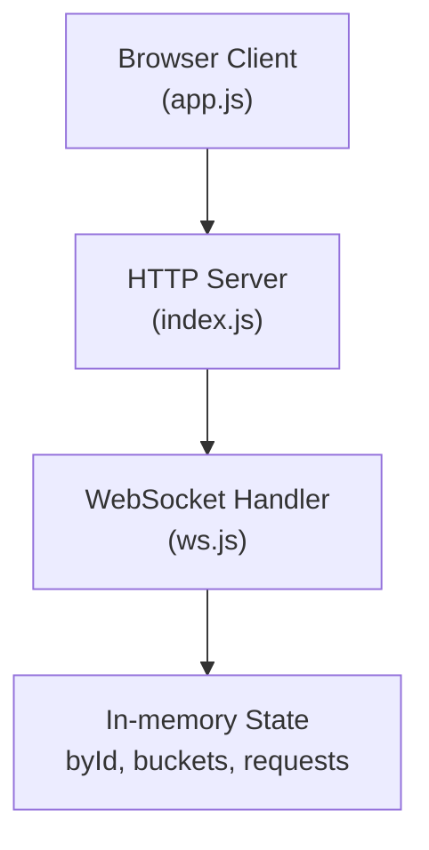
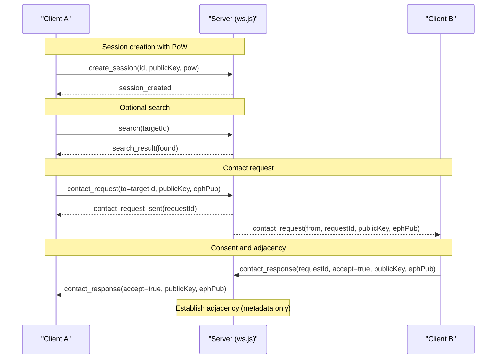
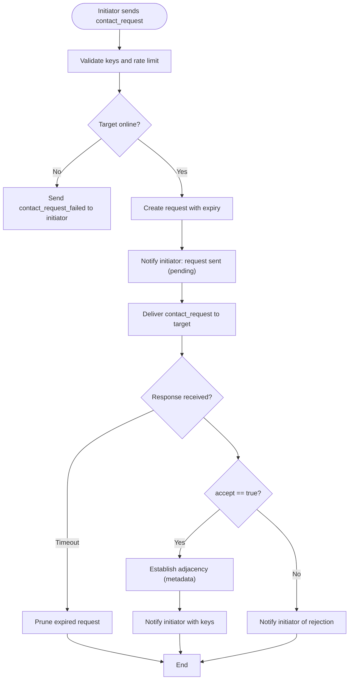
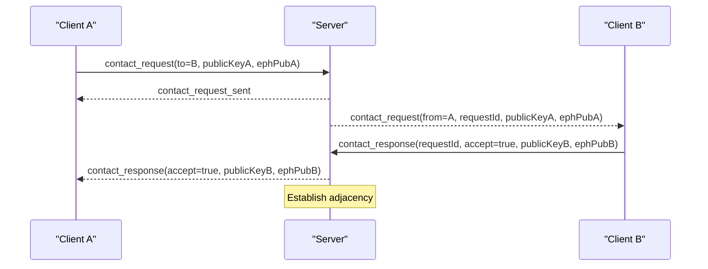
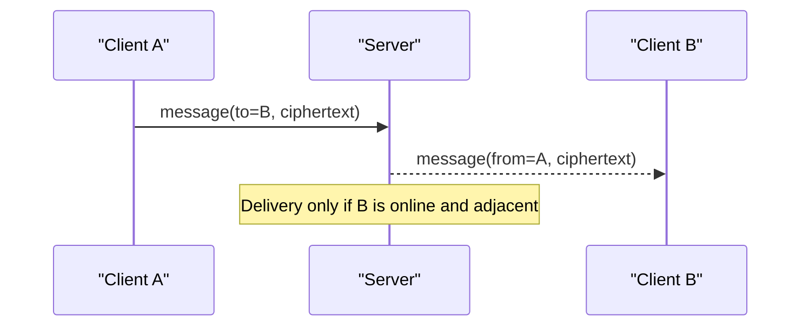
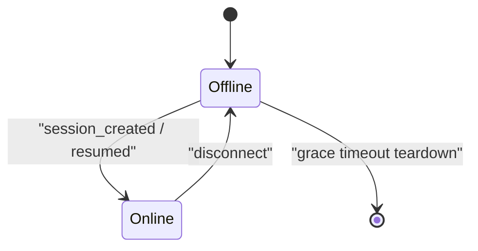
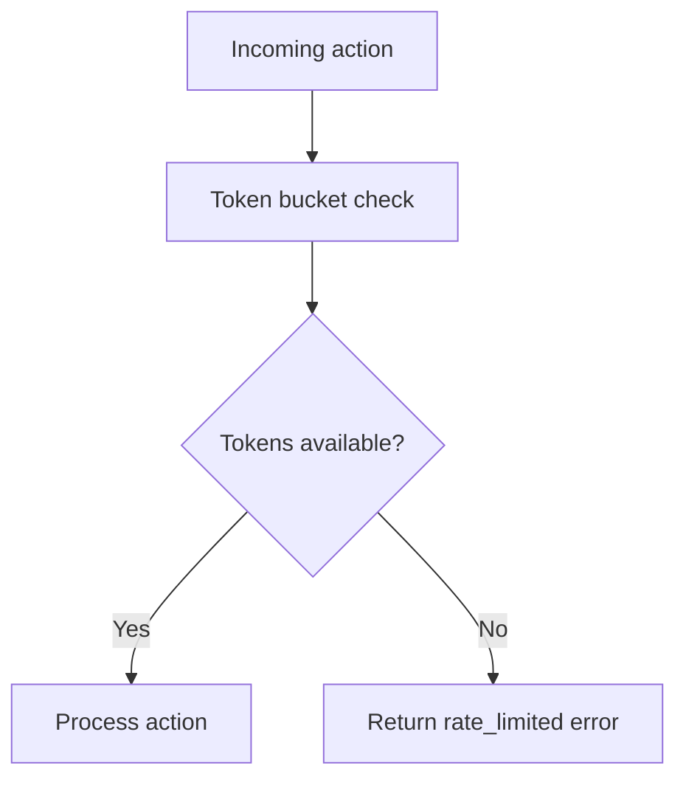
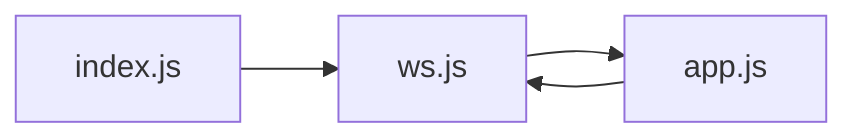

# Peer Discovery Messages

<cite>
**Referenced Files in This Document**
- [ws.js](file://server/ws.js)
- [app.js](file://public/app.js)
- [index.js](file://server/index.js)
</cite>

## Table of Contents
1. [Introduction](#introduction)
2. [Project Structure](#project-structure)
3. [Core Components](#core-components)
4. [Architecture Overview](#architecture-overview)
5. [Detailed Component Analysis](#detailed-component-analysis)
6. [Dependency Analysis](#dependency-analysis)
7. [Performance Considerations](#performance-considerations)
8. [Troubleshooting Guide](#troubleshooting-guide)
9. [Conclusion](#conclusion)

## Introduction
This document explains the peer discovery and contact management protocol used by the application’s WebSocket relay. It focuses on:
- ID-based peer discovery via the search message type, which only reveals whether a target is online without exposing any additional information.
- The bidirectional consent workflow for establishing encrypted chats using contact_request, contact_response, and failure signals.
- Request lifecycle with expiry handling and adjacency establishment between peers.
- Rate limiting to prevent ID enumeration and contact spam.
- Practical examples of queries, requests, acceptance/rejection flows, and failure scenarios.

## Project Structure
The system consists of:
- A Node.js HTTP server that serves static assets and upgrades WebSocket connections.
- A WebSocket handler that implements session management, presence, discovery, contact workflows, and rate limiting.
- A browser client that drives the UI, performs cryptographic operations, and sends/receives messages over the WebSocket channel.

**Diagram sources**
- [index.js:73-109](file://server/index.js#L73-L109)
- [ws.js:258-312](file://server/ws.js#L258-L312)

**Section sources**
- [index.js:1-116](file://server/index.js#L1-L116)
- [ws.js:1-313](file://server/ws.js#L1-L313)
- [app.js:1-624](file://public/app.js#L1-L624)

## Core Components
- Session creation and presence: clients authenticate with proof-of-work and receive a session; online/offline events are broadcast to known peers.
- Search: clients query by ID; the server returns only whether the target is currently connected (online).
- Contact request/response: clients exchange ephemeral keys and identity public keys to derive a shared chat key; both sides must consent.
- Adjacency: upon mutual acceptance, peers record each other as chat partners so they can send messages directly.
- Rate limiting: per-action token buckets protect against abuse.

Key responsibilities and behaviors are implemented in the WebSocket handler and coordinated by the client.

**Section sources**
- [ws.js:150-229](file://server/ws.js#L150-L229)
- [ws.js:181-229](file://server/ws.js#L181-L229)
- [ws.js:258-312](file://server/ws.js#L258-L312)
- [app.js:227-322](file://public/app.js#L227-L322)

## Architecture Overview
The end-to-end flow for discovery and contact establishment involves:
- Proof-of-work challenge-response to mitigate abuse during session creation.
- Optional search to check if a peer is online before initiating a contact request.
- Exchange of cryptographic material and explicit consent to establish an encrypted chat.
- Server maintains minimal metadata (presence and adjacency) and forwards ciphertext-only messages.

**Diagram sources**
- [ws.js:150-179](file://server/ws.js#L150-L179)
- [ws.js:181-229](file://server/ws.js#L181-L229)
- [app.js:108-120](file://public/app.js#L108-L120)
- [app.js:237-310](file://public/app.js#L237-L310)

## Detailed Component Analysis

### ID-based Peer Discovery (search)
- Purpose: Determine if a specific peer is currently online.
- Behavior:
  - Requires an active session.
  - Returns a boolean presence indicator for the requested ID.
  - Does not reveal any user details beyond online status.
- Rate limiting: Enforced per connection to prevent ID enumeration attacks.

Example usage pattern:
- Client validates input format and length, then sends a search message with the target ID.
- On success, the UI may prompt the user to initiate a contact request.

Failure modes:
- Rate limited: client receives a rate limit error and should back off.
- No session: client must complete session creation first.

**Section sources**
- [ws.js:181-186](file://server/ws.js#L181-L186)
- [ws.js:277-280](file://server/ws.js#L277-L280)
- [app.js:596-603](file://public/app.js#L596-L603)
- [app.js:178-193](file://public/app.js#L178-L193)

### Contact Request Workflow (contact_request, contact_response, contact_request_failed)
- Initiator sends a contact request including:
  - Target peer ID
  - Identity public key
  - Ephemeral public key
- Server:
  - Validates keys and rate limits.
  - Creates a short-lived request record with an expiry timestamp.
  - Notifies the initiator that the request was delivered (pending state).
  - Forwards the request to the target if online.
- If the target is offline or unreachable, the initiator receives a failure notification.

Acceptance flow:
- Target responds with accept=true and includes their own identity and ephemeral public keys.
- Server verifies keys, notifies the initiator, and establishes adjacency on both sides (metadata only).
- Both clients derive a shared chat key from the exchanged ephemeral keys and begin encrypted messaging.

Rejection flow:
- Target responds with accept=false.
- Server notifies the initiator; no adjacency is created.

Expiry handling:
- Pending requests are pruned periodically based on their expiry time.
- Expired requests cannot be responded to.

**Diagram sources**
- [ws.js:188-229](file://server/ws.js#L188-L229)
- [ws.js:305-311](file://server/ws.js#L305-L311)
- [app.js:237-310](file://public/app.js#L237-L310)

**Section sources**
- [ws.js:188-229](file://server/ws.js#L188-L229)
- [ws.js:305-311](file://server/ws.js#L305-L311)
- [app.js:237-310](file://public/app.js#L237-L310)

### Bidirectional Consent Mechanism
- Consent is required from both parties:
  - Initiator expresses intent by sending a contact request.
  - Target explicitly accepts or rejects via contact_response.
- Only upon mutual acceptance does the server establish adjacency and share cryptographic material needed to derive a shared secret.
- Rejection prevents adjacency and key sharing.

**Diagram sources**
- [ws.js:188-229](file://server/ws.js#L188-L229)
- [app.js:237-310](file://public/app.js#L237-L310)

**Section sources**
- [ws.js:188-229](file://server/ws.js#L188-L229)
- [app.js:237-310](file://public/app.js#L237-L310)

### Adjacency Establishment and Messaging
- After acceptance, the server records each peer as a chat partner (adjacency) in memory.
- Clients can then send encrypted messages to each other.
- If either side ends the chat, adjacency is removed and both sides are notified.

**Diagram sources**
- [ws.js:231-240](file://server/ws.js#L231-L240)
- [ws.js:242-255](file://server/ws.js#L242-L255)
- [app.js:324-359](file://public/app.js#L324-L359)

**Section sources**
- [ws.js:231-255](file://server/ws.js#L231-L255)
- [app.js:324-359](file://public/app.js#L324-L359)

### Presence Handling
- When a client disconnects, the server marks them offline and notifies known peers.
- Upon reconnection within a grace window, the session resumes and peers are notified as online again.

**Diagram sources**
- [ws.js:133-179](file://server/ws.js#L133-L179)

**Section sources**
- [ws.js:133-179](file://server/ws.js#L133-L179)

### Rate Limiting and Abuse Prevention
- Token buckets enforce per-action limits:
  - search: protects against ID enumeration.
  - contact: protects against contact spam.
  - message: controls message throughput.
  - create: limits session creation attempts.
- Errors indicate rate limiting; clients should display friendly feedback and back off.

**Diagram sources**
- [ws.js:15-21](file://server/ws.js#L15-L21)
- [ws.js:37-65](file://server/ws.js#L37-L65)
- [ws.js:181-192](file://server/ws.js#L181-L192)
- [app.js:178-193](file://public/app.js#L178-L193)

**Section sources**
- [ws.js:15-21](file://server/ws.js#L15-L21)
- [ws.js:37-65](file://server/ws.js#L37-L65)
- [app.js:178-193](file://public/app.js#L178-L193)

## Dependency Analysis
- index.js wires HTTP and WebSocket upgrade, attaches the WebSocket handler, and enforces security headers and CSP.
- ws.js implements all protocol logic: sessions, presence, search, contact workflows, adjacency, and rate limiting.
- app.js implements client-side flows: PoW solving, session creation, search, contact request/response handling, encryption, and UI updates.

**Diagram sources**
- [index.js:91-109](file://server/index.js#L91-L109)
- [ws.js:258-312](file://server/ws.js#L258-L312)
- [app.js:74-120](file://public/app.js#L74-L120)

**Section sources**
- [index.js:73-109](file://server/index.js#L73-L109)
- [ws.js:258-312](file://server/ws.js#L258-L312)
- [app.js:74-120](file://public/app.js#L74-L120)

## Performance Considerations
- Minimal server state: everything is in-memory; no disk I/O or logs reduce overhead.
- Message size limits: enforced to prevent large payloads.
- Periodic pruning of expired requests keeps memory bounded.
- Graceful reconnection reduces churn and preserves sessions briefly after disconnects.

[No sources needed since this section provides general guidance]

## Troubleshooting Guide
Common issues and how to interpret responses:
- Rate limited errors: indicates too many actions; wait and retry.
- Too large: message exceeds maximum size; reduce payload.
- Bad key: invalid public key format; ensure correct base64 encoding and supported curve.
- ID taken: session already exists or key mismatch; choose a different ID or reconnect.
- No session: complete session creation before searching or contacting.
- Offline: target is not currently connected; contact request failed.

Client-side behavior:
- Displays user-friendly toasts for errors and prompts for retries.
- Maintains pending outgoing requests until accepted or rejected.

**Section sources**
- [app.js:178-193](file://public/app.js#L178-L193)
- [ws.js:89-91](file://server/ws.js#L89-L91)
- [ws.js:150-192](file://server/ws.js#L150-L192)

## Conclusion
The protocol provides privacy-preserving peer discovery and secure contact establishment:
- Search reveals only online presence, preventing information leakage.
- Contact workflows require explicit consent and use ephemeral keys to derive shared secrets.
- Rate limiting and request expiry protect against abuse and keep server state minimal.
- Adjacency enables direct encrypted messaging while maintaining strong privacy guarantees.

[No sources needed since this section summarizes without analyzing specific files]