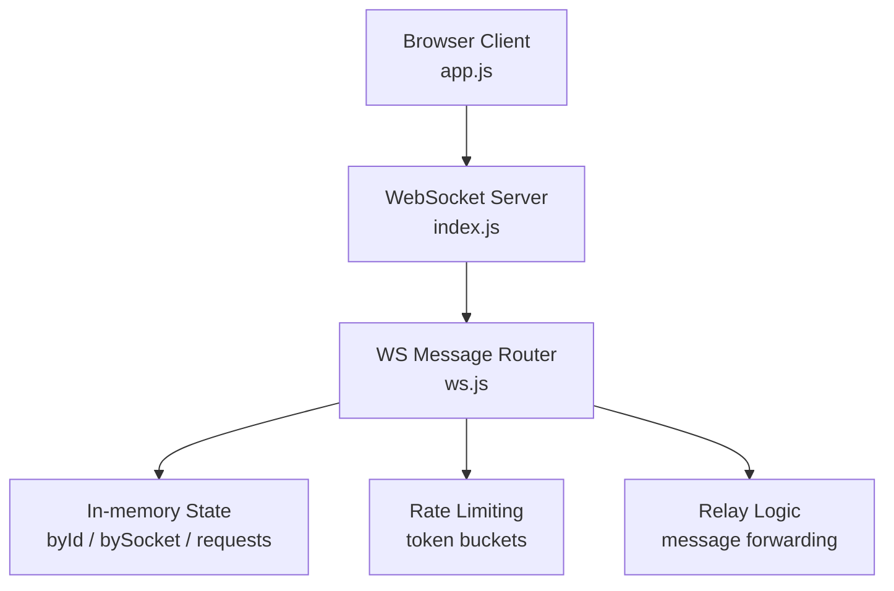
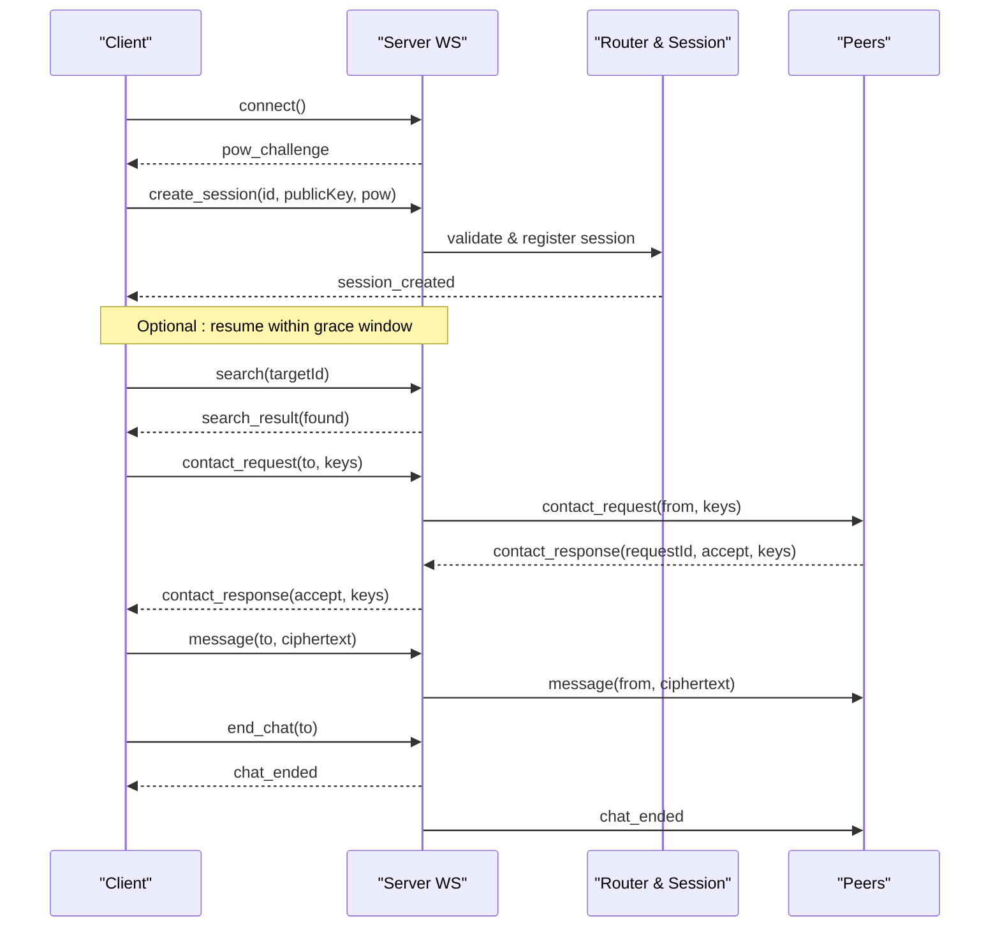
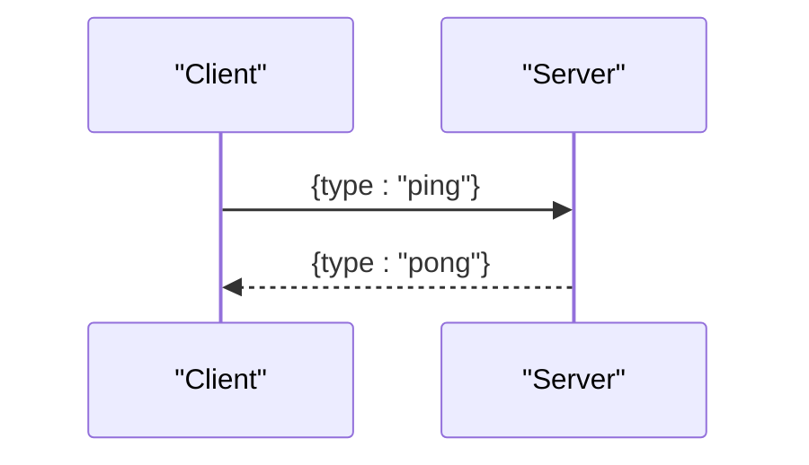
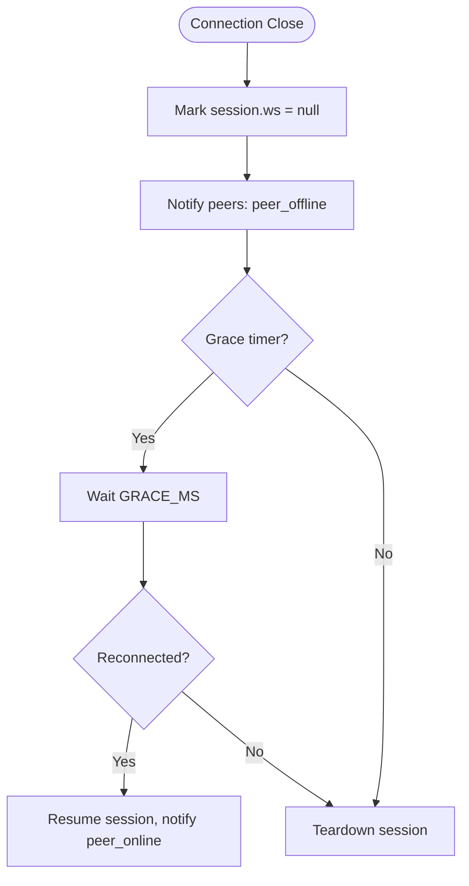
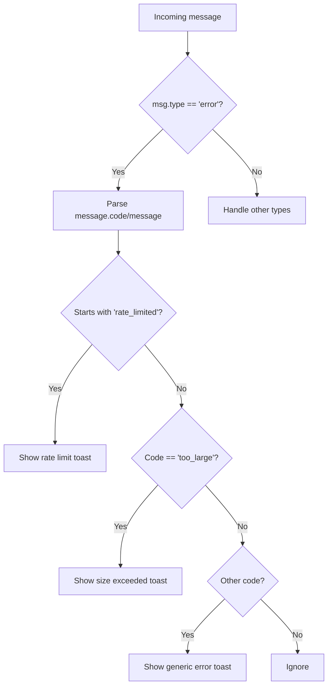
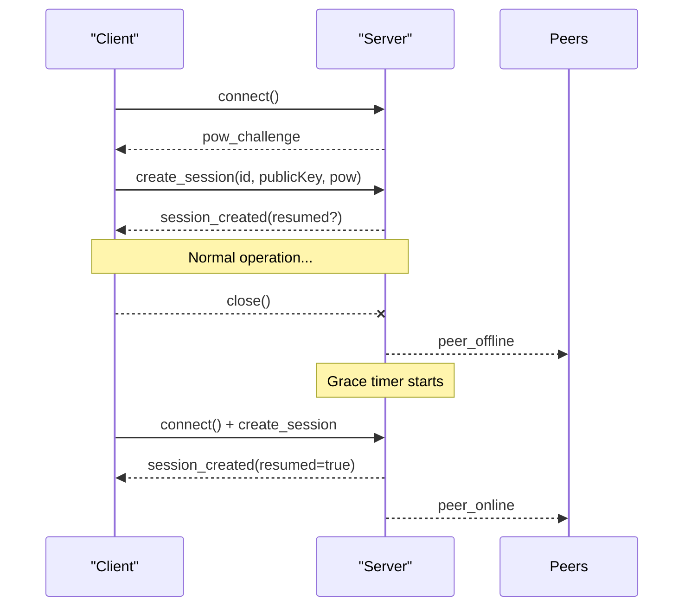
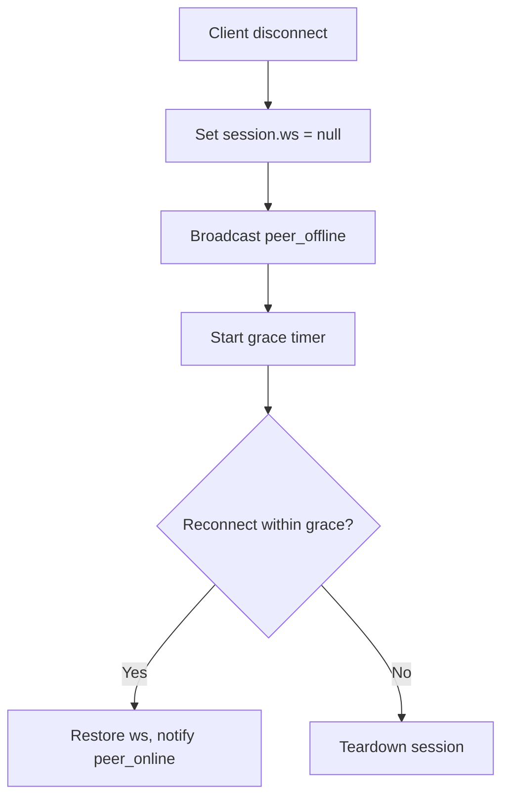
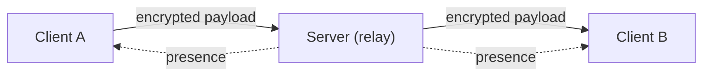

# System Messages

<cite>
**Referenced Files in This Document**
- [server/ws.js](file://server/ws.js)
- [server/index.js](file://server/index.js)
- [public/app.js](file://public/app.js)
- [public/crypto.js](file://public/crypto.js)
- [package.json](file://package.json)
</cite>

## Table of Contents
1. [Introduction](#introduction)
2. [Project Structure](#project-structure)
3. [Core Components](#core-components)
4. [Architecture Overview](#architecture-overview)
5. [Detailed Component Analysis](#detailed-component-analysis)
6. [Dependency Analysis](#dependency-analysis)
7. [Performance Considerations](#performance-considerations)
8. [Troubleshooting Guide](#troubleshooting-guide)
9. [Conclusion](#conclusion)

## Introduction
This document describes the system-level WebSocket messages used for connection management and status updates in the application. It focuses on:
- Heartbeat via ping/pong to monitor connection health
- Presence notifications (peer_online, peer_offline) that inform users about contact availability
- Error response formats and common error codes (no_session, bad_request, too_large, rate limiting errors)
- Connection lifecycle management, graceful disconnection handling, and error recovery strategies
- The server’s role as a stateless relay and how system messages maintain application state consistency across clients

The server is intentionally minimal and privacy-focused: it stores no logs, retains no data beyond RAM, and relays only ciphertext between clients. All cryptographic operations occur in the browser.

## Project Structure
At a high level:
- The Node HTTP server serves static assets and upgrades connections to WebSocket
- A WebSocket handler implements message routing, session management, presence, and rate limiting
- The client manages connection lifecycle, handles system messages, and performs end-to-end encryption



**Diagram sources**
- [server/index.js:91-109](file://server/index.js#L91-L109)
- [server/ws.js:257-312](file://server/ws.js#L257-L312)

**Section sources**
- [server/index.js:1-116](file://server/index.js#L1-L116)
- [server/ws.js:1-313](file://server/ws.js#L1-L313)
- [public/app.js:1-624](file://public/app.js#L1-L624)
- [package.json:1-19](file://package.json#L1-L19)

## Core Components
- WebSocket router and session manager: routes messages, enforces authentication, maintains per-session adjacency, and broadcasts presence
- Rate limiter: token-bucket based limits per action type to prevent abuse
- Presence system: notifies peers when a user comes online or goes offline
- Message relay: forwards encrypted payloads without inspecting content; no store-and-forward
- Client-side lifecycle: connects, solves proof-of-work, creates/resumes sessions, handles presence and errors, and reconnects gracefully

Key responsibilities are split cleanly between server and client:
- Server: protocol enforcement, presence, rate limiting, relay
- Client: cryptography, UI, reconnection logic, and local chat state

**Section sources**
- [server/ws.js:15-65](file://server/ws.js#L15-L65)
- [server/ws.js:122-186](file://server/ws.js#L122-L186)
- [server/ws.js:231-255](file://server/ws.js#L231-L255)
- [public/app.js:74-120](file://public/app.js#L74-L120)
- [public/app.js:124-193](file://public/app.js#L124-L193)

## Architecture Overview
The server acts as a stateless relay with ephemeral in-memory state. Clients authenticate via proof-of-work and identity keys, then exchange encrypted messages. Presence is maintained through explicit events.



**Diagram sources**
- [server/ws.js:94-105](file://server/ws.js#L94-L105)
- [server/ws.js:150-179](file://server/ws.js#L150-L179)
- [server/ws.js:181-229](file://server/ws.js#L181-L229)
- [server/ws.js:231-255](file://server/ws.js#L231-L255)
- [public/app.js:99-120](file://public/app.js#L99-L120)
- [public/app.js:227-310](file://public/app.js#L227-L310)

## Detailed Component Analysis

### Heartbeat: ping/pong
- Purpose: Keepalive and connection health monitoring
- Behavior:
  - Client sends a message with type "ping"
  - Server responds with a message with type "pong"
- Notes:
  - No payload required beyond the type field
  - Useful for detecting dead connections before timeouts



**Diagram sources**
- [server/ws.js:292-294](file://server/ws.js#L292-L294)

**Section sources**
- [server/ws.js:292-294](file://server/ws.js#L292-L294)

### Presence Notifications: peer_online and peer_offline
- peer_online:
  - Sent when a session becomes active (new or resumed within grace window)
  - Broadcast to all peers in the session’s adjacency set
- peer_offline:
  - Sent immediately when a connection closes
  - Also sent when attempting to send a message to an offline target
- Client behavior:
  - Updates presence indicators and titles accordingly



**Diagram sources**
- [server/ws.js:133-148](file://server/ws.js#L133-L148)
- [server/ws.js:158-171](file://server/ws.js#L158-L171)
- [server/ws.js:231-239](file://server/ws.js#L231-L239)
- [public/app.js:164-169](file://public/app.js#L164-L169)

**Section sources**
- [server/ws.js:133-148](file://server/ws.js#L133-L148)
- [server/ws.js:158-171](file://server/ws.js#L158-L171)
- [server/ws.js:231-239](file://server/ws.js#L231-L239)
- [public/app.js:164-169](file://public/app.js#L164-L169)

### Error Responses and Common Error Codes
All errors are delivered as messages with type "error" and a string message field.

Common error codes and their triggers:
- no_session:
  - Attempted operation without an established session (e.g., search, contact, message, end_chat)
- bad_request:
  - Invalid request context (e.g., contact_response referencing unknown or expired requestId)
- too_large:
  - Encrypted payload exceeds maximum allowed size
- rate_limited:<action>:
  - Exceeded per-action rate limit (search, contact, message, create)
- Additional validation errors:
  - bad_id, bad_key, bad_pow, id_taken during session creation

Client handling:
- Displays user-friendly toasts for rate limits and size errors
- Ignores non-fatal protocol errors like no_session where appropriate



**Diagram sources**
- [server/ws.js:89-91](file://server/ws.js#L89-L91)
- [server/ws.js:150-186](file://server/ws.js#L150-L186)
- [server/ws.js:207-239](file://server/ws.js#L207-L239)
- [public/app.js:170-193](file://public/app.js#L170-L193)

**Section sources**
- [server/ws.js:89-91](file://server/ws.js#L89-L91)
- [server/ws.js:150-186](file://server/ws.js#L150-L186)
- [server/ws.js:207-239](file://server/ws.js#L207-L239)
- [public/app.js:170-193](file://public/app.js#L170-L193)

### Connection Lifecycle Management
- Connect and authenticate:
  - Client opens WebSocket and requests proof-of-work challenge
  - Solves PoW locally and sends create_session with id, public key, and nonce
  - Server validates and registers session; may resume within grace window
- Graceful disconnect and resume:
  - On close, server marks session offline and starts a grace period
  - If the same client reconnects within the grace window with matching identity, session resumes and peers are notified online again
- Intentional logout:
  - Client sets intentionalClose flag and closes socket; server cleans up after grace period



**Diagram sources**
- [public/app.js:74-120](file://public/app.js#L74-L120)
- [server/ws.js:133-179](file://server/ws.js#L133-L179)

**Section sources**
- [public/app.js:74-120](file://public/app.js#L74-L120)
- [server/ws.js:133-179](file://server/ws.js#L133-L179)

### Graceful Disconnection Handling
- Immediate effects:
  - Session marked offline; peers receive peer_offline
  - Any pending message to that peer returns peer_offline instead of queuing
- Recovery:
  - Grace window allows seamless resume if the client reconnects quickly with the same identity
  - After grace expires, session is torn down and adjacency removed



**Diagram sources**
- [server/ws.js:133-148](file://server/ws.js#L133-L148)
- [server/ws.js:158-171](file://server/ws.js#L158-L171)

**Section sources**
- [server/ws.js:133-148](file://server/ws.js#L133-L148)
- [server/ws.js:158-171](file://server/ws.js#L158-L171)

### Error Recovery Strategies
- Rate limiting:
  - Back off and retry after delay; client shows informative toasts
- Too large:
  - Enforce client-side size checks; truncate or warn user
- No session:
  - Ensure session establishment completes before sending operational messages
- Bad request:
  - Validate requestId and session context on client side; avoid stale interactions
- Offline targets:
  - Inform user that recipient is offline; do not queue messages

**Section sources**
- [public/app.js:170-193](file://public/app.js#L170-L193)
- [server/ws.js:181-239](file://server/ws.js#L181-L239)

### Server as Stateless Relay and Consistency Model
- Stateless relay:
  - Server never inspects plaintext; only forwards base64 ciphertext
  - No persistence; all state is in RAM and cleared on process restart
- Consistency:
  - Presence is event-driven: peer_online/peer_offline keep UI states aligned
  - Chat adjacency is metadata-only; actual content remains end-to-end encrypted
  - Requests are short-lived and pruned periodically to avoid stale state



**Diagram sources**
- [server/ws.js:1-3](file://server/ws.js#L1-L3)
- [server/ws.js:231-239](file://server/ws.js#L231-L239)
- [public/app.js:164-169](file://public/app.js#L164-L169)

**Section sources**
- [server/ws.js:1-3](file://server/ws.js#L1-L3)
- [server/ws.js:231-239](file://server/ws.js#L231-L239)
- [public/app.js:164-169](file://public/app.js#L164-L169)

## Dependency Analysis
- Server dependencies:
  - Node http module for static serving and upgrade handling
  - ws library for WebSocket server
  - Internal modules: index.js wires HTTP and WS; ws.js implements protocol logic
- Client dependencies:
  - app.js orchestrates UI and WebSocket protocol
  - crypto.js provides cryptographic primitives and PoW solver

```mermaid
graph TB
subgraph "Server"
I["index.js"] --> W["ws.js"]
I --> N["Node http/ws"]
end
subgraph "Client"
A["app.js"] --> C["crypto.js"]
end
A < --> I
```

**Diagram sources**
- [server/index.js:1-116](file://server/index.js#L1-L116)
- [server/ws.js:1-313](file://server/ws.js#L1-L313)
- [public/app.js:1-624](file://public/app.js#L1-L624)
- [public/crypto.js:1-242](file://public/crypto.js#L1-L242)

**Section sources**
- [server/index.js:1-116](file://server/index.js#L1-L116)
- [server/ws.js:1-313](file://server/ws.js#L1-L313)
- [public/app.js:1-624](file://public/app.js#L1-L624)
- [public/crypto.js:1-242](file://public/crypto.js#L1-L242)
- [package.json:1-19](file://package.json#L1-L19)

## Performance Considerations
- Proof-of-work difficulty and nonce bounds protect against abuse while keeping client work reasonable
- Token bucket rate limiting smooths bursts and prevents enumeration/spam
- Maximum payload sizes enforced server-side to mitigate resource exhaustion
- Grace period reduces churn and improves UX during brief network interruptions

[No sources needed since this section provides general guidance]

## Troubleshooting Guide
- Symptoms and likely causes:
  - Frequent “rate limited” toasts:
    - Check action frequency; back off retries
  - “Message exceeds 2 KB”:
    - Reduce message size on client; enforce pre-send checks
  - “No session” errors:
    - Ensure session creation completes before sending operational messages
  - “Bad request” on contact responses:
    - Verify requestId validity and timely processing
  - Recipient appears offline:
    - Expect peer_offline; consider retry later or notify user
- Debugging tips:
  - Use ping/pong to verify liveness
  - Observe presence changes to confirm connectivity
  - Review client-side error handling paths for user feedback

**Section sources**
- [public/app.js:170-193](file://public/app.js#L170-L193)
- [server/ws.js:181-239](file://server/ws.js#L181-L239)

## Conclusion
The system uses a minimal, privacy-first design where the server acts as a stateless relay. System-level messages—ping/pong for heartbeat, peer_online/peer_offline for presence, and structured error responses—enable robust connection management and consistent state across clients. Rate limiting, size constraints, and grace periods provide resilience and protection against misuse. Clients implement end-to-end encryption and handle lifecycle events to deliver a secure, responsive messaging experience.

[No sources needed since this section summarizes without analyzing specific files]