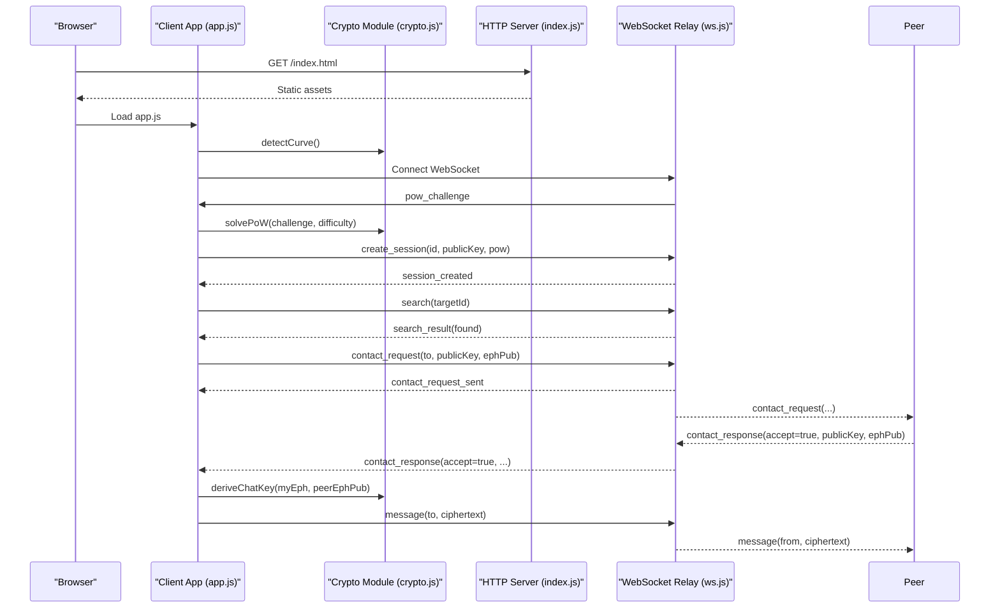
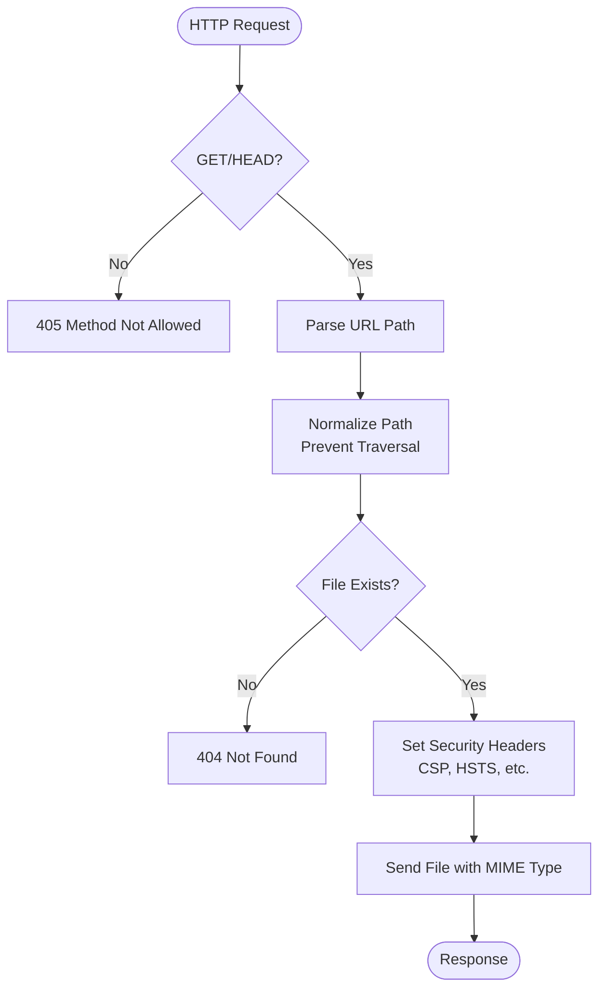
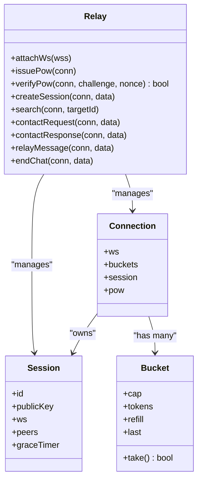
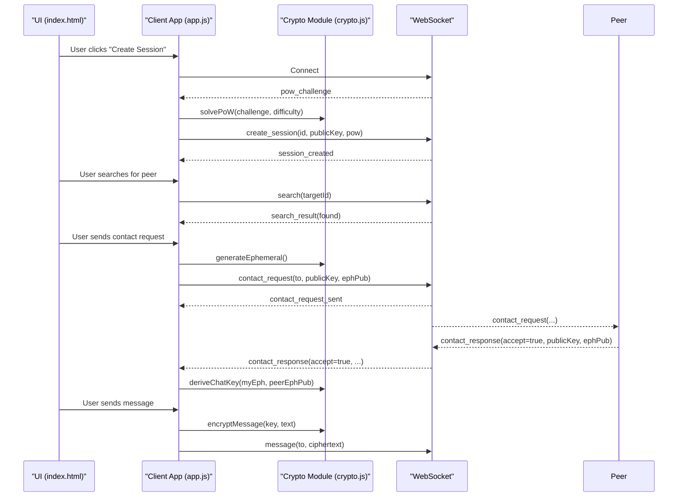
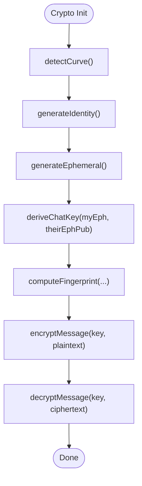
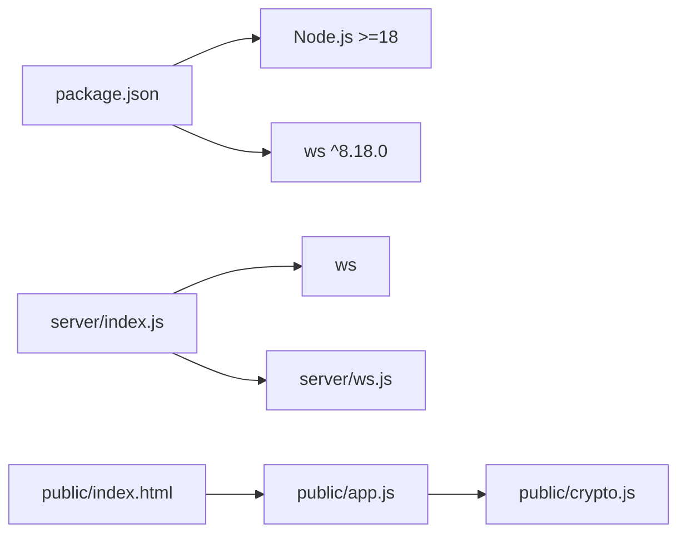

# Architecture Overview

<cite>
**Referenced Files in This Document**
- [package.json](file://package.json)
- [server/index.js](file://server/index.js)
- [server/ws.js](file://server/ws.js)
- [public/app.js](file://public/app.js)
- [public/crypto.js](file://public/crypto.js)
- [public/index.html](file://public/index.html)
</cite>

## Table of Contents
1. [Introduction](#introduction)
2. [Project Structure](#project-structure)
3. [Core Components](#core-components)
4. [Architecture Overview](#architecture-overview)
5. [Detailed Component Analysis](#detailed-component-analysis)
6. [Dependency Analysis](#dependency-analysis)
7. [Performance Considerations](#performance-considerations)
8. [Troubleshooting Guide](#troubleshooting-guide)
9. [Conclusion](#conclusion)

## Introduction
Shh V1.0 is a privacy-first, end-to-end encrypted real-time chat application. The system uses a Node.js backend that serves static assets and relays WebSocket messages without inspecting their content. The frontend is a vanilla JavaScript single-page application that performs all cryptographic operations locally using the Web Crypto API. All state is ephemeral and lives only in RAM; there are no databases, persistent logs, or disk-based storage on the server.

The design emphasizes:
- Zero persistence: every process restart clears all sessions and relationships.
- Stateless message relay: the server forwards opaque ciphertext payloads between clients.
- Client-side cryptography: private keys never leave the browser.
- Minimal attack surface: strict security headers, Content Security Policy, and rate limiting.

## Project Structure
The repository is organized into two main layers:
- Server layer (Node.js): HTTP server for static files, WebSocket upgrade handling, and an in-memory session/message relay.
- Client layer (browser): HTML/CSS/JS UI with a dedicated cryptographic module.

```mermaid
graph TB
subgraph "Browser"
UI["HTML + CSS"]
App["Client App (app.js)"]
Crypto["Crypto Module (crypto.js)"]
end
subgraph "Server (Node.js)"
HTTP["HTTP Server (index.js)"]
WSS["WebSocket Relay (ws.js)"]
end
UI --> App
App --> Crypto
App < --> |WebSocket| WSS
HTTP --> UI
HTTP --> WSS
```

**Diagram sources**
- [server/index.js:73-115](file://server/index.js#L73-L115)
- [server/ws.js:258-312](file://server/ws.js#L258-L312)
- [public/app.js:74-120](file://public/app.js#L74-L120)
- [public/crypto.js:1-10](file://public/crypto.js#L1-L10)
- [public/index.html:103-103](file://public/index.html#L103-L103)

**Section sources**
- [package.json:1-19](file://package.json#L1-L19)
- [server/index.js:1-116](file://server/index.js#L1-L116)
- [server/ws.js:1-313](file://server/ws.js#L1-L313)
- [public/app.js:1-624](file://public/app.js#L1-L624)
- [public/crypto.js:1-242](file://public/crypto.js#L1-L242)
- [public/index.html:1-106](file://public/index.html#L1-L106)

## Core Components
- Node.js HTTP server: Serves static assets from the public directory, applies strict security headers, and upgrades connections to WebSockets.
- WebSocket relay: Manages in-memory sessions, presence, contact requests, and message routing. It validates inputs and enforces rate limits but does not decrypt or log message content.
- Client app: Handles connection lifecycle, user interactions, and protocol messaging over WebSocket.
- Cryptographic module: Implements identity generation, per-chat key derivation, encryption/decryption, fingerprinting, and proof-of-work solving using Web Crypto API.

Key architectural properties:
- Stateless relay: Messages are forwarded as base64-encoded ciphertexts.
- In-memory state: Sessions, peer adjacency, and pending requests exist only in RAM.
- Privacy by default: No database, no request/connection logs, no cookies, no IndexedDB.

**Section sources**
- [server/index.js:1-116](file://server/index.js#L1-L116)
- [server/ws.js:1-313](file://server/ws.js#L1-L313)
- [public/app.js:1-624](file://public/app.js#L1-L624)
- [public/crypto.js:1-242](file://public/crypto.js#L1-L242)

## Architecture Overview
The system follows a client-server model where:
- Clients connect via HTTPS to fetch assets and then establish a secure WebSocket connection (WSS).
- The server authenticates clients through a Proof-of-Work challenge to mitigate abuse.
- Clients create an anonymous identity (in-memory) and optionally search for peers by ID.
- Chat sessions are established through a contact request/response flow that exchanges ephemeral public keys and derives a shared AES-GCM key locally.
- Messages are encrypted client-side and relayed by the server without inspection.



**Diagram sources**
- [public/app.js:74-120](file://public/app.js#L74-L120)
- [public/app.js:124-176](file://public/app.js#L124-L176)
- [public/app.js:237-310](file://public/app.js#L237-L310)
- [public/app.js:344-359](file://public/app.js#L344-L359)
- [server/ws.js:93-105](file://server/ws.js#L93-L105)
- [server/ws.js:150-179](file://server/ws.js#L150-L179)
- [server/ws.js:181-240](file://server/ws.js#L181-L240)

## Detailed Component Analysis

### Server: HTTP Layer and Security
Responsibilities:
- Serve static files from the public directory with safe path normalization.
- Apply strict security headers including Content-Security-Policy, HSTS, X-Frame-Options, Referrer-Policy, and Permissions-Policy.
- Upgrade HTTP connections to WebSockets when appropriate.
- Enforce a maximum payload size for WebSocket frames.

Security considerations:
- CSP restricts scripts/styles/assets to same-origin and allows ws/wss for WebSocket communication.
- Cache-Control: no-store ensures clients always load fresh crypto code.
- No logging of requests or connections.



**Diagram sources**
- [server/index.js:41-71](file://server/index.js#L41-L71)
- [server/index.js:73-89](file://server/index.js#L73-L89)

**Section sources**
- [server/index.js:14-39](file://server/index.js#L14-L39)
- [server/index.js:41-89](file://server/index.js#L41-L89)
- [server/index.js:91-115](file://server/index.js#L91-L115)

### Server: WebSocket Relay and Session Management
Responsibilities:
- Manage in-memory maps for sessions by ID and by socket.
- Handle Proof-of-Work challenges and validate nonces.
- Validate identities and ephemeral public keys.
- Route messages between online peers without decryption.
- Maintain presence and chat adjacency metadata only.
- Rate-limit actions per connection using token buckets.

State model:
- byId: Maps session IDs to session objects containing the connected WebSocket, public key, and peer set.
- bySocket: Maps WebSocket instances to connection context.
- requests: Stores pending contact requests with expiry timestamps.



**Diagram sources**
- [server/ws.js:23-34](file://server/ws.js#L23-L34)
- [server/ws.js:36-65](file://server/ws.js#L36-L65)
- [server/ws.js:93-105](file://server/ws.js#L93-L105)
- [server/ws.js:150-179](file://server/ws.js#L150-L179)
- [server/ws.js:181-240](file://server/ws.js#L181-L240)
- [server/ws.js:258-312](file://server/ws.js#L258-L312)

**Section sources**
- [server/ws.js:1-313](file://server/ws.js#L1-L313)

### Client: Application Controller and UI
Responsibilities:
- Establish WebSocket connection and handle reconnection logic.
- Drive the UI based on server events (presence, requests, messages).
- Manage local in-memory state for chats, pending requests, and active chat.
- Integrate with the cryptographic module for key management and message encryption.

Communication patterns:
- On open, request PoW challenge and authenticate with create_session.
- Search for peers by ID and send contact requests with ephemeral public keys.
- Accept/reject incoming contact requests and establish per-chat keys.
- Encrypt outgoing messages and display decrypted incoming messages.



**Diagram sources**
- [public/app.js:74-120](file://public/app.js#L74-L120)
- [public/app.js:124-176](file://public/app.js#L124-L176)
- [public/app.js:237-310](file://public/app.js#L237-L310)
- [public/app.js:344-359](file://public/app.js#L344-L359)

**Section sources**
- [public/app.js:1-624](file://public/app.js#L1-L624)
- [public/index.html:1-106](file://public/index.html#L1-L106)

### Client: Cryptographic Module
Responsibilities:
- Generate identity keypairs and per-chat ephemeral keypairs.
- Negotiate ECDH curve (X25519 preferred, P-256 fallback).
- Derive per-chat AES-256-GCM keys using HKDF with order-independent salt.
- Compute human-checkable fingerprints for MITM verification.
- Encrypt/decrypt messages with AES-GCM and unique nonces.
- Solve Proof-of-Work challenges using a compact SHA-256 implementation.

Design highlights:
- Private keys remain in memory only; they are never serialized or transmitted.
- Forward secrecy: each chat uses a fresh ephemeral keypair.
- Curve negotiation is implicit based on public key length.



**Diagram sources**
- [public/crypto.js:135-157](file://public/crypto.js#L135-L157)
- [public/crypto.js:167-180](file://public/crypto.js#L167-L180)
- [public/crypto.js:191-211](file://public/crypto.js#L191-L211)
- [public/crypto.js:213-221](file://public/crypto.js#L213-L221)
- [public/crypto.js:223-241](file://public/crypto.js#L223-L241)

**Section sources**
- [public/crypto.js:1-242](file://public/crypto.js#L1-L242)

## Dependency Analysis
External dependencies:
- Node.js runtime (>=18)
- ws library for WebSocket server functionality

Internal dependencies:
- server/index.js depends on ws and delegates WebSocket handling to server/ws.js.
- public/app.js imports functions from public/crypto.js.
- public/index.html loads public/app.js as a module.



**Diagram sources**
- [package.json:1-19](file://package.json#L1-L19)
- [server/index.js:1-10](file://server/index.js#L1-L10)
- [public/app.js:1-8](file://public/app.js#L1-L8)
- [public/index.html:103-103](file://public/index.html#L103-L103)

**Section sources**
- [package.json:1-19](file://package.json#L1-L19)
- [server/index.js:1-10](file://server/index.js#L1-L10)
- [public/app.js:1-8](file://public/app.js#L1-L8)
- [public/index.html:103-103](file://public/index.html#L103-L103)

## Performance Considerations
- Stateless relay minimizes server-side processing overhead; only JSON parsing and forwarding occur.
- Token-bucket rate limiting protects against abuse while allowing bursts within configured limits.
- Maximum payload sizes prevent resource exhaustion (WebSocket frame cap and message size checks).
- Graceful disconnection handling avoids long-lived timers beyond necessary cleanup windows.
- Client-side cryptography offloads heavy operations to the browser; PoW solving yields to the event loop to keep UI responsive.

[No sources needed since this section provides general guidance]

## Troubleshooting Guide
Common issues and behaviors:
- Rate limiting errors: The server responds with specific error codes for excessive search, contact, message, or create actions. The client displays user-friendly toasts indicating which action was throttled.
- Message too large: The server rejects oversized ciphertexts; the client enforces a 2 KB limit before sending.
- Session creation failures: Occur if the identifier is invalid, the public key is malformed, or the PoW is incorrect. The client prompts retry behavior.
- Offline peers: If a recipient is offline, the server notifies the sender; no store-and-forward occurs.
- Presence updates: Peers receive peer_online and peer_offline events to update UI indicators.

Operational notes:
- No logs are written for requests or connections; debugging relies on client-side toasts and console output limited to startup confirmation.
- Closing the tab ends the session immediately; the server prunes sessions after a short grace period.

**Section sources**
- [public/app.js:178-193](file://public/app.js#L178-L193)
- [server/ws.js:89-91](file://server/ws.js#L89-L91)
- [server/ws.js:133-148](file://server/ws.js#L133-L148)
- [server/ws.js:231-240](file://server/ws.js#L231-L240)

## Conclusion
Shh V1.0 implements a minimal, privacy-preserving architecture centered around a stateless WebSocket relay and client-side cryptography. By avoiding databases and logs, it reduces exposure of sensitive data and simplifies operational concerns. The separation of concerns between server components (HTTP server, WebSocket handler, session management) and client components (UI controller, WebSocket client, cryptographic module) enables clear responsibilities and maintainability. The zero-persistence design ensures that all state is ephemeral, aligning with the project’s goal of anonymity and confidentiality.

[No sources needed since this section summarizes without analyzing specific files]