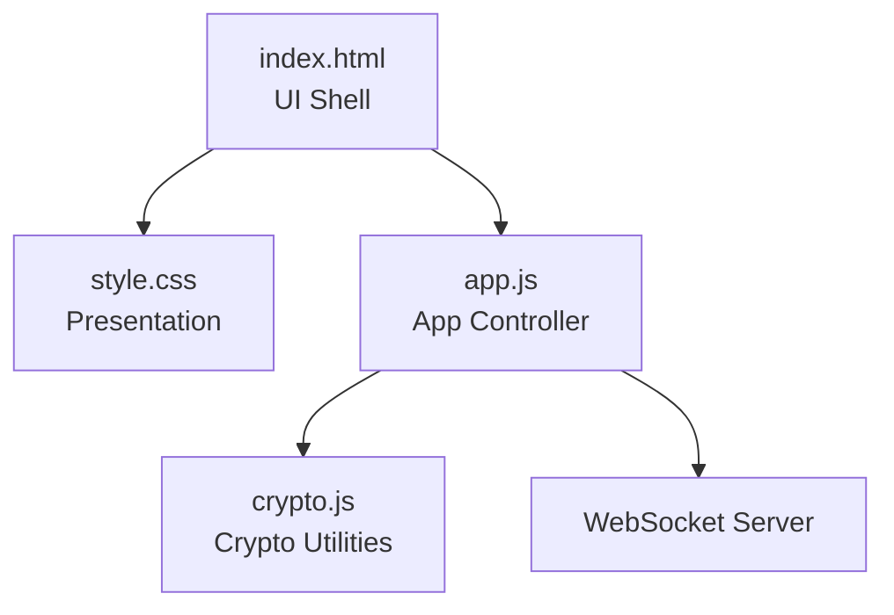
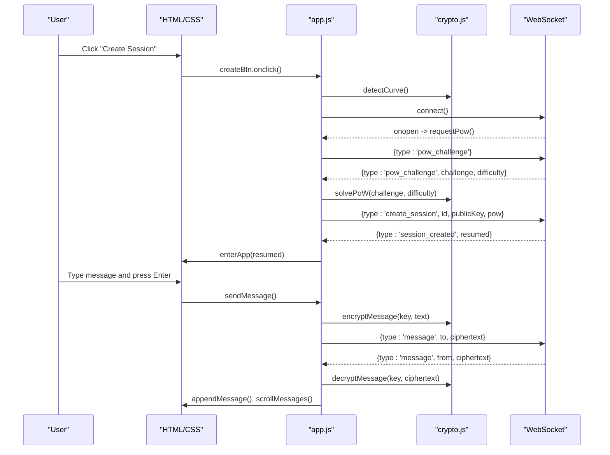
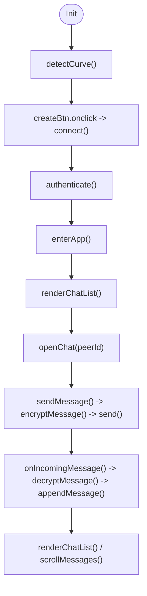
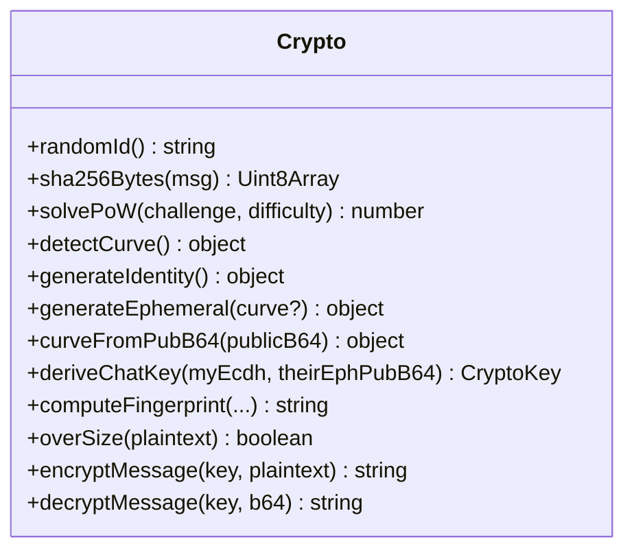
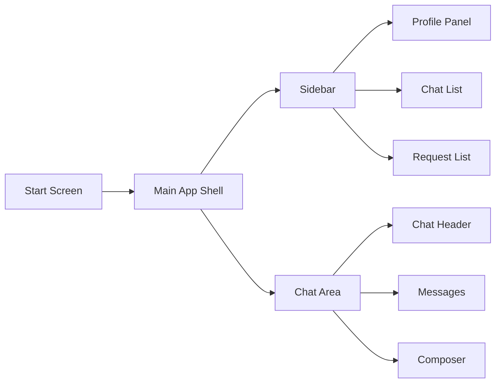
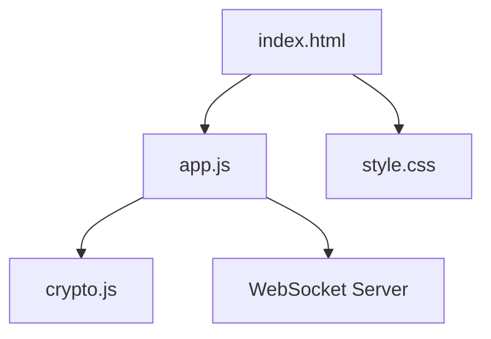

# Client Architecture

<cite>
**Referenced Files in This Document**
- [app.js](file://public/app.js)
- [crypto.js](file://public/crypto.js)
- [index.html](file://public/index.html)
- [style.css](file://public/style.css)
</cite>

## Table of Contents
1. [Introduction](#introduction)
2. [Project Structure](#project-structure)
3. [Core Components](#core-components)
4. [Architecture Overview](#architecture-overview)
5. [Detailed Component Analysis](#detailed-component-analysis)
6. [Dependency Analysis](#dependency-analysis)
7. [Performance Considerations](#performance-considerations)
8. [Troubleshooting Guide](#troubleshooting-guide)
9. [Conclusion](#conclusion)

## Introduction
This document describes the client-side architecture of Shh V1.0, a vanilla JavaScript end-to-end encrypted chat application. The frontend is split into three clear layers:
- UI logic and event handling in app.js
- Cryptographic operations in crypto.js
- Presentation layer in index.html and style.css

The client uses an event-driven model to handle user interactions and WebSocket events. All data (sessions, chats, messages, UI state) lives in memory for the lifetime of the tab. There is no persistence (no localStorage, cookies, or IndexedDB). The design emphasizes separation of concerns between business logic, cryptography, and rendering, while providing responsive layouts and accessibility features.

## Project Structure
The client consists of four files under public/:
- index.html: Application shell with semantic sections, ARIA labels, and module script import
- style.css: Dark theme, CSS variables, responsive grid layout, and mobile-first adjustments
- app.js: Main application controller; manages WebSocket lifecycle, session state, chat list, messaging, and UI updates
- crypto.js: Pure cryptographic utilities; identity generation, ephemeral keys, ECDH key derivation, AES-GCM encryption/decryption, PoW solver, fingerprinting

**Diagram sources**
- [index.html:1-106](file://public/index.html#L1-L106)
- [style.css:1-225](file://public/style.css#L1-L225)
- [app.js:1-624](file://public/app.js#L1-L624)
- [crypto.js:1-242](file://public/crypto.js#L1-L242)

**Section sources**
- [index.html:1-106](file://public/index.html#L1-L106)
- [style.css:1-225](file://public/style.css#L1-L225)
- [app.js:1-624](file://public/app.js#L1-L624)
- [crypto.js:1-242](file://public/crypto.js#L1-L242)

## Core Components
- App controller (app.js):
  - DOM references and helpers
  - In-memory state: session, chats Map, pendingOut, incoming requests, activeChat, presence
  - WebSocket lifecycle: connect, authenticate, message dispatch, reconnection
  - Search/contact flow: send contact request, accept/reject incoming requests
  - Messaging: encrypt outgoing, decrypt incoming, render messages
  - UI rendering: chat list, requests panel, chat pane, composer autosize, size hint
  - Event wiring: buttons, inputs, menus, profile toggles, logout/reset

- Crypto utilities (crypto.js):
  - Base32 ID generation
  - Custom SHA-256 implementation for PoW
  - Curve negotiation (X25519 preferred, P-256 fallback)
  - Identity and ephemeral key generation
  - ECDH + HKDF to derive per-chat AES-256-GCM key
  - Fingerprint computation for out-of-band verification
  - Message encryption/decryption with unique nonces

- Presentation (index.html + style.css):
  - Semantic sections for start screen and main app
  - Accessible controls with aria-labels and aria-pressed
  - Responsive two-pane layout that collapses on small screens
  - Dark-only theme with CSS variables and minimal styling

**Section sources**
- [app.js:10-36](file://public/app.js#L10-L36)
- [app.js:74-120](file://public/app.js#L74-L120)
- [app.js:124-176](file://public/app.js#L124-L176)
- [app.js:227-322](file://public/app.js#L227-L322)
- [app.js:324-359](file://public/app.js#L324-L359)
- [app.js:398-530](file://public/app.js#L398-L530)
- [app.js:556-624](file://public/app.js#L556-L624)
- [crypto.js:12-45](file://public/crypto.js#L12-L45)
- [crypto.js:47-127](file://public/crypto.js#L47-L127)
- [crypto.js:135-180](file://public/crypto.js#L135-L180)
- [crypto.js:191-221](file://public/crypto.js#L191-L221)
- [crypto.js:223-241](file://public/crypto.js#L223-L241)
- [index.html:1-106](file://public/index.html#L1-L106)
- [style.css:1-225](file://public/style.css#L1-L225)

## Architecture Overview
The client follows a modular, event-driven architecture:
- User actions trigger handlers in app.js
- Handlers call crypto.js for cryptographic operations
- app.js sends JSON over WebSocket to the server
- Incoming messages are dispatched by type and update in-memory state
- Rendering functions update the DOM based on current state

**Diagram sources**
- [app.js:569-575](file://public/app.js#L569-L575)
- [app.js:74-120](file://public/app.js#L74-L120)
- [app.js:124-176](file://public/app.js#L124-L176)
- [app.js:344-359](file://public/app.js#L344-L359)
- [crypto.js:151-157](file://public/crypto.js#L151-L157)
- [crypto.js:115-127](file://public/crypto.js#L115-L127)
- [crypto.js:228-241](file://public/crypto.js#L228-L241)

## Detailed Component Analysis

### UI Logic and State Management (app.js)
- DOM references: Centralized element accessors simplify event binding and rendering
- In-memory state:
  - ws: WebSocket instance
  - session: current identity and id
  - chats: Map of peerId to chat objects (messages, key, fingerprint, online, unread)
  - pendingOut: outbound contact requests with ephemeral key promises
  - incoming: inbound contact requests with initiator info
  - notifByPeer: actionable notices mapped by peerId
  - activeChat: currently open chat peerId
  - reconnectTimer/intentionalClose: reconnection control
- Event-driven model:
  - WebSocket onmessage routes to onMessage switch-case dispatcher
  - UI events wired in init(): create session, search, profile toggles, copy ID, logout, chat menu, composer input/keydown
- State transitions:
  - Start screen -> authenticated app -> chat list -> open chat -> send/receive messages
  - Contact flow: search -> found notice -> send request -> accept/reject -> establish chat
- Presence and offline handling:
  - Peer online/offline events update chat.online and UI title
  - Reconnect timer attempts quick reconnect after socket close unless intentionalClose

**Diagram sources**
- [app.js:559-575](file://public/app.js#L559-L575)
- [app.js:108-120](file://public/app.js#L108-L120)
- [app.js:195-207](file://public/app.js#L195-L207)
- [app.js:398-437](file://public/app.js#L398-L437)
- [app.js:466-493](file://public/app.js#L466-L493)
- [app.js:344-359](file://public/app.js#L344-L359)
- [app.js:324-342](file://public/app.js#L324-L342)

**Section sources**
- [app.js:10-36](file://public/app.js#L10-L36)
- [app.js:74-120](file://public/app.js#L74-L120)
- [app.js:124-176](file://public/app.js#L124-L176)
- [app.js:195-225](file://public/app.js#L195-L225)
- [app.js:227-322](file://public/app.js#L227-L322)
- [app.js:324-359](file://public/app.js#L324-L359)
- [app.js:398-530](file://public/app.js#L398-L530)
- [app.js:556-624](file://public/app.js#L556-L624)

### Cryptographic Operations (crypto.js)
- Identity and ephemeral keys:
  - generateIdentity(): creates X25519 or P-256 keypair
  - generateEphemeral(curve?): fresh per-chat keypair for forward secrecy
- Curve negotiation:
  - detectCurve(): probes Web Crypto for X25519 then P-256; caches result
  - curveFromPubB64(): infers curve from public key byte length (32 vs 65)
- Key derivation:
  - deriveChatKey(myEcdh, theirEphPubB64): ECDH shared secret -> HKDF-SHA256 with sorted ephemeral pubs as salt -> AES-256-GCM key
- Fingerprint:
  - computeFingerprint(...): SHA-256 over sorted identity and ephemeral pub pairs for MITM verification
- Message security:
  - encryptMessage(key, plaintext): AES-GCM with random 96-bit nonce; returns base64(iv || ct)
  - decryptMessage(key, b64): splits iv and ct, verifies tag, decodes UTF-8
- Proof-of-work:
  - sha256Bytes(): custom synchronous SHA-256 for fast PoW solving
  - solvePoW(challenge, difficulty): brute-force nonce with periodic yield to keep UI responsive

**Diagram sources**
- [crypto.js:12-45](file://public/crypto.js#L12-L45)
- [crypto.js:47-127](file://public/crypto.js#L47-L127)
- [crypto.js:135-180](file://public/crypto.js#L135-L180)
- [crypto.js:191-221](file://public/crypto.js#L191-L221)
- [crypto.js:223-241](file://public/crypto.js#L223-L241)

**Section sources**
- [crypto.js:12-45](file://public/crypto.js#L12-L45)
- [crypto.js:47-127](file://public/crypto.js#L47-L127)
- [crypto.js:135-180](file://public/crypto.js#L135-L180)
- [crypto.js:191-221](file://public/crypto.js#L191-L221)
- [crypto.js:223-241](file://public/crypto.js#L223-L241)

### Presentation Layer (index.html + style.css)
- HTML structure:
  - Start screen section with brand, tagline, create button, and hint
  - Main app with sidebar (profile, search, chat list, requests) and chat area (header, messages, composer)
  - Toast container with aria-live for announcements
  - Module script import for app.js
- Accessibility:
  - aria-label attributes on interactive elements
  - aria-pressed toggles for show/hide controls
  - aria-live region for toast notifications
- Responsive design:
  - CSS Grid two-column layout on desktop
  - Single-column stack on mobile with pane switching via data-pane attribute
  - Mobile-friendly touch targets and font sizes
- Theme:
  - Dark-only color scheme using CSS variables
  - Minimalist monochrome palette with subtle borders and shadows

**Diagram sources**
- [index.html:13-99](file://public/index.html#L13-L99)
- [style.css:57-220](file://public/style.css#L57-L220)

**Section sources**
- [index.html:1-106](file://public/index.html#L1-L106)
- [style.css:1-225](file://public/style.css#L1-L225)

## Dependency Analysis
- app.js depends on crypto.js for all cryptographic operations
- index.html imports app.js as a module and links style.css
- No direct dependency from crypto.js to app.js or HTML/CSS
- WebSocket communication is abstracted behind send() and onMessage() in app.js

**Diagram sources**
- [index.html:103](file://public/index.html#L103)
- [app.js:4-8](file://public/app.js#L4-L8)
- [app.js:95-97](file://public/app.js#L95-L97)

**Section sources**
- [index.html:103](file://public/index.html#L103)
- [app.js:4-8](file://public/app.js#L4-L8)
- [app.js:95-97](file://public/app.js#L95-L97)

## Performance Considerations
- PoW solver yields periodically to avoid blocking the UI thread
- Message size capped at 2 KB to limit payload and processing time
- DOM updates are batched where possible (e.g., renderChatList rebuilds list once)
- Autosize textarea avoids excessive layout thrashing by capping max height
- In-memory state ensures fast reads/writes without I/O latency

[No sources needed since this section provides general guidance]

## Troubleshooting Guide
- Browser does not support required cryptography:
  - detectCurve() disables create button and shows hint when neither X25519 nor P-256 is available
- Rate limiting errors:
  - onError handles rate_limited codes and displays localized toasts
- Too-large messages:
  - overSize() check prevents sending >2KB payloads and shows error toast
- Session creation failures:
  - Handles id_taken and bad_pow with user-facing toasts
- Reconnection:
  - onSocketClosed schedules reconnect after 1 second unless intentionalClose is set
- Copy to clipboard:
  - navigator.clipboard may fail; catch block shows error toast

**Section sources**
- [app.js:559-575](file://public/app.js#L559-L575)
- [app.js:178-193](file://public/app.js#L178-L193)
- [app.js:344-359](file://public/app.js#L344-L359)
- [app.js:86-93](file://public/app.js#L86-L93)
- [app.js:590-593](file://public/app.js#L590-L593)

## Conclusion
Shh V1.0’s client architecture cleanly separates UI logic, cryptographic operations, and presentation. The event-driven model simplifies handling both user interactions and WebSocket events. In-memory state management keeps the app simple and secure by design, while responsive CSS and accessibility attributes ensure broad usability. The progressive enhancement strategy relies on feature detection for cryptographic curves, and the offline-first approach is implemented through graceful reconnection and robust error handling.