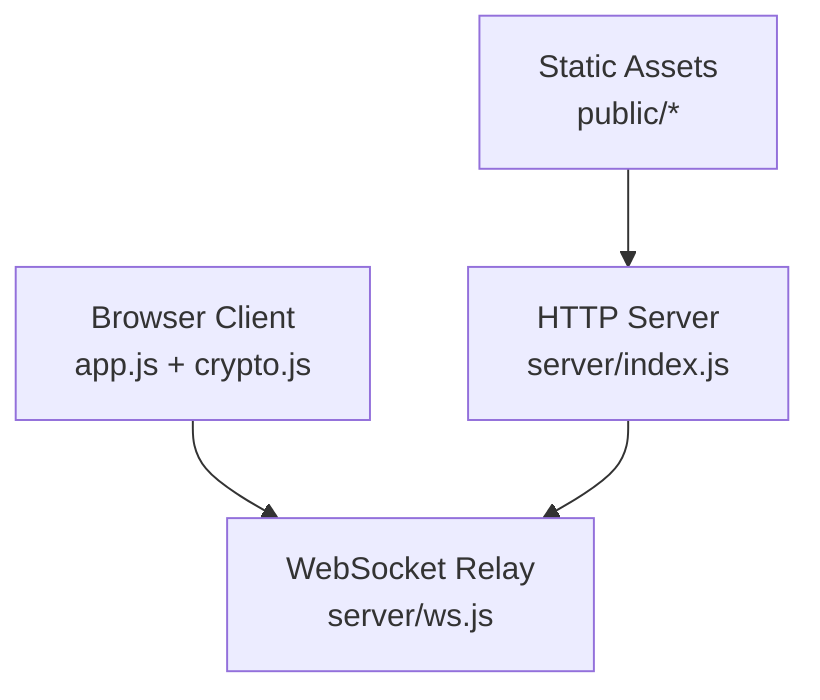
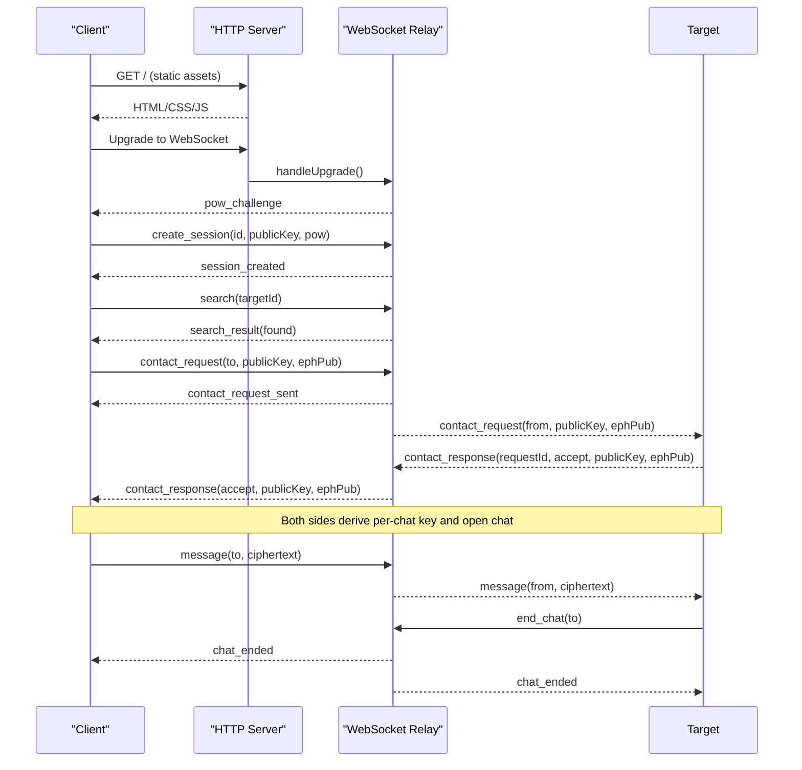
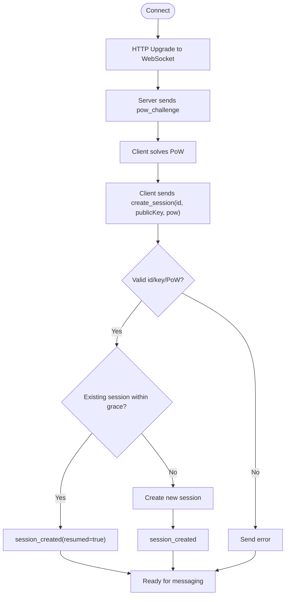
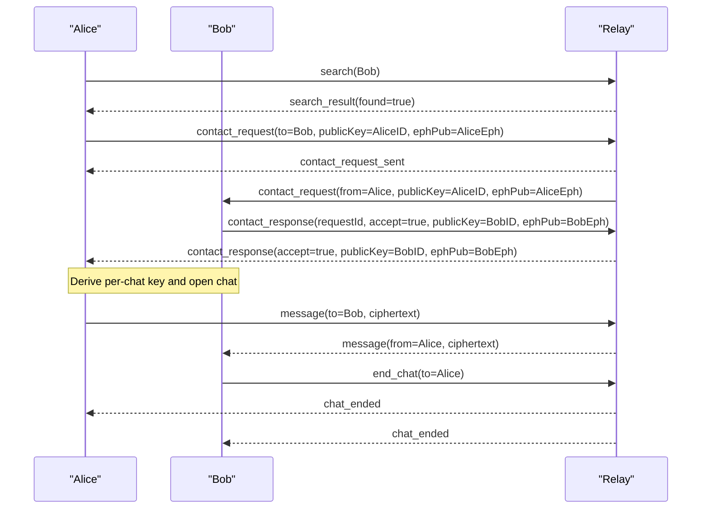
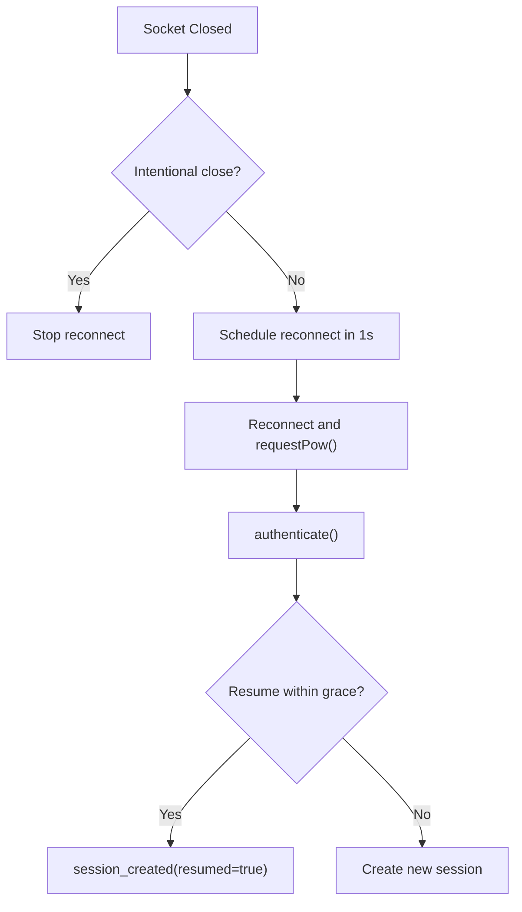
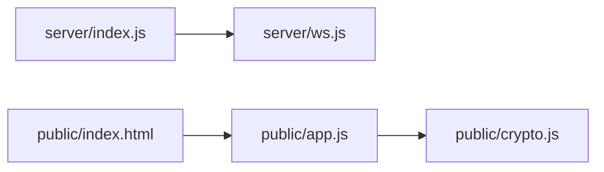

# Communication Protocols

<cite>
**Referenced Files in This Document**
- [package.json](file://package.json)
- [server/index.js](file://server/index.js)
- [server/ws.js](file://server/ws.js)
- [public/app.js](file://public/app.js)
- [public/crypto.js](file://public/crypto.js)
- [public/index.html](file://public/index.html)
</cite>

## Table of Contents
1. [Introduction](#introduction)
2. [Project Structure](#project-structure)
3. [Core Components](#core-components)
4. [Architecture Overview](#architecture-overview)
5. [Detailed Component Analysis](#detailed-component-analysis)
6. [Dependency Analysis](#dependency-analysis)
7. [Performance Considerations](#performance-considerations)
8. [Troubleshooting Guide](#troubleshooting-guide)
9. [Conclusion](#conclusion)

## Introduction
This document describes the Shh V1.0 communication protocols for a secure, anonymous, end-to-end encrypted real-time messaging system. The protocol runs over WebSocket and uses a binary payload format for encrypted messages. The server is a minimal relay that never sees plaintext or keys; it forwards ciphertext between authenticated clients.

Key design goals:
- No persistent storage on the server (in-memory only).
- No logs and no IP retention.
- Proof-of-work to mitigate abuse.
- Forward secrecy per conversation using ephemeral key exchange.
- Strict payload validation and size limits.
- Graceful session recovery within a short grace window after reconnects.

## Project Structure
The project consists of:
- A Node.js HTTP server with static file serving and WebSocket upgrade handling.
- A WebSocket relay module implementing the protocol logic.
- A browser client application handling UI, connection lifecycle, cryptography, and message flow.
- A crypto module providing identity generation, ephemeral key exchange, shared key derivation, fingerprinting, and AES-GCM encryption/decryption.

**Diagram sources**
- [server/index.js:73-109](file://server/index.js#L73-L109)
- [server/ws.js:258-312](file://server/ws.js#L258-L312)
- [public/app.js:75-120](file://public/app.js#L75-L120)
- [public/crypto.js:129-241](file://public/crypto.js#L129-L241)

**Section sources**
- [package.json:1-19](file://package.json#L1-L19)
- [server/index.js:1-116](file://server/index.js#L1-L116)
- [server/ws.js:1-313](file://server/ws.js#L1-L313)
- [public/app.js:1-624](file://public/app.js#L1-L624)
- [public/crypto.js:1-242](file://public/crypto.js#L1-L242)
- [public/index.html:1-106](file://public/index.html#L1-L106)

## Core Components
- HTTP server and security headers: Serves static assets, enforces strict Content Security Policy, and upgrades requests to WebSocket.
- WebSocket relay: Implements proof-of-work challenge, session creation, presence, contact discovery, chat adjacency, message relay, and chat termination.
- Client app: Manages WebSocket lifecycle, UI state, contact discovery, request/response flows, and message sending/receiving.
- Crypto module: Provides identity and ephemeral key generation, ECDH-based shared secret derivation, HKDF key scheduling, AES-GCM encryption/decryption, and fingerprint computation.

**Section sources**
- [server/index.js:24-84](file://server/index.js#L24-L84)
- [server/ws.js:5-21](file://server/ws.js#L5-L21)
- [server/ws.js:93-120](file://server/ws.js#L93-L120)
- [server/ws.js:150-255](file://server/ws.js#L150-L255)
- [public/app.js:75-120](file://public/app.js#L75-L120)
- [public/crypto.js:129-241](file://public/crypto.js#L129-L241)

## Architecture Overview
The protocol follows these phases:
1. HTTP upgrade to WebSocket.
2. Proof-of-work challenge issuance and solution by the client.
3. Session creation with identity public key and PoW nonce.
4. Contact discovery via ID search.
5. Bidirectional contact request/response with ephemeral key exchange.
6. End-to-end encryption using per-chat keys derived from ECDH and HKDF.
7. Real-time message relay with presence updates and chat termination signals.

**Diagram sources**
- [server/index.js:91-109](file://server/index.js#L91-L109)
- [server/ws.js:93-105](file://server/ws.js#L93-L105)
- [server/ws.js:150-179](file://server/ws.js#L150-L179)
- [server/ws.js:181-255](file://server/ws.js#L181-L255)
- [public/app.js:99-120](file://public/app.js#L99-L120)
- [public/app.js:227-322](file://public/app.js#L227-L322)
- [public/app.js:324-359](file://public/app.js#L324-L359)

## Detailed Component Analysis

### Binary Protocol Format
- Transport: JSON frames over WebSocket for control messages.
- Payload: Base64-encoded binary ciphertext for message content.
- Message envelope: JSON object with a required string field type and additional fields depending on the message type.
- Encrypted message payload: Base64(iv || ciphertext || tag), where iv is a unique 96-bit nonce and ciphertext includes the AES-GCM tag.

Constraints:
- Plaintext maximum size: 2 KB.
- Maximum ciphertext length enforced by server: approximately 2 KB plus IV and tag overhead.
- Public key formats: X25519 raw (32 bytes -> base64 length 44) or P-256 uncompressed point (65 bytes -> base64 length 88).

**Section sources**
- [public/crypto.js:14](file://public/crypto.js#L14)
- [public/crypto.js:228-241](file://public/crypto.js#L228-L241)
- [server/ws.js:10-13](file://server/ws.js#L10-L13)
- [server/ws.js:111-120](file://server/ws.js#L111-L120)

### Connection Lifecycle
- Initial HTTP upgrade: The server accepts WebSocket upgrades and delegates to the relay.
- Proof-of-work challenge: The server issues a random challenge and difficulty; the client solves SHA-256(challenge:nonce) with leading zeros.
- Session creation: The client sends its identity public key and PoW result; the server validates rate limits, identity format, key format, and PoW.
- Session resume: If an existing session exists within a grace window and the identity key matches, the server resumes the session and notifies peers.

**Diagram sources**
- [server/index.js:91-109](file://server/index.js#L91-L109)
- [server/ws.js:93-105](file://server/ws.js#L93-L105)
- [server/ws.js:150-179](file://server/ws.js#L150-L179)
- [public/app.js:99-120](file://public/app.js#L99-L120)

**Section sources**
- [server/index.js:91-109](file://server/index.js#L91-L109)
- [server/ws.js:93-105](file://server/ws.js#L93-L105)
- [server/ws.js:150-179](file://server/ws.js#L150-L179)
- [public/app.js:99-120](file://public/app.js#L99-L120)

### Message Types
Control and signaling messages:
- pow_challenge: Server-initiated challenge with challenge string and difficulty.
- create_session: Client-initiated session establishment with id, publicKey, and pow.
- session_created: Server confirmation including id, publicKey, and resumed flag.
- search: Client query for targetId presence.
- search_result: Server response indicating found status.
- contact_request: Client request to initiate a chat with to, publicKey, and ephPub.
- contact_request_sent: Acknowledgment to requester that request was delivered.
- contact_request_failed: Failure reason (e.g., offline).
- contact_request: Delivered to target with requestId, from, publicKey, ephPub.
- contact_response: Accept or reject with requestId, accept flag, and optional publicKey/ephPub.
- peer_offline: Presence update when a peer disconnects.
- peer_online: Presence update when a peer reconnects.
- message: Encrypted payload with to and ciphertext.
- chat_ended: Termination signal sent to both parties.
- ping/pong: Keepalive control signals.
- error: Protocol-level error codes.

Delivery guarantees:
- No store-and-forward: Messages are not queued; if the recipient is offline, delivery fails immediately and the sender receives peer_offline.
- Bidirectional chat adjacency: Both peers maintain a set of active chat partners; chat termination removes adjacency on both sides.

**Section sources**
- [server/ws.js:93-105](file://server/ws.js#L93-L105)
- [server/ws.js:150-255](file://server/ws.js#L150-L255)
- [public/app.js:124-176](file://public/app.js#L124-L176)
- [public/app.js:227-322](file://public/app.js#L227-L322)
- [public/app.js:324-359](file://public/app.js#L324-L359)

### Bidirectional Communication Patterns
Contact discovery:
- Client sends search(targetId); server responds with search_result(found).
- If found, client initiates contact_request with its identity public key and an ephemeral public key.

Chat establishment:
- Server relays contact_request to target; target responds with contact_response(accept, publicKey, ephPub).
- Both sides derive a per-chat key using ECDH and HKDF, compute a fingerprint, and open the chat locally.

Message exchange:
- Client encrypts plaintext with the per-chat key using AES-GCM and sends message(to, ciphertext).
- Server validates payload size and forwards to recipient; recipient decrypts and displays the message.

Session recovery:
- On disconnect, server marks peer offline and starts a grace timer.
- If the same identity reconnects within the grace window with the same public key, server resumes the session and notifies peers.

**Diagram sources**
- [server/ws.js:181-255](file://server/ws.js#L181-L255)
- [public/app.js:227-322](file://public/app.js#L227-L322)
- [public/app.js:324-359](file://public/app.js#L324-L359)

**Section sources**
- [server/ws.js:181-255](file://server/ws.js#L181-L255)
- [public/app.js:227-322](file://public/app.js#L227-L322)
- [public/app.js:324-359](file://public/app.js#L324-L359)

### Security Measures
- Payload validation:
  - Base64 decoding and length checks for ciphertext.
  - Max ciphertext size enforced by server.
  - Public key format validation by base64 length (X25519 or P-256).
- Size limits:
  - Plaintext capped at 2 KB.
  - Ciphertext max bytes includes IV and tag slack.
- Rate limiting:
  - Token buckets per action (search, contact, message, create).
- Abuse mitigation:
  - Proof-of-work requiring SHA-256 hashes with leading hex zeros.
- Transport security:
  - Strict CSP and security headers on all HTTP responses.
  - HSTS header for HTTPS deployments.
- Privacy:
  - No logs, no IP retention, in-memory state only.

Forward secrecy:
- Per-chat ephemeral keypair used for ECDH shared secret.
- Shared secret fed into HKDF with order-independent salt built from sorted ephemeral public keys.
- Resulting AES-256-GCM key used for each message with a fresh random nonce.

**Section sources**
- [server/ws.js:5-21](file://server/ws.js#L5-L21)
- [server/ws.js:107-120](file://server/ws.js#L107-L120)
- [server/index.js:24-84](file://server/index.js#L24-L84)
- [public/crypto.js:129-241](file://public/crypto.js#L129-L241)

### Error Handling and Reconnection Strategies
- Protocol errors:
  - Server sends error messages with codes such as bad_id, bad_key, bad_pow, too_large, no_session, id_taken, and rate_limited:<action>.
  - Client maps rate-limited codes to user-friendly toasts and disables actions temporarily.
- Delivery failures:
  - If recipient is offline, sender receives peer_offline; no queue is maintained.
- Reconnect behavior:
  - Client attempts quick reconnection after socket close unless intentionally closed.
  - Server maintains a grace period for session resumption; if the same identity reconnects within this window, the session is resumed.

**Diagram sources**
- [public/app.js:86-120](file://public/app.js#L86-L120)
- [server/ws.js:133-179](file://server/ws.js#L133-L179)

**Section sources**
- [public/app.js:178-193](file://public/app.js#L178-L193)
- [public/app.js:86-120](file://public/app.js#L86-L120)
- [server/ws.js:133-179](file://server/ws.js#L133-L179)

## Dependency Analysis
External dependencies:
- ws: WebSocket server library used by the Node.js server.

Internal dependencies:
- server/index.js depends on server/ws.js for WebSocket attachment.
- public/app.js depends on public/crypto.js for cryptographic operations.
- public/index.html loads public/app.js as a module.

**Diagram sources**
- [server/index.js:9-9](file://server/index.js#L9-L9)
- [public/app.js:4-8](file://public/app.js#L4-L8)
- [public/index.html:103-103](file://public/index.html#L103-L103)

**Section sources**
- [package.json:14-16](file://package.json#L14-L16)
- [server/index.js:9-9](file://server/index.js#L9-L9)
- [public/app.js:4-8](file://public/app.js#L4-L8)
- [public/index.html:103-103](file://public/index.html#L103-L103)

## Performance Considerations
- Proof-of-work complexity: Difficulty and nonce limit balance security against client CPU usage.
- Rate limiting: Token buckets prevent enumeration and spam while allowing bursts.
- In-memory state: Fast lookups via Maps and Sets; no disk I/O for runtime data.
- Payload size limits: Prevent large payloads from consuming bandwidth and memory.
- Graceful cleanup: Timers prune expired requests and sessions to avoid memory leaks.

[No sources needed since this section provides general guidance]

## Troubleshooting Guide
Common issues and resolutions:
- Browser lacks ECDH support:
  - The client detects curve support and disables creation if unsupported. Update the browser or use a supported environment.
- Too many searches or messages:
  - Rate-limited errors indicate hitting token bucket limits; wait before retrying.
- Message too large:
  - Plaintext exceeds 2 KB; reduce message size.
- Identity taken or bad PoW:
  - Session creation failed due to collision or invalid PoW; retry with a new identity or wait for a fresh challenge.
- Recipient offline:
  - No store-and-forward; ensure the recipient is online before sending.

Operational tips:
- Verify fingerprint out-of-band to detect MITM attacks.
- Use HTTPS deployments to benefit from HSTS and secure WebSocket connections.

**Section sources**
- [public/app.js:559-575](file://public/app.js#L559-L575)
- [public/app.js:178-193](file://public/app.js#L178-L193)
- [public/app.js:344-359](file://public/app.js#L344-L359)
- [server/ws.js:150-179](file://server/ws.js#L150-L179)

## Conclusion
Shh V1.0 implements a secure, privacy-focused WebSocket protocol with strong emphasis on forward secrecy, payload validation, and abuse prevention. The server acts as a minimal relay, ensuring that plaintext and keys never leave the clients. The protocol supports contact discovery, bidirectional chat establishment, real-time encrypted messaging, and graceful session recovery. Its design prioritizes security and simplicity, making it suitable for anonymous, ephemeral conversations.

[No sources needed since this section summarizes without analyzing specific files]