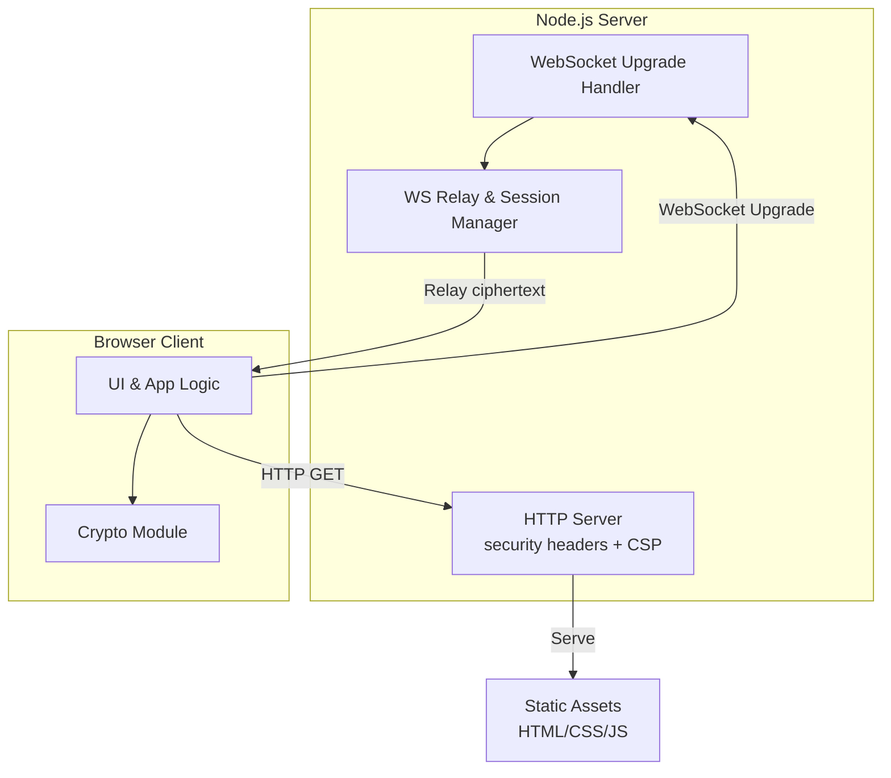
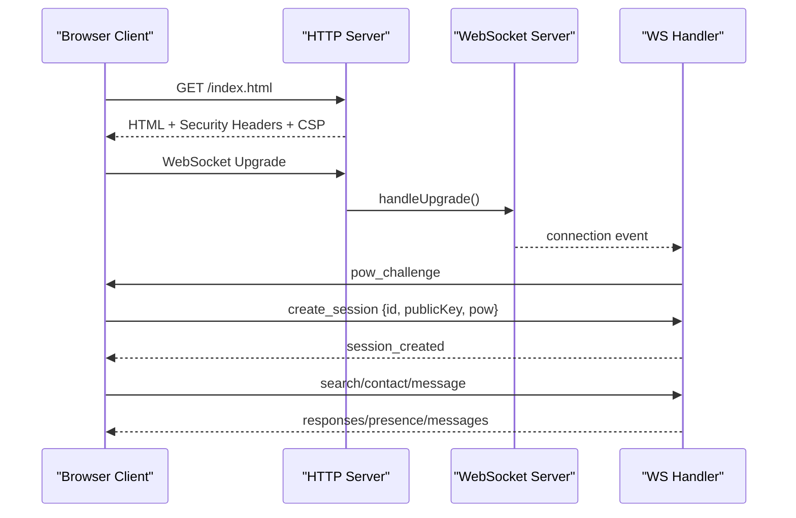
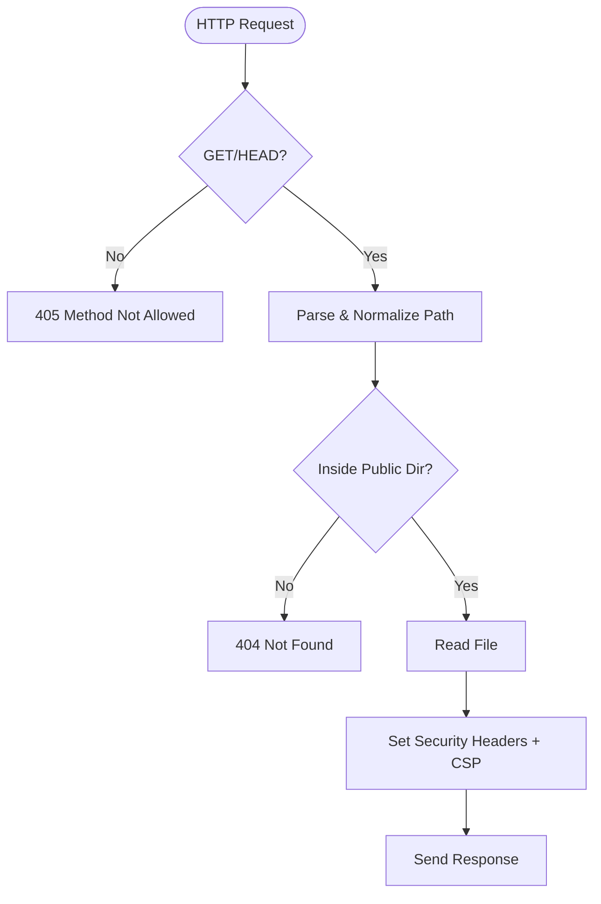
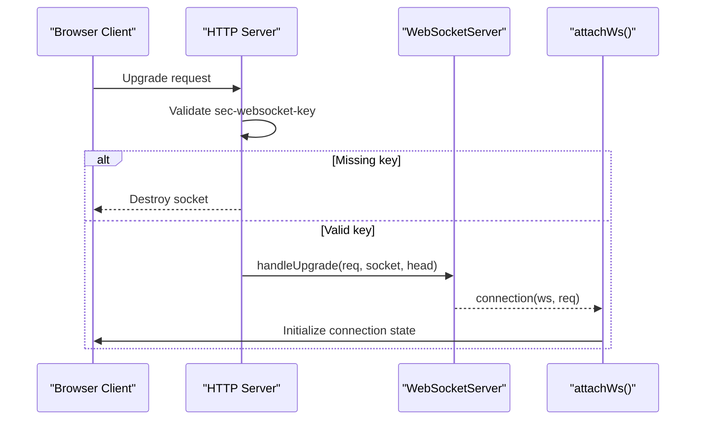
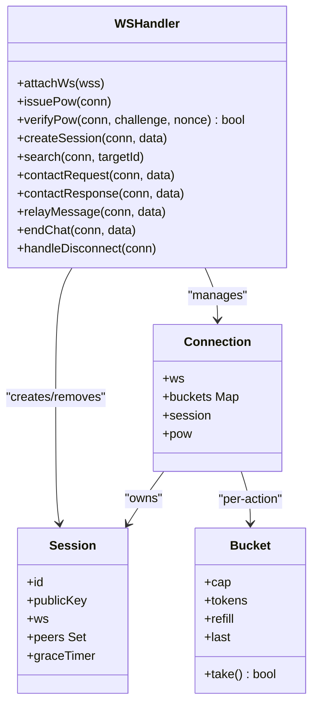
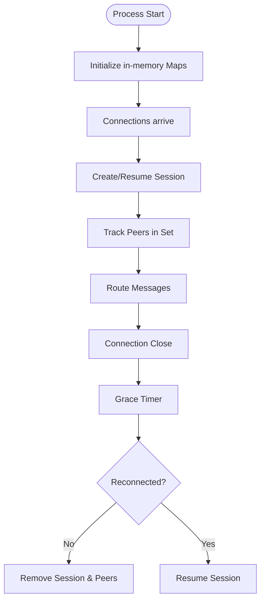
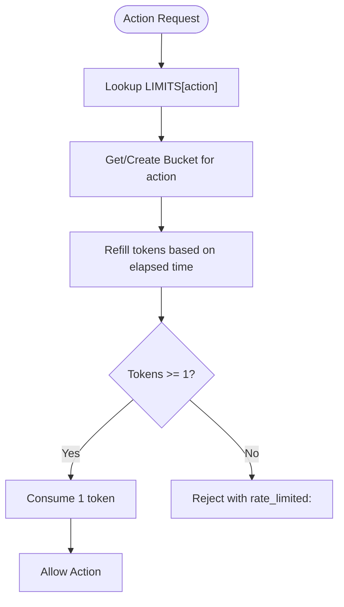
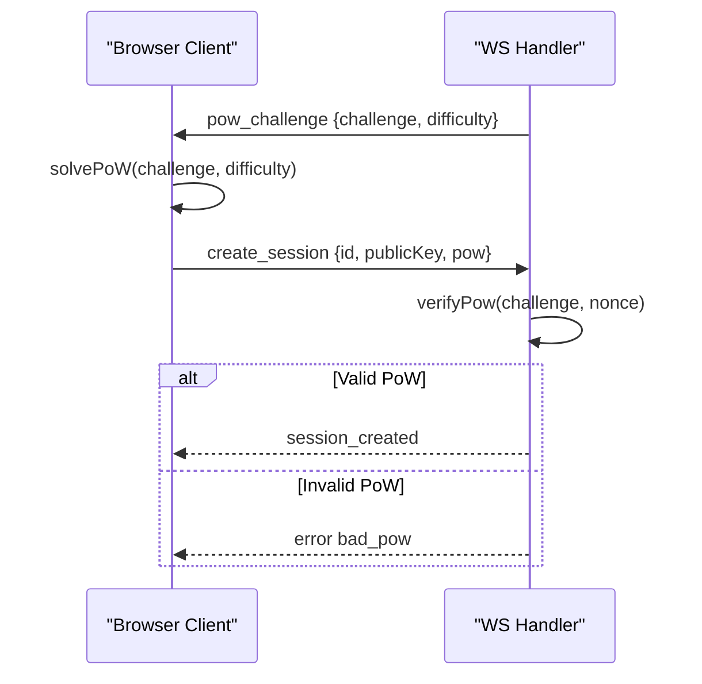
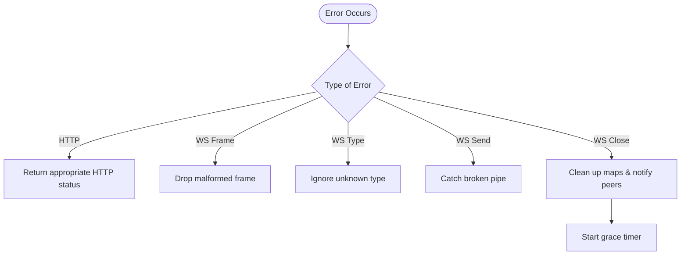
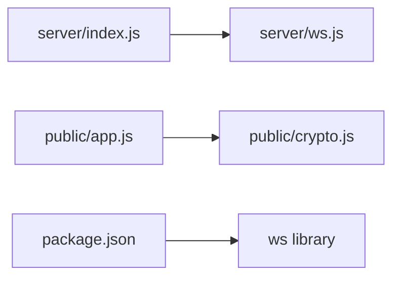

# Server Architecture

<cite>
**Referenced Files in This Document**
- [server/index.js](file://server/index.js)
- [server/ws.js](file://server/ws.js)
- [public/app.js](file://public/app.js)
- [public/crypto.js](file://public/crypto.js)
- [package.json](file://package.json)
</cite>

## Table of Contents
1. [Introduction](#introduction)
2. [Project Structure](#project-structure)
3. [Core Components](#core-components)
4. [Architecture Overview](#architecture-overview)
5. [Detailed Component Analysis](#detailed-component-analysis)
6. [Dependency Analysis](#dependency-analysis)
7. [Performance Considerations](#performance-considerations)
8. [Troubleshooting Guide](#troubleshooting-guide)
9. [Conclusion](#conclusion)

## Introduction
This document describes the Shh V1.0 server architecture, focusing on the Node.js backend that provides a secure, stateless WebSocket relay for end-to-end encrypted messaging. The server:
- Serves static assets with strict security headers and Content Security Policy (CSP).
- Accepts HTTP requests and upgrades them to WebSocket connections.
- Relays only opaque ciphertext between clients; it never sees plaintext or keys.
- Maintains ephemeral session state in memory using Maps.
- Enforces rate limits via token buckets and anti-spam proof-of-work (PoW).
- Follows a zero-persistence philosophy: no database, no logs, no disk writes beyond serving files.

The client performs all cryptographic operations in the browser, including identity generation, per-chat key derivation, message encryption/decryption, and PoW solving.

## Project Structure
The project is organized into a small Node.js server and a browser-based client:
- server/index.js: HTTP server, static file serving, CSP, security headers, WebSocket upgrade wiring.
- server/ws.js: WebSocket handler, connection lifecycle, session management, message routing, rate limiting, PoW verification.
- public/app.js: Client application logic, UI, WebSocket protocol handling, presence, chat flow.
- public/crypto.js: Browser-side cryptography (ECDH, HKDF, AES-GCM), fingerprinting, PoW solver.
- package.json: Project metadata, dependencies, scripts.

**Diagram sources**
- [server/index.js:73-109](file://server/index.js#L73-L109)
- [server/ws.js:258-312](file://server/ws.js#L258-L312)
- [public/app.js:74-120](file://public/app.js#L74-L120)
- [public/crypto.js:1-10](file://public/crypto.js#L1-L10)

**Section sources**
- [server/index.js:1-116](file://server/index.js#L1-L116)
- [server/ws.js:1-313](file://server/ws.js#L1-L313)
- [public/app.js:1-624](file://public/app.js#L1-L624)
- [public/crypto.js:1-242](file://public/crypto.js#L1-L242)
- [package.json:1-19](file://package.json#L1-L19)

## Core Components
- HTTP Server and Static File Serving:
  - Serves files from the public directory with safe path normalization and traversal protection.
  - Applies strict CSP and additional security headers to every response.
  - Disallows non-GET/HEAD methods.
- WebSocket Server:
  - Uses ws library with noServer mode; upgrades are handled by the HTTP server.
  - Validates WebSocket upgrade requests and emits connection events.
- WebSocket Handler:
  - Manages per-connection state, sessions, peer relationships, and pending contact requests.
  - Implements token-bucket rate limiting per action type.
  - Issues and verifies PoW challenges to prevent abuse.
  - Routes messages as opaque ciphertext between peers without storing content.
- Client Application:
  - Connects to the server, solves PoW, creates/resumes sessions, searches for peers, exchanges contact requests, and sends encrypted messages.
  - Handles presence updates and chat lifecycle.
- Cryptography Module:
  - Implements ECDH curve negotiation (X25519/P-256), HKDF key derivation, AES-GCM encryption, fingerprint computation, and PoW solver.

**Section sources**
- [server/index.js:14-89](file://server/index.js#L14-L89)
- [server/index.js:91-109](file://server/index.js#L91-L109)
- [server/ws.js:15-65](file://server/ws.js#L15-L65)
- [server/ws.js:93-120](file://server/ws.js#L93-L120)
- [server/ws.js:122-255](file://server/ws.js#L122-L255)
- [public/app.js:74-120](file://public/app.js#L74-L120)
- [public/crypto.js:135-241](file://public/crypto.js#L135-L241)

## Architecture Overview
The system follows a stateless relay model:
- Clients perform all crypto locally; the server only relays base64-encoded ciphertext.
- Sessions exist only while connected; inactive peers are marked offline immediately upon disconnect.
- Peer adjacency is maintained in-memory to route messages efficiently.
- Rate limiting and PoW protect against enumeration, spam, and resource exhaustion.

**Diagram sources**
- [server/index.js:73-109](file://server/index.js#L73-L109)
- [server/ws.js:93-105](file://server/ws.js#L93-L105)
- [server/ws.js:150-179](file://server/ws.js#L150-L179)
- [public/app.js:99-120](file://public/app.js#L99-L120)

## Detailed Component Analysis

### HTTP Server Setup and Security Headers
- Security headers applied to every response:
  - Content-Security-Policy with strict directives: default-src self, script/style/img/connect/font/worker/manifest constraints, connect-src allows same-origin plus ws/wss.
  - X-Content-Type-Options nosniff, X-Frame-Options DENY, Referrer-Policy no-referrer, Permissions-Policy disabling camera/microphone/geolocation/interest-cohort.
  - Cross-Origin-Opener-Policy same-origin, Cross-Origin-Resource-Policy same-origin, Strict-Transport-Security enabled.
- Static file serving:
  - Normalizes paths and guards against traversal outside the public directory.
  - Sets appropriate MIME types and Cache-Control no-store to ensure fresh crypto code.
- Method restriction:
  - Only GET and HEAD allowed; others return 405.

**Diagram sources**
- [server/index.js:41-71](file://server/index.js#L41-L71)
- [server/index.js:73-89](file://server/index.js#L73-L89)

**Section sources**
- [server/index.js:24-39](file://server/index.js#L24-L39)
- [server/index.js:41-71](file://server/index.js#L41-L71)
- [server/index.js:73-89](file://server/index.js#L73-L89)

### WebSocket Upgrade and Connection Establishment
- The HTTP server listens for upgrade events and validates the sec-websocket-key header.
- Non-WebSocket upgrades are rejected by destroying the socket.
- Valid upgrades are passed to the WebSocket server, which emits a connection event.

**Diagram sources**
- [server/index.js:97-107](file://server/index.js#L97-L107)
- [server/ws.js:258-262](file://server/ws.js#L258-L262)

**Section sources**
- [server/index.js:91-109](file://server/index.js#L91-L109)
- [server/ws.js:258-303](file://server/ws.js#L258-L303)

### WebSocket Handler Architecture
- Connection lifecycle:
  - On connection, create a connection object with per-connection rate limit buckets and initialize session/pow fields.
  - Handle message frames: parse JSON, validate type, dispatch to handlers.
  - On close, clean up maps and notify peers about offline status.
- Session management:
  - createSession validates id format, public key length, and PoW solution.
  - Supports resuming within a grace window if the same identity key is used.
  - Tracks peers as a Set of IDs for efficient routing.
- Message routing:
  - search returns presence only (online/offline).
  - contact_request/contact_response establish bidirectional adjacency when accepted.
  - message routes ciphertext to target if online; otherwise notifies sender that peer is offline.
  - end_chat removes adjacency and notifies both sides.

**Diagram sources**
- [server/ws.js:23-34](file://server/ws.js#L23-L34)
- [server/ws.js:37-65](file://server/ws.js#L37-L65)
- [server/ws.js:122-179](file://server/ws.js#L122-L179)
- [server/ws.js:181-255](file://server/ws.js#L181-L255)
- [server/ws.js:258-312](file://server/ws.js#L258-L312)

**Section sources**
- [server/ws.js:23-34](file://server/ws.js#L23-L34)
- [server/ws.js:122-179](file://server/ws.js#L122-L179)
- [server/ws.js:181-255](file://server/ws.js#L181-L255)
- [server/ws.js:258-312](file://server/ws.js#L258-L312)

### Stateless Design and In-Memory State
- Active sessions are stored in byId Map (id -> session).
- Active sockets are tracked in bySocket Map (ws -> connection).
- Pending contact requests are stored in requests Map (requestId -> {from, to, expiry}).
- No persistence: all state is lost on process restart; no logs or IPs are recorded.
- Grace period after disconnect allows tab refresh to resume session without losing peer adjacency.

**Diagram sources**
- [server/ws.js:23-34](file://server/ws.js#L23-L34)
- [server/ws.js:122-148](file://server/ws.js#L122-L148)
- [server/ws.js:150-179](file://server/ws.js#L150-L179)

**Section sources**
- [server/ws.js:23-34](file://server/ws.js#L23-L34)
- [server/ws.js:122-148](file://server/ws.js#L122-L148)
- [server/ws.js:150-179](file://server/ws.js#L150-L179)

### Rate Limiting Implementation (Token Bucket)
- Per-connection token buckets for actions: search, contact, message, create.
- Each bucket has capacity and refill rate; tokens are consumed per action.
- If insufficient tokens, the action is rejected with a rate-limited error.

**Diagram sources**
- [server/ws.js:15-21](file://server/ws.js#L15-L21)
- [server/ws.js:37-65](file://server/ws.js#L37-L65)

**Section sources**
- [server/ws.js:15-21](file://server/ws.js#L15-L21)
- [server/ws.js:37-65](file://server/ws.js#L37-L65)

### Anti-Spam Proof-of-Work Mechanism
- Server issues a random challenge and difficulty level.
- Client must find a nonce such that SHA-256(challenge:nonce) starts with a specified number of leading zeros.
- Client sends the challenge and nonce with create_session; server verifies the solution and bounds nonce range.
- Integrates with authentication: session creation fails if PoW is invalid.

**Diagram sources**
- [server/ws.js:93-105](file://server/ws.js#L93-L105)
- [server/ws.js:150-157](file://server/ws.js#L150-L157)
- [public/app.js:99-120](file://public/app.js#L99-L120)
- [public/crypto.js:113-127](file://public/crypto.js#L113-L127)

**Section sources**
- [server/ws.js:93-105](file://server/ws.js#L93-L105)
- [server/ws.js:150-157](file://server/ws.js#L150-L157)
- [public/app.js:99-120](file://public/app.js#L99-L120)
- [public/crypto.js:113-127](file://public/crypto.js#L113-L127)

### Zero-Persistence Philosophy and Security Implications
- No database, no logs, no IP storage: reduces attack surface and privacy risks.
- All state is volatile; process restart clears sessions and peer relationships.
- Security headers and CSP minimize XSS, clickjacking, and unauthorized external resources.
- End-to-end encryption ensures server cannot read message content.
- Trade-offs:
  - No message history or offline delivery; messages sent to offline peers are not queued.
  - No audit trail; troubleshooting relies on client-side diagnostics.

**Section sources**
- [server/index.js:1-3](file://server/index.js#L1-L3)
- [server/ws.js:1-3](file://server/ws.js#L1-L3)
- [server/index.js:24-39](file://server/index.js#L24-L39)
- [server/ws.js:231-240](file://server/ws.js#L231-L240)

### Error Handling Strategies and Graceful Degradation
- HTTP errors:
  - Bad request parsing returns 400.
  - Path traversal attempts return 404.
  - Non-GET/HEAD methods return 405.
- WebSocket errors:
  - Malformed frames are dropped silently.
  - Unknown message types are ignored.
  - Broken pipes during send are caught and ignored.
  - Connection errors swallow exceptions and clean up state.
- Graceful degradation:
  - Offline peers receive immediate notification; no store-and-forward.
  - Grace period allows session resumption after page refresh.
  - Client handles rate-limited errors with user-friendly toasts.

**Diagram sources**
- [server/index.js:41-71](file://server/index.js#L41-L71)
- [server/ws.js:68-76](file://server/ws.js#L68-L76)
- [server/ws.js:263-296](file://server/ws.js#L263-L296)
- [server/ws.js:299-303](file://server/ws.js#L299-L303)
- [server/ws.js:133-148](file://server/ws.js#L133-L148)

**Section sources**
- [server/index.js:41-71](file://server/index.js#L41-L71)
- [server/ws.js:68-76](file://server/ws.js#L68-L76)
- [server/ws.js:263-296](file://server/ws.js#L263-L296)
- [server/ws.js:299-303](file://server/ws.js#L299-L303)
- [server/ws.js:133-148](file://server/ws.js#L133-L148)

## Dependency Analysis
- External dependency:
  - ws library for WebSocket server functionality.
- Internal modules:
  - server/index.js depends on server/ws.js for WebSocket attachment.
  - public/app.js depends on public/crypto.js for cryptographic operations.

**Diagram sources**
- [server/index.js:9](file://server/index.js#L9)
- [package.json:14-16](file://package.json#L14-L16)

**Section sources**
- [server/index.js:9](file://server/index.js#L9)
- [package.json:14-16](file://package.json#L14-L16)

## Performance Considerations
- Token bucket rate limiting prevents bursts and steady-state abuse across actions.
- Max payload size is capped at 16 KB to mitigate large-message attacks.
- Plaintext size is limited to 2 KB; ciphertext validation enforces bounds.
- Grace timers prune stale sessions periodically; pending requests are pruned every 30 seconds.
- No logging minimizes I/O overhead and protects privacy.

[No sources needed since this section provides general guidance]

## Troubleshooting Guide
- Common client-side errors:
  - Rate-limited actions show toasts indicating which action is throttled.
  - Too-large messages are rejected with a size hint.
  - Session creation failures due to taken IDs or invalid PoW prompt retry.
- Server-side behaviors:
  - Malformed WebSocket frames are dropped without errors.
  - Unknown message types are ignored.
  - Connection errors are swallowed; cleanup occurs automatically.
- Debugging tips:
  - Verify CSP and security headers are present in HTTP responses.
  - Ensure WebSocket upgrade succeeds and pow_challenge is received.
  - Confirm client PoW solver completes within nonce bounds.

**Section sources**
- [public/app.js:178-193](file://public/app.js#L178-L193)
- [server/ws.js:263-296](file://server/ws.js#L263-L296)
- [server/ws.js:299-303](file://server/ws.js#L299-L303)

## Conclusion
The Shh V1.0 server implements a minimal, secure, and stateless WebSocket relay designed for privacy-focused real-time messaging. It combines strict HTTP security headers and CSP, robust WebSocket upgrade handling, in-memory session and peer management, token-bucket rate limiting, and anti-spam PoW verification. By keeping all state in RAM and avoiding persistence, the design prioritizes privacy and reduces attack surfaces, while relying on client-side cryptography for confidentiality and integrity. The trade-off is no message history or offline delivery, aligning with the zero-persistence philosophy.

[No sources needed since this section summarizes without analyzing specific files]