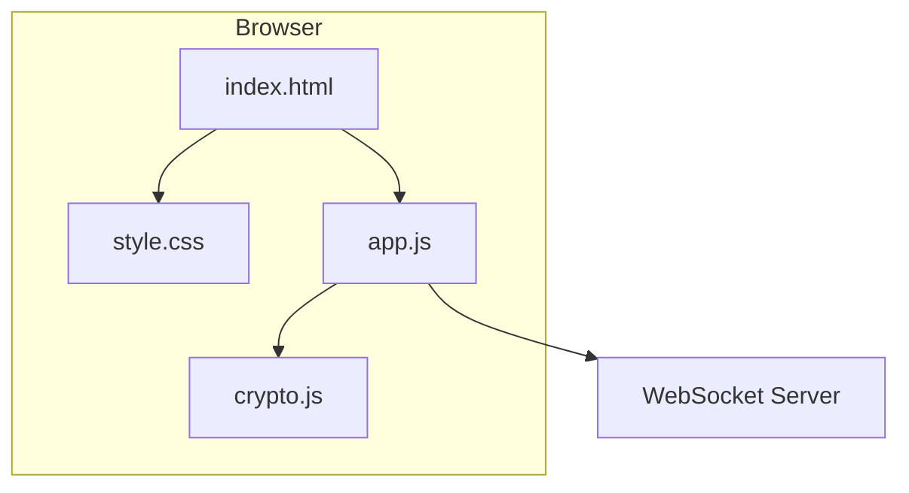
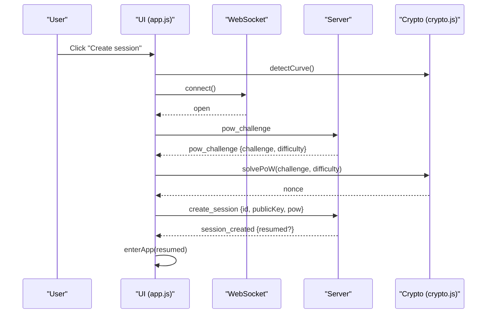
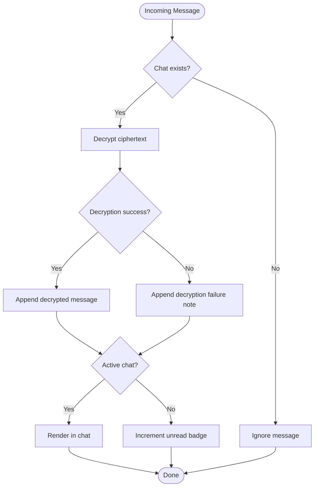
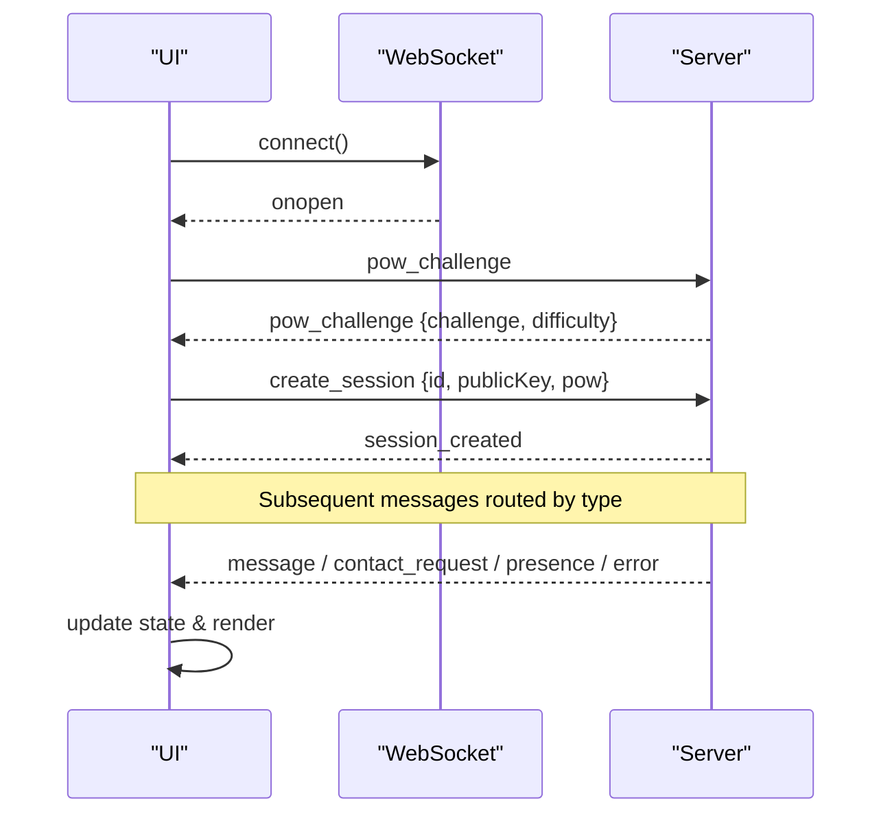
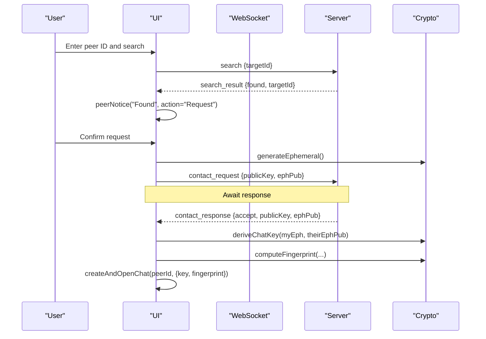
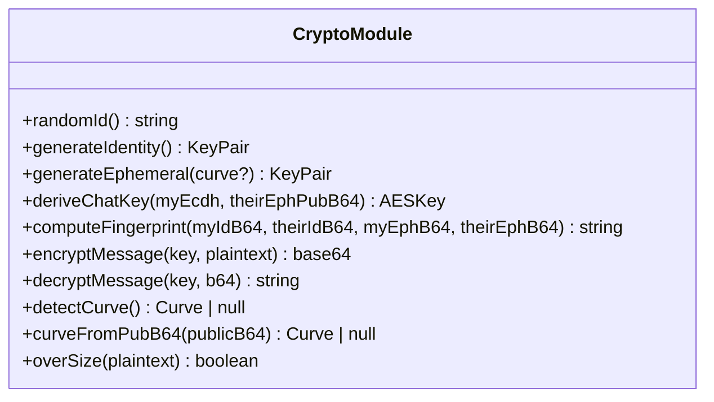
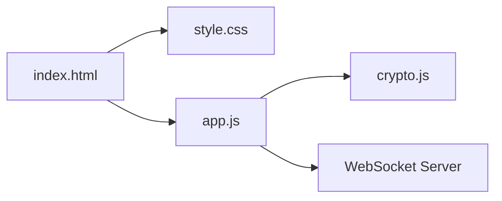

# Client Application

<cite>
**Referenced Files in This Document**
- [app.js](file://public/app.js)
- [crypto.js](file://public/crypto.js)
- [index.html](file://public/index.html)
- [style.css](file://public/style.css)
</cite>

## Table of Contents
1. [Introduction](#introduction)
2. [Project Structure](#project-structure)
3. [Core Components](#core-components)
4. [Architecture Overview](#architecture-overview)
5. [Detailed Component Analysis](#detailed-component-analysis)
6. [Dependency Analysis](#dependency-analysis)
7. [Performance Considerations](#performance-considerations)
8. [Troubleshooting Guide](#troubleshooting-guide)
9. [Conclusion](#conclusion)
10. [Appendices](#appendices)

## Introduction
This document describes the client application’s frontend implementation: the main application logic, UI state management, WebSocket communication, user interactions, contact discovery and request/response workflows, real-time presence indicators, toast notifications, profile panel, and adaptive cryptography with automatic curve negotiation (X25519/P-256 fallback). It also covers cross-browser compatibility considerations and performance optimizations used to keep the interface responsive and efficient.

## Project Structure
The client is a minimal, single-page app built with vanilla JavaScript and modern CSS. The HTML defines the start screen, main app shell, sidebar, chat area, and notification container. The JavaScript module orchestrates WebSocket lifecycle, message handling, cryptographic operations via a dedicated crypto module, and DOM updates. Styles provide a dark, monochrome theme with responsive layout for mobile and desktop.

**Diagram sources**
- [index.html:1-106](file://public/index.html#L1-L106)
- [style.css:1-225](file://public/style.css#L1-L225)
- [app.js:1-624](file://public/app.js#L1-L624)
- [crypto.js:1-242](file://public/crypto.js#L1-L242)

**Section sources**
- [index.html:13-101](file://public/index.html#L13-L101)
- [style.css:57-225](file://public/style.css#L57-L225)
- [app.js:10-38](file://public/app.js#L10-L38)

## Core Components
- UI State Management: In-memory maps track chats, pending requests, incoming requests, and active chat; rendering functions update the DOM based on this state.
- WebSocket Communication: Connection lifecycle includes PoW challenge/nonce exchange, session creation, and reconnection logic.
- User Interaction Processing: Event listeners handle search, messaging, profile toggles, and chat controls.
- Contact Management: ID-based peer discovery, contact request sending, acceptance/rejection, and ephemeral key exchange.
- Real-Time Presence: Online/offline indicators per peer updated via server events.
- Toast Notifications: Temporary and actionable notices for system feedback.
- Profile Panel: Displays masked identity and public key with show/hide and copy actions.
- Adaptive Cryptography: Automatic curve negotiation between X25519 and P-256, per-chat ephemeral keys, AES-GCM encryption, and fingerprinting.

**Section sources**
- [app.js:26-38](file://public/app.js#L26-L38)
- [app.js:74-120](file://public/app.js#L74-L120)
- [app.js:227-322](file://public/app.js#L227-L322)
- [app.js:398-518](file://public/app.js#L398-L518)
- [crypto.js:129-242](file://public/crypto.js#L129-L242)

## Architecture Overview
The client follows an event-driven architecture:
- Initialization probes Web Crypto support and selects the best ECDH curve.
- On “Create session,” the client connects to the WebSocket server, solves a proof-of-work challenge, and authenticates.
- Message dispatch routes server messages to handlers that update in-memory state and render UI changes.
- Contact flows use ephemeral key exchanges to derive per-chat shared secrets and fingerprints for verification.
- Messaging encrypts outgoing messages and decrypts incoming ones using per-chat keys.

**Diagram sources**
- [app.js:559-575](file://public/app.js#L559-L575)
- [app.js:74-120](file://public/app.js#L74-L120)
- [crypto.js:151-157](file://public/crypto.js#L151-L157)
- [crypto.js:115-127](file://public/crypto.js#L115-L127)

## Detailed Component Analysis

### UI State Management and Rendering
- In-memory structures:
  - `chats`: Map from peerId to chat object containing messages, online status, unread count, and cryptographic context.
  - `pendingOut` and `incoming`: Track outbound and inbound contact requests.
  - `activeChat`: Currently selected peerId.
- Rendering functions:
  - `renderChatList`: Sorts chats by last message timestamp, renders items with presence dots, previews, and unread badges.
  - `renderRequests`: Renders incoming contact requests with accept/reject actions.
  - `openChat`, `appendMessage`, `scrollMessages`: Manage chat view and message list updates.
- State synchronization:
  - Incoming messages update chat state and either append to visible chat or increment unread counters.
  - Presence events toggle online flags and update UI elements like tooltips and avatar dot.

**Diagram sources**
- [app.js:324-342](file://public/app.js#L324-L342)
- [app.js:398-437](file://public/app.js#L398-L437)

**Section sources**
- [app.js:26-38](file://public/app.js#L26-L38)
- [app.js:398-518](file://public/app.js#L398-L518)

### WebSocket Communication Handling
- Connection lifecycle:
  - Guard against duplicate connections; connect once and reuse.
  - On open, request PoW challenge; on close, reset presence and schedule reconnect unless intentionally closed.
- Message dispatch:
  - Centralized handler routes by message type: session setup, search results, contact requests/responses, messages, chat end, presence, errors.
- Error recovery:
  - Rate limiting and size errors produce user-friendly toasts.
  - Reconnect timer ensures resilience after transient failures.

**Diagram sources**
- [app.js:74-120](file://public/app.js#L74-L120)
- [app.js:124-176](file://public/app.js#L124-L176)

**Section sources**
- [app.js:74-120](file://public/app.js#L74-L120)
- [app.js:124-176](file://public/app.js#L124-L176)

### Contact Management System (ID-based Peer Discovery)
- Search workflow:
  - Validate input length and characters; send search request to server.
  - If found, present actionable notice to initiate contact request.
- Request flow:
  - Generate ephemeral key pair; send contact request with identity and ephemeral public keys.
  - Show persistent notice while awaiting response; allow cancellation.
- Acceptance flow:
  - For incoming requests, determine peer’s curve from ephemeral key length; generate matching ephemeral key; derive shared secret; compute fingerprint; respond with acceptance and own ephemeral public key; create and open chat.
- Response handling:
  - On acceptance, derive shared secret using initiator’s ephemeral key; compute fingerprint; create and open chat.

**Diagram sources**
- [app.js:227-322](file://public/app.js#L227-L322)
- [crypto.js:170-211](file://public/crypto.js#L170-L211)

**Section sources**
- [app.js:227-322](file://public/app.js#L227-L322)
- [crypto.js:170-211](file://public/crypto.js#L170-L211)

### Real-Time Presence Indicators
- Presence events:
  - `peer_online` and `peer_offline` update chat objects’ online flags and refresh UI.
  - Tooltip reflects current presence when viewing a chat.
- Visual cues:
  - Sidebar item dot turns on/off based on presence.
  - Avatar dot indicates local session online status.

**Section sources**
- [app.js:164-169](file://public/app.js#L164-L169)
- [app.js:390-396](file://public/app.js#L390-L396)
- [app.js:196-207](file://public/app.js#L196-L207)

### Toast Notifications and Actionable Notices
- Temporary toasts:
  - Non-actional messages auto-dismiss after a short duration.
- Persistent notices:
  - For contact request outcomes, display dismissible notices with action buttons (e.g., cancel request).
- Styling:
  - Rounded pill-like toasts with subtle animations; error toasts highlighted in danger color.

**Section sources**
- [app.js:39-72](file://public/app.js#L39-L72)
- [style.css:203-212](file://public/style.css#L203-L212)

### Profile Management Panel
- Display:
  - Masked identity and public key by default; toggle visibility with aria attributes for accessibility.
- Actions:
  - Copy identity to clipboard with fallback handling.
  - Logout clears all in-memory state and resets UI to start screen.

**Section sources**
- [app.js:196-225](file://public/app.js#L196-L225)
- [app.js:577-594](file://public/app.js#L577-L594)
- [index.html:38-55](file://public/index.html#L38-L55)

### Adaptive Cryptography Integration
- Curve negotiation:
  - Probe browser support for X25519; fall back to P-256 if unavailable.
  - Curve selection cached to avoid repeated probing.
- Per-chat keys:
  - Fresh ephemeral key pairs per chat ensure forward secrecy.
  - Shared secret derived via ECDH and HKDF with order-independent salt from sorted ephemeral public keys.
- Message encryption:
  - AES-256-GCM with unique 96-bit nonces per message; base64-encoded payloads include IV and ciphertext/tag.
- Fingerprinting:
  - SHA-256 over identity and ephemeral public keys to enable out-of-band verification and mitigate MITM attacks.

**Diagram sources**
- [crypto.js:129-242](file://public/crypto.js#L129-L242)

**Section sources**
- [crypto.js:129-242](file://public/crypto.js#L129-L242)

### User Interface Components and Event Handling Patterns
- Layout:
  - Two-pane grid layout with sidebar and chat area; collapses to single pane on mobile.
- Inputs and controls:
  - Search input with validation; send button and textarea with autosize and character limit enforcement.
  - Chat menu toggles fingerprint details and end-chat action.
- Event patterns:
  - Inline onclick handlers bound during initialization.
  - Global click listener closes menus/profile panels when clicking outside.
  - Keyboard shortcuts: Enter sends message; Shift+Enter allows multiline input.

**Section sources**
- [index.html:23-98](file://public/index.html#L23-L98)
- [style.css:57-225](file://public/style.css#L57-L225)
- [app.js:556-621](file://public/app.js#L556-L621)

### State Synchronization Between UI and WebSocket Layers
- UI triggers:
  - User actions (search, send, accept/reject) emit WebSocket messages.
- Server responses:
  - Update in-memory state and call rendering functions to reflect changes.
- Consistency:
  - Presence updates propagate immediately; unread counts adjust when switching chats; chat lists sort by recency.

**Section sources**
- [app.js:124-176](file://public/app.js#L124-L176)
- [app.js:324-359](file://public/app.js#L324-L359)
- [app.js:398-518](file://public/app.js#L398-L518)

### Common User Workflows
- Creating a chat:
  - Search for peer by ID; if found, send contact request; upon acceptance, derive shared secret and open chat.
- Sending messages:
  - Type message; validate size; encrypt with per-chat key; send via WebSocket; append locally and scroll into view.
- Managing contacts:
  - Accept or reject incoming requests; cancel pending outbound requests; end chats to clear state.

**Section sources**
- [app.js:227-322](file://public/app.js#L227-L322)
- [app.js:344-359](file://public/app.js#L344-L359)
- [app.js:361-388](file://public/app.js#L361-L388)

## Dependency Analysis
- Module dependencies:
  - `app.js` imports cryptographic primitives and utilities from `crypto.js`.
  - `index.html` loads `style.css` and `app.js`.
- Coupling:
  - UI tightly coupled to DOM element IDs; centralized `$` helper reduces repetition.
  - Message routing centralizes protocol handling, reducing scattered logic.
- External integrations:
  - WebSocket server for signaling and relay.
  - Web Crypto API for cryptographic operations.

**Diagram sources**
- [index.html:1-106](file://public/index.html#L1-L106)
- [app.js:1-10](file://public/app.js#L1-L10)

**Section sources**
- [app.js:1-10](file://public/app.js#L1-L10)
- [index.html:1-106](file://public/index.html#L1-L106)

## Performance Considerations
- Responsive UI:
  - Proof-of-work solver yields to the event loop periodically to prevent blocking.
  - Autosizing textarea avoids layout thrashing; max height capped to maintain performance.
- Efficient rendering:
  - Chat list sorted by last message timestamp; only necessary DOM nodes created/updated.
  - Presence and unread badges updated minimally.
- Memory usage:
  - All data kept in RAM; no persistence to avoid storage overhead and privacy risks.
- Network efficiency:
  - Base64 encoding for payloads; strict message size limits reduce bandwidth usage.

[No sources needed since this section provides general guidance]

## Troubleshooting Guide
- Browser lacks required cryptography:
  - Detection disables “Create session” and shows hint; user should update browser.
- Rate limiting:
  - Errors like “too many searches/messages” display localized toasts; wait before retrying.
- Message too large:
  - Enforced 2 KB limit; user must shorten text.
- Session creation issues:
  - Bad proof-of-work or taken ID triggers error toasts; retry recommended.
- Disconnections:
  - Automatic reconnect scheduled; intentional close prevents resume.

**Section sources**
- [app.js:559-575](file://public/app.js#L559-L575)
- [app.js:178-193](file://public/app.js#L178-L193)
- [app.js:86-93](file://public/app.js#L86-L93)

## Conclusion
The client application implements a secure, responsive, and user-friendly chat interface using vanilla JavaScript and modern CSS. It manages UI state in memory, communicates with a WebSocket server for signaling and relay, and integrates adaptive cryptography with automatic curve negotiation to ensure broad compatibility. Contact discovery and request workflows are streamlined with actionable notifications, while presence indicators and profile management enhance usability. The design emphasizes performance, privacy, and simplicity, making it suitable for real-time encrypted messaging across browsers.

## Appendices
- Cross-Browser Compatibility:
  - Uses Web Crypto API; falls back to P-256 if X25519 unsupported.
  - Dark mode and modern CSS features supported in contemporary browsers.
- Accessibility:
  - ARIA labels and attributes for interactive elements; keyboard navigation for sending messages.
- Security Notes:
  - Private keys never leave memory; messages encrypted end-to-end; fingerprints enable manual verification.

[No sources needed since this section provides general guidance]