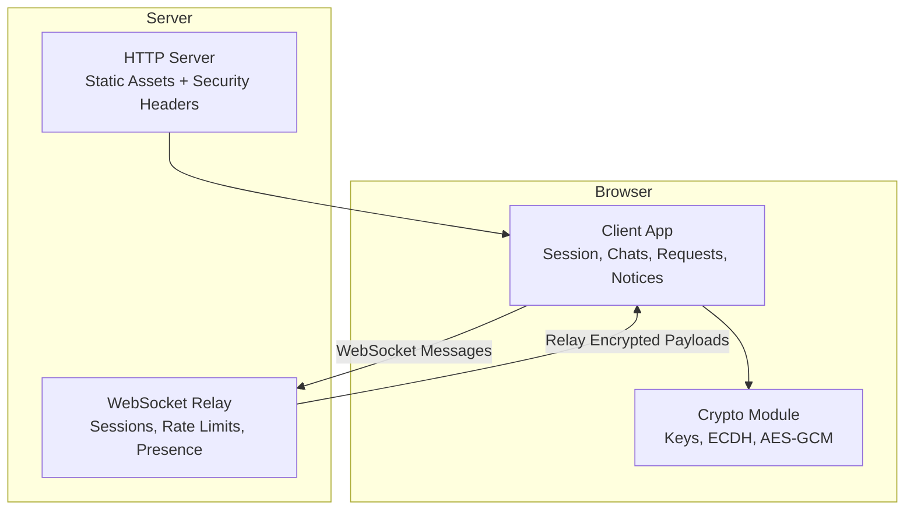
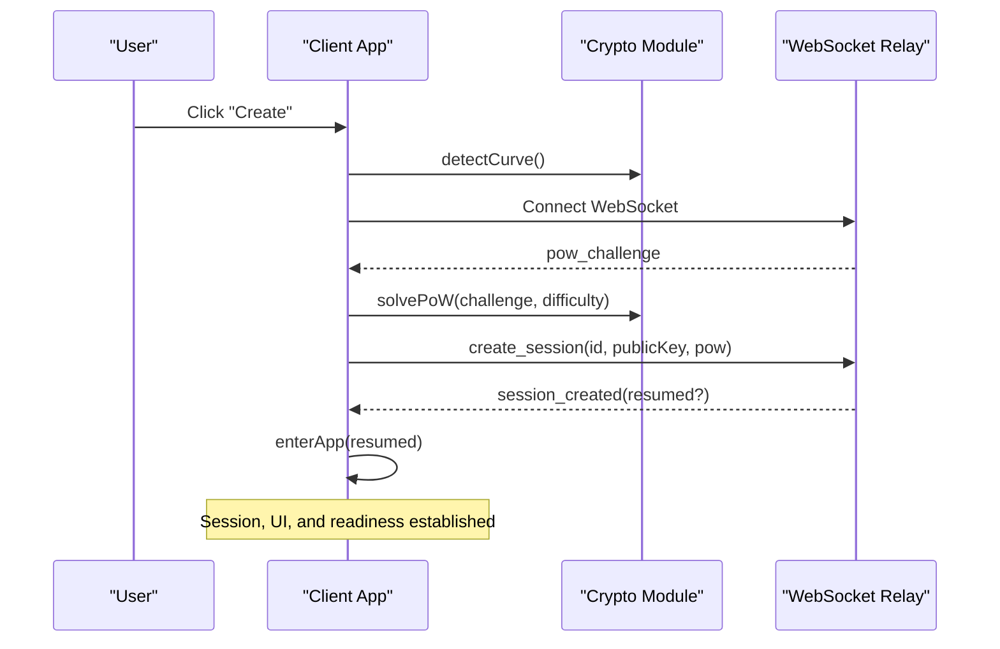
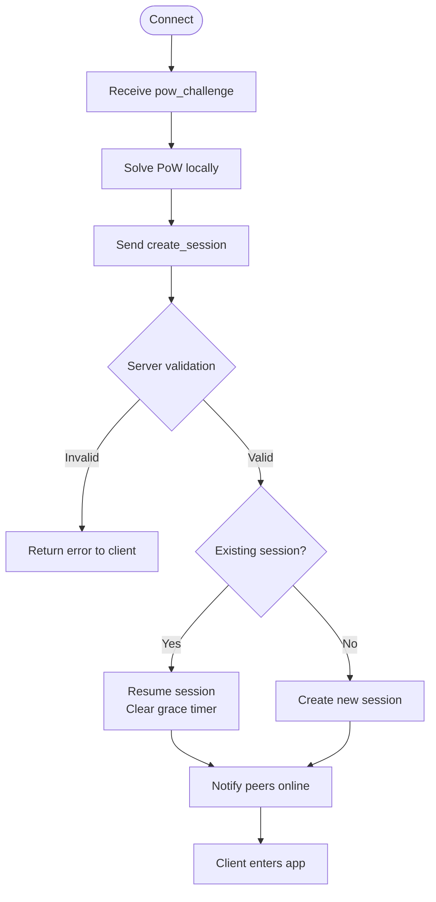
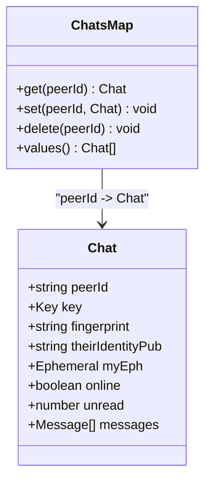
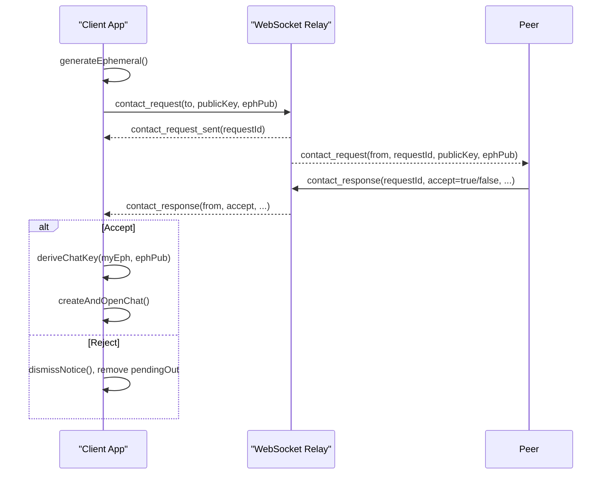
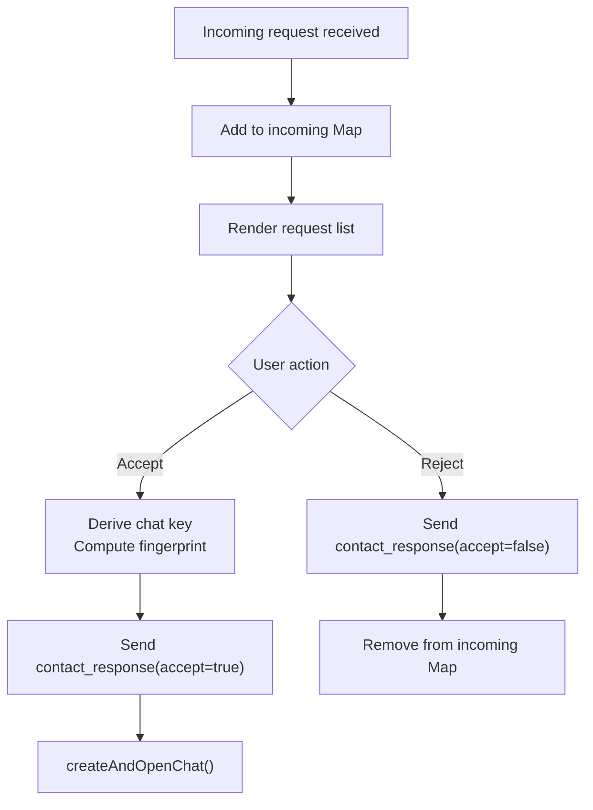
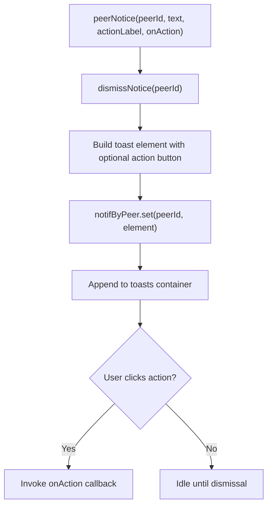
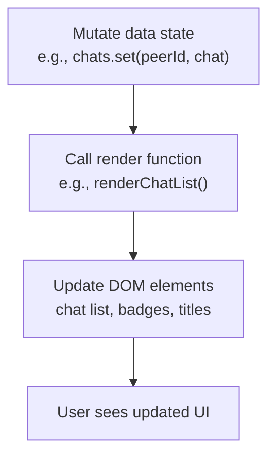
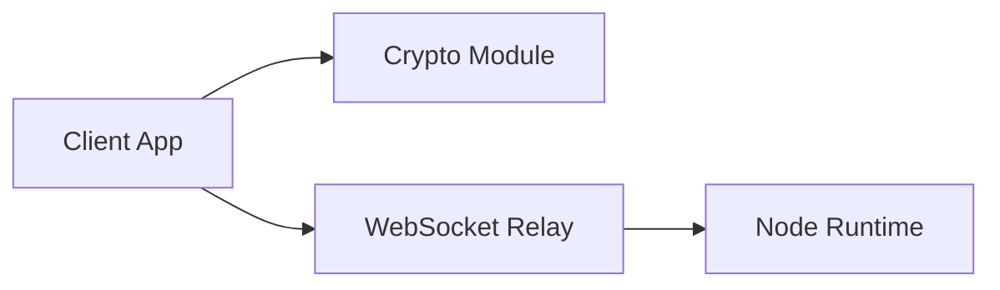

# State Management

<cite>
**Referenced Files in This Document**
- [app.js](file://public/app.js)
- [crypto.js](file://public/crypto.js)
- [index.js](file://server/index.js)
- [ws.js](file://server/ws.js)
</cite>

## Table of Contents
1. [Introduction](#introduction)
2. [Project Structure](#project-structure)
3. [Core Components](#core-components)
4. [Architecture Overview](#architecture-overview)
5. [Detailed Component Analysis](#detailed-component-analysis)
6. [Dependency Analysis](#dependency-analysis)
7. [Performance Considerations](#performance-considerations)
8. [Troubleshooting Guide](#troubleshooting-guide)
9. [Conclusion](#conclusion)

## Introduction
This document explains the state management layer for the application, focusing on in-memory data structures and synchronization patterns between client and server. The system is intentionally zero-persistence: all runtime state lives only in RAM on both the browser and the Node server. Closing a tab or restarting the server loses all state.

The client maintains:
- A session object with identity information
- A chats Map for peer conversations
- A pendingOut Map for outgoing contact requests
- An incoming Map for pending contact requests
- A notifByPeer Map for actionable notices (toasts)

The server maintains:
- Active sessions by id and socket
- Pending contact requests with expiry
- Per-connection rate-limiting buckets

State changes are driven by user actions and WebSocket messages. UI updates are triggered by explicit render functions that read from these in-memory structures.

## Project Structure
At a high level:
- The browser app initializes, connects to the server, performs proof-of-work, creates or resumes a session, and manages chats, contacts, and messages entirely in memory.
- The server relays encrypted messages, enforces rate limits, validates inputs, and tracks online presence without storing any persistent data.

**Diagram sources**
- [app.js:26-35](file://public/app.js#L26-L35)
- [crypto.js:1-10](file://public/crypto.js#L1-L10)
- [index.js:1-10](file://server/index.js#L1-L10)
- [ws.js:1-10](file://server/ws.js#L1-L10)

**Section sources**
- [app.js:1-35](file://public/app.js#L1-L35)
- [index.js:1-10](file://server/index.js#L1-L10)

## Core Components
This section documents the primary in-memory state objects and their responsibilities.

- Session
  - Purpose: Holds the current user’s identity and id.
  - Shape: { id, identity }
  - Lifecycle: Created during authentication; reused when resuming within the grace window.
  - Mutations: Replaced on new authentication; cleared on logout/reset.

- Chats Map
  - Purpose: Stores per-peer chat state including encryption key, fingerprint, message list, unread count, and online status.
  - Key: peerId
  - Typical fields: peerId, key, fingerprint, theirIdentityPub, myEph, online, unread, messages[]
  - Mutations: Created when a contact request completes; updated on incoming messages; removed on chat end.

- PendingOut Map
  - Purpose: Tracks outgoing contact requests and associated ephemeral keys.
  - Key: peerId
  - Typical fields: requestId, eph (Promise resolving to ephemeral key)
  - Mutations: Set when sending a request; cleared on response or failure.

- Incoming Map
  - Purpose: Tracks incoming contact requests awaiting user action.
  - Key: requestId
  - Typical fields: from, ephPub, identityPub
  - Mutations: Set on receiving a request; cleared on accept/reject.

- NotifByPeer Map
  - Purpose: Maps peerId to an actionable notice element for “found” or “waiting for reply”.
  - Key: peerId
  - Value: DOM toast element
  - Mutations: Set when creating a notice; cleared when dismissed or replaced.

These structures are manipulated exclusively in RAM. There is no localStorage, cookies, or IndexedDB usage.

**Section sources**
- [app.js:26-35](file://public/app.js#L26-L35)
- [app.js:237-322](file://public/app.js#L237-L322)
- [app.js:324-396](file://public/app.js#L324-L396)
- [app.js:49-72](file://public/app.js#L49-L72)

## Architecture Overview
The state lifecycle spans initialization, authentication, connection establishment, messaging, and cleanup.

**Diagram sources**
- [app.js:559-575](file://public/app.js#L559-L575)
- [app.js:99-120](file://public/app.js#L99-L120)
- [app.js:125-137](file://public/app.js#L125-L137)
- [app.js:196-207](file://public/app.js#L196-L207)
- [ws.js:93-105](file://server/ws.js#L93-L105)
- [ws.js:150-179](file://server/ws.js#L150-L179)

## Detailed Component Analysis

### Session Management
- Creation and Resume
  - On connect, the client requests a PoW challenge and solves it locally.
  - It then sends create_session with id, public key, and PoW solution.
  - If the id already exists and the same identity key is used within the grace window, the server resumes the session and notifies peers that the user is back online.
  - The client stores session = { id, identity } and updates the UI.

- Validation Rules
  - Id must match the expected base32 pattern and length.
  - Public key must be a valid base64-encoded curve point of acceptable length.
  - PoW must satisfy the required difficulty and nonce bounds.

- Consistency Maintenance
  - On resume, the server reuses the existing session object and clears its grace timer.
  - Peers receive peer_online to reflect presence.

- Cleanup
  - On disconnect, the server marks the session offline and schedules teardown after a grace period if not resumed.
  - On resetAll, the client clears session and all related state.

**Diagram sources**
- [ws.js:93-105](file://server/ws.js#L93-L105)
- [ws.js:150-179](file://server/ws.js#L150-L179)
- [app.js:99-120](file://public/app.js#L99-L120)
- [app.js:196-207](file://public/app.js#L196-L207)

**Section sources**
- [app.js:99-120](file://public/app.js#L99-L120)
- [app.js:196-207](file://public/app.js#L196-L207)
- [ws.js:150-179](file://server/ws.js#L150-L179)

### Chats Map: Peer Conversations
- Creation
  - When a contact request completes successfully, createAndOpenChat constructs or updates the chat entry with encryption key, fingerprint, and metadata.
  - The chat is added to the chats Map and opened immediately.

- Message Handling
  - Incoming messages decrypt using the chat key and append to the messages array.
  - If the active chat matches the sender, the message is appended to the UI; otherwise, unread count increments and a toast appears.
  - Outgoing messages encrypt via crypto module, send over WebSocket, and append locally.

- Presence and End Chat
  - Presence updates toggle online status and refresh UI.
  - Ending a chat removes adjacency on the server and clears local chat state.

**Diagram sources**
- [app.js:312-322](file://public/app.js#L312-L322)
- [app.js:324-359](file://public/app.js#L324-L359)
- [app.js:361-396](file://public/app.js#L361-L396)

**Section sources**
- [app.js:312-322](file://public/app.js#L312-L322)
- [app.js:324-359](file://public/app.js#L324-L359)
- [app.js:361-396](file://public/app.js#L361-L396)

### PendingOut Map: Outgoing Contact Requests
- Sending a Request
  - Generates an ephemeral key pair and stores it in pendingOut keyed by target peerId.
  - Sends contact_request with identity and ephemeral public key.
  - Shows a persistent notice indicating the request is pending.

- Responses and Failures
  - On success, the pending entry is consumed to derive the chat key and open the chat.
  - On failure or rejection, the pending entry is removed and appropriate feedback is shown.

**Diagram sources**
- [app.js:237-250](file://public/app.js#L237-L250)
- [app.js:295-310](file://public/app.js#L295-L310)
- [ws.js:188-229](file://server/ws.js#L188-L229)

**Section sources**
- [app.js:237-250](file://public/app.js#L237-L250)
- [app.js:295-310](file://public/app.js#L295-L310)
- [ws.js:188-229](file://server/ws.js#L188-L229)

### Incoming Map: Pending Contact Requests
- Receiving a Request
  - Adds an entry keyed by requestId with initiator info and ephemeral/public keys.
  - Renders the request list for user action.

- Accepting or Rejecting
  - Accept: derives chat key using the initiator’s curve, computes fingerprint, sends acceptance, and opens the chat.
  - Reject: sends rejection and removes the request.

**Diagram sources**
- [app.js:252-293](file://public/app.js#L252-L293)
- [ws.js:188-229](file://server/ws.js#L188-L229)

**Section sources**
- [app.js:252-293](file://public/app.js#L252-L293)
- [ws.js:188-229](file://server/ws.js#L188-L229)

### NotifByPeer Map: Actionable Notices
- Purpose
  - Maintains a single actionable notice per peer for states like “found” or “waiting for reply”.
  - Ensures only one notice per peer is visible at a time.

- Operations
  - Creating a notice replaces any existing notice for the same peer.
  - Dismissing removes the DOM element and deletes the map entry.

**Diagram sources**
- [app.js:49-72](file://public/app.js#L49-L72)
- [app.js:228-235](file://public/app.js#L228-L235)
- [app.js:237-249](file://public/app.js#L237-L249)

**Section sources**
- [app.js:49-72](file://public/app.js#L49-L72)
- [app.js:228-235](file://public/app.js#L228-L235)
- [app.js:237-249](file://public/app.js#L237-L249)

### UI State vs Data State
- Data State
  - In-memory structures: session, chats, pendingOut, incoming, notifByPeer.
  - These represent the authoritative runtime state.

- UI State
  - DOM elements and attributes reflect data state through explicit render functions.
  - Examples: renderChatList, renderRequests, openChat, appendMessage.

- Propagation
  - Data mutations trigger corresponding render calls to keep UI consistent.
  - Presence changes update chat entries and titles.
  - Unread counts update badges and lists.

**Diagram sources**
- [app.js:399-437](file://public/app.js#L399-L437)
- [app.js:439-464](file://public/app.js#L439-L464)
- [app.js:466-493](file://public/app.js#L466-L493)

**Section sources**
- [app.js:399-437](file://public/app.js#L399-L437)
- [app.js:439-464](file://public/app.js#L439-L464)
- [app.js:466-493](file://public/app.js#L466-L493)

### State Persistence Strategy
- Zero Persistence
  - No localStorage, cookies, or IndexedDB usage.
  - All state is ephemeral and lost on tab close or server restart.

- Implications
  - Users cannot recover chats or identities across sessions unless they manually record identifiers and keys.
  - Resuming a session is possible only within the server’s grace window and requires reconnecting with the same id and identity key.

**Section sources**
- [app.js:1-3](file://public/app.js#L1-L3)
- [index.js:1-3](file://server/index.js#L1-L3)
- [ws.js:1-3](file://server/ws.js#L1-L3)

### Common State Operations

- Creating a New Chat
  - Steps: search for peer, show “found” notice, send contact request, await response, derive chat key, create chat entry, open chat.
  - State changes: incoming/pendingOut maps, chats map, UI panes.

- Updating Message Lists
  - Incoming: decrypt, push to messages[], increment unread if not active, render list.
  - Outgoing: encrypt, send, push to messages[], append to UI, scroll.

- Managing Contact Request Workflows
  - Outgoing: store ephemeral key, show pending notice, handle sent/failed/response events.
  - Incoming: add to incoming map, render requests, accept/reject flow.

- Handling Session Recovery
  - Grace window allows reconnecting with same id and identity key.
  - Server resumes session, clears grace timer, notifies peers online.
  - Client enters app with resumed flag and shows recovery toast.

**Section sources**
- [app.js:228-322](file://public/app.js#L228-L322)
- [app.js:324-359](file://public/app.js#L324-L359)
- [ws.js:150-179](file://server/ws.js#L150-L179)

## Dependency Analysis
The client depends on the crypto module for key generation, ECDH negotiation, HKDF key derivation, AES-GCM encryption/decryption, and fingerprint computation. The server depends on the WebSocket relay for protocol handling, rate limiting, and presence management.

**Diagram sources**
- [app.js:4-8](file://public/app.js#L4-L8)
- [ws.js:1-3](file://server/ws.js#L1-L3)

**Section sources**
- [app.js:4-8](file://public/app.js#L4-L8)
- [ws.js:1-3](file://server/ws.js#L1-L3)

## Performance Considerations
- Memory Usage
  - All state is in RAM; avoid retaining large message histories indefinitely.
  - Use hardRemoveChat to free chat entries promptly when ending chats.

- Rendering Efficiency
  - Batch UI updates where possible; renderChatList rebuilds the list each time but sorts by last message timestamp.
  - Avoid unnecessary DOM operations by checking activeChat before appending messages.

- Network and Rate Limits
  - Server enforces per-action token buckets to prevent abuse.
  - Client checks message size before sending to avoid too_large errors.

- Cryptographic Cost
  - ECDH and AES-GCM operations are asynchronous to keep UI responsive.
  - PoW solving yields to the event loop periodically.

[No sources needed since this section provides general guidance]

## Troubleshooting Guide
- Session Issues
  - Symptom: Cannot create session or receives bad_id/bad_key/bad_pow.
  - Check: Id format, public key length, PoW solution validity.
  - Actions: Regenerate id/key, retry PoW, ensure browser supports ECDH curves.

- Contact Request Problems
  - Symptom: Request fails or never responds.
  - Check: Target online presence, pendingOut entries, incoming map consistency.
  - Actions: Dismiss stale notices, verify server-side request expiry, resend if necessary.

- Message Decryption Errors
  - Symptom: Received messages show decryption failure.
  - Check: Chat key derivation correctness, shared ephemeral keys, curve compatibility.
  - Actions: Recompute fingerprint, re-establish chat if mismatch detected.

- Presence and Offline States
  - Symptom: Peer appears offline unexpectedly.
  - Check: WebSocket connection state, grace window timing, peer_offline/online messages.
  - Actions: Reconnect, verify server teardown timers.

- Cleanup and Reset
  - Use resetAll to clear all in-memory state and return to start screen.
  - Ensure intentionalClose prevents automatic reconnect during logout.

**Section sources**
- [app.js:178-193](file://public/app.js#L178-L193)
- [app.js:533-554](file://public/app.js#L533-L554)
- [ws.js:133-148](file://server/ws.js#L133-L148)

## Conclusion
The state management design prioritizes privacy and simplicity by keeping all data in RAM and relying on secure, ephemeral cryptographic primitives. The client’s in-memory structures model sessions, chats, contact workflows, and notices, while the server coordinates presence and relays encrypted payloads without accessing content. State transitions are explicit and validated, ensuring consistency between UI and data. Because there is no persistence, users must treat sessions and chats as transient, with recovery limited to short grace windows and manual credential handling.

[No sources needed since this section summarizes without analyzing specific files]