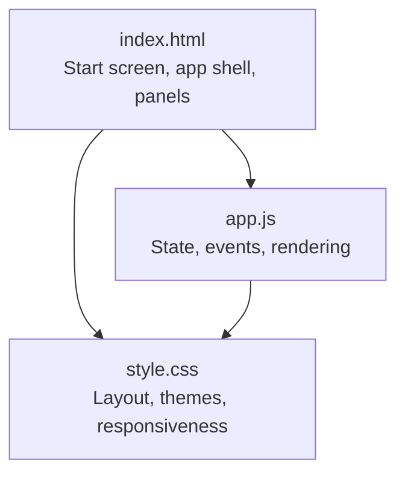
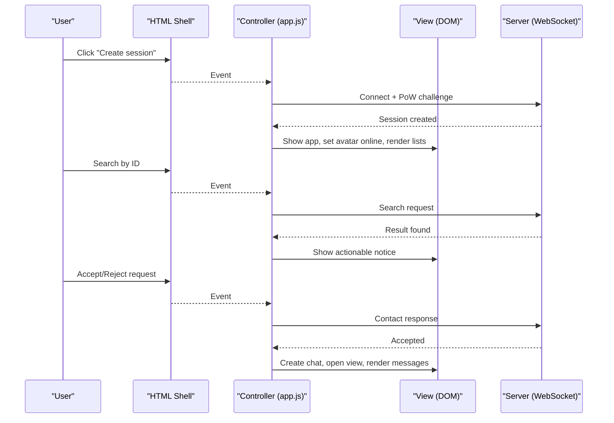
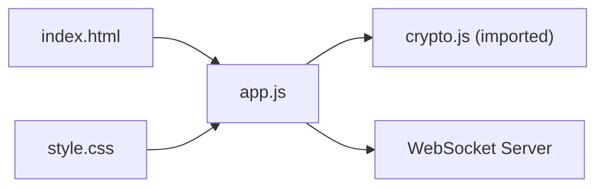

# UI Components

<cite>
**Referenced Files in This Document**
- [index.html](file://public/index.html)
- [app.js](file://public/app.js)
- [style.css](file://public/style.css)
</cite>

## Table of Contents
1. [Introduction](#introduction)
2. [Project Structure](#project-structure)
3. [Core Components](#core-components)
4. [Architecture Overview](#architecture-overview)
5. [Detailed Component Analysis](#detailed-component-analysis)
6. [Dependency Analysis](#dependency-analysis)
7. [Performance Considerations](#performance-considerations)
8. [Troubleshooting Guide](#troubleshooting-guide)
9. [Conclusion](#conclusion)

## Introduction
This document explains the responsive chat interface built with vanilla JavaScript and modern CSS. It covers the main application layout (start screen, chat list panel, active chat view, profile management panel), toast notifications, DOM manipulation patterns, event handling, state-driven UI updates, responsive design, visual feedback systems, accessibility features, and component lifecycle management.

## Project Structure
The UI is defined by a single-page HTML shell, a client-side JavaScript module that drives behavior and state, and a stylesheet providing theming and responsive layouts.

**Diagram sources**
- [index.html:13-101](file://public/index.html#L13-L101)
- [app.js:10-24](file://public/app.js#L10-L24)
- [style.css:1-225](file://public/style.css#L1-L225)

**Section sources**
- [index.html:13-101](file://public/index.html#L13-L101)
- [app.js:10-24](file://public/app.js#L10-L24)
- [style.css:1-225](file://public/style.css#L1-L225)

## Core Components
- Start screen: Entry point to create or resume a session; includes branding, tagline, primary action button, and a hint area for progress.
- App shell: Two-pane layout with a sidebar (profile, search, chat list, requests) and a chat area (header, messages, composer).
- Profile management panel: Shows user ID and public key with toggle visibility and copy actions; logout resets state.
- Chat list panel: Lists active chats sorted by last activity, shows online presence dot and unread badge.
- Active chat view: Displays peer name, fingerprint chip, message history, and composition area with size hints.
- Toast notification system: Non-blocking success/info/error messages and actionable notices for contact requests.

Key behaviors:
- State-driven rendering: A small in-memory store drives UI updates via dedicated render functions.
- Event binding: Centralized initialization wires clicks, keyboard shortcuts, and input changes.
- Responsive layout: CSS Grid adapts from two-pane desktop to single-pane mobile with pane toggling via data attributes.

**Section sources**
- [index.html:13-101](file://public/index.html#L13-L101)
- [app.js:195-207](file://public/app.js#L195-L207)
- [app.js:398-518](file://public/app.js#L398-L518)
- [style.css:57-220](file://public/style.css#L57-L220)

## Architecture Overview
The UI follows a simple MVC-like pattern:
- Model: In-memory state objects (session, chats map, pending/outgoing requests, incoming requests, active chat).
- View: DOM elements referenced once at startup; rendered by explicit functions.
- Controller: Event handlers update model and call render/update helpers.

**Diagram sources**
- [app.js:74-120](file://public/app.js#L74-L120)
- [app.js:124-176](file://public/app.js#L124-L176)
- [app.js:227-322](file://public/app.js#L227-L322)
- [app.js:559-621](file://public/app.js#L559-L621)

## Detailed Component Analysis

### Start Screen
- Purpose: Authenticate and establish a WebSocket connection, solving a proof-of-work challenge before creating/resuming a session.
- Key interactions:
  - Primary button triggers connection and PoW flow.
  - Hint text indicates progress and error states when crypto support is missing.
- DOM references: start section, create button, hint element.
- Accessibility: Uses semantic heading and descriptive text; no interactive controls beyond the primary button.

**Section sources**
- [index.html:13-21](file://public/index.html#L13-L21)
- [app.js:99-120](file://public/app.js#L99-L120)
- [app.js:559-575](file://public/app.js#L559-L575)

### App Shell and Layout
- Purpose: Main container with sidebar and chat area; uses CSS Grid for two-pane layout on desktop and switches to single-pane on mobile.
- Pane switching: Data attribute on the app root toggles visibility of side/chat panes on small screens.
- Visuals: Dark theme with monochrome accents, consistent spacing and typography.

**Section sources**
- [index.html:23-99](file://public/index.html#L23-L99)
- [style.css:57-62](file://public/style.css#L57-L62)
- [style.css:214-220](file://public/style.css#L214-L220)

### Sidebar: Profile Panel
- Purpose: Display and manage user identity and cryptographic keys; supports masking/unmasking and copying ID.
- Interactions:
  - Toggle visibility for ID and public key with aria-pressed state updates.
  - Copy ID to clipboard with fallback error handling.
  - Logout resets all state and returns to start screen.
- Accessibility: Buttons have aria-labels; toggles use aria-pressed to reflect state.

**Section sources**
- [index.html:26-59](file://public/index.html#L26-L59)
- [app.js:209-225](file://public/app.js#L209-L225)
- [app.js:577-594](file://public/app.js#L577-L594)
- [style.css:89-114](file://public/style.css#L89-L114)

### Sidebar: Search and Chat List
- Purpose: Find peers by ID and display active chats with last message preview and unread badges.
- Interactions:
  - Validate and normalize search input; trigger server search on click or Enter.
  - Render chat items sorted by last message timestamp; show online presence dot and unread count badge.
  - Empty state shown when no chats exist.
- Accessibility: Chat list has an aria-label; search input has placeholder and aria-label.

**Section sources**
- [index.html:31-59](file://public/index.html#L31-L59)
- [app.js:227-250](file://public/app.js#L227-L250)
- [app.js:398-437](file://public/app.js#L398-L437)
- [app.js:596-603](file://public/app.js#L596-L603)
- [style.css:116-133](file://public/style.css#L116-L133)

### Requests Panel
- Purpose: Handle incoming contact requests with accept/reject actions.
- Interactions:
  - Render cards per incoming request with code and action buttons.
  - Accepting derives shared key and opens chat; rejecting sends decline and removes request.
- Accessibility: Buttons are standard interactive elements; context provided via surrounding labels.

**Section sources**
- [index.html:57-59](file://public/index.html#L57-L59)
- [app.js:252-293](file://public/app.js#L252-L293)
- [app.js:439-464](file://public/app.js#L439-L464)
- [style.css:135-147](file://public/style.css#L135-L147)

### Active Chat View
- Purpose: Display conversation with peer, including header with peer name and fingerprint chip, message list, and composer.
- Interactions:
  - Open chat clears unread, shows header/messages/composer, renders messages, focuses input.
  - Message sending validates size, encrypts, sends, appends local echo, autosizes textarea, updates size hint.
  - Receiving messages decrypts, appends, scrolls into view, increments unread if not active, shows toast.
  - End chat sends termination, cleans up state, selects next chat or back to empty state.
- Accessibility: Composer textarea has aria-label; menu and chips include aria-hidden where decorative.

**Section sources**
- [index.html:62-98](file://public/index.html#L62-L98)
- [app.js:324-359](file://public/app.js#L324-L359)
- [app.js:466-518](file://public/app.js#L466-L518)
- [style.css:149-201](file://public/style.css#L149-L201)

### Toast Notification System
- Purpose: Provide transient feedback and actionable notices for user flows.
- Types:
  - Simple toasts: Auto-dismiss after a time-to-live.
  - Actionable notices: Persistent until dismissed or acted upon; used for contact request status.
- Styling: Rounded pill shapes, subtle shadows, animations; error variant highlights danger color.

**Section sources**
- [index.html:101-101](file://public/index.html#L101-L101)
- [app.js:39-72](file://public/app.js#L39-L72)
- [style.css:203-212](file://public/style.css#L203-L212)

### DOM Manipulation Patterns
- Element caching: All frequently accessed nodes are stored in a central object for performance and readability.
- Rendering functions: Dedicated functions clear and rebuild sections (chat list, requests, messages) based on current state.
- Lifecycle:
  - Initialization detects crypto support and wires all event listeners.
  - On session creation, UI transitions from start screen to app and populates profile info.
  - On logout/reset, all state is cleared and DOM returns to initial state.

**Section sources**
- [app.js:10-24](file://public/app.js#L10-L24)
- [app.js:398-518](file://public/app.js#L398-L518)
- [app.js:532-554](file://public/app.js#L532-L554)
- [app.js:559-621](file://public/app.js#L559-L621)

### Event Handling and Keyboard Shortcuts
- Button clicks: Create session, profile toggle, search, send message, end chat, menu toggles.
- Input validation: Search input normalized and validated minimum length; message input trimmed and size-checked.
- Keyboard shortcuts:
  - Enter in search input triggers search.
  - Enter in message composer sends message (Shift+Enter allowed for newlines).
- Global click handler: Dismiss menus when clicking outside.

**Section sources**
- [app.js:559-621](file://public/app.js#L559-L621)

### State-Driven UI Updates
- State stores:
  - Session: id and identity.
  - Chats: Map of peerId to chat objects with messages, encryption key, fingerprint, online status, unread count.
  - Pending outgoing and incoming requests: Maps for tracking handshake state.
- Update strategy:
  - Handlers mutate state then call render functions to reflect changes.
  - Presence updates propagate to both list and active chat header.
  - Unread counts updated on incoming messages and reset when opening a chat.

**Section sources**
- [app.js:26-35](file://public/app.js#L26-L35)
- [app.js:312-322](file://public/app.js#L312-L322)
- [app.js:324-359](file://public/app.js#L324-L359)
- [app.js:390-396](file://public/app.js#L390-L396)
- [app.js:466-506](file://public/app.js#L466-L506)

### Responsive Design Implementation
- Desktop: Two-column grid with fixed-width sidebar and flexible chat area.
- Mobile: Single column; pane visibility toggled via data attribute to show either sidebar or chat.
- Variables: CSS custom properties define colors, spacing, and widths for consistency across breakpoints.

**Section sources**
- [style.css:1-17](file://public/style.css#L1-L17)
- [style.css:57-62](file://public/style.css#L57-L62)
- [style.css:214-220](file://public/style.css#L214-L220)

### Visual Feedback Systems
- Online presence indicators:
  - Avatar dot turns bright when connected.
  - Per-chat dot reflects peer online/offline status.
- Unread message badges:
  - Numeric badge in chat list item; capped at “9+” for large counts.
- Size hints for composition:
  - Live byte counter with overflow highlighting when exceeding limit.
- Toast notifications:
  - Success/info/toast variants; actionable notices for contact requests.

**Section sources**
- [style.css:67-73](file://public/style.css#L67-L73)
- [style.css:124-132](file://public/style.css#L124-L132)
- [style.css:199-201](file://public/style.css#L199-L201)
- [style.css:203-212](file://public/style.css#L203-L212)
- [app.js:86-93](file://public/app.js#L86-L93)
- [app.js:390-396](file://public/app.js#L390-L396)
- [app.js:526-530](file://public/app.js#L526-L530)

### Accessibility Features
- ARIA attributes:
  - aria-label on search input, profile button, chat menu button, and message textarea.
  - aria-pressed toggled on visibility controls for ID and key.
  - aria-live region for toasts to announce changes to screen readers.
  - Decorative icons use aria-hidden to avoid noise.
- Keyboard navigation:
  - Focus management ensures composer input is focused when opening a chat.
  - Enter key shortcuts for search and sending messages.
- Semantic structure:
  - Use of headings, nav, and sections improves document outline.

**Section sources**
- [index.html:28-35](file://public/index.html#L28-L35)
- [index.html:41-54](file://public/index.html#L41-L54)
- [index.html:68-96](file://public/index.html#L68-L96)
- [index.html:101-101](file://public/index.html#L101-L101)
- [app.js:209-225](file://public/app.js#L209-L225)
- [app.js:492-492](file://public/app.js#L492-L492)
- [app.js:577-589](file://public/app.js#L577-L589)
- [app.js:603-617](file://public/app.js#L603-L617)

### Component Initialization and Event Binding
- Initialization sequence:
  - Detect supported curves and disable create button if unsupported.
  - Wire up all event listeners for buttons, inputs, and global clicks.
  - On create session, connect to WebSocket and handle challenges.
- Event binding patterns:
  - Direct onclick handlers for simple actions.
  - Input event listeners for live updates (autosize, size hint).
  - Global click listener to dismiss dropdowns and panels.

**Section sources**
- [app.js:559-621](file://public/app.js#L559-L621)

### DOM Element Lifecycle Management
- Creation: Elements are created dynamically for messages, list items, and notices.
- Destruction: Notices are removed when dismissed; toasts auto-remove after TTL; resetAll clears all state and DOM references.
- Reuse: Centralized element cache avoids repeated queries; render functions rebuild sections efficiently.

**Section sources**
- [app.js:39-72](file://public/app.js#L39-L72)
- [app.js:408-437](file://public/app.js#L408-L437)
- [app.js:508-518](file://public/app.js#L508-L518)
- [app.js:532-554](file://public/app.js#L532-L554)

## Dependency Analysis
The UI depends on:
- HTML structure for layout and semantics.
- CSS for styling and responsive behavior.
- JavaScript for state management, event handling, and dynamic rendering.
- External crypto utilities imported from a separate module for secure operations.

**Diagram sources**
- [app.js:4-8](file://public/app.js#L4-L8)
- [index.html:9-10](file://public/index.html#L9-L10)
- [index.html:103-103](file://public/index.html#L103-L103)

**Section sources**
- [app.js:4-8](file://public/app.js#L4-L8)
- [index.html:9-10](file://public/index.html#L9-L10)
- [index.html:103-103](file://public/index.html#L103-L103)

## Performance Considerations
- Minimal reflows: Render functions rebuild only necessary sections.
- Efficient scrolling: Messages container scrolls to bottom on append.
- Debounced interactions: Autosize and size hint update on input events without heavy computation.
- Memory usage: All state is in-memory; closing tab clears everything, avoiding stale references.

[No sources needed since this section provides general guidance]

## Troubleshooting Guide
Common issues and resolutions:
- Browser lacks required cryptography: Create button disabled; hint explains limitation.
- Rate limiting errors: Toast informs user to wait; specific categories mapped to friendly messages.
- Too-large messages: Size hint turns red; send blocked with error toast.
- Session creation failures: Toast prompts retry; button re-enabled and hint cleared.
- Offline or rejected contact requests: Toast informs outcome; notices dismissed appropriately.

**Section sources**
- [app.js:178-193](file://public/app.js#L178-L193)
- [app.js:559-575](file://public/app.js#L559-L575)
- [app.js:344-359](file://public/app.js#L344-L359)
- [app.js:295-310](file://public/app.js#L295-L310)

## Conclusion
The UI components form a cohesive, responsive chat experience driven by clear separation of concerns: HTML defines structure, CSS handles presentation and responsiveness, and JavaScript manages state, events, and rendering. The design emphasizes minimalism, accessibility, and robust feedback through visual indicators and toast notifications. The modular approach enables maintainability and clarity for future enhancements.