# WebSocket Client

<cite>
**Referenced Files in This Document**
- [app.js](file://public/app.js)
- [crypto.js](file://public/crypto.js)
- [ws.js](file://server/ws.js)
- [index.js](file://server/index.js)
</cite>

## Table of Contents
1. [Introduction](#introduction)
2. [Project Structure](#project-structure)
3. [Core Components](#core-components)
4. [Architecture Overview](#architecture-overview)
5. [Detailed Component Analysis](#detailed-component-analysis)
6. [Dependency Analysis](#dependency-analysis)
7. [Performance Considerations](#performance-considerations)
8. [Troubleshooting Guide](#troubleshooting-guide)
9. [Conclusion](#conclusion)

## Introduction
This document explains the real-time communication layer implemented with WebSockets. It covers the client-side connection lifecycle, proof-of-work authentication, session creation and resumption, message dispatching for all protocol types, automatic reconnection behavior, bidirectional messaging patterns, encoding/decoding, error handling, state management, cleanup procedures, security considerations, and performance optimizations. The server is a minimal relay that never sees plaintext or keys and stores no persistent data.

## Project Structure
The project consists of:
- A browser-based client that manages UI, cryptography, and WebSocket transport.
- A Node.js server that relays encrypted messages, enforces rate limits, and coordinates presence and chat adjacency.

```mermaid
graph TB
subgraph "Browser"
UI["UI (HTML/CSS)"]
App["Client App<br/>WebSocket lifecycle, dispatch, UI state"]
Crypto["Crypto Module<br/>ECDH, AES-GCM, PoW solver"]
end
subgraph "Server"
HTTP["HTTP Server<br/>Static files, CSP, upgrade"]
WSS["WebSocket Relay<br/>Auth, rate limits, presence, routing"]
end
UI --> App
App --> Crypto
App < --> |JSON over WS| WSS
HTTP --> WSS
```

**Diagram sources**
- [index.js:73-109](file://server/index.js#L73-L109)
- [ws.js:258-312](file://server/ws.js#L258-L312)
- [app.js:74-120](file://public/app.js#L74-L120)
- [crypto.js:113-127](file://public/crypto.js#L113-L127)

**Section sources**
- [index.js:1-116](file://server/index.js#L1-L116)
- [app.js:1-624](file://public/app.js#L1-L624)

## Core Components
- Client app: Establishes WebSocket connections, performs proof-of-work challenge/response, creates/resumes sessions, dispatches incoming messages to handlers, manages chat state, and handles reconnection.
- Crypto module: Implements identity generation, ephemeral key exchange, shared key derivation, fingerprinting, encryption/decryption, and PoW solving.
- Server: Accepts WebSocket upgrades, issues PoW challenges, validates proofs, creates/resumes sessions, enforces per-action rate limits, routes contact requests and messages, and broadcasts presence changes.

Key responsibilities:
- Connection lifecycle: connect, authenticate, enterApp, reconnect on close.
- Message dispatch: switch on message type to route to handlers.
- Security: E2E encryption, PoW anti-abuse, strict CSP, no logs, in-memory only.
- Presence and chat adjacency: peer_online/offline, chat_ended, online indicators.

**Section sources**
- [app.js:74-176](file://public/app.js#L74-L176)
- [crypto.js:1-242](file://public/crypto.js#L1-L242)
- [ws.js:1-313](file://server/ws.js#L1-L313)

## Architecture Overview
The client initiates a WebSocket connection and immediately requests a proof-of-work challenge. After solving it, it sends a create_session request with its identity public key and proof. The server validates the proof, checks rate limits, and either resumes an existing session within a grace period or creates a new one. Once authenticated, the client enters the application UI and can search for peers, send contact requests, establish chats, and exchange encrypted messages.

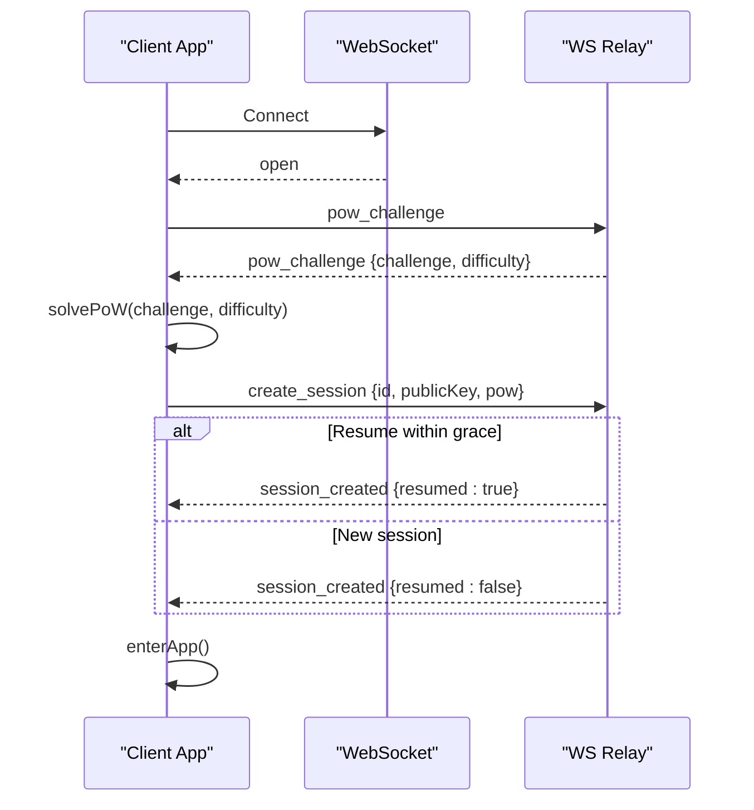

**Diagram sources**
- [app.js:74-120](file://public/app.js#L74-L120)
- [ws.js:93-179](file://server/ws.js#L93-L179)
- [crypto.js:113-127](file://public/crypto.js#L113-L127)

## Detailed Component Analysis

### WebSocket Connection Lifecycle
- Connection establishment:
  - The client constructs a URL based on the current page protocol (ws/wss).
  - On open, it requests a proof-of-work challenge.
  - On message, it parses JSON and dispatches by type.
  - On close, it updates UI presence and schedules a quick reconnect if not intentionally closed and a session exists.
- Reconnect strategy:
  - Uses a single timer to avoid overlapping reconnect attempts.
  - Quick reconnect within a short delay after unexpected closes when a session exists.
  - Intentional logout clears timers and resets state.

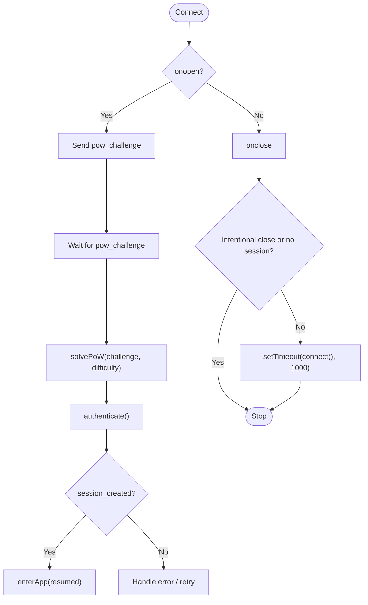

**Diagram sources**
- [app.js:74-97](file://public/app.js#L74-L97)
- [app.js:108-120](file://public/app.js#L108-L120)

**Section sources**
- [app.js:74-120](file://public/app.js#L74-L120)

### Authentication Flow with Proof-of-Work Challenge/Response
- Client flow:
  - Sends pow_challenge to the server upon connection.
  - Receives challenge and difficulty, solves PoW using a CPU-bound loop that yields to the event loop periodically.
  - Sends create_session with id, identity public key, and proof (challenge + nonce).
- Server flow:
  - Issues a random challenge and difficulty.
  - Verifies the proof against the challenge and nonce bounds.
  - Validates identity key format and rate limits.
  - If an existing session exists and the same identity key is provided within the grace window, resumes the session; otherwise creates a new session.

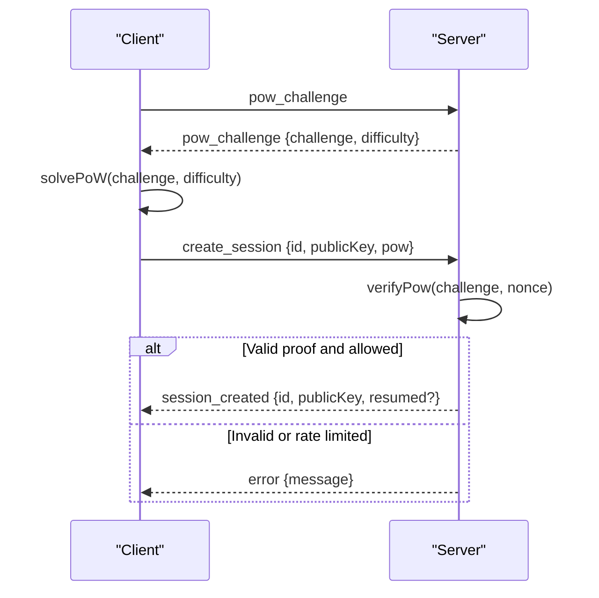

**Diagram sources**
- [app.js:99-120](file://public/app.js#L99-L120)
- [ws.js:93-179](file://server/ws.js#L93-L179)
- [crypto.js:113-127](file://public/crypto.js#L113-L127)

**Section sources**
- [app.js:99-120](file://public/app.js#L99-L120)
- [ws.js:93-179](file://server/ws.js#L93-L179)
- [crypto.js:113-127](file://public/crypto.js#L113-L127)

### Session Creation and Resumption
- New session:
  - Server creates a session object with id, public key, and socket reference.
  - Notifies peers that the user is online.
- Resumed session:
  - If another connection reuses the same id and identity key within the grace period, the server reattaches the socket and marks the session as resumed.
  - Peers are notified that the user is online again.
- Grace period:
  - When a connection drops, the server sets a timer to tear down the session if it does not resume within the configured window.

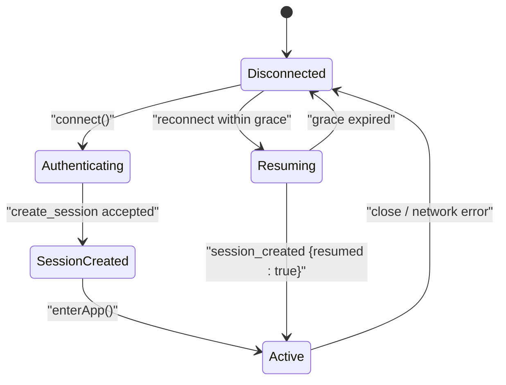

**Diagram sources**
- [ws.js:133-179](file://server/ws.js#L133-L179)
- [app.js:108-120](file://public/app.js#L108-L120)

**Section sources**
- [ws.js:133-179](file://server/ws.js#L133-L179)
- [app.js:108-120](file://public/app.js#L108-L120)

### Message Dispatch System and Handlers
The client’s onMessage function routes incoming messages by type:
- pow_challenge: Solve PoW and authenticate.
- session_created: Enable UI controls and enter the app.
- search_result: Show “found” notice or open existing chat.
- contact_request_sent/contact_request_failed: Update pending outgoing requests and show notices.
- contact_request: Store incoming request and render requests list.
- contact_response: Derive chat key, compute fingerprint, and open chat.
- message: Decrypt and append to active chat or unread count.
- chat_ended: Clean up chat state and notifications.
- peer_offline/peer_online: Update presence indicators.
- error: Display user-friendly errors for rate limiting, size limits, invalid IDs, bad PoW, etc.

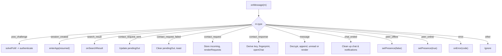

**Diagram sources**
- [app.js:124-176](file://public/app.js#L124-L176)

**Section sources**
- [app.js:124-176](file://public/app.js#L124-L176)

### Bidirectional Communication Patterns
- Outgoing:
  - Client sends JSON objects with a type field and payload fields depending on the action (e.g., search, contact_request, message, end_chat).
  - Messages are sent only when the WebSocket is open.
- Incoming:
  - All messages are parsed from JSON and dispatched synchronously to handlers.
  - UI updates occur immediately to reflect state changes.

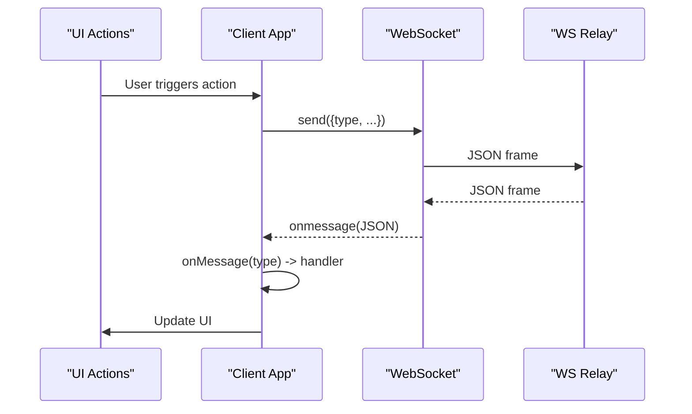

**Diagram sources**
- [app.js:95-97](file://public/app.js#L95-L97)
- [app.js:124-176](file://public/app.js#L124-L176)
- [ws.js:258-296](file://server/ws.js#L258-L296)

**Section sources**
- [app.js:95-97](file://public/app.js#L95-L97)
- [app.js:124-176](file://public/app.js#L124-L176)
- [ws.js:258-296](file://server/ws.js#L258-L296)

### Message Encoding/Decoding Processes
- Encryption:
  - Per-chat keys are derived via ECDH between ephemeral keys and HKDF-SHA256 to produce an AES-256-GCM key.
  - Each message is encrypted with a fresh 96-bit IV and base64-encoded.
- Decryption:
  - The client decrypts ciphertext using the chat key and the embedded IV.
  - If decryption fails, a placeholder message is appended to preserve conversation continuity.
- Size constraints:
  - Plaintext is capped at 2 KB before sending.
  - Server enforces a maximum ciphertext length including overhead.

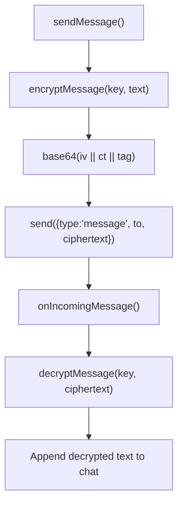

**Diagram sources**
- [app.js:344-359](file://public/app.js#L344-L359)
- [app.js:325-342](file://public/app.js#L325-L342)
- [crypto.js:191-241](file://public/crypto.js#L191-L241)

**Section sources**
- [app.js:325-359](file://public/app.js#L325-L359)
- [crypto.js:191-241](file://public/crypto.js#L191-L241)

### Automatic Reconnection Logic and Graceful Degradation
- Reconnection:
  - On unexpected close, the client schedules a quick reconnect after a short delay if a session exists and the close was not intentional.
  - Only one reconnect attempt is scheduled at a time to prevent race conditions.
- Graceful degradation:
  - While offline, presence indicators are updated to offline, and chat lists are refreshed.
  - No message queueing is performed; if a recipient is offline, the server responds with peer_offline.
- Session recovery:
  - Within the server’s grace period, reconnecting with the same id and identity key resumes the session.

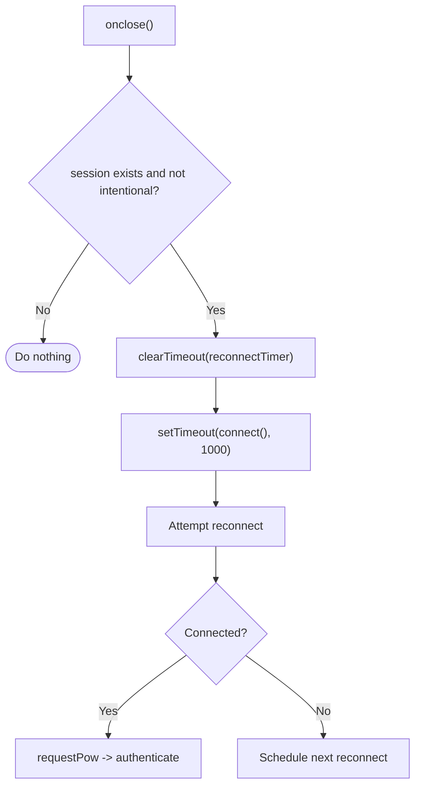

**Diagram sources**
- [app.js:86-93](file://public/app.js#L86-L93)
- [ws.js:133-148](file://server/ws.js#L133-L148)

**Section sources**
- [app.js:86-93](file://public/app.js#L86-L93)
- [ws.js:133-148](file://server/ws.js#L133-L148)

### Connection State Management and Cleanup Procedures
- State variables:
  - ws: current WebSocket instance.
  - session: current session id and identity.
  - chats: Map of peerId to chat state (messages, key, fingerprint, online status).
  - pendingOut/incoming: Maps tracking outbound and inbound contact requests.
  - notifByPeer: Toast elements for actionable notices.
- Cleanup:
  - resetAll sets intentionalClose flag, clears timers, closes socket, nullifies ws/session, clears lastPow, and empties maps and UI panels.
  - hardRemoveChat removes chat entries and resets active chat if needed.

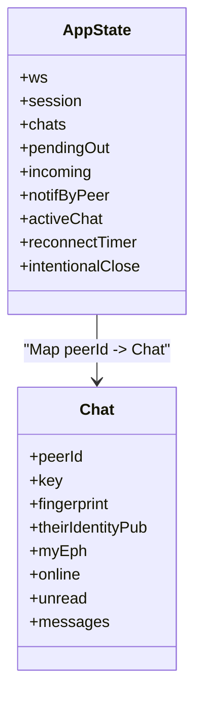

**Diagram sources**
- [app.js:26-35](file://public/app.js#L26-L35)
- [app.js:312-322](file://public/app.js#L312-L322)
- [app.js:384-388](file://public/app.js#L384-L388)
- [app.js:533-554](file://public/app.js#L533-L554)

**Section sources**
- [app.js:26-35](file://public/app.js#L26-L35)
- [app.js:312-322](file://public/app.js#L312-L322)
- [app.js:384-388](file://public/app.js#L384-L388)
- [app.js:533-554](file://public/app.js#L533-L554)

### Error Handling Strategies
- Network failures:
  - Handled by onSocketClosed; UI reflects offline state; reconnect scheduled if appropriate.
- Protocol errors:
  - Rate-limited actions display specific toasts.
  - Too-large messages inform users of size limits.
  - Invalid id or bad_pow shows session creation failure.
  - Non-fatal protocol errors may be ignored or shown briefly.

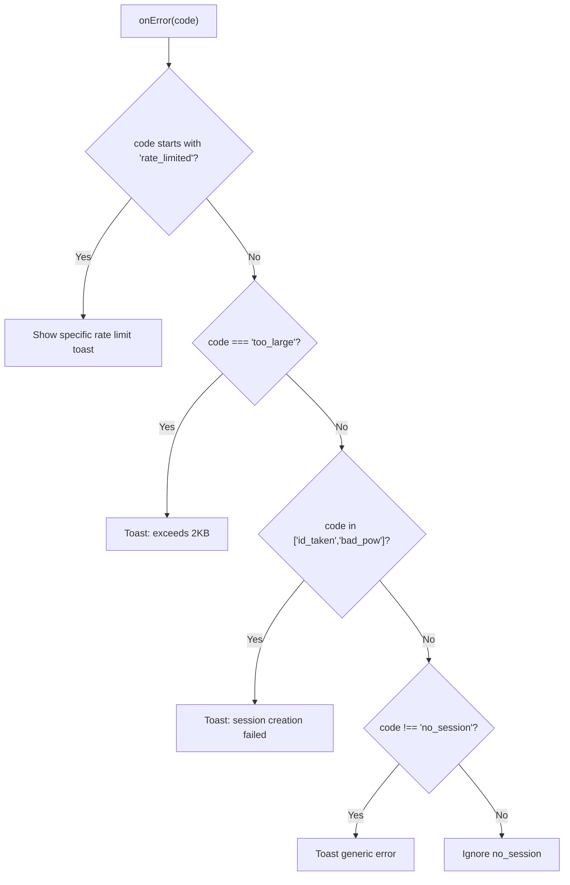

**Diagram sources**
- [app.js:178-193](file://public/app.js#L178-L193)

**Section sources**
- [app.js:178-193](file://public/app.js#L178-L193)

### Security Considerations
- End-to-end encryption:
  - Identity keys and per-chat ephemeral keys are generated in the browser.
  - Shared keys are derived via ECDH and HKDF; messages are encrypted with AES-256-GCM.
- Anti-abuse:
  - Proof-of-work challenge/response prevents automated abuse.
  - Server enforces per-action rate limits using token buckets.
- Transport security:
  - Client uses wss when served over HTTPS.
  - Server sets strict Content-Security-Policy and other security headers.
- Privacy:
  - No logs, no IP storage, no persistence; all state is in RAM.

**Section sources**
- [crypto.js:1-10](file://public/crypto.js#L1-L10)
- [crypto.js:191-241](file://public/crypto.js#L191-L241)
- [ws.js:5-21](file://server/ws.js#L5-L21)
- [ws.js:36-65](file://server/ws.js#L36-L65)
- [index.js:24-39](file://server/index.js#L24-L39)
- [index.js:73-84](file://server/index.js#L73-L84)

### Connection Pooling Strategies
- Single connection per tab:
  - The client maintains a single WebSocket instance and guards against opening multiple concurrent connections.
  - Reconnect logic ensures only one reconnect attempt is scheduled at a time.
- No explicit pooling:
  - There is no multi-connection pooling; this simplifies state management and avoids duplicate messages.

**Section sources**
- [app.js:74-84](file://public/app.js#L74-L84)
- [app.js:86-93](file://public/app.js#L86-L93)

### Performance Optimization Techniques
- Event-loop yielding during PoW:
  - The PoW solver yields periodically to keep the UI responsive.
- Minimal server processing:
  - Server only relays opaque payloads and performs lightweight validations.
- UI updates:
  - Chat list rendering sorts by last message timestamp and updates only necessary DOM nodes.
- Payload sizing:
  - Enforce 2 KB plaintext cap on the client and validate ciphertext length on the server.

**Section sources**
- [crypto.js:113-127](file://public/crypto.js#L113-L127)
- [ws.js:111-120](file://server/ws.js#L111-L120)
- [app.js:399-437](file://public/app.js#L399-L437)
- [app.js:344-359](file://public/app.js#L344-L359)

## Dependency Analysis
The client depends on crypto utilities for all cryptographic operations and on the WebSocket API for transport. The server depends on the ws library for WebSocket handling and Node’s crypto module for hashing and random bytes.

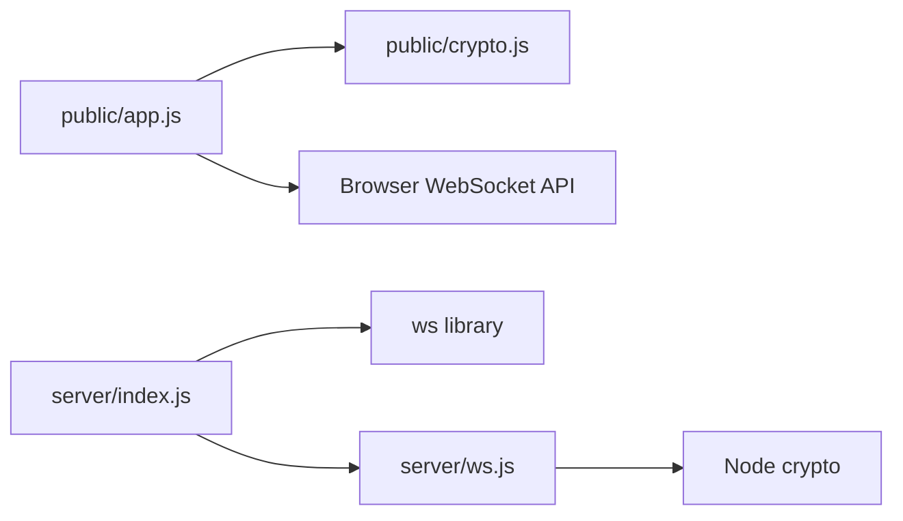

**Diagram sources**
- [app.js:4-8](file://public/app.js#L4-L8)
- [index.js:8-9](file://server/index.js#L8-L9)
- [ws.js:3](file://server/ws.js#L3)

**Section sources**
- [app.js:4-8](file://public/app.js#L4-L8)
- [index.js:8-9](file://server/index.js#L8-L9)
- [ws.js:3](file://server/ws.js#L3)

## Performance Considerations
- Keep PoW computation non-blocking by yielding to the event loop.
- Avoid unnecessary re-renders by updating only affected parts of the UI.
- Use small, well-defined JSON messages to minimize serialization overhead.
- Rely on server-side rate limiting to protect against bursts and enumeration attacks.
- Prefer wss for secure and efficient transport over TLS where available.

[No sources needed since this section provides general guidance]

## Troubleshooting Guide
Common issues and resolutions:
- Browser lacks ECDH support:
  - The app disables the create button and shows a hint about unsupported cryptography.
- Rate-limited actions:
  - Specific toasts indicate which action is throttled; wait and retry later.
- Message too large:
  - The client enforces a 2 KB limit; reduce message size.
- Session creation failures:
  - Invalid id or bad_pow will prompt the user to retry.
- Peer offline:
  - If a target is offline, the server returns peer_offline; no queueing occurs.

**Section sources**
- [app.js:559-575](file://public/app.js#L559-L575)
- [app.js:178-193](file://public/app.js#L178-L193)
- [app.js:344-359](file://public/app.js#L344-L359)
- [ws.js:231-240](file://server/ws.js#L231-L240)

## Conclusion
The WebSocket client implements a robust real-time messaging layer with strong privacy guarantees. It establishes secure connections, authenticates via proof-of-work, manages sessions with graceful resumption, and dispatches all message types to appropriate handlers. Automatic reconnection ensures resilience during network interruptions, while end-to-end encryption protects message content. The server acts as a minimal, privacy-focused relay with rate limiting and presence coordination. Together, these components provide a secure, performant, and user-friendly real-time communication experience.

[No sources needed since this section summarizes without analyzing specific files]