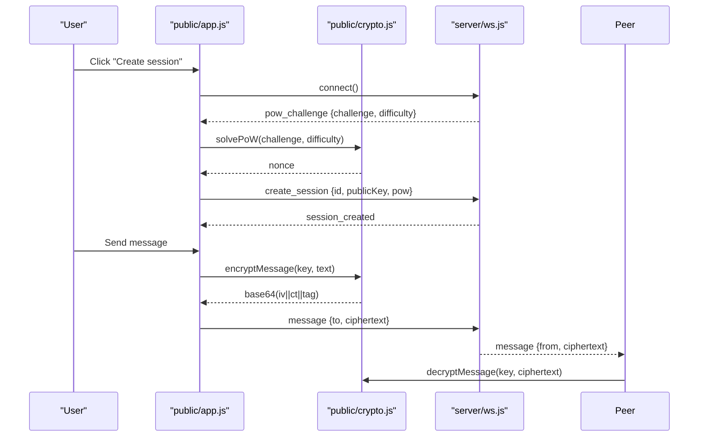
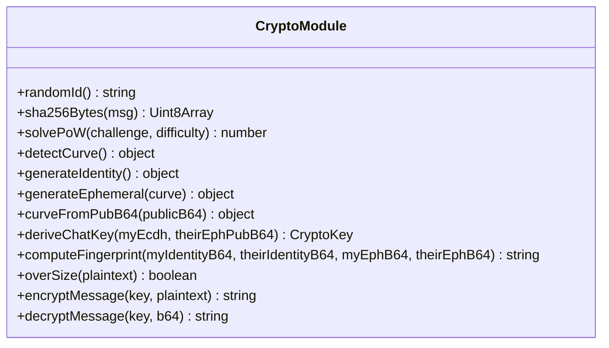
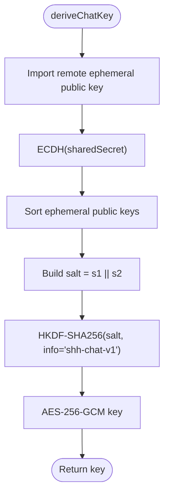
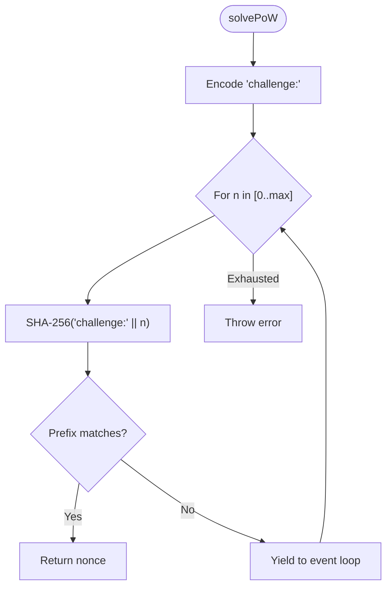
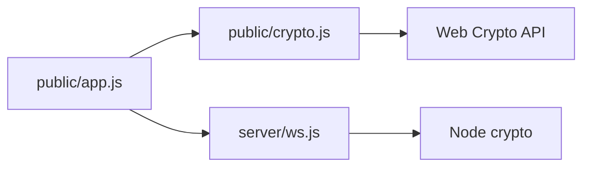

# Cryptographic Module

<cite>
**Referenced Files in This Document**
- [crypto.js](file://public/crypto.js)
- [app.js](file://public/app.js)
- [ws.js](file://server/ws.js)
- [index.js](file://server/index.js)
- [index.html](file://public/index.html)
</cite>

## Table of Contents
1. [Introduction](#introduction)
2. [Project Structure](#project-structure)
3. [Core Components](#core-components)
4. [Architecture Overview](#architecture-overview)
5. [Detailed Component Analysis](#detailed-component-analysis)
6. [Dependency Analysis](#dependency-analysis)
7. [Performance Considerations](#performance-considerations)
8. [Troubleshooting Guide](#troubleshooting-guide)
9. [Conclusion](#conclusion)

## Introduction
This document explains the client-side cryptographic module that provides end-to-end encryption for a real-time chat application. It covers key generation and management using the Web Crypto API, AES-256-GCM message protection with proper nonce handling, ECDH key exchange supporting X25519 and P-256 curves with automatic negotiation, SHA-256 proof-of-work (PoW), fingerprint generation for peer identity verification, and forward secrecy via ephemeral per-chat keys. It also documents security parameters, constants, best practices, compatibility considerations, and potential vulnerabilities.

## Project Structure
The cryptographic logic is implemented in the browser and isolated from the server:
- Client-side cryptography: public/crypto.js
- Client orchestration and UI integration: public/app.js
- Server WebSocket relay (no plaintext access): server/ws.js
- HTTP server and security headers: server/index.js
- Client HTML entrypoint: public/index.html

```mermaid
graph TB
subgraph "Browser"
A["public/index.html"]
B["public/app.js"]
C["public/crypto.js"]
end
subgraph "Server"
D["server/index.js"]
E["server/ws.js"]
end
A --> B
B --> C
B < --> |WebSocket JSON| E
D --> E
```

**Diagram sources**
- [index.html:103-103](file://public/index.html#L103-L103)
- [app.js:1-8](file://public/app.js#L1-L8)
- [crypto.js:1-14](file://public/crypto.js#L1-L14)
- [index.js:91-109](file://server/index.js#L91-L109)
- [ws.js:258-303](file://server/ws.js#L258-L303)

**Section sources**
- [index.html:1-106](file://public/index.html#L1-L106)
- [app.js:1-8](file://public/app.js#L1-L8)
- [crypto.js:1-14](file://public/crypto.js#L1-L14)
- [index.js:1-116](file://server/index.js#L1-L116)
- [ws.js:1-313](file://server/ws.js#L1-L313)

## Core Components
- Key generation and management:
  - Identity keypair (X25519 or P-256) generated once per session in RAM.
  - Per-chat ephemeral keypair for forward secrecy.
- Key exchange:
  - ECDH between ephemeral keys to derive shared secret.
  - Curve negotiation via capability probing; curve inferred by raw public-key length.
- Key derivation:
  - HKDF-SHA256 over ECDH output with order-independent salt built from sorted ephemeral public keys and fixed info string to produce AES-256-GCM key.
- Message protection:
  - AES-256-GCM with fresh random 96-bit nonce per message.
  - Base64 wire format: IV || ciphertext||tag.
- Proof-of-work:
  - SHA-256 brute-force PoW on challenge:nonce with adjustable difficulty.
- Fingerprinting:
  - Deterministic human-checkable fingerprint combining identity and ephemeral public keys.

Security properties:
- Confidentiality and integrity via AES-256-GCM.
- Forward secrecy via per-chat ephemeral keys.
- MITM mitigation via out-of-band fingerprint comparison.
- DoS resistance via PoW and server-side rate limiting.

**Section sources**
- [crypto.js:1-14](file://public/crypto.js#L1-L14)
- [crypto.js:129-211](file://public/crypto.js#L129-L211)
- [crypto.js:223-241](file://public/crypto.js#L223-L241)
- [ws.js:5-13](file://server/ws.js#L5-L13)

## Architecture Overview
The client performs all cryptographic operations locally. The server only relays opaque base64 ciphertexts and metadata.



**Diagram sources**
- [app.js:75-120](file://public/app.js#L75-L120)
- [app.js:344-359](file://public/app.js#L344-L359)
- [crypto.js:115-127](file://public/crypto.js#L115-L127)
- [crypto.js:228-241](file://public/crypto.js#L228-L241)
- [ws.js:93-105](file://server/ws.js#L93-L105)
- [ws.js:231-240](file://server/ws.js#L231-L240)

## Detailed Component Analysis

### Key Generation and Management
- Identity keypair:
  - Generated once per session using Web Crypto’s ECDH with negotiated curve.
  - Public key exported as raw bytes then base64-encoded for transport.
- Per-chat ephemeral keypair:
  - Freshly generated for each chat to ensure forward secrecy.
  - Curve selection mirrors the initiator’s curve to maintain compatibility.

Implementation highlights:
- Curve detection probes X25519 first, falls back to P-256 if unsupported.
- Curve inference from base64 public key length:
  - X25519 raw = 32 bytes -> base64 length 44
  - P-256 uncompressed point = 65 bytes -> base64 length 88

Security notes:
- Private keys never leave the browser memory.
- Curve fallback ensures cross-browser compatibility while preserving protocol semantics.

**Section sources**
- [crypto.js:135-186](file://public/crypto.js#L135-L186)
- [app.js:237-285](file://public/app.js#L237-L285)

#### Class-like structure of crypto module exports


**Diagram sources**
- [crypto.js:12-241](file://public/crypto.js#L12-L241)

### ECDH Key Exchange and Curve Negotiation
- Automatic negotiation:
  - Browser capability probe selects preferred curve at startup.
  - If unavailable, app disables creation and informs the user.
- Curve inference:
  - Based on base64 public key length, both peers agree without extra handshake messages.
- Shared secret derivation:
  - ECDH(sharedSecret) computed from local private key and remote ephemeral public key.

Compatibility:
- X25519 preferred; P-256 fallback ensures broad support.
- Server validates base64 lengths to accept only supported curves.

**Section sources**
- [crypto.js:135-186](file://public/crypto.js#L135-L186)
- [app.js:559-567](file://public/app.js#L559-L567)
- [ws.js:11-13](file://server/ws.js#L11-L13)

### Key Derivation and AES-256-GCM Encryption
- Key schedule:
  - HKDF-SHA256(base=sharedSecret, salt=sorted(ephA_pub || ephB_pub), info="shh-chat-v1") -> AES-256-GCM key.
  - Sorting ephemeral public keys makes salt order-independent so both sides compute identical keys.
- Message encryption:
  - AES-256-GCM with unique 96-bit nonce per message.
  - Wire format: base64(iv || ciphertext||tag).
- Decryption:
  - Parse iv and ciphertext from base64 payload; verify tag automatically via GCM.

Security properties:
- Confidentiality and integrity guaranteed by AES-GCM.
- Nonce uniqueness prevents catastrophic failures.
- Fixed info string binds derived keys to this protocol version.



**Diagram sources**
- [crypto.js:191-211](file://public/crypto.js#L191-L211)

**Section sources**
- [crypto.js:191-211](file://public/crypto.js#L191-L211)
- [crypto.js:223-241](file://public/crypto.js#L223-L241)

### SHA-256 Proof-of-Work
- Purpose:
  - Mitigates automated abuse and resource exhaustion.
- Algorithm:
  - Brute-force nonce such that SHA-256(challenge:nonce) starts with N leading hex zeros.
  - Yields to event loop periodically to keep UI responsive.
- Difficulty:
  - Configurable; server issues challenge with required difficulty.
- Server verification:
  - Recomputes hash and checks prefix; enforces nonce bounds.



**Diagram sources**
- [crypto.js:47-127](file://public/crypto.js#L47-L127)
- [ws.js:93-105](file://server/ws.js#L93-L105)

**Section sources**
- [crypto.js:47-127](file://public/crypto.js#L47-L127)
- [ws.js:93-105](file://server/ws.js#L93-L105)

### Fingerprint Generation
- Input:
  - Both peers’ identity public keys and ephemeral public keys.
- Process:
  - Sort identity keys and ephemeral keys independently.
  - Concatenate sorted IDs and sorted ephemerals plus protocol info.
  - SHA-256 digest, formatted into groups of four hex characters.
- Usage:
  - Out-of-band comparison to detect man-in-the-middle attacks.

Security properties:
- Deterministic across peers when inputs match.
- Short human-readable representation aids manual verification.

**Section sources**
- [crypto.js:213-221](file://public/crypto.js#L213-L221)
- [app.js:273-284](file://public/app.js#L273-L284)

### Forward Secrecy Mechanism
- Each chat uses a fresh ephemeral keypair.
- Compromise of long-term identity keys does not expose past messages because per-chat keys are independent.
- Chat termination removes in-memory keys, preventing reuse.

Operational flow:
- Initiator generates ephemeral keypair and sends its public key.
- Responder derives chat key using initiator’s ephemeral public key and their own ephemeral private key.
- Both sides compute identical AES-256-GCM key via HKDF.

**Section sources**
- [crypto.js:159-172](file://public/crypto.js#L159-L172)
- [crypto.js:191-211](file://public/crypto.js#L191-L211)
- [app.js:237-310](file://public/app.js#L237-L310)

### Cryptographic Constants and Parameters
- Protocol info: "shh-chat-v1"
- Plaintext cap: 2 KB hard limit per message
- AES-GCM nonce size: 96 bits (12 bytes)
- PoW difficulty: configurable (default 4 leading hex zeros)
- Max PoW nonce: 5,000,000
- Supported curves: X25519 (preferred), P-256 (fallback)
- Accepted base64 public key lengths: 44 (X25519), 88 (P-256)
- Cipher max bytes: 2048 + IV + tag slack

These values are enforced on both client and server to ensure consistent behavior.

**Section sources**
- [crypto.js:12-14](file://public/crypto.js#L12-L14)
- [crypto.js:228-232](file://public/crypto.js#L228-L232)
- [ws.js:5-13](file://server/ws.js#L5-L13)

## Dependency Analysis
The client’s app orchestrates cryptographic operations exposed by the crypto module. The server validates inputs and relays encrypted payloads without accessing secrets.



**Diagram sources**
- [app.js:4-8](file://public/app.js#L4-L8)
- [crypto.js:1-14](file://public/crypto.js#L1-L14)
- [ws.js:1-4](file://server/ws.js#L1-L4)

**Section sources**
- [app.js:4-8](file://public/app.js#L4-L8)
- [crypto.js:1-14](file://public/crypto.js#L1-L14)
- [ws.js:1-4](file://server/ws.js#L1-L4)

## Performance Considerations
- SHA-256 PoW:
  - Pure-JS implementation avoids heavy synchronous loops blocking the UI by yielding every 16 iterations.
  - Consider offloading to Web Workers for very high difficulties to avoid UI jank.
- AES-GCM:
  - Hardware-accelerated in modern browsers; negligible overhead for small messages.
- Key derivation:
  - HKDF is fast; sorting and concatenation are minimal cost.
- Memory:
  - All keys and messages are kept in RAM; no persistence reduces I/O overhead but means closing the tab loses state.

[No sources needed since this section provides general guidance]

## Troubleshooting Guide
Common issues and mitigations:
- Browser lacks ECDH support:
  - Symptom: Creation disabled and hint displayed.
  - Cause: Neither X25519 nor P-256 available.
  - Action: Update browser or use a supported environment.
- Unsupported key type:
  - Symptom: Toast indicating unsupported key type during request acceptance.
  - Cause: Remote public key length not matching expected sizes.
  - Action: Ensure both peers run compatible versions.
- Rate limiting:
  - Symptom: Errors like rate_limited:search/contact/message/create.
  - Cause: Exceeding server token bucket limits.
  - Action: Wait before retrying; reduce frequency of actions.
- Too large message:
  - Symptom: Error too_large or toast about exceeding 2 KB.
  - Cause: Message exceeds PLAINTEXT_MAX.
  - Action: Split content or reduce size.
- Session conflicts:
  - Symptom: id_taken or bad_pow errors.
  - Cause: Duplicate ID usage or invalid PoW.
  - Action: Retry with new ID or re-solve PoW.

Operational tips:
- Always compare fingerprints out-of-band to prevent MITM.
- Avoid caching sensitive assets; server sets Cache-Control: no-store.
- Use HTTPS/WSS to protect transport.

**Section sources**
- [app.js:178-193](file://public/app.js#L178-L193)
- [app.js:559-567](file://public/app.js#L559-L567)
- [ws.js:150-179](file://server/ws.js#L150-L179)
- [index.js:61-70](file://server/index.js#L61-L70)

## Conclusion
The cryptographic module implements a robust, privacy-focused design:
- Strong symmetric encryption with AES-256-GCM and per-message nonces.
- Secure key exchange via ECDH with automatic curve negotiation and order-independent salt.
- Forward secrecy through ephemeral per-chat keys.
- Human-verifiable fingerprints to mitigate MITM attacks.
- PoW and server-side rate limiting to resist abuse.
By keeping all secrets in browser memory and relying on the server only as an opaque relay, the system minimizes exposure and aligns with zero-knowledge principles.

[No sources needed since this section summarizes without analyzing specific files]