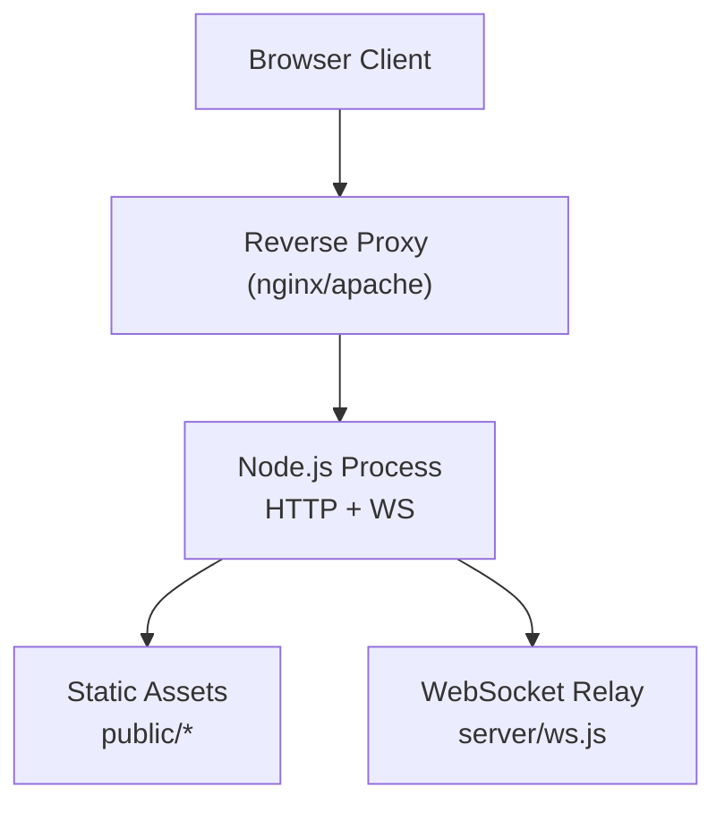
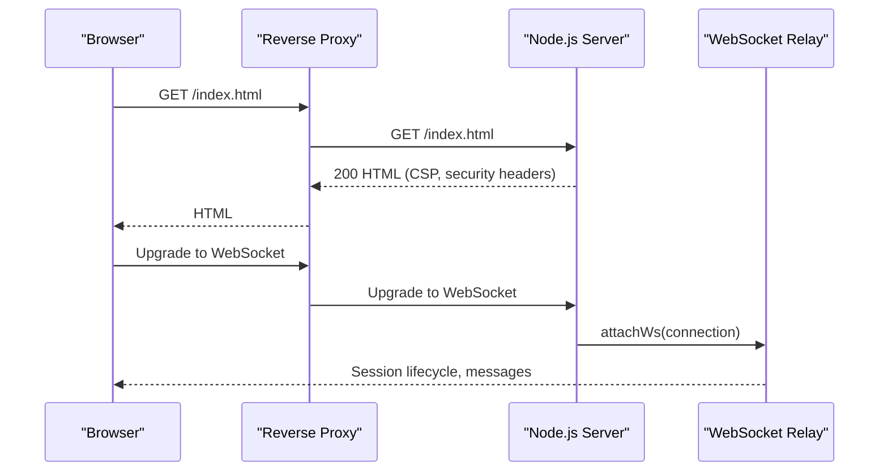
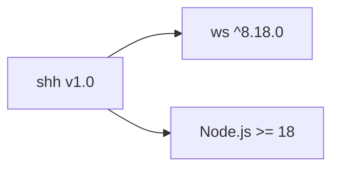

# Deployment Guide

<cite>
**Referenced Files in This Document**
- [package.json](file://package.json)
- [server/index.js](file://server/index.js)
- [server/ws.js](file://server/ws.js)
- [public/index.html](file://public/index.html)
- [public/app.js](file://public/app.js)
</cite>

## Table of Contents
1. Introduction
2. Project Structure
3. Core Components
4. Architecture Overview
5. Detailed Component Analysis
6. Dependency Analysis
7. Performance Considerations
8. Troubleshooting Guide
9. Conclusion
10. Appendices

## Introduction
This deployment guide covers production setup and operational considerations for Shh V1.0, an anonymous real-time end-to-end encrypted messaging application that is intentionally ephemeral: it stores no data on disk and writes no logs. All state resides in memory and is lost when the process restarts or a session disconnects beyond a short grace period. The server exposes static assets over HTTP and a WebSocket relay for encrypted messages.

Key production goals:
- Run Node.js >= 18 as required by the project configuration.
- Install dependencies and start the server securely behind a reverse proxy with TLS termination.
- Configure environment variables (notably PORT).
- Harden security headers and enforce rate limits and proof-of-work to mitigate abuse.
- Plan capacity and scaling given the in-memory architecture.
- Implement monitoring and logging at the infrastructure level since the application does not log requests or connections.
- Containerize with Docker and optionally orchestrate with Kubernetes.
- Address backup and disaster recovery considering the ephemeral design.

## Project Structure
Shh V1.0 is organized into a small, focused structure:
- Public web assets under public/ served by the Node server.
- Server logic under server/ handling HTTP and WebSocket upgrade.
- A single dependency on ws for WebSocket support.
- Package metadata and scripts define how to run the app.

**Diagram sources**
- [server/index.js:73-115](file://server/index.js#L73-L115)
- [server/ws.js:258-312](file://server/ws.js#L258-L312)
- [public/index.html:1-106](file://public/index.html#L1-L106)

**Section sources**
- [package.json:1-19](file://package.json#L1-L19)
- [server/index.js:1-116](file://server/index.js#L1-L116)
- [server/ws.js:1-313](file://server/ws.js#L1-L313)
- [public/index.html:1-106](file://public/index.html#L1-L106)

## Core Components
- HTTP server and static file serving with strict security headers and CSP.
- WebSocket upgrade handler that delegates connection management to the relay module.
- WebSocket relay implementing rate limiting, proof-of-work, presence, contact requests, and message relaying entirely in memory.
- Client-side application performing E2EE operations and UI interactions.

Operational implications:
- No request/connection logs are written by the application; rely on reverse proxy and OS-level logging.
- Memory usage scales with concurrent sessions and active chats; plan capacity accordingly.
- Rate limits and PoW protect against enumeration and spam.

**Section sources**
- [server/index.js:24-89](file://server/index.js#L24-L89)
- [server/index.js:91-115](file://server/index.js#L91-L115)
- [server/ws.js:15-21](file://server/ws.js#L15-L21)
- [server/ws.js:23-27](file://server/ws.js#L23-L27)
- [server/ws.js:93-105](file://server/ws.js#L93-L105)
- [server/ws.js:150-179](file://server/ws.js#L150-L179)
- [server/ws.js:181-240](file://server/ws.js#L181-L240)
- [public/app.js:74-120](file://public/app.js#L74-L120)

## Architecture Overview
The runtime architecture consists of a browser client communicating with a Node.js process via HTTP for static assets and WebSocket for real-time messaging. A reverse proxy terminates TLS and forwards traffic to the Node process.

**Diagram sources**
- [server/index.js:73-115](file://server/index.js#L73-L115)
- [server/ws.js:258-312](file://server/ws.js#L258-L312)

## Detailed Component Analysis

### HTTP Server and Security Headers
- Serves static files from the public directory with safe path normalization and traversal protection.
- Applies strict Content-Security-Policy and other security headers on every response.
- Enforces method restrictions to GET/HEAD only for HTTP endpoints.
- Configures WebSocket upgrade handling without storing IPs or connection metadata.

Operational notes:
- Ensure HSTS is appropriate for your deployment; if TLS is terminated upstream, the header may be redundant but harmless.
- Cache-Control is set to no-store to avoid caching sensitive assets.

**Section sources**
- [server/index.js:24-89](file://server/index.js#L24-L89)
- [server/index.js:46-71](file://server/index.js#L46-L71)
- [server/index.js:91-107](file://server/index.js#L91-L107)

### WebSocket Relay and In-Memory State
- Maintains per-session maps for IDs, sockets, and pending requests.
- Implements token-bucket rate limiting for search, contact, message, and create actions.
- Uses proof-of-work challenges to deter automated abuse.
- Supports session creation, presence checks, contact requests/responses, and message relaying.
- Graceful reconnection window allows clients to resume sessions briefly after disconnect.

Scaling considerations:
- All state is in RAM; each active session consumes memory for identity, peers, and timers.
- Message payloads are capped to prevent excessive memory use.
- Periodic cleanup removes expired pending requests.

**Section sources**
- [server/ws.js:15-27](file://server/ws.js#L15-L27)
- [server/ws.js:37-65](file://server/ws.js#L37-L65)
- [server/ws.js:93-105](file://server/ws.js#L93-L105)
- [server/ws.js:150-179](file://server/ws.js#L150-L179)
- [server/ws.js:181-240](file://server/ws.js#L181-L240)
- [server/ws.js:258-312](file://server/ws.js#L258-L312)

### Client Application Behavior
- Connects to the server using ws/wss based on the current protocol.
- Handles proof-of-work challenges and session authentication.
- Manages chat lists, presence indicators, and message encryption/decryption in-browser.
- Does not persist any data locally; closing the tab ends the session.

Operational notes:
- If Web Crypto curves are unsupported, the UI disables creation and informs users to update their browser.
- Reconnect logic attempts quick reconnection within the server’s grace window.

**Section sources**
- [public/app.js:74-120](file://public/app.js#L74-L120)
- [public/app.js:124-176](file://public/app.js#L124-L176)
- [public/app.js:195-225](file://public/app.js#L195-L225)
- [public/app.js:227-322](file://public/app.js#L227-L322)
- [public/app.js:324-396](file://public/app.js#L324-L396)
- [public/app.js:559-624](file://public/app.js#L559-L624)

## Dependency Analysis
- Runtime dependency: ws for WebSocket support.
- Node.js engines requirement: >= 18.
- Scripts:
  - start: runs the server entry point.
  - dev: runs with watch mode for development.

**Diagram sources**
- [package.json:1-19](file://package.json#L1-L19)

**Section sources**
- [package.json:1-19](file://package.json#L1-L19)

## Performance Considerations
- Memory footprint: Each active session holds identity, peer sets, and timers. Estimate memory per session and multiply by expected concurrent sessions to size instances.
- Payload limits: Messages are capped to approximately 2 KB plaintext plus overhead; this protects memory and CPU.
- Rate limits: Token buckets throttle search, contact, message, and create actions to reduce load spikes.
- Proof-of-work: Adds client-side CPU work to mitigate brute-force enumeration and spam.
- Reverse proxy buffering: Tune buffer sizes and timeouts appropriately to handle WebSocket upgrades and large payloads.
- Connection pooling: Use a process manager to keep multiple worker processes behind a load balancer; each process has its own in-memory state.

Capacity planning guidelines:
- Determine peak concurrent sessions and estimate memory per session.
- Set instance count so total memory fits within available resources with headroom.
- Monitor CPU usage due to cryptographic operations and PoW verification.

[No sources needed since this section provides general guidance]

## Troubleshooting Guide
Common issues and resolutions:
- Port conflicts: Ensure the configured PORT is free; the server listens on PORT or defaults to 3000.
- TLS termination errors: Verify reverse proxy forwards both HTTP and WebSocket Upgrade headers correctly.
- CSP blocking assets: Confirm assets are served from same origin and no external resources are loaded.
- Rate-limited errors: Clients receive rate limit messages; adjust usage patterns or scale horizontally.
- Too-large messages: Messages exceeding the payload cap are rejected; ensure client enforces size limits.
- Session not found or offline: If a peer is offline, messages are not queued; retry later or notify the user.

Infrastructure-level diagnostics:
- Since the application does not write logs, capture access logs and error logs at the reverse proxy layer.
- Use process manager metrics (PM2, systemd) to monitor CPU, memory, and uptime.
- Track WebSocket upgrade success/failure rates via proxy metrics.

**Section sources**
- [server/index.js:111-115](file://server/index.js#L111-L115)
- [server/ws.js:181-240](file://server/ws.js#L181-L240)
- [public/app.js:178-193](file://public/app.js#L178-L193)

## Conclusion
Shh V1.0 is designed for privacy and simplicity with an in-memory, zero-persistence model. Production deployments should focus on secure reverse proxy configuration, robust process management, and infrastructure-level monitoring and logging. Capacity planning must account for concurrent sessions and memory constraints. Scaling horizontally across multiple instances is straightforward, but remember that each instance maintains independent in-memory state.

[No sources needed since this section summarizes without analyzing specific files]

## Appendices

### Environment Variables
- PORT: Determines the listening port; defaults to 3000 if unset.

Configure via your process manager or platform environment settings.

**Section sources**
- [server/index.js:111-115](file://server/index.js#L111-L115)

### Node.js Environment Requirements
- Node.js version >= 18 is required by the engines field.
- Use the provided scripts to start the server in production or development.

**Section sources**
- [package.json:7-12](file://package.json#L7-L12)

### Dependency Installation and Startup
- Install dependencies using your package manager.
- Start the server using the defined script.

**Section sources**
- [package.json:10-12](file://package.json#L10-L12)

### Reverse Proxy Configuration
- Terminate TLS at the reverse proxy.
- Forward HTTP requests to serve static assets.
- Enable WebSocket upgrade forwarding for the WebSocket endpoint.
- Set appropriate timeouts and buffer sizes for long-lived connections.

[No sources needed since this section provides general guidance]

### SSL/TLS Termination
- Use a managed certificate provider or internal CA.
- Ensure HSTS is enabled at the proxy layer.
- Validate cipher suites and protocols for modern security.

[No sources needed since this section provides general guidance]

### Process Managers
- PM2: Manage process lifecycles, auto-restart, and basic metrics.
- systemd: Define a service unit with restart policies and resource limits.

[No sources needed since this section provides general guidance]

### Security Hardening Measures
- Strict CSP and security headers are applied by the server.
- Rate limiting and proof-of-work mitigate abuse.
- Avoid exposing unnecessary ports; restrict inbound traffic to HTTP/HTTPS.
- Use least-privilege principles for the Node process.

**Section sources**
- [server/index.js:24-89](file://server/index.js#L24-L89)
- [server/ws.js:15-21](file://server/ws.js#L15-L21)
- [server/ws.js:93-105](file://server/ws.js#L93-L105)

### Monitoring and Logging Strategies
- Capture access logs and error logs at the reverse proxy.
- Use process manager metrics to track CPU, memory, and uptime.
- Instrument health checks via a simple HTTP endpoint if needed (outside the current codebase).
- Alert on high error rates, failed WebSocket upgrades, and memory pressure.

[No sources needed since this section provides general guidance]

### Containerization with Docker
- Create a minimal image based on a Node.js LTS image matching the engines requirement.
- Copy application files and install dependencies.
- Expose the configured port and set environment variables for PORT.
- Use health checks to verify the process is running and accepting connections.

[No sources needed since this section provides general guidance]

### Orchestration with Kubernetes
- Deploy a Deployment with replicas scaled according to memory and CPU capacity.
- Use a Service to expose the application behind an Ingress controller.
- Configure resource requests and limits to constrain memory usage per pod.
- Use Horizontal Pod Autoscaler based on CPU/memory or custom metrics.

[No sources needed since this section provides general guidance]

### Cloud Deployment Patterns
- Use managed platforms that terminate TLS and provide autoscaling.
- Configure environment variables for PORT and any platform-specific settings.
- Leverage built-in observability where available.

[No sources needed since this section provides general guidance]

### Backup and Disaster Recovery
- The application is ephemeral; there is no persistent data to back up.
- Focus on restoring service quickly: maintain container images and configuration artifacts.
- For multi-instance setups, consider stateless scaling and rapid redeployment strategies.

[No sources needed since this section provides general guidance]

### Scaling Considerations
- Horizontal scaling: Run multiple instances behind a load balancer; each instance manages its own in-memory sessions.
- Vertical scaling: Increase memory per instance to accommodate more concurrent sessions.
- Monitor per-instance memory and CPU to determine optimal sizing.

[No sources needed since this section provides general guidance]

### Performance Tuning Recommendations
- Tune reverse proxy buffers and timeouts for WebSocket longevity.
- Adjust rate limits and PoW difficulty if necessary to balance security and performance.
- Monitor payload sizes and enforce client-side limits to prevent oversized messages.

[No sources needed since this section provides general guidance]