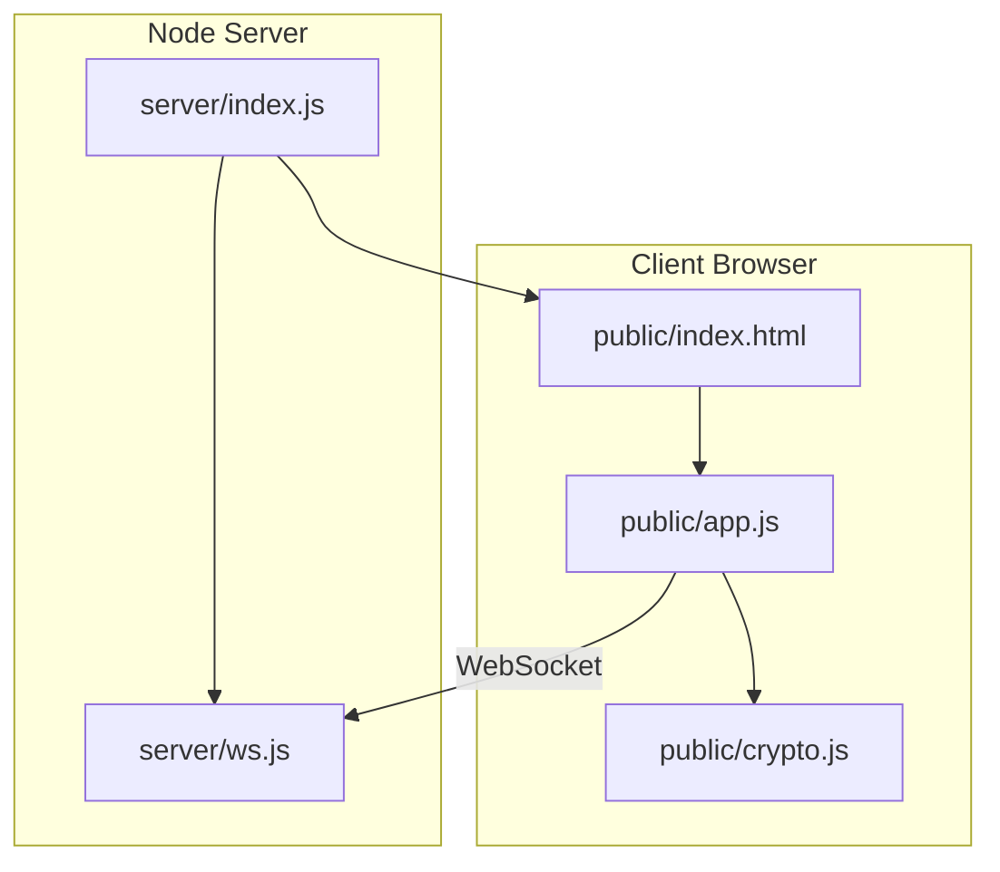
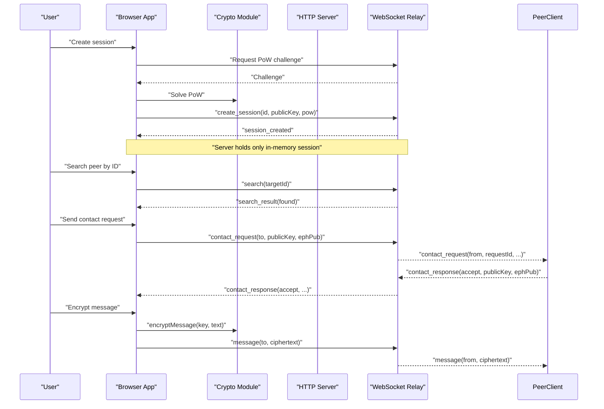
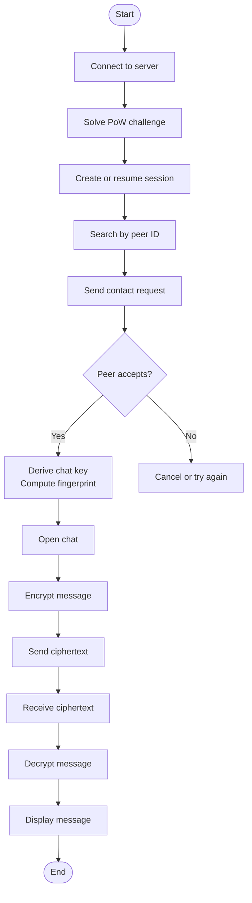
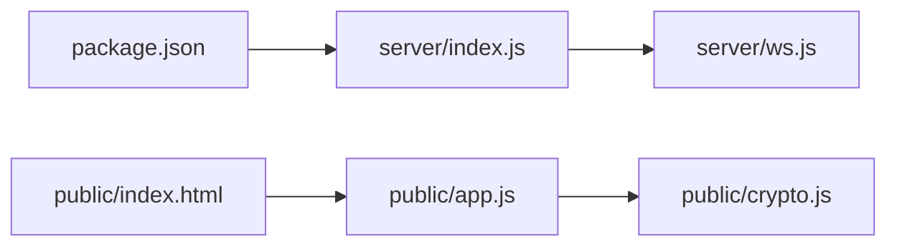

# Project Overview

<cite>
**Referenced Files in This Document**
- [package.json](file://package.json)
- [server/index.js](file://server/index.js)
- [server/ws.js](file://server/ws.js)
- [public/index.html](file://public/index.html)
- [public/app.js](file://public/app.js)
- [public/crypto.js](file://public/crypto.js)
</cite>

## Table of Contents
1. [Introduction](#introduction)
2. [Project Structure](#project-structure)
3. [Core Components](#core-components)
4. [Architecture Overview](#architecture-overview)
5. [Detailed Component Analysis](#detailed-component-analysis)
6. [Dependency Analysis](#dependency-analysis)
7. [Performance Considerations](#performance-considerations)
8. [Troubleshooting Guide](#troubleshooting-guide)
9. [Conclusion](#conclusion)

## Introduction
Shh V1.0 is a privacy-first, anonymous, real-time end-to-end encrypted messaging application. Its design centers on three principles:
- Privacy-first architecture: no database, no persistent logs, and no data written to disk by the server. All runtime state lives in memory.
- Zero data persistence: closing a browser tab or reconnecting clears all local chat state; the server does not store messages or identity material.
- End-to-end encryption: clients perform all cryptographic operations locally. The server only relays opaque ciphertext between peers.

The application targets privacy-conscious users who want anonymous conversations and developers seeking a minimal secure messaging reference implementation. Typical use cases include private peer-to-peer chats where participants exchange identities out-of-band and verify security via fingerprint comparison.

Key terminology used throughout this project:
- Session: a client connection bound to an identity and public key.
- Identity: a long-lived asymmetric keypair generated per session.
- Peer: another connected user identified by their session id.
- Chat: a one-to-one relationship established after a contact request is accepted.

## Project Structure
The repository follows a simple client-server layout:
- Server-side Node.js application serving static assets and handling WebSocket upgrades.
- Client-side web application implementing UI, WebSocket protocol, and cryptography.

**Diagram sources**
- [public/index.html:1-106](file://public/index.html#L1-L106)
- [public/app.js:1-624](file://public/app.js#L1-L624)
- [public/crypto.js:1-242](file://public/crypto.js#L1-L242)
- [server/index.js:1-116](file://server/index.js#L1-L116)
- [server/ws.js:1-313](file://server/ws.js#L1-L313)

**Section sources**
- [package.json:1-19](file://package.json#L1-L19)
- [server/index.js:1-116](file://server/index.js#L1-L116)
- [public/index.html:1-106](file://public/index.html#L1-L106)

## Core Components
This section summarizes the main building blocks and responsibilities.

- Server entrypoint (HTTP + WebSocket):
  - Serves static files from the public directory with strict Content-Security-Policy and other security headers.
  - Accepts WebSocket upgrades without logging IPs or connection metadata.
  - Delegates message routing to the WebSocket handler.

- WebSocket relay:
  - Maintains in-memory maps for sessions, connections, and pending contact requests.
  - Enforces rate limits per action using token buckets.
  - Issues and verifies proof-of-work challenges to mitigate spam.
  - Relays only base64-encoded ciphertext; it never sees plaintext or keys.

- Client application:
  - Manages WebSocket lifecycle, UI state, and user interactions.
  - Implements search, contact request/response flow, and chat management.
  - Performs all encryption/decryption locally and exposes a fingerprint for manual verification.

- Cryptography module:
  - Generates identity and ephemeral keypairs.
  - Derives per-chat AES-256-GCM keys via ECDH and HKDF.
  - Encrypts and decrypts messages with unique nonces.
  - Computes human-checkable fingerprints to detect man-in-the-middle attempts.

**Section sources**
- [server/index.js:24-89](file://server/index.js#L24-L89)
- [server/ws.js:1-313](file://server/ws.js#L1-L313)
- [public/app.js:1-624](file://public/app.js#L1-L624)
- [public/crypto.js:1-242](file://public/crypto.js#L1-L242)

## Architecture Overview
At a high level, Shh uses a minimal client-server model:
- Clients connect over WebSocket to the server.
- The server authenticates sessions via proof-of-work and maintains ephemeral presence.
- Peers discover each other by exchanging short identifiers and establishing a chat through a contact request workflow.
- Messages are encrypted client-side and relayed as ciphertext; the server never stores them.

**Diagram sources**
- [public/app.js:99-176](file://public/app.js#L99-L176)
- [public/app.js:227-322](file://public/app.js#L227-L322)
- [public/app.js:324-359](file://public/app.js#L324-L359)
- [server/ws.js:93-105](file://server/ws.js#L93-L105)
- [server/ws.js:150-179](file://server/ws.js#L150-L179)
- [server/ws.js:181-240](file://server/ws.js#L181-L240)

## Detailed Component Analysis

### Server Entry Point (HTTP + Security Headers + Static Serving)
Responsibilities:
- Serve static assets from the public directory with safe path normalization.
- Apply strict security headers including CSP, HSTS, frame protection, and referrer policy.
- Upgrade HTTP connections to WebSocket and forward frames to the relay.

Security highlights:
- No request/connection logging beyond minimal boot output.
- Strict CSP restricts external resources and enforces same-origin communication.
- Cache-Control set to no-store to ensure clients always load fresh crypto code.

Operational notes:
- Uses a single dependency (ws) for WebSocket support.
- Runs on Node.js 18+ and defaults to port 3000 unless configured via environment variable.

**Section sources**
- [server/index.js:1-116](file://server/index.js#L1-L116)
- [package.json:1-19](file://package.json#L1-L19)

### WebSocket Relay (Session, Presence, Rate Limits, Proof-of-Work)
Responsibilities:
- Maintain in-memory maps for sessions, sockets, and pending contact requests.
- Issue and verify proof-of-work challenges to prevent abuse.
- Enforce per-action rate limits using token buckets.
- Route messages and presence events between peers.

Key behaviors:
- Sessions are created with a validated id and public key; reconnection within a grace window resumes the same session if keys match.
- Search returns only online presence information for a target id.
- Contact requests carry ephemeral public keys; acceptance establishes adjacency metadata only.
- Message relay validates payload size and forwards ciphertext; offline peers receive no queued messages.

Privacy guarantees:
- No IP storage, no logs, no disk writes, no message persistence.
- All state is pruned when sessions disconnect or expire.

**Section sources**
- [server/ws.js:1-313](file://server/ws.js#L1-L313)

### Client Application (UI, Protocol, Chat Management)
Responsibilities:
- Manage WebSocket lifecycle, automatic reconnection, and graceful logout.
- Drive the UI for profile display, search, contact requests, chat list, and message composer.
- Implement the full contact request/response flow and chat lifecycle.

Protocol flow:
- On connect, request a PoW challenge, solve it, and create or resume a session.
- Search for peers by id and initiate contact requests with ephemeral keys.
- Handle incoming requests, derive per-chat keys, compute fingerprints, and open chats.
- Encrypt outgoing messages and decrypt incoming ones; update unread counts and presence indicators.

Data handling:
- All chat state is in-memory; closing the tab resets everything.
- Profile identifiers and keys can be masked/unmasked in the UI.

**Section sources**
- [public/app.js:1-624](file://public/app.js#L1-L624)
- [public/index.html:1-106](file://public/index.html#L1-L106)

### Cryptography Module (Identity, Ephemeral Keys, AES-256-GCM, Fingerprint)
Responsibilities:
- Generate identity and per-chat ephemeral keypairs.
- Negotiate curve support (X25519 preferred, P-256 fallback).
- Derive per-chat shared secrets using ECDH and HKDF.
- Encrypt/decrypt messages with AES-256-GCM and unique nonces.
- Compute human-readable fingerprints for manual verification.

Design highlights:
- Forward secrecy: each chat uses a fresh ephemeral keypair.
- Order-independent salt construction ensures both sides derive the same key.
- Compact SHA-256 implementation supports efficient PoW solving in the browser.

**Section sources**
- [public/crypto.js:1-242](file://public/crypto.js#L1-L242)

### Conceptual Overview
For beginners, think of Shh as a private chat room that leaves no traces:
- You generate a random identifier and share it with your peer.
- Both sides prove they are not bots by solving a small computational puzzle.
- After accepting a contact request, you establish a secure chat.
- Every message is encrypted on your device and decrypted on the peer’s device.
- If you close the app, all conversation history disappears.

For experienced developers, Shh demonstrates:
- Minimal server footprint with in-memory state and no persistence.
- Strict security headers and CSP to minimize attack surface.
- A clean separation between transport (WebSocket relay) and cryptography (client-only).
- Practical anti-abuse mechanisms (PoW, rate limiting) without compromising privacy.

[No sources needed since this diagram shows conceptual workflow, not actual code structure]

## Dependency Analysis
High-level dependencies:
- package.json declares ws as the sole runtime dependency.
- server/index.js depends on ws and delegates to server/ws.js.
- public/app.js imports functions from public/crypto.js.
- public/index.html loads public/app.js as the client entry point.

**Diagram sources**
- [package.json:1-19](file://package.json#L1-L19)
- [server/index.js:1-116](file://server/index.js#L1-L116)
- [server/ws.js:1-313](file://server/ws.js#L1-L313)
- [public/index.html:1-106](file://public/index.html#L1-L106)
- [public/app.js:1-624](file://public/app.js#L1-L624)
- [public/crypto.js:1-242](file://public/crypto.js#L1-L242)

**Section sources**
- [package.json:1-19](file://package.json#L1-L19)
- [server/index.js:1-116](file://server/index.js#L1-L116)
- [public/app.js:1-624](file://public/app.js#L1-L624)
- [public/crypto.js:1-242](file://public/crypto.js#L1-L242)

## Performance Considerations
- In-memory only: fast lookups via Maps and Sets; no I/O latency for state.
- WebSocket payload cap: hard limit prevents oversized messages from consuming resources.
- Token-bucket rate limiting: smooths bursts while allowing normal usage patterns.
- Proof-of-work difficulty: configurable to balance usability and anti-spam effectiveness.
- Client-side crypto: offloads heavy operations to the browser; UI remains responsive by yielding during PoW computation.

[No sources needed since this section provides general guidance]

## Troubleshooting Guide
Common issues and resolutions:
- Rate-limited errors:
  - Occur when too many searches, contact requests, messages, or session creations are attempted quickly.
  - Resolution: wait briefly and retry; reduce automation frequency.

- Too-large messages:
  - Plaintext exceeds the 2 KB limit before encryption.
  - Resolution: shorten messages or split content into multiple messages.

- Session creation failures:
  - May happen due to invalid identifiers, mismatched keys, or failed proof-of-work.
  - Resolution: regenerate identifiers, ensure consistent keys on reconnect, and allow time for PoW solving.

- Offline peers:
  - Messages are not queued; if the peer is offline, delivery fails immediately.
  - Resolution: ensure the peer is connected before sending.

- Browser compatibility:
  - Some environments may lack required Web Crypto curves (X25519/P-256).
  - Resolution: use a modern browser; the app detects supported curves and informs the user.

**Section sources**
- [public/app.js:178-193](file://public/app.js#L178-L193)
- [public/app.js:344-359](file://public/app.js#L344-L359)
- [public/app.js:559-575](file://public/app.js#L559-L575)
- [server/ws.js:150-179](file://server/ws.js#L150-L179)
- [server/ws.js:231-240](file://server/ws.js#L231-L240)

## Conclusion
Shh V1.0 delivers a compact, privacy-preserving messaging experience by combining:
- Anonymous identity discovery via short identifiers.
- Strong end-to-end encryption performed entirely in the client.
- A minimalist server that relays ciphertext without storing any sensitive data.
- Anti-abuse controls such as proof-of-work and rate limiting.

It is well-suited for users who value anonymity and confidentiality, and for developers exploring secure, zero-persistence messaging architectures. By keeping the system simple and transparent, Shh makes strong privacy properties accessible and understandable.

[No sources needed since this section summarizes without analyzing specific files]