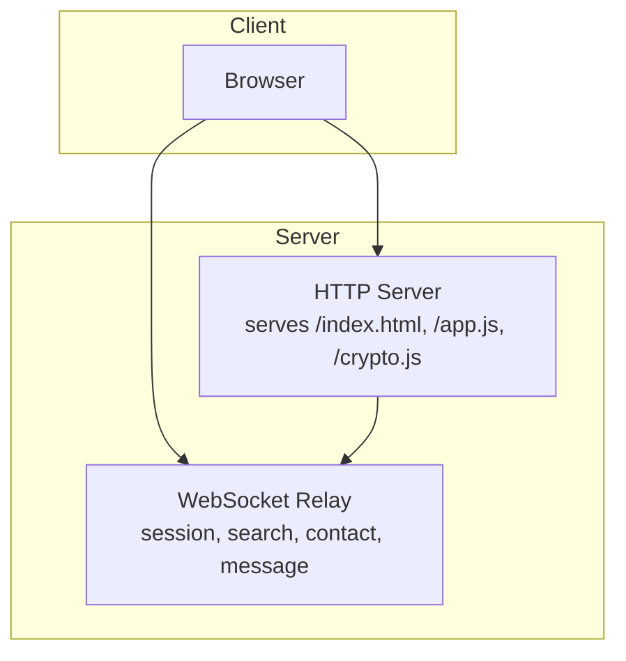
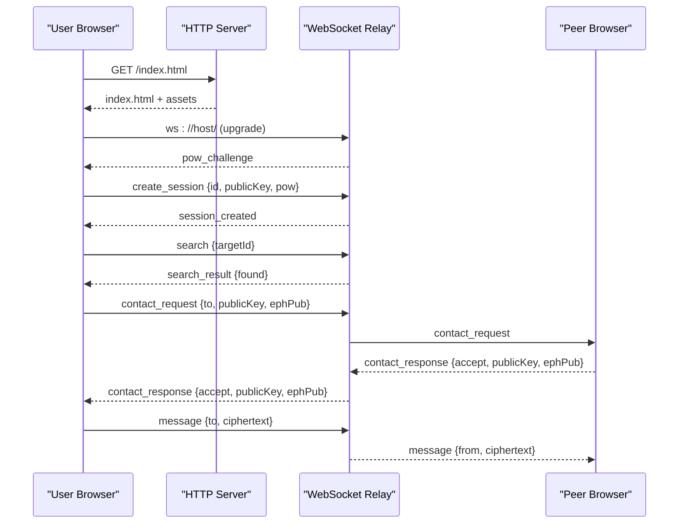
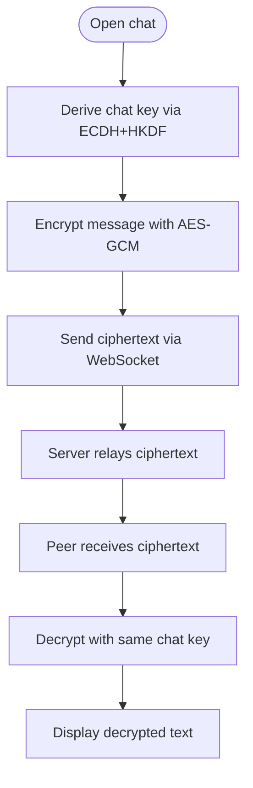
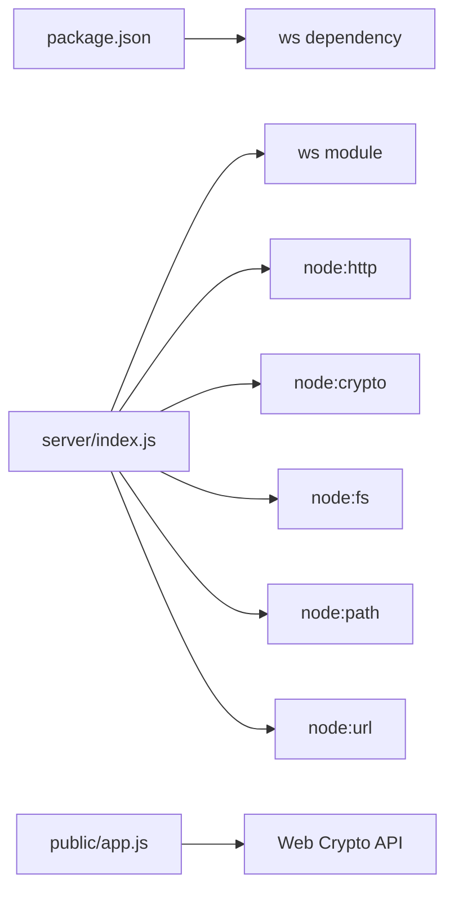

# Quick Start Guide

<cite>
**Referenced Files in This Document**
- [package.json](file://package.json)
- [server/index.js](file://server/index.js)
- [server/ws.js](file://server/ws.js)
- [public/index.html](file://public/index.html)
- [public/app.js](file://public/app.js)
- [public/crypto.js](file://public/crypto.js)
</cite>

## Table of Contents
1. Introduction
2. Project Structure
3. Core Components
4. Architecture Overview
5. Detailed Component Analysis
6. Dependency Analysis
7. Performance Considerations
8. Troubleshooting Guide
9. Conclusion

## Introduction
Shh V1.0 is an anonymous, real-time end-to-end encrypted messaging app that runs entirely in memory with no database and no logs. It provides a simple web interface for creating sessions, generating anonymous identities, and sending encrypted messages over WebSockets. The server relays only ciphertext; all encryption and decryption happen in the browser.

This guide helps you set up and run Shh V1.0 quickly, walk through your first conversation, understand the basic messaging flow, and troubleshoot common setup issues.

## Project Structure
Shh V1.0 is organized into a small Node.js server and a static frontend:
- Server: HTTP server serving static assets and upgrading to WebSocket connections; WebSocket relay handling session lifecycle, rate limiting, and message routing.
- Public: HTML/CSS/JS client that handles UI, crypto operations, and WebSocket communication.

**Diagram sources**
- [server/index.js:73-115](file://server/index.js#L73-L115)
- [server/ws.js:258-303](file://server/ws.js#L258-L303)
- [public/index.html:103-103](file://public/index.html#L103-L103)

**Section sources**
- [package.json:1-19](file://package.json#L1-L19)
- [server/index.js:1-116](file://server/index.js#L1-L116)
- [server/ws.js:1-313](file://server/ws.js#L1-L313)
- [public/index.html:1-106](file://public/index.html#L1-L106)
- [public/app.js:1-624](file://public/app.js#L1-L624)
- [public/crypto.js:1-242](file://public/crypto.js#L1-L242)

## Core Components
- Node.js runtime requirement: Node.js >= 18 (enforced by engines field).
- Installation: Use npm or yarn to install dependencies defined in package.json.
- Development server: Run with npm run dev to start with file watching enabled.
- Production server: Run with npm start to start the server without watch mode.
- Default port: 3000 unless overridden by environment variable PORT.

Key scripts and configuration are defined in package.json.

**Section sources**
- [package.json:7-12](file://package.json#L7-L12)
- [server/index.js:111-115](file://server/index.js#L111-L115)

## Architecture Overview
Shh uses a minimal architecture:
- The HTTP server serves the static frontend and sets strict security headers.
- WebSocket connections are upgraded from HTTP and handled by the relay module.
- The relay maintains ephemeral in-memory state for sessions, presence, and chat adjacency.
- All messages are end-to-end encrypted in the browser using ECDH key exchange and AES-GCM.

**Diagram sources**
- [public/app.js:75-120](file://public/app.js#L75-L120)
- [server/ws.js:94-179](file://server/ws.js#L94-L179)
- [server/ws.js:181-240](file://server/ws.js#L181-L240)

## Detailed Component Analysis

### Getting Started and First Usage
- Prerequisites:
  - Node.js version >= 18.
  - A modern browser supporting Web Crypto API with ECDH (X25519 or P-256 fallback).
- Install dependencies:
  - npm install or yarn install.
- Start development server:
  - npm run dev
- Start production server:
  - npm start
- Open the app:
  - Visit http://localhost:3000 (or the configured PORT).
- Create a session:
  - Click “Create session” on the start screen.
  - The client solves a proof-of-work challenge and sends a create_session request.
  - On success, your anonymous ID and public key appear in the profile panel.
- Generate an anonymous identity:
  - Each session generates a fresh X25519 identity in memory; it is not persisted.
- Find a peer:
  - Enter another user’s ID in the search box and press Search.
  - If found, accept the prompt to send a contact request.
- Establish a chat:
  - Both sides exchange ephemeral keys and derive a shared chat key.
  - Compare fingerprints out-of-band to verify authenticity.
- Send your first message:
  - Type a message and click Send. Messages are encrypted in the browser and relayed to the peer.

Expected interactions:
- After creating a session, your avatar dot turns online.
- When searching, you will see a notice prompting you to send a contact request if the peer is online.
- Once accepted, a new chat opens with a system note indicating messages are encrypted and not stored on the server.
- You can copy your ID from the profile panel to share with others.

**Section sources**
- [public/index.html:13-21](file://public/index.html#L13-L21)
- [public/index.html:24-99](file://public/index.html#L24-L99)
- [public/app.js:108-120](file://public/app.js#L108-L120)
- [public/app.js:227-322](file://public/app.js#L227-L322)
- [public/app.js:324-359](file://public/app.js#L324-L359)

### Basic Messaging Workflow
The end-to-end messaging flow ensures confidentiality and forward secrecy:
- Identity and ephemeral keys are generated in the browser.
- Chat keys are derived via ECDH and HKDF; each chat has a fresh ephemeral pair.
- Messages are encrypted with AES-GCM using a unique nonce per message.
- The server never sees plaintext or keys; it only routes base64 ciphertext.

**Diagram sources**
- [public/crypto.js:191-211](file://public/crypto.js#L191-L211)
- [public/crypto.js:223-241](file://public/crypto.js#L223-L241)
- [server/ws.js:231-240](file://server/ws.js#L231-L240)

**Section sources**
- [public/crypto.js:1-11](file://public/crypto.js#L1-L11)
- [public/crypto.js:129-211](file://public/crypto.js#L129-L211)
- [public/crypto.js:223-241](file://public/crypto.js#L223-L241)
- [server/ws.js:231-240](file://server/ws.js#L231-L240)

### Security and Privacy Features
- Strict Content Security Policy and security headers on every response.
- No disk storage, no logs, no IP retention; all state lives in RAM.
- Proof-of-work challenges mitigate abuse during connection and session creation.
- Rate limiting protects against enumeration and spam across search, contact requests, and messages.
- End-to-end encryption ensures only peers can read messages.

**Section sources**
- [server/index.js:24-84](file://server/index.js#L24-L84)
- [server/ws.js:5-21](file://server/ws.js#L5-L21)
- [server/ws.js:36-65](file://server/ws.js#L36-L65)
- [server/ws.js:93-105](file://server/ws.js#L93-L105)

## Dependency Analysis
Shh V1.0 has minimal external dependencies:
- ws: WebSocket server library used by the Node.js server.
- Built-in Node modules: http, crypto, fs, path, url.
- Client-side cryptography relies on the Web Crypto API.

**Diagram sources**
- [package.json:14-16](file://package.json#L14-L16)
- [server/index.js:3-9](file://server/index.js#L3-L9)
- [public/app.js:4-8](file://public/app.js#L4-L8)

**Section sources**
- [package.json:1-19](file://package.json#L1-L19)
- [server/index.js:3-9](file://server/index.js#L3-L9)
- [public/app.js:4-8](file://public/app.js#L4-L8)

## Performance Considerations
- Message size limit: Plaintext is capped at 2 KB; attempts to exceed this are rejected early.
- Payload cap: The server enforces a hard payload size to prevent oversized frames.
- Rate limits: Token buckets protect against brute-force searches, spam contact requests, and message flooding.
- In-memory state: No disk I/O or database queries; performance is dominated by network latency and cryptographic operations.
- Reconnection: Clients reconnect quickly after transient disconnects within a grace window.

Practical tips:
- Keep messages concise to stay under the 2 KB limit.
- Avoid rapid repeated searches or contact requests to respect rate limits.
- Prefer stable networks to minimize reconnections.

**Section sources**
- [public/crypto.js:14-14](file://public/crypto.js#L14-L14)
- [public/app.js:344-359](file://public/app.js#L344-L359)
- [server/ws.js:5-21](file://server/ws.js#L5-L21)
- [server/ws.js:111-120](file://server/ws.js#L111-L120)
- [server/ws.js:133-148](file://server/ws.js#L133-L148)

## Troubleshooting Guide
Common setup issues and resolutions:

- Port conflicts:
  - Symptom: Server fails to bind to port 3000.
  - Resolution: Set the PORT environment variable to an available port before starting the server.
  - Reference: The server reads PORT from the environment and defaults to 3000.

- Node.js version compatibility:
  - Symptom: Errors related to unsupported features or engines mismatch.
  - Resolution: Ensure Node.js >= 18 is installed.
  - Reference: Engines field specifies minimum Node version.

- Browser security restrictions:
  - Symptom: WebSockets fail or content blocked due to CSP.
  - Resolution: Access the app via localhost or HTTPS; ensure your environment allows same-origin resources and WebSocket upgrades.
  - Reference: Strict CSP permits same-origin assets and ws/wss connections.

- Missing or unsupported cryptography:
  - Symptom: “Create session” button disabled with a hint about ECDH support.
  - Resolution: Use a modern browser that supports Web Crypto ECDH (X25519 or P-256 fallback).
  - Reference: Client detects curve support and disables actions if unavailable.

- Rate limiting errors:
  - Symptom: Toasts indicating too many searches, contact requests, or messages.
  - Resolution: Wait for the token bucket to refill; reduce frequency of actions.
  - Reference: Server enforces per-action rate limits and returns specific error codes.

- Too-large messages:
  - Symptom: Error toast when attempting to send large messages.
  - Resolution: Keep messages under 2 KB.
  - Reference: Client checks size before encrypting and sending.

- Offline peers:
  - Symptom: Contact request fails because the target is offline.
  - Resolution: Ensure both peers are connected; there is no store-and-forward for messages.
  - Reference: Server responds with offline reason and does not queue messages.

**Section sources**
- [server/index.js:111-115](file://server/index.js#L111-L115)
- [package.json:7-9](file://package.json#L7-L9)
- [server/index.js:24-84](file://server/index.js#L24-L84)
- [public/app.js:559-575](file://public/app.js#L559-L575)
- [public/app.js:178-193](file://public/app.js#L178-L193)
- [public/app.js:344-359](file://public/app.js#L344-L359)
- [server/ws.js:181-240](file://server/ws.js#L181-L240)

## Conclusion
You now have everything needed to set up Shh V1.0, run it locally, and send your first encrypted message. Remember that Shh keeps no logs and stores nothing on disk; all state is ephemeral. For best results, use a modern browser, keep messages under the size limit, and respect rate limits. If you encounter issues, consult the troubleshooting section for quick fixes.