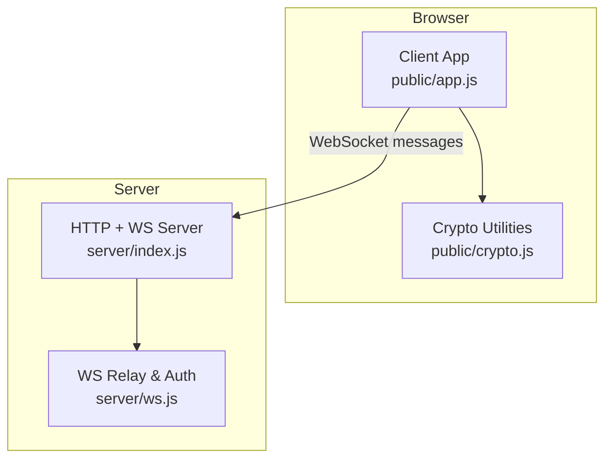
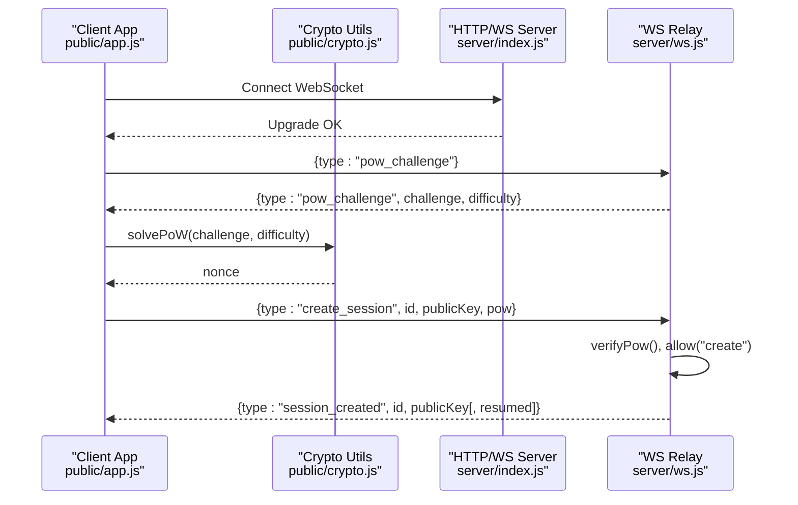
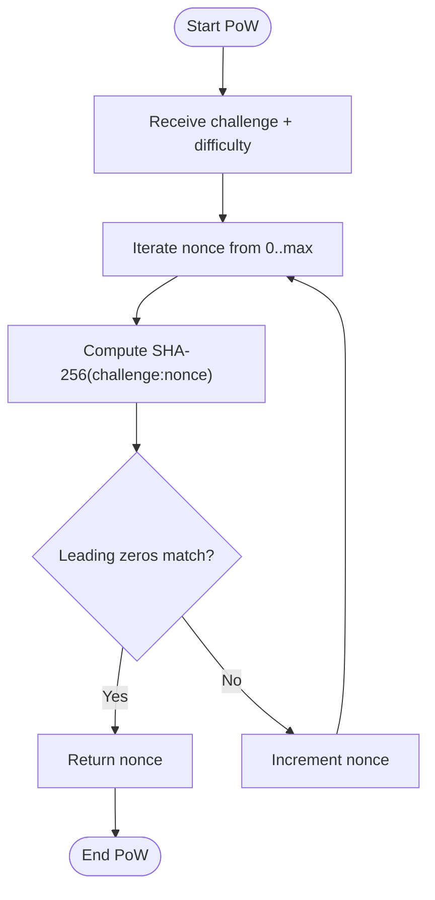
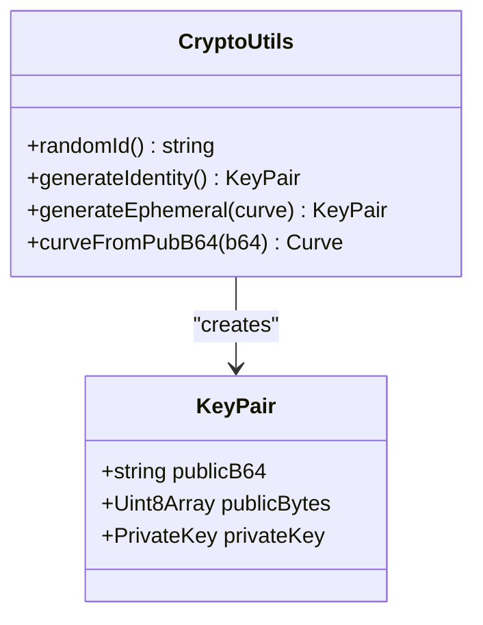
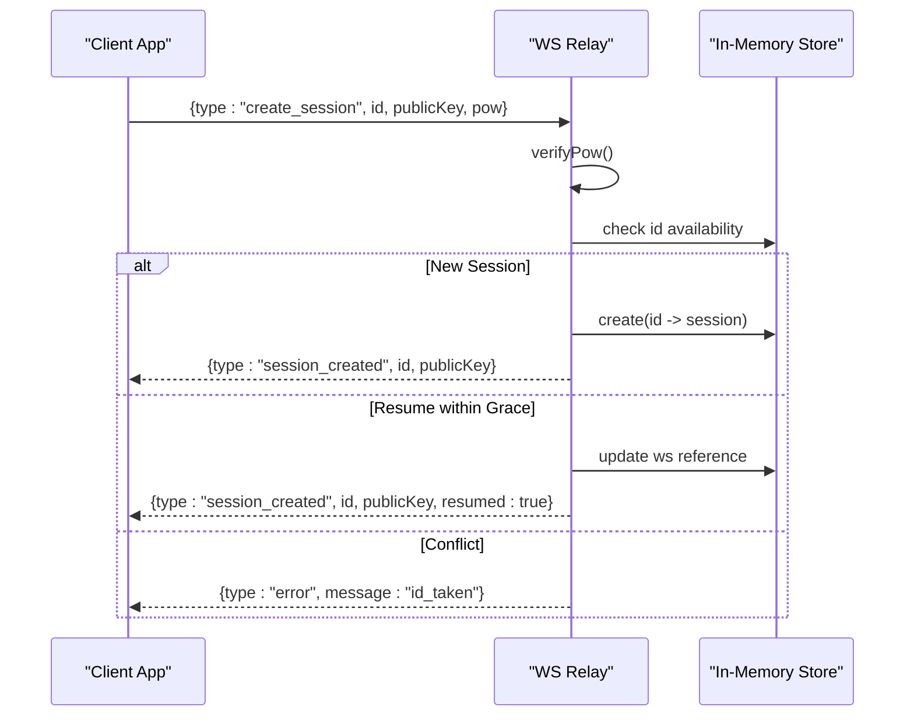
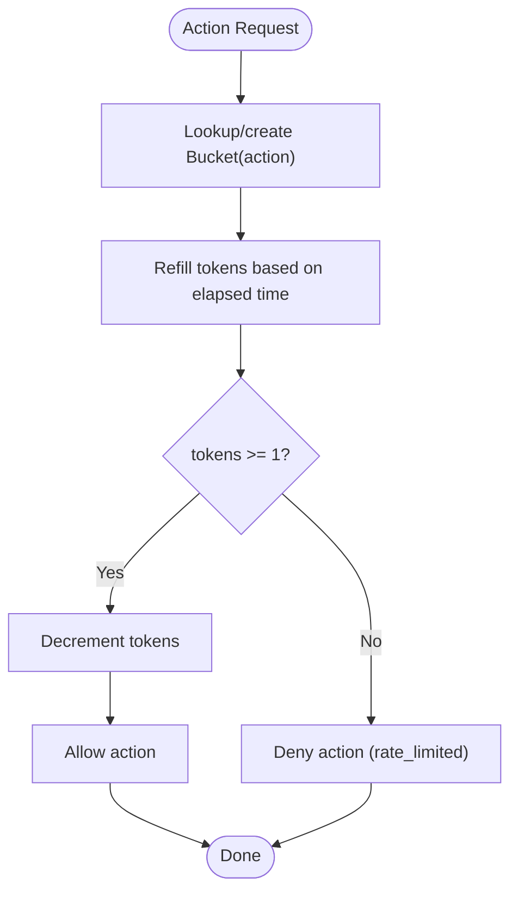
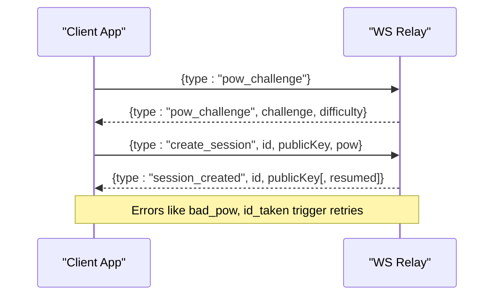
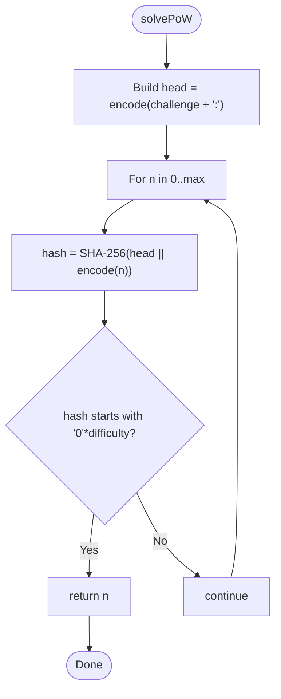
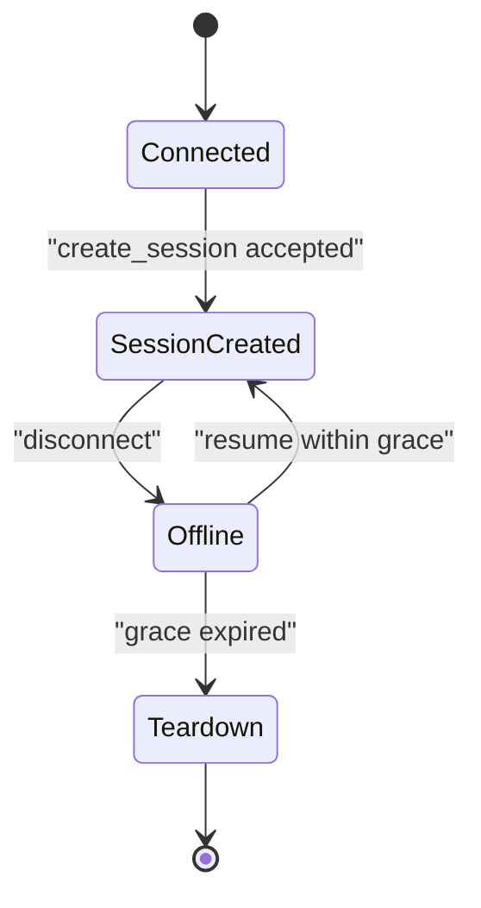
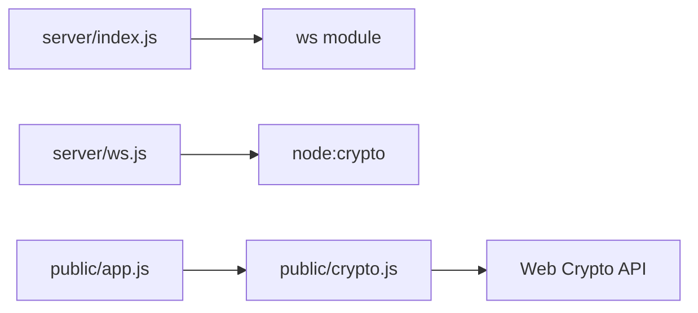

# Authentication System

<cite>
**Referenced Files in This Document**
- [server/index.js](file://server/index.js)
- [server/ws.js](file://server/ws.js)
- [public/app.js](file://public/app.js)
- [public/crypto.js](file://public/crypto.js)
- [package.json](file://package.json)
</cite>

## Table of Contents
1. [Introduction](#introduction)
2. [Project Structure](#project-structure)
3. [Core Components](#core-components)
4. [Architecture Overview](#architecture-overview)
5. [Detailed Component Analysis](#detailed-component-analysis)
6. [Dependency Analysis](#dependency-analysis)
7. [Performance Considerations](#performance-considerations)
8. [Troubleshooting Guide](#troubleshooting-guide)
9. [Conclusion](#conclusion)

## Introduction
This document explains Shh’s anonymous authentication system, focusing on how clients prove computational work before establishing a session and performing actions. It covers:
- The challenge-response proof-of-work (PoW) mechanism that requires clients to find a hash with specific leading zeros.
- The base32 identity generation process for anonymous users.
- The full session management flow: connection establishment, PoW verification, and session creation or resumption.
- Rate limiting using token buckets per action type to prevent abuse.
- Security implications of the anonymous design and privacy protections against spam and abuse.

The server is intentionally stateless beyond RAM, stores no logs, and never sees plaintext or keys. All cryptographic operations occur in the browser.

## Project Structure
Shh consists of a Node HTTP + WebSocket server and a browser client:
- Server:
  - Static file serving with strict security headers.
  - WebSocket upgrade handling and relay logic.
  - In-memory session store, rate limiters, and PoW verifier.
- Client:
  - UI and WebSocket protocol handler.
  - Cryptographic utilities including PoW solver, key generation, and message encryption.

**Diagram sources**
- [server/index.js:73-109](file://server/index.js#L73-L109)
- [server/ws.js:258-312](file://server/ws.js#L258-L312)
- [public/app.js:74-120](file://public/app.js#L74-L120)
- [public/crypto.js:113-127](file://public/crypto.js#L113-L127)

**Section sources**
- [server/index.js:1-116](file://server/index.js#L1-L116)
- [server/ws.js:1-313](file://server/ws.js#L1-L313)
- [public/app.js:1-624](file://public/app.js#L1-L624)
- [public/crypto.js:1-242](file://public/crypto.js#L1-L242)
- [package.json:1-19](file://package.json#L1-L19)

## Core Components
- Proof-of-Work Challenge and Verification:
  - Server issues a random challenge and difficulty; client must find a nonce such that SHA-256(challenge:nonce) starts with a number of leading hex zeros equal to the difficulty.
  - Nonce range is bounded to limit brute-force work per attempt.
- Identity Generation:
  - Clients generate a cryptographically random base32 identifier of 12–16 characters for anonymity.
  - Each session also creates an X25519 (or P-256 fallback) identity keypair used for ECDH-based chat key derivation.
- Session Management:
  - After PoW completion, client sends create_session with id, public key, and PoW solution.
  - Server validates PoW, checks rate limits, ensures uniqueness, and either creates a new session or resumes within a grace window.
- Rate Limiting:
  - Token bucket algorithm per action type (search, contact, message, create).
  - Prevents enumeration, spam, and flooding by limiting burst and steady-state rates.

**Section sources**
- [server/ws.js:5-21](file://server/ws.js#L5-L21)
- [server/ws.js:93-105](file://server/ws.js#L93-L105)
- [public/crypto.js:39-45](file://public/crypto.js#L39-L45)
- [public/crypto.js:113-127](file://public/crypto.js#L113-L127)
- [server/ws.js:150-179](file://server/ws.js#L150-L179)
- [server/ws.js:36-65](file://server/ws.js#L36-L65)

## Architecture Overview
The authentication handshake and session lifecycle involve coordinated steps between client and server:

**Diagram sources**
- [public/app.js:74-120](file://public/app.js#L74-L120)
- [public/crypto.js:113-127](file://public/crypto.js#L113-L127)
- [server/ws.js:93-105](file://server/ws.js#L93-L105)
- [server/ws.js:150-179](file://server/ws.js#L150-L179)

## Detailed Component Analysis

### Proof-of-Work Mechanism
- Challenge Issuance:
  - Server generates a random 16-byte challenge and sends it to the client along with a difficulty parameter indicating the required number of leading zero hex digits.
- Client Solver:
  - Client iterates nonces from 0 up to a maximum bound, computing SHA-256(challenge:nonce) until the digest begins with the required prefix.
  - The solver yields to the event loop periodically to keep the UI responsive.
- Server Verification:
  - Server verifies that the nonce is within bounds and that SHA-256(challenge:nonce) matches the expected prefix.
  - The challenge is single-use; after successful verification, the stored challenge is cleared.

**Diagram sources**
- [public/crypto.js:113-127](file://public/crypto.js#L113-L127)
- [server/ws.js:93-105](file://server/ws.js#L93-L105)

**Section sources**
- [server/ws.js:5-8](file://server/ws.js#L5-L8)
- [server/ws.js:93-105](file://server/ws.js#L93-L105)
- [public/crypto.js:113-127](file://public/crypto.js#L113-L127)

### Base32 Identity Generation
- Random Identifier:
  - Clients generate a 12-character base32 string using cryptographically secure randomness.
  - The character set excludes ambiguous symbols to improve readability and reduce errors when sharing IDs.
- Identity Key Pair:
  - Each session creates an ECDH key pair (X25519 preferred, P-256 fallback) for deriving per-chat keys.
  - Public key length determines curve negotiation without extra signaling.

**Diagram sources**
- [public/crypto.js:39-45](file://public/crypto.js#L39-L45)
- [public/crypto.js:159-172](file://public/crypto.js#L159-L172)
- [public/crypto.js:174-180](file://public/crypto.js#L174-L180)

**Section sources**
- [public/crypto.js:39-45](file://public/crypto.js#L39-L45)
- [public/crypto.js:159-172](file://public/crypto.js#L159-L172)
- [public/crypto.js:174-180](file://public/crypto.js#L174-L180)

### Session Management Flow
- Connection Establishment:
  - Client connects via WebSocket and requests a PoW challenge.
- PoW Verification:
  - Client solves the challenge and submits create_session with id, publicKey, and pow.
  - Server validates PoW, checks rate limits, and enforces constraints (id format, key validity).
- Session Creation or Resumption:
  - If the id is taken and not within the grace window, or if the public key mismatches, the server rejects the request.
  - Within the grace window, the server resumes the existing session and notifies peers.
- Presence and Peers:
  - On disconnect, the server marks the peer offline and informs other peers.
  - A short grace period allows reconnection without losing the session identity.

**Diagram sources**
- [server/ws.js:150-179](file://server/ws.js#L150-L179)
- [server/ws.js:133-148](file://server/ws.js#L133-L148)

**Section sources**
- [server/ws.js:150-179](file://server/ws.js#L150-L179)
- [server/ws.js:133-148](file://server/ws.js#L133-L148)
- [public/app.js:108-120](file://public/app.js#L108-L120)

### Rate Limiting Implementation
- Token Bucket Algorithm:
  - Each action type has a capacity and refill rate configured in LIMITS.
  - Per connection, a map of buckets tracks tokens for each action.
  - Tokens are refilled proportionally to elapsed time; taking a token decrements the count.
- Action-Specific Limits:
  - search: prevents ID enumeration.
  - contact: prevents spam requests.
  - message: controls message throughput.
  - create: limits session creation attempts.

**Diagram sources**
- [server/ws.js:36-65](file://server/ws.js#L36-L65)

**Section sources**
- [server/ws.js:15-21](file://server/ws.js#L15-L21)
- [server/ws.js:36-65](file://server/ws.js#L36-L65)

### Authentication Handshake Example
- Step-by-step:
  1. Client connects and requests a PoW challenge.
  2. Server responds with challenge and difficulty.
  3. Client computes nonce and sends create_session with id, publicKey, and pow.
  4. Server verifies PoW and returns session_created (possibly resumed).
- Error Handling:
  - If PoW fails or id is taken, client receives error messages and can retry with a new id or wait for rate limits to reset.

**Diagram sources**
- [public/app.js:99-120](file://public/app.js#L99-L120)
- [server/ws.js:93-105](file://server/ws.js#L93-L105)
- [server/ws.js:150-179](file://server/ws.js#L150-L179)

### PoW Calculation Example
- Client-side:
  - Iterates nonces up to a maximum bound, computing SHA-256(challenge:nonce) until the digest starts with the required number of leading zeros.
  - Yields control periodically to avoid blocking the UI thread.
- Server-side:
  - Validates nonce bounds and checks the digest prefix.

**Diagram sources**
- [public/crypto.js:113-127](file://public/crypto.js#L113-L127)
- [server/ws.js:100-105](file://server/ws.js#L100-L105)

### Session State Management Example
- Server maintains:
  - byId: mapping from id to session object.
  - bySocket: mapping from WebSocket to connection context.
  - requests: pending contact requests with expiry.
- Grace Period:
  - On disconnect, the server sets a timer to teardown the session after a grace window if not resumed.
  - During this window, reconnections can resume the same id if the public key matches.

**Diagram sources**
- [server/ws.js:133-148](file://server/ws.js#L133-L148)
- [server/ws.js:150-179](file://server/ws.js#L150-L179)

**Section sources**
- [server/ws.js:23-27](file://server/ws.js#L23-L27)
- [server/ws.js:133-148](file://server/ws.js#L133-L148)
- [server/ws.js:150-179](file://server/ws.js#L150-L179)

## Dependency Analysis
- Server Dependencies:
  - Uses Node built-ins for HTTP, crypto, filesystem, path, URL.
  - Depends on ws for WebSocket server functionality.
- Client Dependencies:
  - Relies on Web Crypto API for ECDH, AES-GCM, HKDF, and SHA-256.
  - Implements a compact synchronous SHA-256 for PoW solving to avoid overhead.

**Diagram sources**
- [server/index.js:3-9](file://server/index.js#L3-L9)
- [server/ws.js:3](file://server/ws.js#L3)
- [public/app.js:4-8](file://public/app.js#L4-L8)
- [public/crypto.js:1-11](file://public/crypto.js#L1-L11)

**Section sources**
- [server/index.js:3-9](file://server/index.js#L3-L9)
- [server/ws.js:3](file://server/ws.js#L3)
- [public/app.js:4-8](file://public/app.js#L4-L8)
- [public/crypto.js:1-11](file://public/crypto.js#L1-L11)
- [package.json:14-16](file://package.json#L14-L16)

## Performance Considerations
- PoW Solver Responsiveness:
  - The client solver yields to the event loop every few iterations to keep the UI responsive during computation.
- Message Size Limits:
  - Plaintext capped at 2 KB; ciphertext includes IV and tag, with additional slack validated server-side.
- Rate Limits Tuning:
  - Adjust capacities and refill rates per action to balance usability and protection against abuse.
- Memory Usage:
  - All state is in RAM; sessions and buckets are lightweight objects. No persistence means lower storage overhead but transient state.

[No sources needed since this section provides general guidance]

## Troubleshooting Guide
- Common Errors:
  - bad_pow: PoW solution invalid; client should retry with a fresh challenge.
  - id_taken: Identity already in use outside grace window or key mismatch; generate a new id.
  - too_large: Message exceeds size limit; compress or shorten content.
  - rate_limited:*: Too many requests for a given action; wait for token refill.
- Debugging Steps:
  - Verify PoW parameters (challenge, difficulty, nonce bounds).
  - Ensure base32 id format and public key lengths are valid.
  - Monitor rate limit tokens per action to understand throttling behavior.

**Section sources**
- [public/app.js:178-193](file://public/app.js#L178-L193)
- [server/ws.js:89-91](file://server/ws.js#L89-L91)
- [server/ws.js:150-179](file://server/ws.js#L150-L179)

## Conclusion
Shh’s authentication system combines a client-side proof-of-work challenge with anonymous base32 identities and ephemeral ECDH keys to provide privacy-preserving, real-time messaging. The server acts as a minimal relay, enforcing PoW validation, rate limits, and presence semantics while storing no sensitive data. This design protects user privacy, mitigates spam and enumeration attacks, and keeps the system simple and efficient.

[No sources needed since this section summarizes without analyzing specific files]