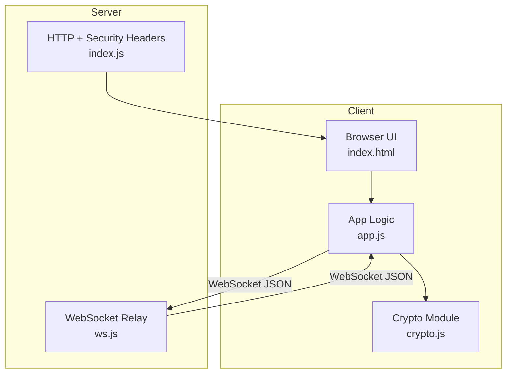
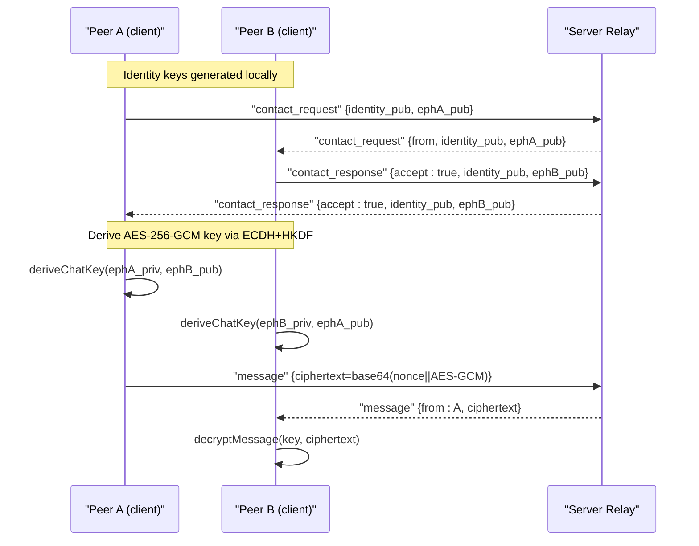
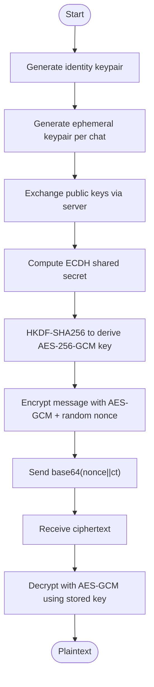
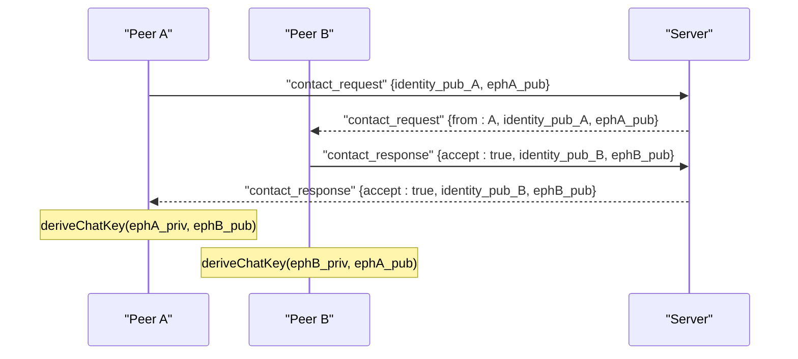
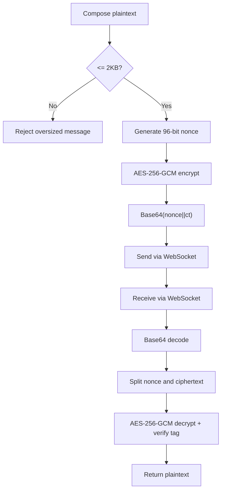
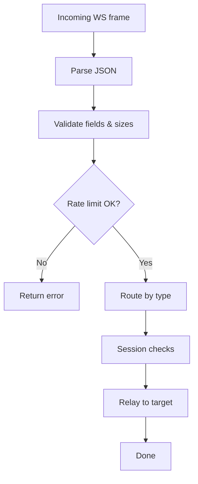
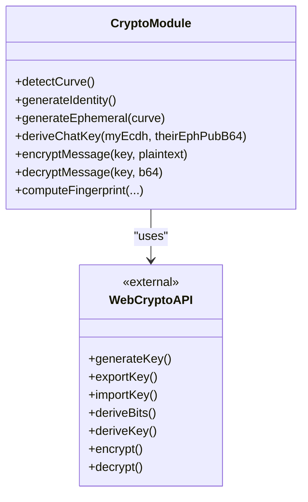
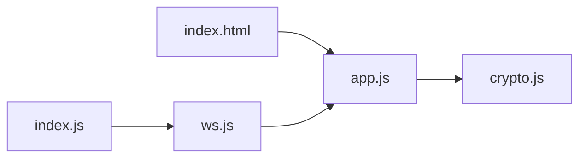

# End-to-End Encryption

<cite>
**Referenced Files in This Document**
- [crypto.js](file://public/crypto.js)
- [app.js](file://public/app.js)
- [ws.js](file://server/ws.js)
- [index.js](file://server/index.js)
- [index.html](file://public/index.html)
</cite>

## Table of Contents
1. [Introduction](#introduction)
2. [Project Structure](#project-structure)
3. [Core Components](#core-components)
4. [Architecture Overview](#architecture-overview)
5. [Detailed Component Analysis](#detailed-component-analysis)
6. [Dependency Analysis](#dependency-analysis)
7. [Performance Considerations](#performance-considerations)
8. [Troubleshooting Guide](#troubleshooting-guide)
9. [Conclusion](#conclusion)

## Introduction
This document explains the end-to-end encryption (E2EE) implementation in Shh V1.0. The system uses:
- X25519/ECDH for key exchange with optional P-256 fallback
- HKDF-SHA256 to derive per-chat AES-256-GCM keys
- AES-256-GCM with a fresh 96-bit nonce per message
- Forward secrecy via ephemeral per-chat keypairs
- A fingerprint mechanism for out-of-band verification
- A server that relays only opaque ciphertext and never sees plaintext or keys

The cryptographic logic runs entirely in the browser using the Web Crypto API. The server is a stateful, in-memory relay with rate limiting and proof-of-work challenges.

## Project Structure
Shh V1.0 consists of a client-side application and a minimal Node.js server:
- Client (public/): UI, WebSocket integration, and all cryptography
- Server (server/): HTTP static server, security headers, WebSocket relay, rate limiting, and session management

**Diagram sources**
- [index.html:1-106](file://public/index.html#L1-L106)
- [app.js:1-624](file://public/app.js#L1-L624)
- [crypto.js:1-242](file://public/crypto.js#L1-L242)
- [index.js:1-116](file://server/index.js#L1-L116)
- [ws.js:1-313](file://server/ws.js#L1-L313)

**Section sources**
- [index.html:1-106](file://public/index.html#L1-L106)
- [index.js:1-116](file://server/index.js#L1-L116)

## Core Components
- crypto.js: Implements ECDH key generation, curve negotiation, shared secret derivation, AES-256-GCM encryption/decryption, fingerprinting, and PoW helper.
- app.js: Orchestrates WebSocket lifecycle, contact requests, chat setup, message send/receive, and UI state.
- ws.js: Validates inputs, enforces rate limits, manages sessions, and relays messages without accessing content.
- index.js: Serves static assets, sets strict security headers, upgrades to WebSocket, and wires the relay.

Key responsibilities:
- Key material and algorithms: crypto.js
- Protocol flow and UI: app.js
- Relay and policy enforcement: ws.js
- Transport and hardening: index.js

**Section sources**
- [crypto.js:1-242](file://public/crypto.js#L1-L242)
- [app.js:1-624](file://public/app.js#L1-L624)
- [ws.js:1-313](file://server/ws.js#L1-L313)
- [index.js:1-116](file://server/index.js#L1-L116)

## Architecture Overview
The E2EE workflow combines asymmetric key exchange and symmetric encryption:
1. Each peer generates an identity X25519 keypair once per session.
2. For each chat, both peers generate fresh ephemeral X25519 keypairs.
3. Peers exchange public keys over the server relay.
4. Both sides compute the same shared secret via ECDH and derive an AES-256-GCM key using HKDF-SHA256 with a deterministic salt from sorted ephemeral public keys.
5. Messages are encrypted with AES-256-GCM using a unique 96-bit nonce per message; the nonce is prepended to the ciphertext before transmission.
6. The server only relays base64-encoded ciphertexts and metadata; it never sees plaintext or keys.

**Diagram sources**
- [app.js:237-310](file://public/app.js#L237-L310)
- [crypto.js:191-241](file://public/crypto.js#L191-L241)
- [ws.js:188-239](file://server/ws.js#L188-L239)

## Detailed Component Analysis

### Cryptographic Primitives and Key Management
- Curve negotiation:
  - Detects support for X25519 first, then falls back to P-256 if needed.
  - Curve is implied by public key length; no extra handshake is required.
- Identity keys:
  - One X25519 keypair per session, created in RAM.
- Ephemeral per-chat keys:
  - Fresh X25519 keypair per chat for forward secrecy.
- Shared secret and key schedule:
  - ECDH(shared_secret = ECDH(private, other_public))
  - HKDF-SHA256(shared_secret, salt=sorted(ephemeral_pubs), info="shh-chat-v1") -> AES-256-GCM key
- Message AEAD:
  - AES-256-GCM with a random 96-bit nonce per message.
  - Wire format: base64(nonce || ciphertext || tag).
- Fingerprint:
  - SHA-256 over sorted identity and ephemeral public keys plus info string; displayed for out-of-band verification.

**Diagram sources**
- [crypto.js:151-211](file://public/crypto.js#L151-L211)
- [crypto.js:223-241](file://public/crypto.js#L223-L241)

**Section sources**
- [crypto.js:135-211](file://public/crypto.js#L135-L211)
- [crypto.js:223-241](file://public/crypto.js#L223-L241)

### Key Exchange Protocol (X25519/ECDH)
- Initiator generates an ephemeral keypair and includes its public key in the contact request.
- Responder accepts and generates its own ephemeral keypair, returning its public key.
- Both sides derive the same AES-256-GCM key using ECDH and HKDF with a deterministic salt derived from the sorted ephemeral public keys.
- Curve compatibility is ensured by inferring the curve from the public key byte length.

**Diagram sources**
- [app.js:237-310](file://public/app.js#L237-L310)
- [crypto.js:191-211](file://public/crypto.js#L191-L211)
- [ws.js:188-229](file://server/ws.js#L188-L229)

**Section sources**
- [app.js:237-310](file://public/app.js#L237-L310)
- [crypto.js:151-211](file://public/crypto.js#L151-L211)
- [ws.js:188-229](file://server/ws.js#L188-L229)

### Message Encryption and Decryption Workflow
- Sender:
  - Checks message size limit (2 KB).
  - Generates a fresh 96-bit nonce.
  - Encrypts plaintext with AES-256-GCM using the per-chat key.
  - Encodes nonce||ciphertext||tag as base64 and sends via WebSocket.
- Receiver:
  - Base64-decodes the payload.
  - Extracts the nonce and ciphertext.
  - Decrypts using the per-chat key and verifies integrity via GCM tag.

**Diagram sources**
- [app.js:344-359](file://public/app.js#L344-L359)
- [crypto.js:223-241](file://public/crypto.js#L223-L241)
- [ws.js:231-239](file://server/ws.js#L231-L239)

**Section sources**
- [app.js:344-359](file://public/app.js#L344-L359)
- [crypto.js:223-241](file://public/crypto.js#L223-L241)
- [ws.js:231-239](file://server/ws.js#L231-L239)

### Server Relay and Policy Enforcement
- The server validates:
  - Proof-of-work challenge/nonce
  - Identity and ephemeral public key formats
  - Ciphertext size constraints
- It enforces per-action rate limits using token buckets.
- It maintains in-memory sessions and adjacency lists but never stores or logs sensitive data.
- It forwards only opaque ciphertexts and protocol metadata.

**Diagram sources**
- [ws.js:93-120](file://server/ws.js#L93-L120)
- [ws.js:150-179](file://server/ws.js#L150-L179)
- [ws.js:231-239](file://server/ws.js#L231-L239)

**Section sources**
- [ws.js:1-313](file://server/ws.js#L1-L313)
- [index.js:24-84](file://server/index.js#L24-L84)

### Integration with Web Crypto API
- Key generation and ECDH operations use crypto.subtle.generateKey and deriveBits.
- Symmetric encryption/decryption uses crypto.subtle.encrypt/decrypt with AES-GCM.
- HKDF is used via crypto.subtle.importKey('HKDF', ...) and deriveKey.
- Curve detection probes X25519 and P-256 support at runtime.

**Diagram sources**
- [crypto.js:151-211](file://public/crypto.js#L151-L211)
- [crypto.js:223-241](file://public/crypto.js#L223-L241)

**Section sources**
- [crypto.js:151-211](file://public/crypto.js#L151-L211)
- [crypto.js:223-241](file://public/crypto.js#L223-L241)

## Dependency Analysis
- Client dependencies:
  - app.js imports functions from crypto.js for all cryptographic operations and UI orchestration.
  - index.html loads app.js as a module.
- Server dependencies:
  - index.js serves static files and upgrades to WebSocket, delegating protocol handling to ws.js.
  - ws.js implements validation, rate limiting, session management, and message relay.

**Diagram sources**
- [index.html:103-103](file://public/index.html#L103-L103)
- [app.js:4-8](file://public/app.js#L4-L8)
- [index.js:8-9](file://server/index.js#L8-L9)
- [ws.js:258-313](file://server/ws.js#L258-L313)

**Section sources**
- [app.js:4-8](file://public/app.js#L4-L8)
- [index.js:8-9](file://server/index.js#L8-L9)

## Performance Considerations
- Asymmetric operations:
  - ECDH key generation and derivation are performed in-browser; they are fast enough for interactive use.
- Symmetric operations:
  - AES-256-GCM is efficient and suitable for real-time messaging.
- Network:
  - Only base64-encoded ciphertexts are transmitted; overhead is minimal.
- Server:
  - Token-bucket rate limiting prevents abuse while keeping latency low.
  - No persistence or logging reduces I/O overhead.

[No sources needed since this section provides general guidance]

## Troubleshooting Guide
Common issues and mitigations:
- Browser does not support required curves:
  - The app detects curve support and disables creation if neither X25519 nor P-256 is available.
- Oversized messages:
  - Client enforces a 2 KB limit; server also validates ciphertext size.
- Invalid keys or malformed payloads:
  - Server rejects invalid base64 lengths and oversized ciphertexts.
- Offline peers:
  - If the recipient is offline, the server notifies the sender and does not queue messages.
- Replay protection:
  - Per-message nonces ensure ciphertext uniqueness; however, there is no explicit replay counter. See recommendations below.

Operational notes:
- All state is in memory; closing the tab clears keys and chats.
- The server prunes expired pending requests periodically.

**Section sources**
- [app.js:559-567](file://public/app.js#L559-L567)
- [app.js:344-359](file://public/app.js#L344-L359)
- [ws.js:107-120](file://server/ws.js#L107-L120)
- [ws.js:231-239](file://server/ws.js#L231-L239)
- [ws.js:305-311](file://server/ws.js#L305-L311)

## Conclusion
Shh V1.0 implements a robust E2EE scheme:
- Forward secrecy through ephemeral per-chat keys
- Secure key exchange via X25519/ECDH with P-256 fallback
- Strong symmetric encryption with AES-256-GCM and per-message nonces
- Deterministic key derivation using HKDF-SHA256
- Minimal server that relays only ciphertexts and enforces rate limits and input validation
- Out-of-band fingerprint verification to mitigate MITM risks

Recommendations for future hardening:
- Add sequence numbers or timestamps to prevent replay attacks.
- Implement periodic key rotation per chat with renegotiation signaling.
- Add authenticated metadata (e.g., sender ID binding) to protect against misrouting.
- Consider post-quantum KEMs alongside X25519 when practical.

[No sources needed since this section summarizes without analyzing specific files]