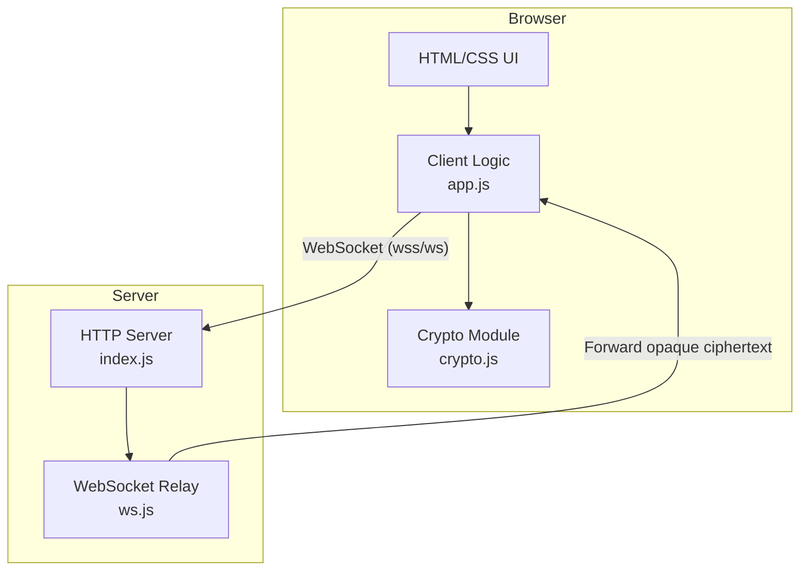
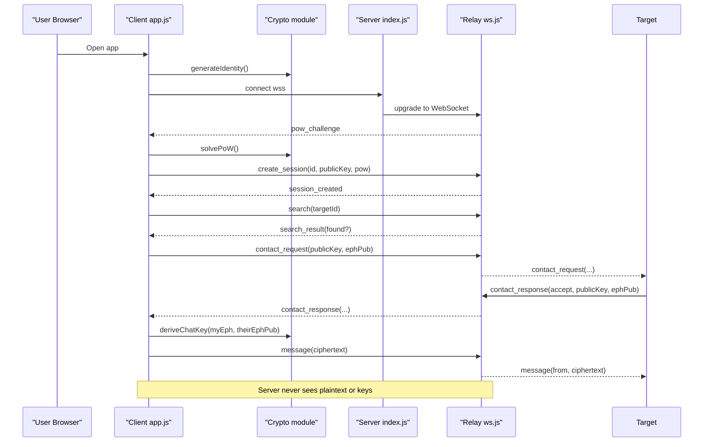
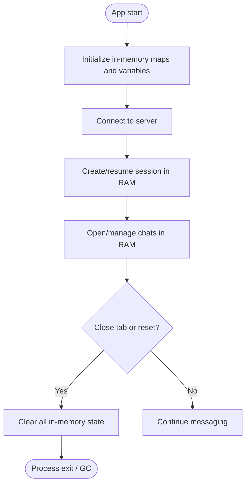
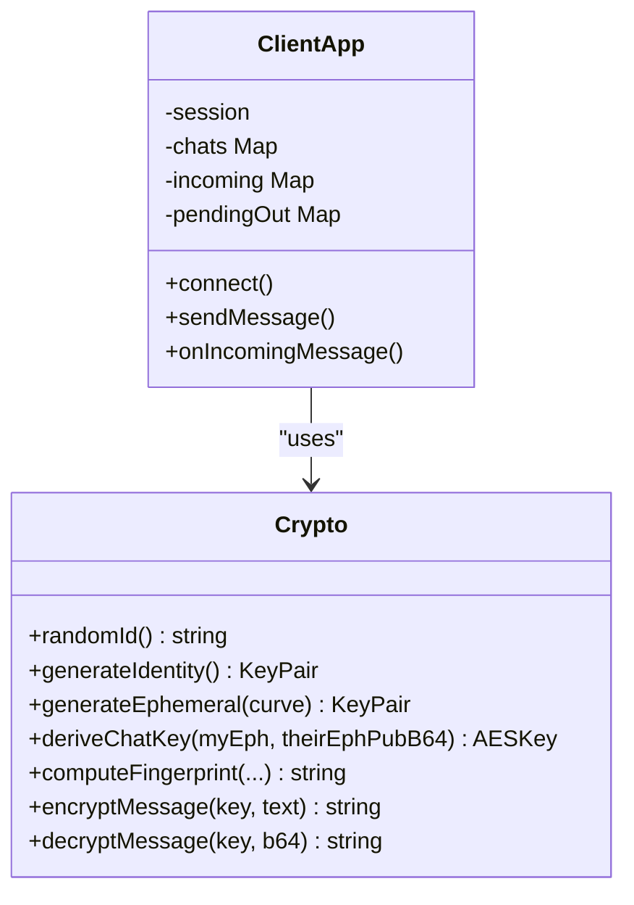
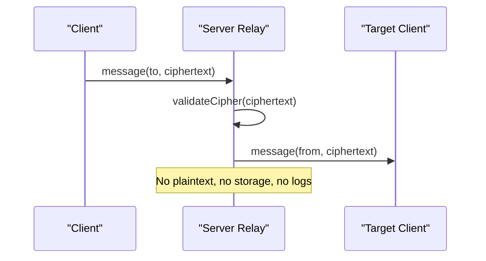
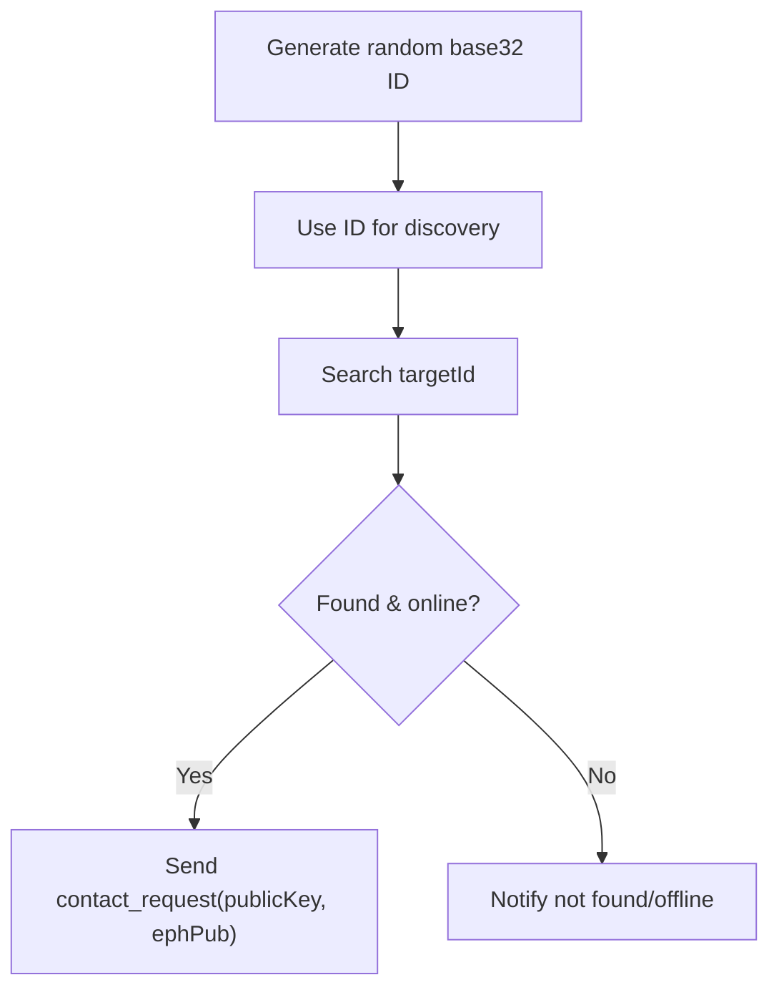
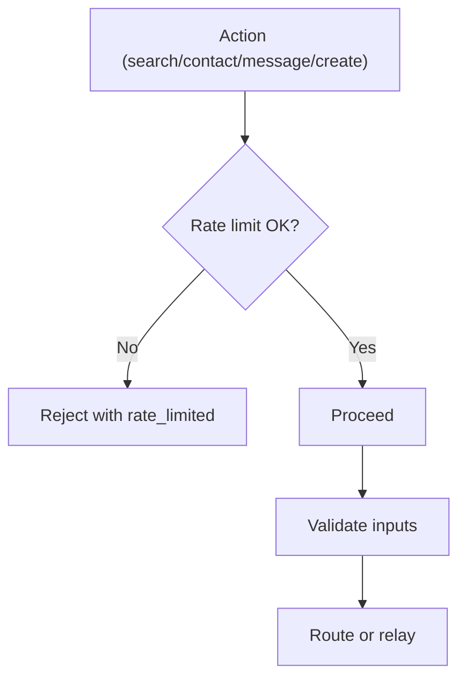
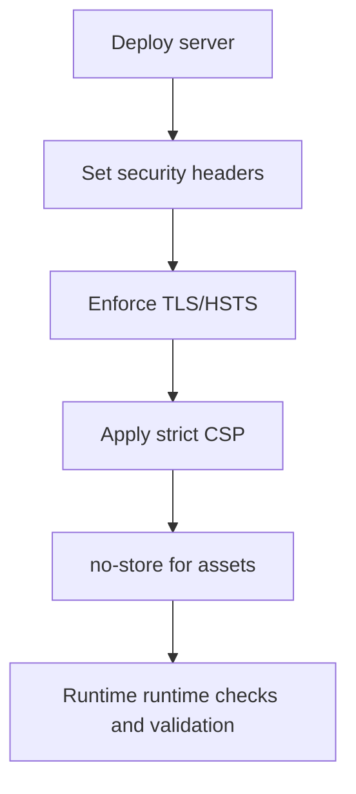
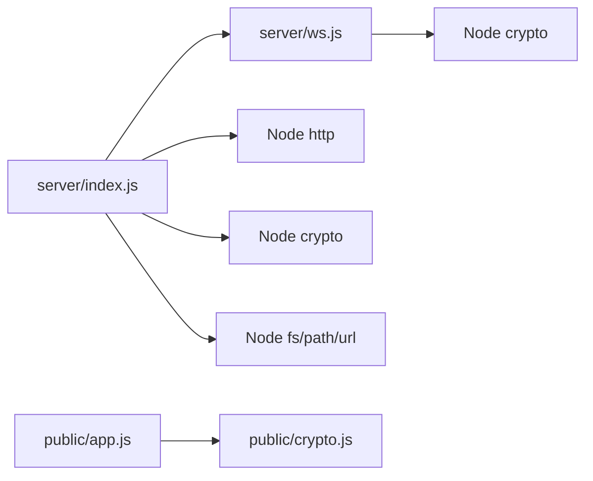

# Privacy Guarantees

<cite>
**Referenced Files in This Document**
- [app.js](file://public/app.js)
- [crypto.js](file://public/crypto.js)
- [index.html](file://public/index.html)
- [index.js](file://server/index.js)
- [ws.js](file://server/ws.js)
- [package.json](file://package.json)
- [.gitignore](file://.gitignore)
</cite>

## Table of Contents
1. [Introduction](#introduction)
2. [Project Structure](#project-structure)
3. [Core Components](#core-components)
4. [Architecture Overview](#architecture-overview)
5. [Detailed Component Analysis](#detailed-component-analysis)
6. [Dependency Analysis](#dependency-analysis)
7. [Performance Considerations](#performance-considerations)
8. [Troubleshooting Guide](#troubleshooting-guide)
9. [Conclusion](#conclusion)
10. [Appendices](#appendices)

## Introduction
This document explains Shh’s privacy guarantees and zero-data-persistence design. It focuses on how the application ensures that no messages, identities, logs, or sensitive data are stored on disk or transmitted to third parties. The system uses an in-memory-only architecture where all state is held in RAM and cleared when connections terminate. The server acts as a blind relay: it forwards opaque ciphertexts and cannot inspect message contents due to end-to-end encryption. Users communicate through randomly generated base32 identifiers without revealing personal information. The documentation also covers metadata protection, traffic analysis resistance, limitations of the current privacy model, operational security practices, threat models, trade-offs between privacy and functionality, and recommendations for production deployments.

## Project Structure
Shh consists of a Node.js server and a browser-based client:
- Server: HTTP static file server with strict security headers, WebSocket upgrade handling, and a minimal relay layer.
- Client: Browser app implementing identity generation, per-chat key derivation, AES-GCM encryption/decryption, and UI logic.

**Diagram sources**
- [index.js:73-115](file://server/index.js#L73-L115)
- [ws.js:258-312](file://server/ws.js#L258-L312)
- [app.js:74-120](file://public/app.js#L74-L120)
- [crypto.js:167-241](file://public/crypto.js#L167-L241)

**Section sources**
- [index.js:1-116](file://server/index.js#L1-L116)
- [ws.js:1-313](file://server/ws.js#L1-L313)
- [app.js:1-624](file://public/app.js#L1-L624)
- [crypto.js:1-242](file://public/crypto.js#L1-L242)
- [index.html:1-106](file://public/index.html#L1-L106)
- [package.json:1-19](file://package.json#L1-L19)

## Core Components
- In-memory-only client state: All sessions, chats, pending requests, and notifications live in JavaScript variables and DOM elements; nothing is written to localStorage, cookies, or IndexedDB. Closing the tab clears everything.
- End-to-end encryption: Identity keys and per-chat ephemeral keys are generated in the browser. Messages are encrypted with AES-256-GCM using a chat-specific key derived via ECDH + HKDF. Only ciphertext traverses the network.
- Blind relay server: The server only validates protocol fields and forwards messages. It never stores plaintext, does not log IPs, and does not persist any state beyond active connections.
- Anonymity model: Users use random base32 identifiers. No personal information is required or transmitted.
- Metadata protections: Presence is limited to online/offline signals; contact requests carry public keys but not content; rate limiting and PoW mitigate abuse.
- Operational hardening: Strict CSP, HSTS, no external resources, no-store cache policy, and minimal permissions.

**Section sources**
- [app.js:1-35](file://public/app.js#L1-L35)
- [crypto.js:1-14](file://public/crypto.js#L1-L14)
- [index.js:24-84](file://server/index.js#L24-L84)
- [ws.js:1-21](file://server/ws.js#L1-L21)

## Architecture Overview
The privacy model relies on three layers:
1. Client-side crypto: Generates identities and per-chat keys, encrypts/decrypts messages locally.
2. Network transport: Uses HTTPS/WSS to protect transport confidentiality and integrity.
3. Server relay: Validates inputs, enforces limits, and forwards ciphertexts without inspection.

**Diagram sources**
- [app.js:99-120](file://public/app.js#L99-L120)
- [app.js:227-310](file://public/app.js#L227-L310)
- [app.js:344-359](file://public/app.js#L344-L359)
- [ws.js:93-105](file://server/ws.js#L93-L105)
- [ws.js:150-179](file://server/ws.js#L150-L179)
- [ws.js:181-239](file://server/ws.js#L181-L239)

## Detailed Component Analysis

### Zero Data Persistence and In-Memory State
- Client state: Session, chats, pending outbound requests, incoming requests, and notices are kept in memory. There is no persistence layer. When the user closes the tab or explicitly resets, all references are dropped and garbage collection can reclaim memory.
- Server state: Active sessions, socket mappings, and pending requests are stored in Maps. Connections are pruned after a short grace period. No database, no disk writes, and no request/connection logs.

**Diagram sources**
- [app.js:26-35](file://public/app.js#L26-L35)
- [app.js:532-554](file://public/app.js#L532-L554)
- [ws.js:23-30](file://server/ws.js#L23-L30)
- [ws.js:133-148](file://server/ws.js#L133-L148)

**Section sources**
- [app.js:26-35](file://public/app.js#L26-L35)
- [app.js:532-554](file://public/app.js#L532-L554)
- [ws.js:23-30](file://server/ws.js#L23-L30)
- [ws.js:133-148](file://server/ws.js#L133-L148)

### End-to-End Encryption Model
- Identity keys: One X25519 keypair per session, created in RAM.
- Per-chat keys: Fresh ephemeral keypairs per chat for forward secrecy.
- Key derivation: ECDH shared secret combined with HKDF-SHA256 to produce AES-256-GCM keys. Salt is order-independent based on sorted ephemeral public keys.
- Message format: AES-GCM with a fresh 96-bit nonce per message. Only base64-encoded ciphertext is sent over the wire.
- Fingerprinting: SHA-256 over identity and ephemeral public keys enables out-of-band verification to prevent MITM.

**Diagram sources**
- [crypto.js:39-45](file://public/crypto.js#L39-L45)
- [crypto.js:167-172](file://public/crypto.js#L167-L172)
- [crypto.js:191-211](file://public/crypto.js#L191-L211)
- [crypto.js:213-221](file://public/crypto.js#L213-L221)
- [crypto.js:223-241](file://public/crypto.js#L223-L241)
- [app.js:344-359](file://public/app.js#L344-L359)
- [app.js:324-342](file://public/app.js#L324-L342)

**Section sources**
- [crypto.js:1-14](file://public/crypto.js#L1-L14)
- [crypto.js:167-241](file://public/crypto.js#L167-L241)
- [app.js:324-359](file://public/app.js#L324-L359)

### Server as a Blind Relay
- The server accepts WebSocket upgrades, issues challenges, validates tokens, and routes messages by target identifier.
- It never inspects ciphertext, never stores private keys, and does not retain connection metadata beyond active sessions.
- Graceful teardown removes sessions and notifies peers about presence changes.

**Diagram sources**
- [ws.js:231-239](file://server/ws.js#L231-L239)
- [ws.js:111-120](file://server/ws.js#L111-L120)

**Section sources**
- [ws.js:1-21](file://server/ws.js#L1-L21)
- [ws.js:258-312](file://server/ws.js#L258-L312)

### Anonymity Model and Identifiers
- User identifiers are random base32 strings, generated client-side.
- Public keys are exchanged during contact setup; they do not reveal personal information.
- Search returns only whether a target is online; no profile data is exposed.

**Diagram sources**
- [crypto.js:39-45](file://public/crypto.js#L39-L45)
- [app.js:596-603](file://public/app.js#L596-L603)
- [ws.js:181-186](file://server/ws.js#L181-L186)

**Section sources**
- [crypto.js:39-45](file://public/crypto.js#L39-L45)
- [app.js:596-603](file://public/app.js#L596-L603)
- [ws.js:181-186](file://server/ws.js#L181-L186)

### Metadata Protection and Traffic Analysis Resistance
- Minimal metadata: Only presence (online/offline), target IDs, and public keys are exchanged.
- Rate limiting: Token buckets limit search, contact, message, and create actions per connection.
- Proof of work: Clients must solve a SHA-256 challenge before creating a session, mitigating automated abuse.
- No store-and-forward: If a recipient is offline, the server does not queue messages; this reduces persistent metadata at rest.

**Diagram sources**
- [ws.js:15-21](file://server/ws.js#L15-L21)
- [ws.js:36-65](file://server/ws.js#L36-L65)
- [ws.js:93-105](file://server/ws.js#L93-L105)
- [ws.js:231-239](file://server/ws.js#L231-L239)

**Section sources**
- [ws.js:15-21](file://server/ws.js#L15-L21)
- [ws.js:36-65](file://server/ws.js#L36-L65)
- [ws.js:93-105](file://server/ws.js#L93-L105)
- [ws.js:231-239](file://server/ws.js#L231-L239)

### Operational Security Practices
- Transport security: Enforce HSTS and require WSS for WebSocket connections.
- Content security: Strict CSP restricts scripts, styles, fonts, frames, and external connections.
- Permissions: Disable camera, microphone, geolocation, and interest cohort access.
- Cache control: Serve assets with no-store to ensure clients always run the latest code.
- Referrer policy: Set no-referrer to avoid leaking URL context.

**Diagram sources**
- [index.js:24-84](file://server/index.js#L24-L84)
- [index.js:61-70](file://server/index.js#L61-L70)

**Section sources**
- [index.js:24-84](file://server/index.js#L24-L84)
- [index.js:61-70](file://server/index.js#L61-L70)

### Threat Models and Limitations
- Protects against:
  - Passive eavesdropping on message content via E2EE.
  - Server-side data retention due to in-memory-only design and no logs.
  - Automated abuse via PoW and rate limiting.
  - Some traffic correlation risks via minimal metadata exposure.
- Limitations:
  - Endpoint compromise: If a device is compromised, local memory may be read.
  - Traffic analysis: Observers may infer activity patterns from timing and volume.
  - Presence leakage: Online/offline signals reveal availability.
  - No persistent storage: Cannot recover history across sessions.
  - Forward secrecy applies per chat; long-term identity keys are reused per session.

[No sources needed since this section provides general guidance]

### Trade-offs Between Privacy and Functionality
- No message history: Users lose conversations when closing tabs; convenience is sacrificed for privacy.
- No delivery guarantees: Offline recipients do not receive queued messages.
- Limited metadata: While reducing exposure, it also means fewer features like rich profiles or persistent contacts.
- Strict security headers: May block some third-party integrations intentionally.

[No sources needed since this section provides general guidance]

### Recommendations for Production Deployments
- Always deploy behind TLS and enforce HSTS.
- Run behind a reverse proxy that terminates TLS and forwards to the app port.
- Restrict inbound IPs if possible and monitor resource usage.
- Avoid enabling logging that captures IPs or payloads.
- Keep dependencies updated and audit them regularly.
- Configure process managers to restart the service and clear memory on crash.
- Use environment variables for ports and secrets; do not commit .env files.

**Section sources**
- [package.json:10-16](file://package.json#L10-L16)
- [.gitignore:10-13](file://.gitignore#L10-L13)

## Dependency Analysis
Shh has minimal external dependencies:
- ws: WebSocket server implementation used by the relay.
- Node built-ins: http, crypto, fs, path, url.

**Diagram sources**
- [index.js:3-9](file://server/index.js#L3-L9)
- [ws.js:3](file://server/ws.js#L3)
- [app.js:4-8](file://public/app.js#L4-L8)

**Section sources**
- [index.js:3-9](file://server/index.js#L3-L9)
- [ws.js:3](file://server/ws.js#L3)
- [app.js:4-8](file://public/app.js#L4-L8)
- [package.json:14-16](file://package.json#L14-L16)

## Performance Considerations
- Client-side cryptography uses Web Crypto API for efficient AES-GCM and ECDH operations.
- Proof of work is bounded and yields to the event loop to keep the UI responsive.
- Server payload size is capped to prevent large-message abuse.
- In-memory structures (Maps, Sets) provide O(1) average-time lookups for sessions and peers.

[No sources needed since this section provides general guidance]

## Troubleshooting Guide
- Browser lacks ECDH support: The client detects curve support and disables creation if unsupported. Update the browser or enable experimental flags.
- Too many actions: Rate-limited errors indicate excessive searches, contacts, or messages. Wait for token refill.
- Message too large: Enforced 2 KB limit; split content or reduce payload.
- Session conflicts: Reconnecting within the grace window requires matching identity keys; otherwise, a new session is needed.
- Connection drops: The client attempts quick reconnection; server tears down sessions after a grace period.

**Section sources**
- [app.js:559-567](file://public/app.js#L559-L567)
- [app.js:178-193](file://public/app.js#L178-L193)
- [app.js:344-359](file://public/app.js#L344-L359)
- [ws.js:150-179](file://server/ws.js#L150-L179)
- [ws.js:133-148](file://server/ws.js#L133-L148)

## Conclusion
Shh implements a strong privacy model centered on in-memory-only operation, end-to-end encryption, and a blind relay server. By avoiding persistent storage and minimizing metadata exposure, it protects message content and reduces server-side risk. Users benefit from anonymity through random identifiers and cryptographic verification. However, the design trades off convenience and durability for privacy. Operators should follow the recommended operational practices to maintain these guarantees in production.

[No sources needed since this section summarizes without analyzing specific files]

## Appendices

### Security Headers and Policies Summary
- Content-Security-Policy: Restricts sources and actions.
- X-Content-Type-Options: Prevents MIME sniffing.
- X-Frame-Options: Disallows framing.
- Referrer-Policy: No referrer.
- Permissions-Policy: Disables sensitive APIs.
- Cross-Origin policies: Same-origin enforcement.
- Strict-Transport-Security: Enforces HTTPS.

**Section sources**
- [index.js:24-84](file://server/index.js#L24-L84)