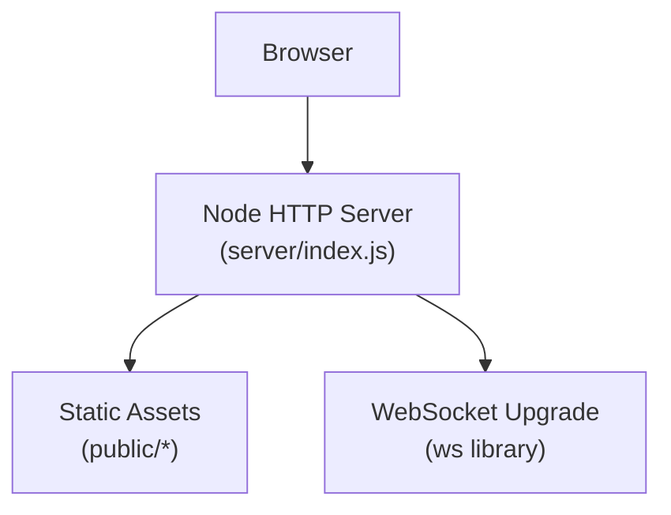
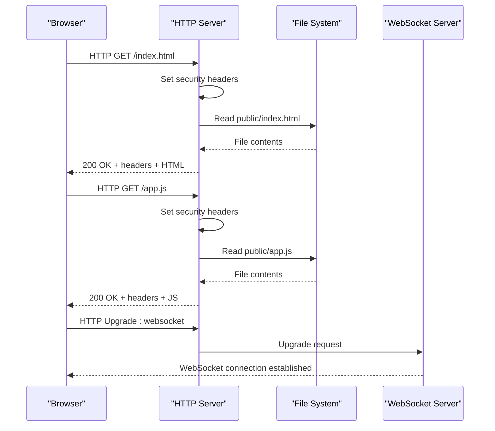
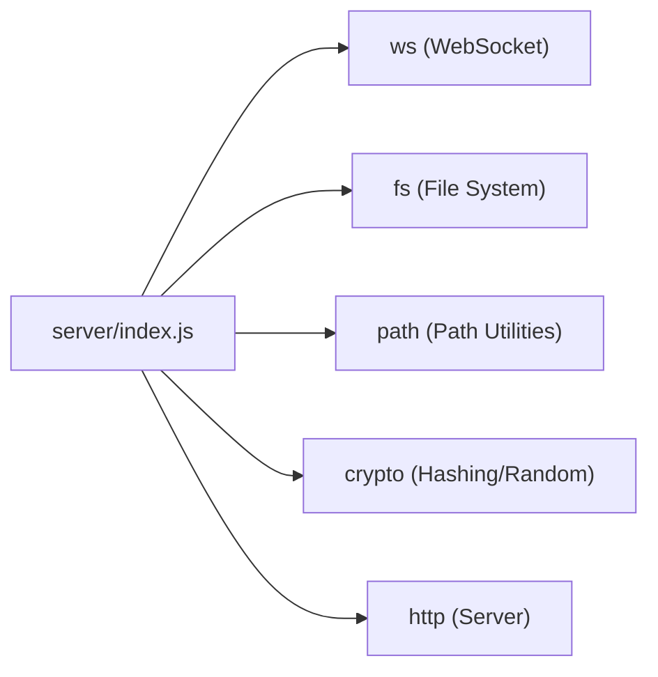

# Security Headers & CSP

<cite>
**Referenced Files in This Document**   
- [server/index.js](file://server/index.js)
- [package.json](file://package.json)
</cite>

## Table of Contents
1. [Introduction](#introduction)
2. [Project Structure](#project-structure)
3. [Core Components](#core-components)
4. [Architecture Overview](#architecture-overview)
5. [Detailed Component Analysis](#detailed-component-analysis)
6. [Dependency Analysis](#dependency-analysis)
7. [Performance Considerations](#performance-considerations)
8. [Troubleshooting Guide](#troubleshooting-guide)
9. [Conclusion](#conclusion)

## Introduction
This document explains the HTTP security headers and Content Security Policy (CSP) implemented by Shh V1.0. It covers how the server hardens responses against common web vulnerabilities such as cross-site scripting (XSS), clickjacking, MIME-type sniffing, and unauthorized resource loading. It also documents the rationale behind each header, customization options for different deployments, browser compatibility considerations, and troubleshooting guidance for CSP-related issues.

## Project Structure
Shh V1.0 is a Node.js application that serves static assets from a public directory and exposes WebSocket endpoints for real-time communication. The HTTP server applies security headers to every response before serving content or handling WebSocket upgrades.

**Diagram sources**
- [server/index.js:1-116](file://server/index.js#L1-L116)

**Section sources**
- [server/index.js:1-116](file://server/index.js#L1-L116)
- [package.json:1-19](file://package.json#L1-L19)

## Core Components
The security posture is primarily defined in the HTTP request handler where headers are set on every response. Key responsibilities include:
- Defining a strict CSP policy
- Applying defensive HTTP headers
- Serving static files with explicit MIME types and cache control
- Handling WebSocket upgrades securely

**Section sources**
- [server/index.js:24-39](file://server/index.js#L24-L39)
- [server/index.js:73-89](file://server/index.js#L73-L89)
- [server/index.js:91-109](file://server/index.js#L91-L109)

## Architecture Overview
At runtime, the server attaches security headers to all HTTP responses. Static file requests are served with correct MIME types and no caching. WebSocket upgrade requests are validated and routed to the WebSocket server.

**Diagram sources**
- [server/index.js:73-89](file://server/index.js#L73-L89)
- [server/index.js:97-109](file://server/index.js#L97-L109)

## Detailed Component Analysis

### Security Headers Applied
Every HTTP response includes the following headers:

- Content-Security-Policy
  - Purpose: Restricts which resources can be loaded and executed.
  - Effect: Prevents inline scripts, external origins, and dangerous features; allows same-origin assets and WebSocket connections required by the app.
- X-Content-Type-Options: nosniff
  - Purpose: Disables MIME-type sniffing.
  - Effect: Forces browsers to respect declared Content-Type, reducing risks of executing unintended content types.
- X-Frame-Options: DENY
  - Purpose: Prevents framing of the page.
  - Effect: Mitigates clickjacking by disallowing embedding in iframes.
- Referrer-Policy: no-referrer
  - Purpose: Controls referrer information sent with requests.
  - Effect: Minimizes sensitive URL leakage across origins.
- Permissions-Policy
  - Purpose: Restricts access to powerful browser APIs.
  - Effect: Disables camera, microphone, geolocation, and related features unless explicitly allowed.
- Cross-Origin-Opener-Policy: same-origin
  - Purpose: Isolates browsing contexts to the same origin.
  - Effect: Reduces cross-origin data exposure between tabs/windows.
- Cross-Origin-Resource-Policy: same-origin
  - Purpose: Controls cross-origin resource sharing at the network layer.
  - Effect: Prevents cross-origin reads of resources unless explicitly permitted.
- Strict-Transport-Security (HSTS)
  - Purpose: Enforces HTTPS usage for a specified duration.
  - Effect: Ensures clients use secure connections when supported.

Rationale summary:
- These headers collectively reduce attack surface by enforcing strict resource loading, preventing framing, disabling MIME sniffing, limiting sensitive API access, isolating browsing contexts, and enforcing HTTPS.

**Section sources**
- [server/index.js:24-39](file://server/index.js#L24-L39)
- [server/index.js:73-83](file://server/index.js#L73-L83)

### Content Security Policy Directives
The CSP is composed of directives that restrict behavior and resource loading:

- default-src 'self'
  - Sets a restrictive fallback for all resource types to same-origin only.
- base-uri 'none'
  - Disallows <base> elements to prevent changing the base URL for relative resources.
- object-src 'none'
  - Blocks plugins like Flash or embedded objects.
- frame-ancestors 'none'
  - Prevents the page from being framed by any origin (defense-in-depth alongside X-Frame-Options).
- form-action 'none'
  - Disallows forms submission to any origin.
- script-src 'self'
  - Allows scripts only from the same origin; blocks inline and remote scripts.
- style-src 'self'
  - Allows styles only from the same origin; blocks inline styles unless explicitly allowed elsewhere.
- img-src 'self' data:
  - Allows images from the same origin and data URIs.
- connect-src 'self' ws: wss:
  - Allows fetch/XHR/WebSocket connections to same-origin and WebSocket schemes needed by the app.
- font-src 'none'
  - Blocks loading fonts from external sources.
- worker-src 'none'
  - Disallows Web Workers and Service Workers.
- manifest-src 'self'
  - Allows the web app manifest only from the same origin.

Security benefits:
- XSS mitigation via script-src 'self' and default-src 'self'.
- Clickjacking protection via frame-ancestors 'none' and X-Frame-Options DENY.
- MIME-type sniffing prevention via X-Content-Type-Options nosniff.
- Reduced tracking and third-party injection via restrictive defaults and disabled plugin/script execution.

Customization notes:
- If inline scripts/styles are required, add nonces or hashes to script-src/style-src.
- If external CDNs are needed, whitelist specific domains in relevant directives.
- For analytics or telemetry, allow connect-src to specific endpoints.
- For PWA features, ensure manifest-src and worker-src are configured appropriately.

**Section sources**
- [server/index.js:24-39](file://server/index.js#L24-L39)

### Static File Serving and MIME Types
The server maps file extensions to MIME types and sets Cache-Control: no-store to avoid caching sensitive code.

Key behaviors:
- Explicit MIME mapping prevents misinterpretation of content types.
- Path normalization and prefix checks mitigate path traversal attacks.
- No logging and in-memory-only design minimize data retention.

Security implications:
- Correct MIME types combined with nosniff reduce execution of unintended content.
- Disabling cache ensures fresh crypto code is always served.

**Section sources**
- [server/index.js:14-22](file://server/index.js#L14-L22)
- [server/index.js:46-71](file://server/index.js#L46-L71)

### WebSocket Upgrade Handling
WebSocket connections are handled separately from HTTP responses. The server validates the presence of the WebSocket key and routes upgrades to the WebSocket server.

Security considerations:
- Non-WebSocket upgrade requests are rejected.
- Payload size is capped to limit abuse.
- No IP logging or persistent storage aligns with privacy goals.

**Section sources**
- [server/index.js:91-109](file://server/index.js#L91-L109)

## Dependency Analysis
The application depends on:
- Node.js built-ins: http, fs, path, crypto, url
- External package: ws for WebSocket support

**Diagram sources**
- [server/index.js:3-9](file://server/index.js#L3-L9)
- [package.json:14-16](file://package.json#L14-L16)

**Section sources**
- [server/index.js:3-9](file://server/index.js#L3-L9)
- [package.json:14-16](file://package.json#L14-L16)

## Performance Considerations
- CSP evaluation overhead is minimal but should be kept tight to avoid unnecessary parsing.
- Disabling caching (no-store) improves freshness and security but increases bandwidth usage.
- WebSocket payload limits protect against memory exhaustion.

[No sources needed since this section provides general guidance]

## Troubleshooting Guide

Common CSP violations and resolutions:
- Blocked script execution
  - Symptom: Console reports blocked script from inline or external source.
  - Resolution: Ensure scripts are hosted on the same origin; if inline scripts are necessary, add nonces or hashes to script-src.
- Blocked image or asset load
  - Symptom: Console reports blocked image or resource.
  - Resolution: Verify the resource is served from the same origin or adjust img-src accordingly. Data URIs are already allowed for images.
- Blocked WebSocket connection
  - Symptom: Console reports blocked WebSocket connection.
  - Resolution: Confirm the connection uses ws: or wss: to the same origin; connect-src already permits these schemes.
- Form submission blocked
  - Symptom: Console reports form action blocked.
  - Resolution: Adjust form-action to allow intended destinations if forms are required.
- Plugin/object blocked
  - Symptom: Embedded objects or plugins fail to load.
  - Resolution: Keep object-src 'none' for security; avoid using deprecated plugins.

Header-specific tips:
- HSTS
  - Ensure deployment terminates TLS (e.g., reverse proxy or platform like Railway). Without TLS, HSTS has no effect.
- X-Frame-Options vs frame-ancestors
  - Both are enforced; frame-ancestors provides broader coverage including modern browsers.
- Permissions-Policy
  - If features like camera or microphone are required, update Permissions-Policy to allow them selectively.

Diagnostic steps:
- Inspect response headers in the browser developer tools to confirm all headers are present.
- Review the console for CSP violation messages to identify offending directives.
- Temporarily relax directives in development to isolate issues, then tighten for production.

**Section sources**
- [server/index.js:24-39](file://server/index.js#L24-L39)
- [server/index.js:73-83](file://server/index.js#L73-L83)

## Conclusion
Shh V1.0 implements a strong security baseline through a strict CSP and complementary HTTP headers. These measures mitigate XSS, clickjacking, MIME-type sniffing, and unauthorized resource loading while preserving functionality for same-origin assets and WebSocket communication. Operators can customize directives based on deployment needs, but should maintain restrictive defaults to preserve the security posture. Proper configuration of TLS and careful monitoring of CSP violations will help ensure robust protection across environments.