# Security Model

<cite>
**Referenced Files in This Document**
- [crypto.js](file://public/crypto.js)
- [app.js](file://public/app.js)
- [index.js](file://server/index.js)
- [ws.js](file://server/ws.js)
- [package.json](file://package.json)
</cite>

## Table of Contents
1. [Introduction](#introduction)
2. [Project Structure](#project-structure)
3. [Core Components](#core-components)
4. [Architecture Overview](#architecture-overview)
5. [Detailed Component Analysis](#detailed-component-analysis)
6. [Dependency Analysis](#dependency-analysis)
7. [Performance Considerations](#performance-considerations)
8. [Troubleshooting Guide](#troubleshooting-guide)
9. [Conclusion](#conclusion)

## Introduction
This document explains the security model of Shh V1.0, focusing on end-to-end encryption (E2EE), privacy guarantees, and operational safeguards. It covers:
- AES-256-GCM message encryption with per-message nonces
- Forward secrecy via ephemeral per-chat keys using X25519/ECDH
- Proof-of-work to mitigate spam and abuse
- Anonymous identity system based on base32 identifiers
- Key exchange protocol for establishing shared secrets between peers
- Rate limiting using token bucket algorithms
- HTTP security headers and Content Security Policy
- Zero-data-persistence design (no messages, identities, or logs stored on disk)
- Cryptographic primitives used (X25519/ECDH, SHA-256, AES-256-GCM, HKDF-SHA256)
- Security best practices, threat models, and limitations

## Project Structure
Shh is a minimal real-time messaging application with client-side cryptography and a stateless relay server.

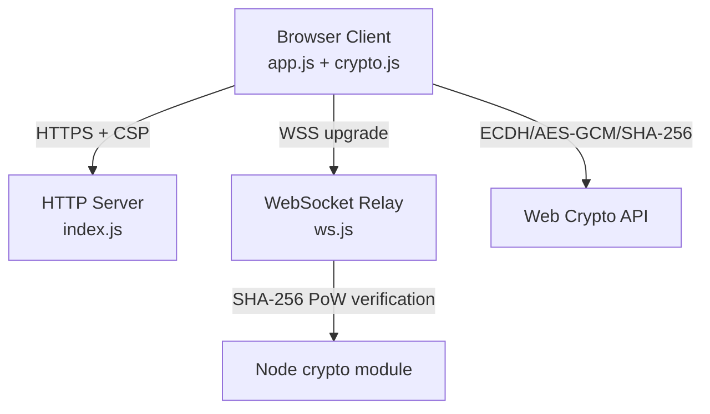

**Diagram sources**
- [index.js:24-83](file://server/index.js#L24-L83)
- [ws.js:93-105](file://server/ws.js#L93-L105)
- [crypto.js:129-211](file://public/crypto.js#L129-L211)
- [crypto.js:228-241](file://public/crypto.js#L228-L241)

**Section sources**
- [index.js:1-116](file://server/index.js#L1-L116)
- [ws.js:1-313](file://server/ws.js#L1-L313)
- [crypto.js:1-242](file://public/crypto.js#L1-L242)
- [app.js:1-624](file://public/app.js#L1-L624)
- [package.json:1-19](file://package.json#L1-L19)

## Core Components
- End-to-end encryption: AES-256-GCM with unique per-message nonce; keys derived via ECDH + HKDF-SHA256.
- Forward secrecy: Fresh ephemeral keypair per chat session ensures compromise of long-term identity does not reveal past messages.
- Identity: Random base32 identifier generated per session; no persistent identity storage.
- Key exchange: ECDH over X25519 (preferred) or P-256 fallback; curve negotiated implicitly by public key length.
- Proof-of-work: SHA-256 puzzle solved in-browser to prevent spam and enumeration attacks.
- Rate limiting: Token bucket per action type prevents abuse at the server.
- Privacy: No disk persistence; all state lives in RAM; no logs; strict HTTP security headers and CSP.

**Section sources**
- [crypto.js:129-211](file://public/crypto.js#L129-L211)
- [crypto.js:228-241](file://public/crypto.js#L228-L241)
- [ws.js:15-21](file://server/ws.js#L15-L21)
- [ws.js:93-105](file://server/ws.js#L93-L105)
- [index.js:24-83](file://server/index.js#L24-L83)

## Architecture Overview
The system uses an encrypted overlay where the server only relays opaque ciphertexts. Clients perform all cryptographic operations. The server enforces rate limits and proof-of-work to protect against abuse while maintaining zero-knowledge of message content.

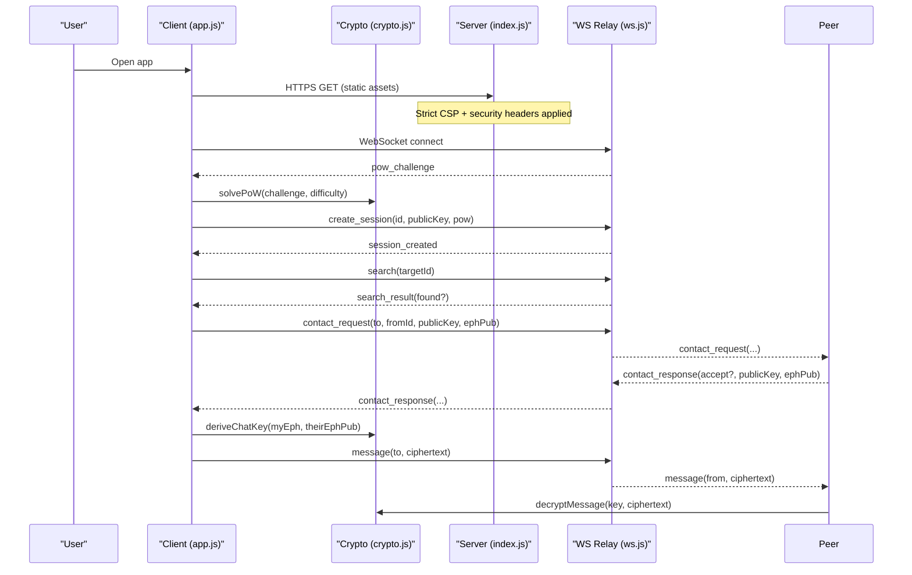

**Diagram sources**
- [index.js:24-83](file://server/index.js#L24-L83)
- [ws.js:93-105](file://server/ws.js#L93-L105)
- [ws.js:150-179](file://server/ws.js#L150-L179)
- [ws.js:181-239](file://server/ws.js#L181-L239)
- [crypto.js:191-211](file://public/crypto.js#L191-L211)
- [crypto.js:228-241](file://public/crypto.js#L228-L241)
- [app.js:99-131](file://public/app.js#L99-L131)
- [app.js:237-310](file://public/app.js#L237-L310)

## Detailed Component Analysis

### End-to-End Encryption and Message Protection
- Algorithm: AES-256-GCM with a fresh random 96-bit nonce per message.
- Key derivation: ECDH shared secret combined with HKDF-SHA256 using a deterministic salt built from sorted ephemeral public keys and a fixed info string.
- Message format: Base64(iv || ciphertext || tag).
- Plaintext size limit: 2 KB enforced client-side and validated server-side.

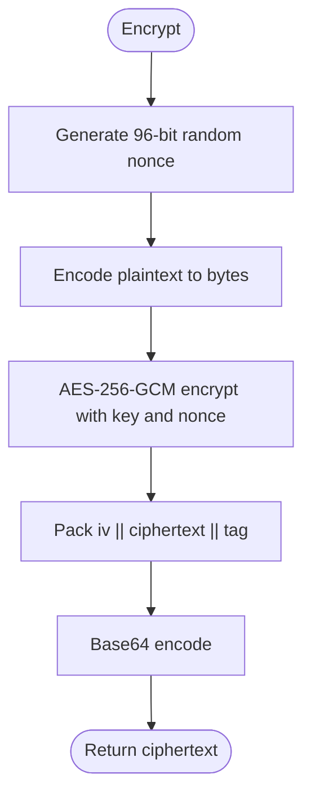

**Diagram sources**
- [crypto.js:228-233](file://public/crypto.js#L228-L233)

**Section sources**
- [crypto.js:228-241](file://public/crypto.js#L228-L241)
- [ws.js:111-120](file://server/ws.js#L111-L120)

### Forward Secrecy via Ephemeral Per-Chat Keys
- Each chat establishes a fresh ephemeral X25519 (or P-256 fallback) keypair.
- Shared secret computed via ECDH between both parties’ ephemeral keys.
- Compromise of one ephemeral key reveals only that chat’s messages; prior chats remain secure.

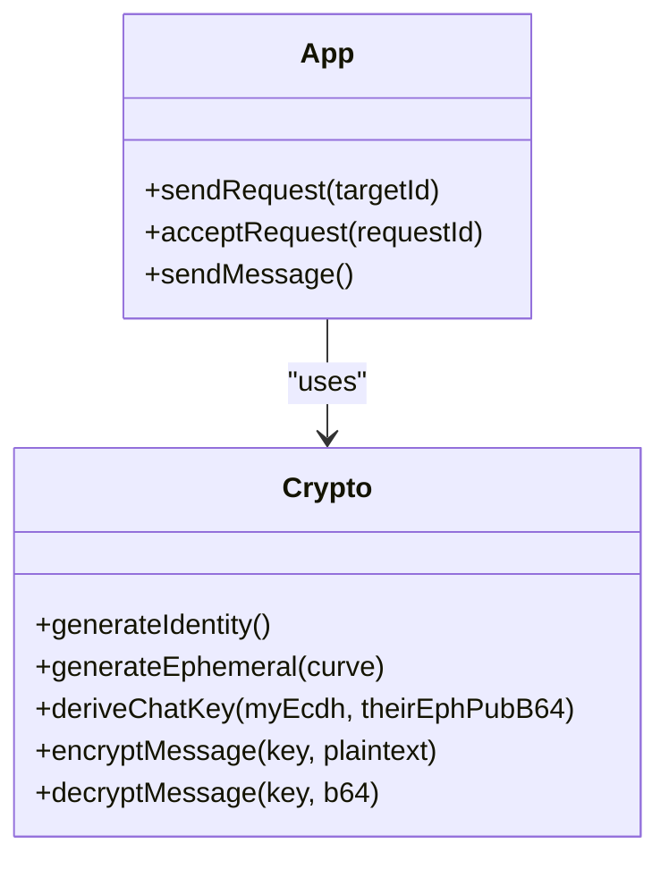

**Diagram sources**
- [crypto.js:167-211](file://public/crypto.js#L167-L211)
- [app.js:237-310](file://public/app.js#L237-L310)

**Section sources**
- [crypto.js:129-211](file://public/crypto.js#L129-L211)
- [app.js:237-310](file://public/app.js#L237-L310)

### Key Exchange Process and Curve Negotiation
- Preferred curve: X25519; fallback to P-256 if unsupported.
- Curve negotiation is implicit: public key byte length determines curve (32 bytes for X25519, 65 bytes for P-256 uncompressed point).
- Both sides compute identical chat key using sorted ephemeral public keys as HKDF salt.

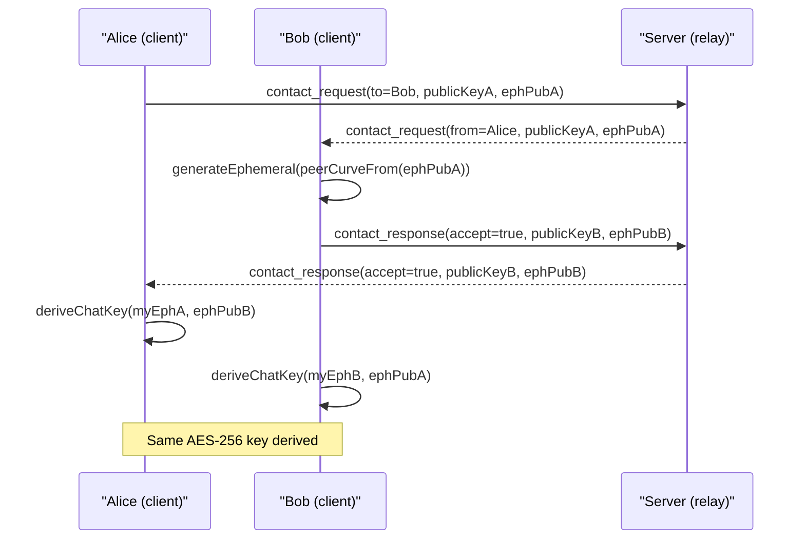

**Diagram sources**
- [crypto.js:151-186](file://public/crypto.js#L151-L186)
- [crypto.js:191-211](file://public/crypto.js#L191-L211)
- [app.js:237-310](file://public/app.js#L237-L310)
- [ws.js:188-229](file://server/ws.js#L188-L229)

**Section sources**
- [crypto.js:151-211](file://public/crypto.js#L151-L211)
- [app.js:237-310](file://public/app.js#L237-L310)
- [ws.js:188-229](file://server/ws.js#L188-L229)

### Anonymous Identity System
- Identity: One X25519 keypair per session, created in memory only.
- Identifier: Random base32 string (12+ characters) used to locate peers.
- No persistent identity storage; closing the tab destroys identity and keys.

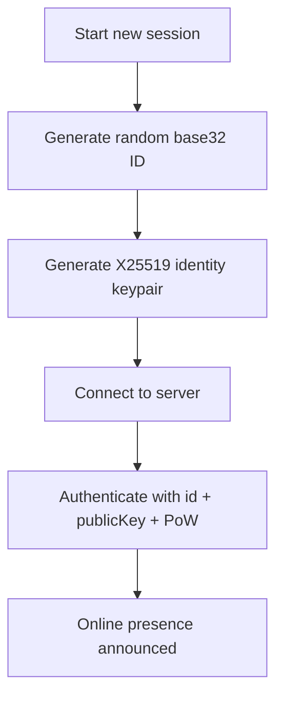

**Diagram sources**
- [crypto.js:40-45](file://public/crypto.js#L40-L45)
- [crypto.js:167-172](file://public/crypto.js#L167-L172)
- [ws.js:150-179](file://server/ws.js#L150-L179)
- [app.js:109-120](file://public/app.js#L109-L120)

**Section sources**
- [crypto.js:40-45](file://public/crypto.js#L40-L45)
- [crypto.js:167-172](file://public/crypto.js#L167-L172)
- [ws.js:150-179](file://server/ws.js#L150-L179)
- [app.js:109-120](file://public/app.js#L109-L120)

### Proof-of-Work Mechanism
- Purpose: Prevent spam and enumeration by requiring computational work before actions like creating sessions.
- Algorithm: SHA-256(challenge:nonce) must start with a configurable number of leading zeros.
- Implementation: In-browser brute-force with periodic event loop yields to keep UI responsive; server verifies within bounds.

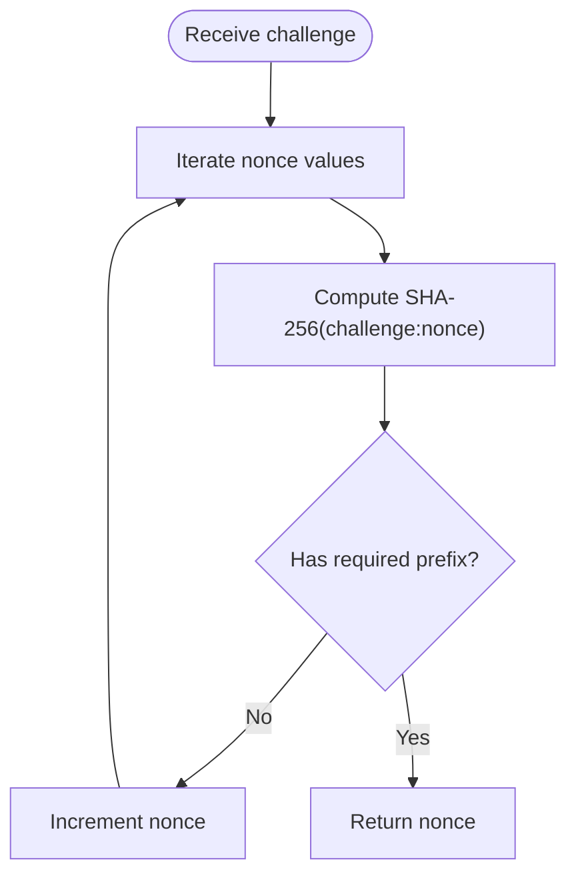

**Diagram sources**
- [crypto.js:113-127](file://public/crypto.js#L113-L127)
- [ws.js:93-105](file://server/ws.js#L93-L105)

**Section sources**
- [crypto.js:113-127](file://public/crypto.js#L113-L127)
- [ws.js:93-105](file://server/ws.js#L93-L105)

### Rate Limiting with Token Bucket
- Per-action buckets: search, contact, message, create.
- Tokens refill over time; burst capacity allows short spikes but throttles sustained abuse.
- Enforced server-side; clients receive explicit rate-limited errors.

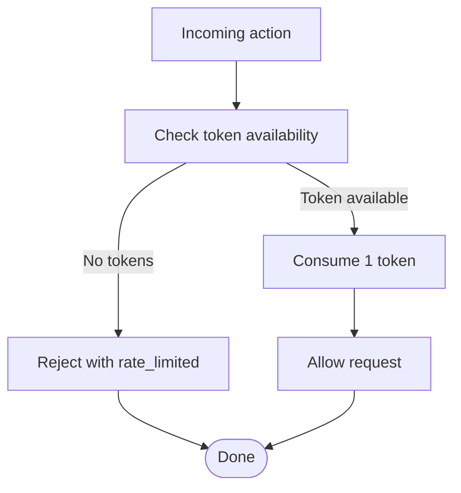

**Diagram sources**
- [ws.js:15-21](file://server/ws.js#L15-L21)
- [ws.js:37-65](file://server/ws.js#L37-L65)

**Section sources**
- [ws.js:15-21](file://server/ws.js#L15-L21)
- [ws.js:37-65](file://server/ws.js#L37-L65)
- [app.js:178-193](file://public/app.js#L178-L193)

### HTTP Security Headers and Content Security Policy
- CSP: Restricts default, script, style, image, connect, font, worker, manifest sources; blocks object/frame ancestors and forms.
- Additional headers: X-Content-Type-Options, X-Frame-Options, Referrer-Policy, Permissions-Policy, Cross-Origin policies, HSTS.
- Cache-Control: no-store to ensure clients always run current code.

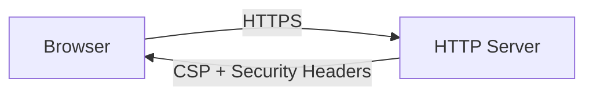

**Diagram sources**
- [index.js:24-83](file://server/index.js#L24-L83)

**Section sources**
- [index.js:24-83](file://server/index.js#L24-L83)

### Zero-Data-Persistence Design
- All state resides in RAM: sessions, connections, and pending requests are transient.
- No database, no logs, no IP retention; graceful teardown after disconnect with a short grace window for reconnection.
- Messages are not queued or stored; offline peers do not receive delayed delivery.

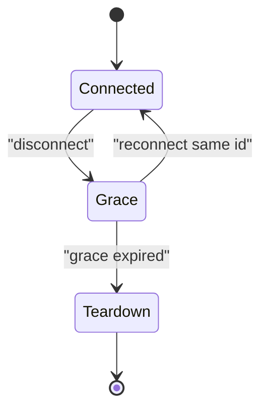

**Diagram sources**
- [ws.js:122-148](file://server/ws.js#L122-L148)

**Section sources**
- [ws.js:1-3](file://server/ws.js#L1-L3)
- [ws.js:122-148](file://server/ws.js#L122-L148)
- [index.js:1-3](file://server/index.js#L1-L3)

## Dependency Analysis
- Client depends on Web Crypto API for ECDH, AES-GCM, and SHA-256.
- Server depends on Node crypto for PoW verification and random data generation.
- WebSocket layer is the sole transport for control and ciphertext; no plaintext ever reaches the server.

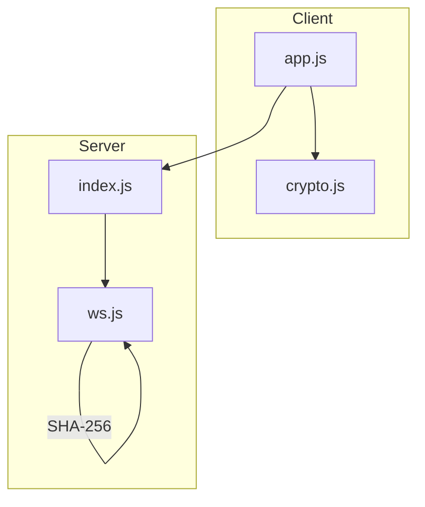

**Diagram sources**
- [app.js:1-8](file://public/app.js#L1-L8)
- [crypto.js:129-211](file://public/crypto.js#L129-L211)
- [index.js:1-10](file://server/index.js#L1-L10)
- [ws.js:1-10](file://server/ws.js#L1-L10)

**Section sources**
- [package.json:1-19](file://package.json#L1-L19)
- [index.js:1-10](file://server/index.js#L1-L10)
- [ws.js:1-10](file://server/ws.js#L1-L10)

## Performance Considerations
- Proof-of-work difficulty balances usability and anti-spam; higher difficulty increases CPU usage and latency.
- Message size cap (2 KB) reduces bandwidth and processing overhead.
- Token bucket rate limiting smooths bursts and protects server resources.
- ECDH curve detection avoids unnecessary failures on older browsers.

[No sources needed since this section provides general guidance]

## Troubleshooting Guide
Common issues and their causes:
- Rate limited: Too many searches, contacts, messages, or session creations; wait for token refill.
- too_large: Message exceeds 2 KB limit; reduce payload.
- bad_pow / id_taken: Session creation failed due to invalid proof-of-work or duplicate identity; retry with a new identity.
- no_session: Attempted action without an established session; reconnect and authenticate first.
- Offline peer: Target not online; no store-and-forward; try again later.

Mitigations:
- Respect rate limits; implement backoff on client side.
- Ensure browser supports ECDH (X25519/P-256); otherwise, update browser.
- Use fingerprints to verify peer authenticity out-of-band.

**Section sources**
- [app.js:178-193](file://public/app.js#L178-L193)
- [ws.js:150-179](file://server/ws.js#L150-L179)
- [ws.js:181-239](file://server/ws.js#L181-L239)

## Conclusion
Shh V1.0 implements a strong privacy-first security model:
- End-to-end encryption with AES-256-GCM and forward secrecy via ephemeral keys
- Anonymous identities and zero persistence
- Robust anti-abuse controls through proof-of-work and rate limiting
- Hardened HTTP surface with strict CSP and security headers
Limitations include no message persistence, no offline delivery, and reliance on browser crypto support. For enhanced security, consider adding mutual authentication flows, certificate pinning, and optional post-quantum key exchanges as they become widely supported.

[No sources needed since this section summarizes without analyzing specific files]