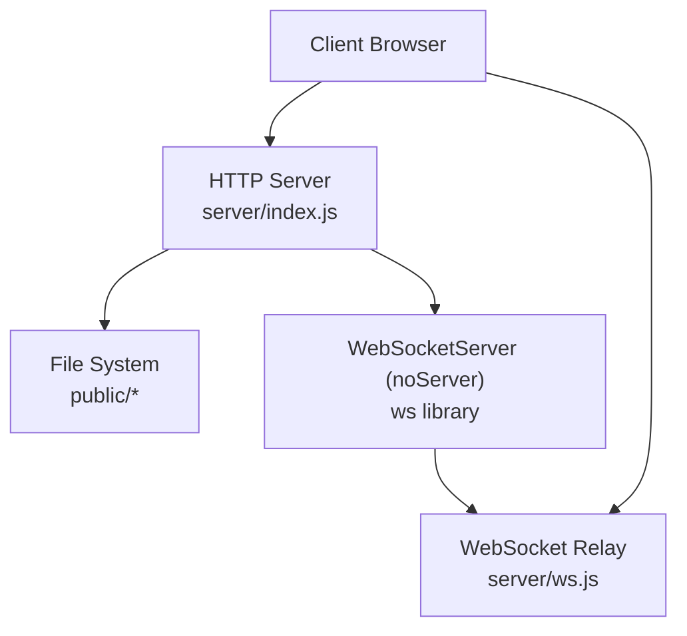
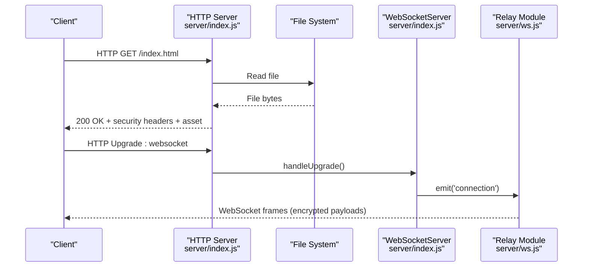
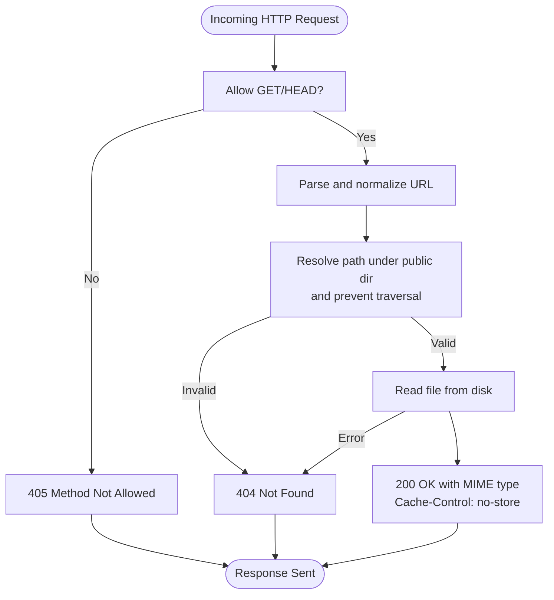
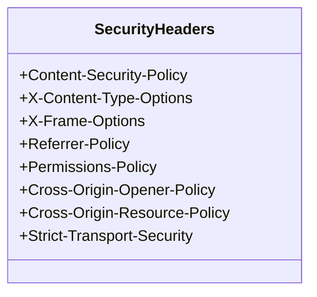
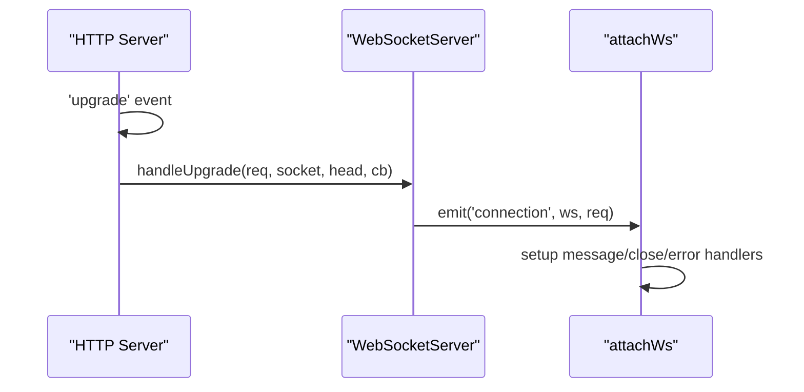
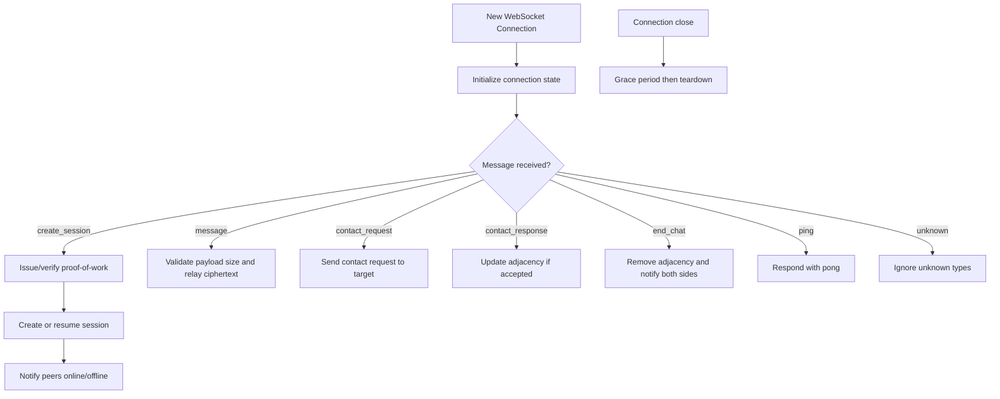
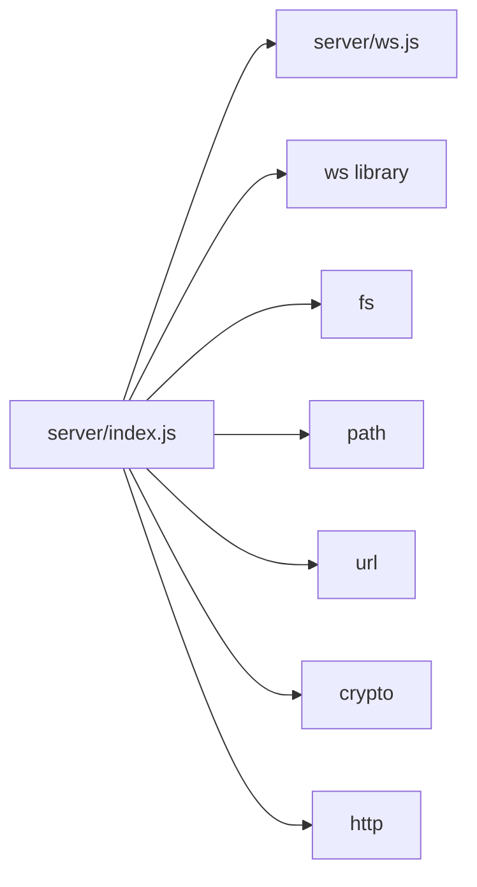

# HTTP Server Setup

<cite>
**Referenced Files in This Document**
- [server/index.js](file://server/index.js)
- [server/ws.js](file://server/ws.js)
- [package.json](file://package.json)
</cite>

## Table of Contents
1. [Introduction](#introduction)
2. [Project Structure](#project-structure)
3. [Core Components](#core-components)
4. [Architecture Overview](#architecture-overview)
5. [Detailed Component Analysis](#detailed-component-analysis)
6. [Dependency Analysis](#dependency-analysis)
7. [Performance Considerations](#performance-considerations)
8. [Troubleshooting Guide](#troubleshooting-guide)
9. [Conclusion](#conclusion)

## Introduction
This document explains the Node.js HTTP server implementation that serves frontend assets and integrates with a WebSocket relay for real-time messaging. It focuses on:
- Static file serving from the public directory with explicit MIME type handling
- Security headers including Content Security Policy (CSP), X-Frame-Options, and related protections
- Request/response handling patterns and error handling for missing or invalid requests
- Integration with the WebSocket upgrade process and how HTTP versus WebSocket connections are handled
- Production considerations such as caching strategies, compression options, and monitoring approaches

The server is intentionally minimal and privacy-focused: it stores no data on disk and writes no request logs. All runtime state lives in memory.

## Project Structure
At a high level, the application consists of:
- A Node.js HTTP server entry point that serves static files and wires up WebSocket upgrades
- A WebSocket module that implements an in-memory relay with rate limiting and proof-of-work challenges
- A public directory containing frontend assets served by the HTTP server
- A package manifest defining dependencies and scripts

**Diagram sources**
- [server/index.js:1-116](file://server/index.js#L1-L116)
- [server/ws.js:1-313](file://server/ws.js#L1-L313)

**Section sources**
- [server/index.js:1-116](file://server/index.js#L1-L116)
- [server/ws.js:1-313](file://server/ws.js#L1-L313)
- [package.json:1-19](file://package.json#L1-L19)

## Core Components
- HTTP server initialization and request handler
- Static file serving with MIME mapping and path traversal protection
- Security headers applied to every response
- WebSocket upgrade handling and integration with the relay module
- In-memory WebSocket relay with session management, rate limiting, and proof-of-work

Key responsibilities:
- Serve only GET/HEAD requests for static assets
- Enforce strict security policies via response headers
- Upgrade compatible requests to WebSocket connections
- Provide a secure, rate-limited relay for encrypted messages

**Section sources**
- [server/index.js:41-89](file://server/index.js#L41-L89)
- [server/index.js:91-109](file://server/index.js#L91-L109)
- [server/ws.js:23-21](file://server/ws.js#L23-L21)
- [server/ws.js:258-312](file://server/ws.js#L258-L312)

## Architecture Overview
The HTTP server uses Node’s built-in http module and the ws library. The server:
- Creates an HTTP server with a single request handler
- Applies security headers to all responses
- Serves static files from the public directory
- Rejects non-GET/HEAD methods
- Handles WebSocket upgrades separately using a WebSocketServer instance configured with noServer mode
- Delegates WebSocket connection lifecycle to the attachWs function in the ws module

**Diagram sources**
- [server/index.js:73-109](file://server/index.js#L73-L109)
- [server/ws.js:258-303](file://server/ws.js#L258-L303)

## Detailed Component Analysis

### HTTP Server Initialization and Request Handling
- The server imports core modules and the WebSocket relay attachment function
- It resolves the public directory relative to the server script location
- It defines a small helper to send responses with status codes and headers
- The main request handler:
  - Applies security headers to every response
  - Restricts allowed methods to GET and HEAD
  - Delegates file serving to a dedicated function

Security headers applied include:
- Content-Security-Policy (strict policy)
- X-Content-Type-Options
- X-Frame-Options
- Referrer-Policy
- Permissions-Policy
- Cross-Origin-Opener-Policy
- Cross-Origin-Resource-Policy
- Strict-Transport-Security (HSTS)

Request flow:
- Parse URL safely; return 400 for malformed URLs
- Normalize path and guard against path traversal
- Read file asynchronously; return 404 if not found
- Set appropriate Content-Type based on extension
- Apply Cache-Control: no-store for privacy and correctness

**Diagram sources**
- [server/index.js:41-89](file://server/index.js#L41-L89)

**Section sources**
- [server/index.js:1-116](file://server/index.js#L1-L116)

### Static File Serving and MIME Type Handling
- MIME types are explicitly mapped for common extensions
- If an extension is unknown, the server falls back to application/octet-stream
- Cache-Control is set to no-store to avoid stale assets and protect privacy
- Path normalization ensures clients cannot escape the public directory

MIME mapping includes HTML, JavaScript, CSS, SVG, PNG, ICO, and webmanifest.

**Section sources**
- [server/index.js:14-22](file://server/index.js#L14-L22)
- [server/index.js:46-71](file://server/index.js#L46-L71)

### Security Headers and CSP
- CSP restricts default sources to self, disallows base-uri, object-src, frame-ancestors, form-action, font-src, worker-src, and allows connect-src for same-origin plus ws/wss
- Script and style sources are limited to self
- Image sources allow self and data URIs
- Additional headers harden clickjacking, content-type sniffing, referrer leakage, permissions, and cross-origin isolation
- HSTS is included even though TLS termination may occur upstream

**Diagram sources**
- [server/index.js:24-39](file://server/index.js#L24-L39)
- [server/index.js:73-84](file://server/index.js#L73-L84)

**Section sources**
- [server/index.js:24-39](file://server/index.js#L24-L39)
- [server/index.js:73-84](file://server/index.js#L73-L84)

### WebSocket Upgrade and Relay Integration
- The server creates a WebSocketServer with noServer enabled and a maxPayload limit
- On the HTTP upgrade event, the server checks for the WebSocket key header
- If present, it delegates the upgrade to the WebSocketServer and emits a connection event
- The attachWs function sets up message handlers, session management, and cleanup

**Diagram sources**
- [server/index.js:91-109](file://server/index.js#L91-L109)
- [server/ws.js:258-303](file://server/ws.js#L258-L303)

**Section sources**
- [server/index.js:91-109](file://server/index.js#L91-L109)
- [server/ws.js:258-312](file://server/ws.js#L258-L312)

### WebSocket Relay: Sessions, Rate Limiting, and Proof-of-Work
- The relay maintains in-memory maps for sessions, sockets, and pending requests
- Each connection has per-action token buckets for rate limiting
- A simple proof-of-work challenge mitigates abuse during session creation
- Session lifecycle includes creation, reconnection within a grace window, and teardown
- Message relay is strictly ciphertext-based; plaintext and keys never touch the server

Key behaviors:
- Issue and verify proof-of-work challenges
- Validate identifiers and public keys
- Enforce rate limits per action (search, contact, message, create)
- Notify peers about online/offline status
- Support contact requests/responses and end-chat flows
- Periodically prune expired pending requests

**Diagram sources**
- [server/ws.js:93-105](file://server/ws.js#L93-L105)
- [server/ws.js:150-179](file://server/ws.js#L150-L179)
- [server/ws.js:181-255](file://server/ws.js#L181-L255)
- [server/ws.js:258-312](file://server/ws.js#L258-L312)

**Section sources**
- [server/ws.js:1-313](file://server/ws.js#L1-L313)

## Dependency Analysis
- The HTTP server depends on:
  - Node built-ins: http, crypto, fs, path, url
  - External library: ws (WebSocketServer)
  - Internal module: ./ws.js (relay logic)
- The relay module depends on:
  - Node built-ins: crypto
  - No external libraries beyond what the server provides

**Diagram sources**
- [server/index.js:3-9](file://server/index.js#L3-L9)
- [server/ws.js:3-3](file://server/ws.js#L3-L3)
- [package.json:14-16](file://package.json#L14-L16)

**Section sources**
- [server/index.js:3-9](file://server/index.js#L3-L9)
- [server/ws.js:3-3](file://server/ws.js#L3-L3)
- [package.json:14-16](file://package.json#L14-L16)

## Performance Considerations
- Static asset delivery:
  - Uses synchronous-looking asynchronous reads via fs.readFile; consider streaming large assets with fs.createReadStream for better memory efficiency
  - Explicit MIME mapping avoids expensive content detection
  - Cache-Control: no-store prevents caching; evaluate whether selective caching for immutable assets improves performance while preserving privacy goals
- Compression:
  - No built-in gzip/deflate middleware; consider adding compression for text assets if latency is a concern
- Concurrency:
  - Node’s event loop handles concurrent I/O; ensure CPU-bound operations remain minimal
- WebSocket relay:
  - In-memory maps provide O(1) lookups; monitor memory usage under load
  - Token bucket rate limiting controls bursts; tune LIMITS for your traffic profile
  - Max payload cap protects against oversized messages
- Monitoring:
  - Since the server intentionally does not log requests, integrate external metrics collection (e.g., process-level metrics, container orchestrator dashboards) to observe uptime, memory, and throughput

[No sources needed since this section provides general guidance]

## Troubleshooting Guide
Common issues and resolutions:
- 404 Not Found for static assets:
  - Verify the requested path exists under the public directory
  - Ensure the filename and extension match the expected MIME mapping
- 405 Method Not Allowed:
  - Only GET and HEAD are supported for static assets; adjust client behavior accordingly
- Malformed URL:
  - The server returns 400 for invalid URLs; check client URL encoding
- WebSocket connection failures:
  - Ensure the client sends the required sec-websocket-key header (handled automatically by browsers and most clients)
  - Confirm the server is listening on the expected port and that network proxies do not block upgrades
- Rate-limited actions:
  - The relay enforces per-action limits; reduce request frequency or adjust LIMITS if necessary
- Memory growth:
  - Monitor in-memory maps for sessions and pending requests; ensure graceful disconnects trigger teardown

**Section sources**
- [server/index.js:46-71](file://server/index.js#L46-L71)
- [server/index.js:85-88](file://server/index.js#L85-L88)
- [server/index.js:97-107](file://server/index.js#L97-L107)
- [server/ws.js:36-65](file://server/ws.js#L36-L65)
- [server/ws.js:133-148](file://server/ws.js#L133-L148)

## Conclusion
The HTTP server provides a minimal, privacy-focused foundation:
- Secure static file serving with strict CSP and comprehensive security headers
- Clear separation between HTTP and WebSocket handling
- An in-memory, rate-limited WebSocket relay that forwards only ciphertext
For production deployments, consider adding compression, selective caching for immutable assets, and external monitoring to complement the server’s intentional lack of logging.

[No sources needed since this section summarizes without analyzing specific files]