# Server Implementation

<cite>
**Referenced Files in This Document**
- [server/index.js](file://server/index.js)
- [server/ws.js](file://server/ws.js)
- [package.json](file://package.json)
- [public/app.js](file://public/app.js)
- [public/crypto.js](file://public/crypto.js)
</cite>

## Table of Contents
1. [Introduction](#introduction)
2. [Project Structure](#project-structure)
3. [Core Components](#core-components)
4. [Architecture Overview](#architecture-overview)
5. [Detailed Component Analysis](#detailed-component-analysis)
6. [Dependency Analysis](#dependency-analysis)
7. [Performance Considerations](#performance-considerations)
8. [Troubleshooting Guide](#troubleshooting-guide)
9. [Conclusion](#conclusion)

## Introduction
This document explains the Node.js backend architecture for the Shh V1.0 application. It focuses on:
- HTTP server setup with static file serving, security headers, and Content Security Policy (CSP).
- WebSocket server implementation using the ws library, including upgrade handling and message routing.
- In-memory session management tracking active connections, peer relationships, and chat states.
- Rate limiting per action type and a proof-of-work challenge-response mechanism.
- Message relay logic that forwards encrypted payloads without content inspection.
- Error handling, connection cleanup, graceful shutdown considerations, configuration options, environment variables, and deployment notes.

The server is intentionally minimal: it stores no data on disk, writes no logs, and keeps all state in RAM.

## Project Structure
The backend consists of two primary modules:
- server/index.js: HTTP server, static file serving, security headers, CSP, and WebSocket upgrade wiring.
- server/ws.js: WebSocket relay, session lifecycle, rate limiting, PoW, and event-driven message routing.

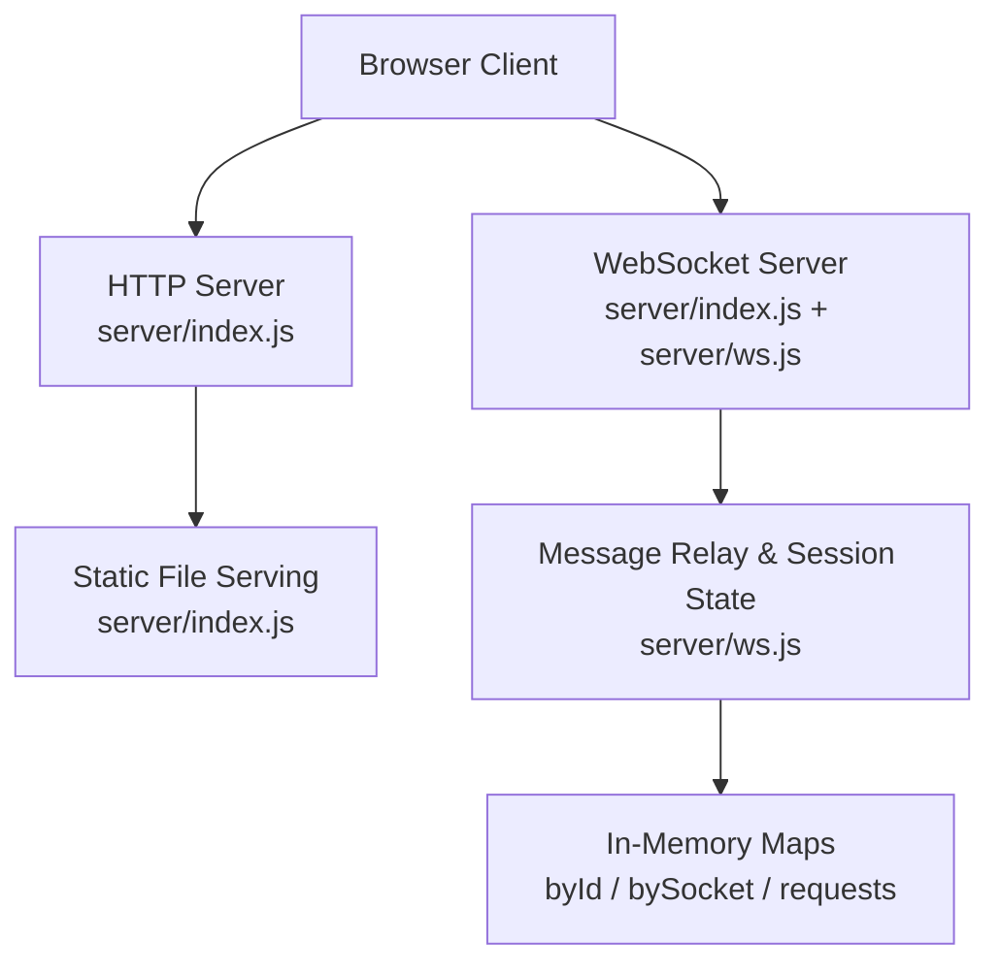

**Diagram sources**
- [server/index.js:41-89](file://server/index.js#L41-L89)
- [server/index.js:91-115](file://server/index.js#L91-L115)
- [server/ws.js:23-34](file://server/ws.js#L23-L34)
- [server/ws.js:257-312](file://server/ws.js#L257-L312)

**Section sources**
- [server/index.js:1-116](file://server/index.js#L1-L116)
- [server/ws.js:1-313](file://server/ws.js#L1-L313)
- [package.json:1-19](file://package.json#L1-L19)

## Core Components
- HTTP server with strict security headers and CSP.
- Static file server with path traversal protection and cache-control policies.
- WebSocket server integrated via ws with manual upgrade handling.
- Event-driven message router dispatching actions like session creation, search, contact exchange, messaging, and chat termination.
- In-memory state maps for sessions, socket-to-connection mapping, and pending contact requests.
- Per-action token-bucket rate limiter.
- Proof-of-work challenge issuance and verification to mitigate abuse.

**Section sources**
- [server/index.js:24-89](file://server/index.js#L24-L89)
- [server/ws.js:5-21](file://server/ws.js#L5-L21)
- [server/ws.js:36-65](file://server/ws.js#L36-L65)
- [server/ws.js:93-120](file://server/ws.js#L93-L120)
- [server/ws.js:257-312](file://server/ws.js#L257-L312)

## Architecture Overview
The server runs an HTTP/HTTPS-capable Node.js server that serves static assets and upgrades compatible requests to WebSocket connections. The WebSocket layer implements a privacy-preserving relay: it never inspects or decrypts message payloads. All client-side cryptography occurs in the browser.

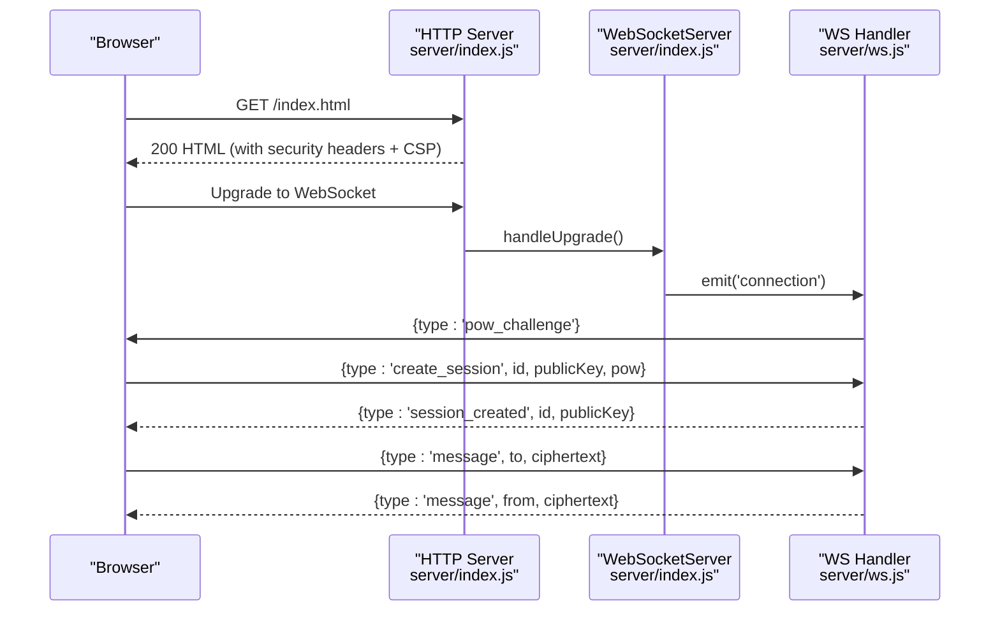

**Diagram sources**
- [server/index.js:73-107](file://server/index.js#L73-L107)
- [server/ws.js:93-105](file://server/ws.js#L93-L105)
- [server/ws.js:150-179](file://server/ws.js#L150-L179)
- [server/ws.js:231-240](file://server/ws.js#L231-L240)

## Detailed Component Analysis

### HTTP Server Setup, Static Files, Security Headers, and CSP
- Static file serving:
  - Resolves requested paths under a public directory.
  - Guards against path traversal by normalizing and validating resolved paths.
  - Serves files with appropriate MIME types and sets Cache-Control: no-store to avoid caching sensitive crypto code.
- Security headers:
  - Content-Security-Policy restricts resources to same-origin and allows ws/wss for WebSocket communication.
  - X-Content-Type-Options: nosniff prevents MIME sniffing.
  - X-Frame-Options: DENY prevents clickjacking.
  - Referrer-Policy: no-referrer minimizes leakage.
  - Permissions-Policy disables camera, microphone, geolocation, and interest-cohort.
  - Cross-Origin-Opener-Policy and Cross-Origin-Resource-Policy set to same-origin.
  - Strict-Transport-Security is included; effective when served over TLS (e.g., behind Railway).
- Method enforcement:
  - Only GET and HEAD are allowed for HTTP endpoints; others return 405.

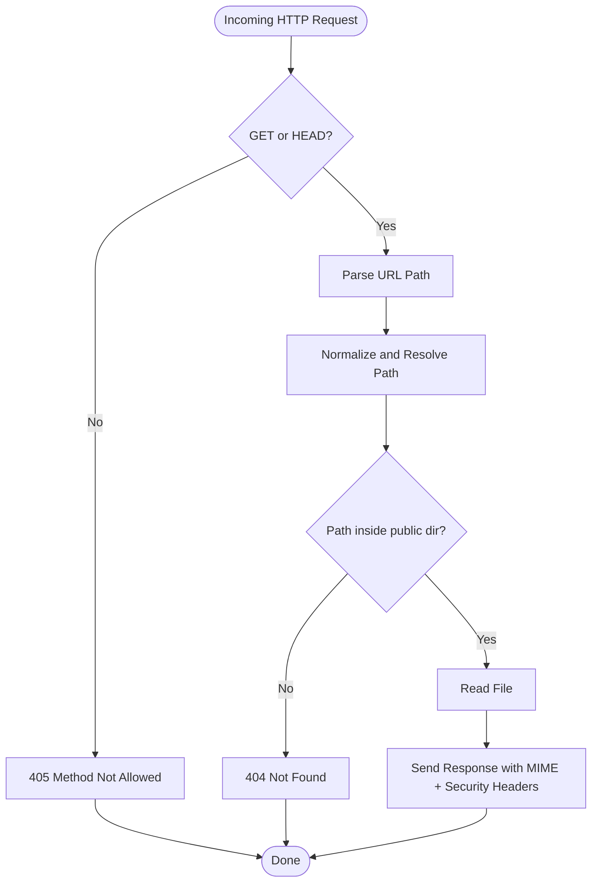

**Diagram sources**
- [server/index.js:41-71](file://server/index.js#L41-L71)
- [server/index.js:73-89](file://server/index.js#L73-L89)

**Section sources**
- [server/index.js:14-22](file://server/index.js#L14-L22)
- [server/index.js:24-39](file://server/index.js#L24-L39)
- [server/index.js:41-71](file://server/index.js#L41-L71)
- [server/index.js:73-89](file://server/index.js#L73-L89)

### WebSocket Server Implementation (ws)
- Integration:
  - The HTTP server creates a WebSocketServer with noServer: true and delegates upgrade handling.
  - On 'upgrade', the server checks for the required sec-websocket-key header and rejects invalid upgrades by destroying the socket.
  - Valid upgrades are passed to wss.handleUpgrade, which emits a 'connection' event handled by ws.js.
- Configuration:
  - maxPayload is capped at 16 KB to prevent oversized frames.
  - No IP logging or retention; only connection acceptance occurs.

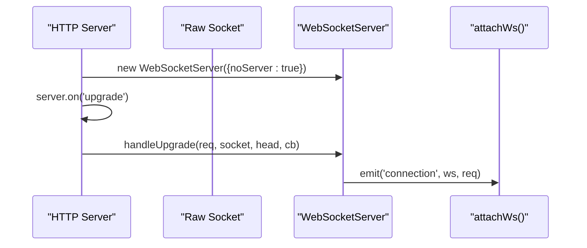

**Diagram sources**
- [server/index.js:91-107](file://server/index.js#L91-L107)

**Section sources**
- [server/index.js:91-107](file://server/index.js#L91-L107)

### Message Routing and Event-Driven Architecture
- attachWs registers a 'connection' handler that:
  - Creates a per-connection object with buckets, session, and PoW state.
  - Parses incoming messages as JSON and routes by msg.type.
  - Enforces that certain actions require an established session.
- Supported message types:
  - pow_challenge: issues a new PoW challenge.
  - create_session: validates identity, key format, and PoW; creates or resumes a session.
  - search: presence check for a target ID.
  - contact_request/contact_response: request/response flow establishing adjacency metadata.
  - message: relays encrypted payload to the target if online.
  - end_chat: tears down adjacency and notifies both sides.
  - ping/pong: keepalive.

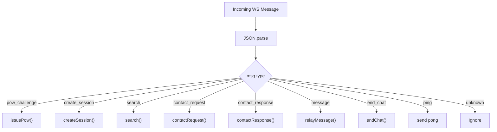

**Diagram sources**
- [server/ws.js:257-312](file://server/ws.js#L257-L312)

**Section sources**
- [server/ws.js:257-312](file://server/ws.js#L257-L312)

### Session Management and In-Memory State
- Data structures:
  - byId: Map from session id to session object (includes ws, publicKey, peers Set, graceTimer).
  - bySocket: Map from WebSocket instance to connection object (buckets, session, pow).
  - requests: Map from requestId to request metadata (from, to, expiry).
- Lifecycle:
  - handleDisconnect removes socket mappings, marks session offline, notifies peers, and schedules teardown after a grace period.
  - createSession validates inputs, handles reconnection within grace window, and updates peer adjacency upon successful contact exchange.
  - teardown fully removes session and cleans up peer references.

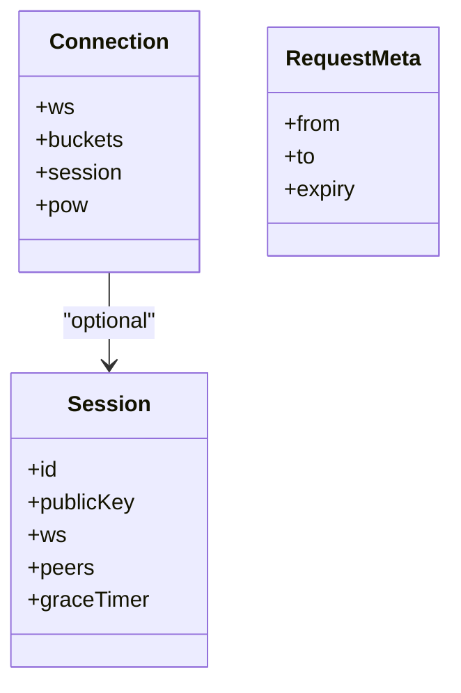

**Diagram sources**
- [server/ws.js:23-34](file://server/ws.js#L23-L34)
- [server/ws.js:122-179](file://server/ws.js#L122-L179)

**Section sources**
- [server/ws.js:23-34](file://server/ws.js#L23-L34)
- [server/ws.js:122-179](file://server/ws.js#L122-L179)

### Rate Limiting
- Token bucket implementation:
  - Each connection maintains per-action buckets with capacity and refill rate.
  - allow(conn, action) enforces limits for search, contact, message, and create.
- Limits:
  - search: burst 10, refill 10/30 per second.
  - contact: burst 5, refill 5/60 per second.
  - message: burst 40, refill 40/20 per second.
  - create: burst 3, refill 3/60 per second.

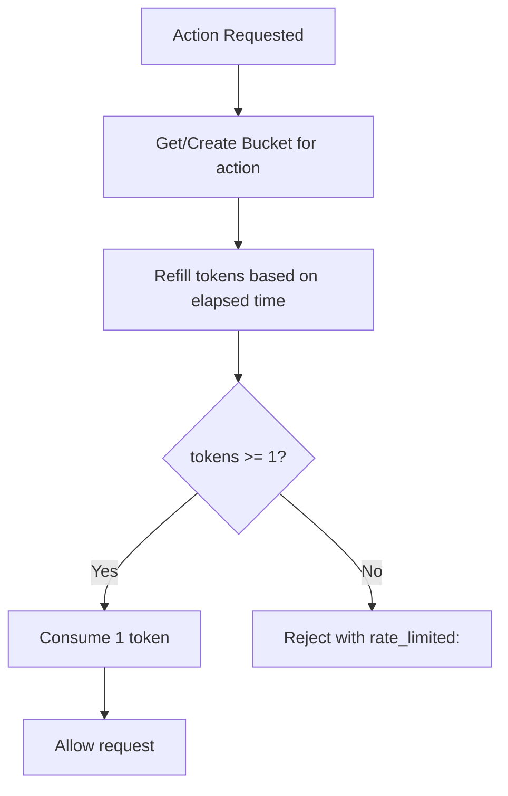

**Diagram sources**
- [server/ws.js:36-65](file://server/ws.js#L36-L65)

**Section sources**
- [server/ws.js:5-21](file://server/ws.js#L5-L21)
- [server/ws.js:36-65](file://server/ws.js#L36-L65)

### Proof-of-Work Challenge-Response
- Issuance:
  - issuePow generates a random challenge and sends it to the client with difficulty.
- Verification:
  - verifyPow ensures nonce is within bounds and SHA-256(challenge:nonce) starts with the required number of leading zeros.
- Client cooperation:
  - The client solves the PoW and returns the nonce along with session creation.

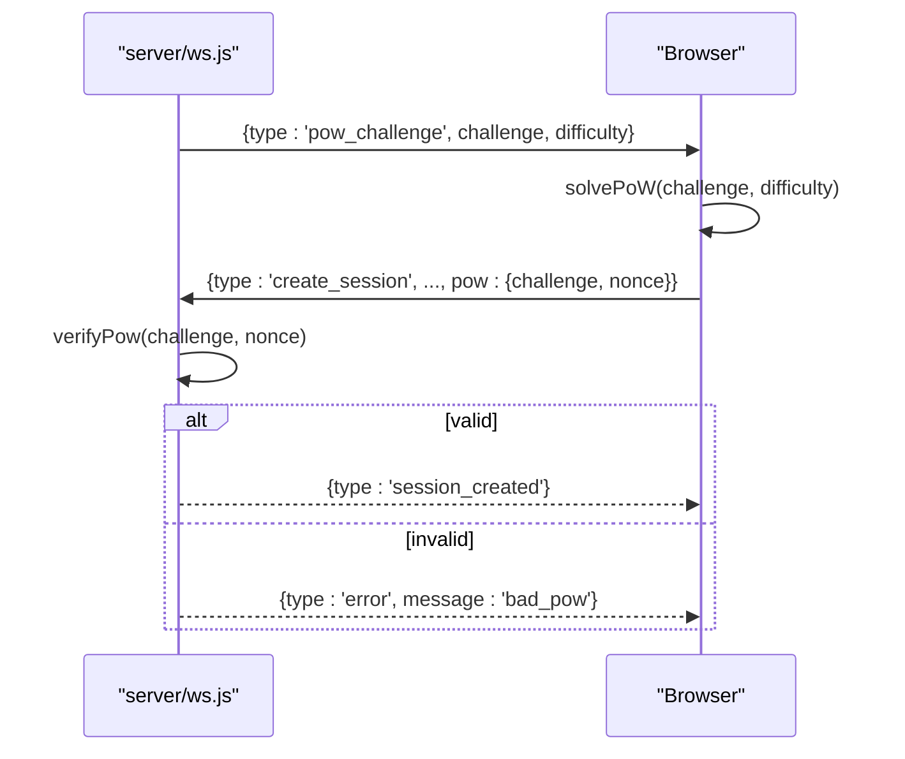

**Diagram sources**
- [server/ws.js:93-105](file://server/ws.js#L93-L105)
- [server/ws.js:150-179](file://server/ws.js#L150-L179)

**Section sources**
- [server/ws.js:93-105](file://server/ws.js#L93-L105)

### Message Relay Logic
- relayMessage:
  - Validates ciphertext size and base64 encoding.
  - Checks target presence; if offline, responds with peer_offline.
  - Forwards the opaque ciphertext to the target without inspecting content.
- Privacy guarantee:
  - The server never sees plaintext or keys; it only relays base64-encoded ciphertext between connected peers.

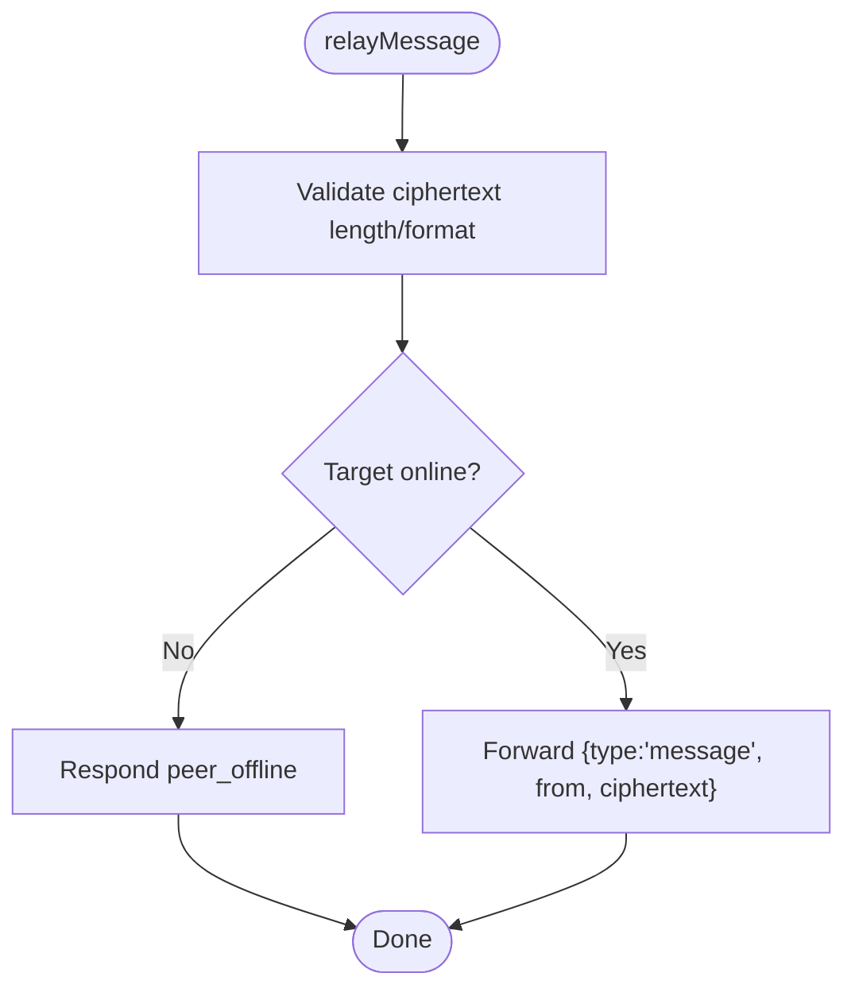

**Diagram sources**
- [server/ws.js:231-240](file://server/ws.js#L231-L240)

**Section sources**
- [server/ws.js:111-120](file://server/ws.js#L111-L120)
- [server/ws.js:231-240](file://server/ws.js#L231-L240)

### Error Handling, Cleanup, and Graceful Shutdown
- Error handling:
  - Malformed messages are dropped silently.
  - Broken pipes during send are ignored.
  - Errors are returned as structured error messages to clients.
- Connection cleanup:
  - handleDisconnect removes socket mappings, marks session offline, notifies peers, and schedules teardown after a grace period.
  - Periodic pruning removes expired pending contact requests.
- Graceful shutdown:
  - The server does not implement explicit process signal handlers; ensure the hosting platform terminates gracefully and closes sockets.

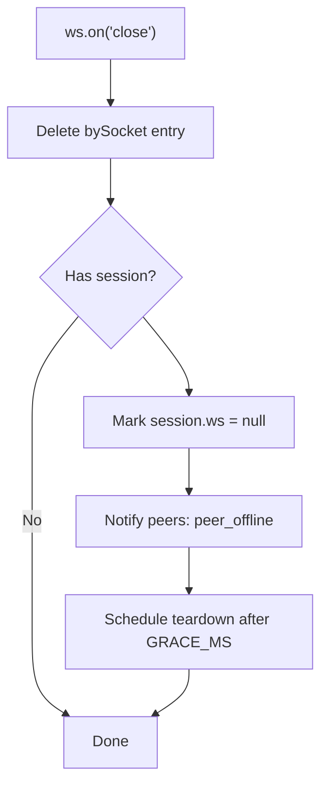

**Diagram sources**
- [server/ws.js:133-148](file://server/ws.js#L133-L148)
- [server/ws.js:305-312](file://server/ws.js#L305-L312)

**Section sources**
- [server/ws.js:133-148](file://server/ws.js#L133-L148)
- [server/ws.js:305-312](file://server/ws.js#L305-L312)

### Configuration Options, Environment Variables, and Deployment
- Environment variables:
  - PORT: Server listening port; defaults to 3000 if unset.
- Runtime tunables (in-memory):
  - POW_DIFFICULTY: Required leading hex zeros for PoW.
  - POW_NONCE_MAX: Maximum nonce value accepted.
  - GRACE_MS: Reconnect window after tab close before full teardown.
  - CIPHER_MAX_BYTES: Max acceptable ciphertext size.
  - LIMITS: Per-action rate limits (capacity, refill rate).
- Dependencies:
  - ws ^8.18.0.
- Deployment considerations:
  - Serve over TLS (e.g., Railway) so HSTS is effective.
  - Ensure upstream proxies pass WebSocket Upgrade headers correctly.
  - Keep memory usage bounded; all state is in RAM and will be lost on restart.

**Section sources**
- [server/index.js:111-115](file://server/index.js#L111-L115)
- [server/ws.js:5-13](file://server/ws.js#L5-L13)
- [server/ws.js:15-21](file://server/ws.js#L15-L21)
- [package.json:14-16](file://package.json#L14-L16)

## Dependency Analysis
The backend has minimal external dependencies and clear internal coupling:
- server/index.js depends on ws and node built-ins (http, crypto, fs, path, url).
- server/ws.js depends only on node crypto and exposes attachWs for integration.
- Frontend app.js and crypto.js operate independently of the server’s internals, communicating via well-defined WebSocket messages.

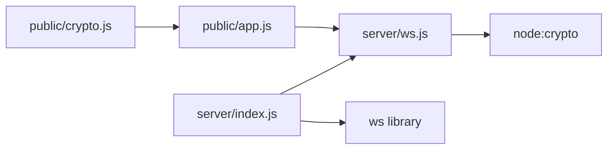

**Diagram sources**
- [server/index.js:1-9](file://server/index.js#L1-L9)
- [server/ws.js:1-3](file://server/ws.js#L1-L3)
- [package.json:14-16](file://package.json#L14-L16)

**Section sources**
- [server/index.js:1-9](file://server/index.js#L1-L9)
- [server/ws.js:1-3](file://server/ws.js#L1-L3)
- [package.json:14-16](file://package.json#L14-L16)

## Performance Considerations
- Static file serving uses synchronous path resolution and asynchronous file reads; consider adding caching layers in production if needed, while preserving no-store for crypto-sensitive assets.
- WebSocket payload cap at 16 KB protects against memory pressure; message payloads are further constrained by client-side encryption limits.
- Rate limiting uses simple token buckets with O(1) operations per action; monitor per-connection map growth under high churn.
- Grace periods reduce churn but may retain stale sessions briefly; tune GRACE_MS according to expected reconnect patterns.
- Avoid enabling verbose logging to preserve privacy and reduce overhead.

[No sources needed since this section provides general guidance]

## Troubleshooting Guide
Common issues and resolutions:
- 405 Method Not Allowed:
  - Ensure HTTP requests use GET or HEAD; other methods are rejected by the server.
- 404 Not Found:
  - Verify requested paths resolve within the public directory; path traversal attempts are blocked.
- WebSocket handshake failures:
  - Confirm the client sends the sec-websocket-key header and the proxy supports WebSocket upgrades.
- Rate-limited errors:
  - Reduce frequency of search, contact, message, or create actions; adjust LIMITS if necessary.
- bad_pow or id_taken:
  - Retry session creation after solving a fresh PoW; choose a different id if taken.
- too_large:
  - Keep plaintext under 2 KB; the client enforces this limit before sending.

**Section sources**
- [server/index.js:85-89](file://server/index.js#L85-L89)
- [server/index.js:55-62](file://server/index.js#L55-L62)
- [server/ws.js:150-179](file://server/ws.js#L150-L179)
- [server/ws.js:231-240](file://server/ws.js#L231-L240)

## Conclusion
The server provides a secure, privacy-first real-time messaging backbone:
- Strict HTTP security headers and CSP minimize attack surface.
- WebSocket relay forwards only opaque ciphertext, ensuring end-to-end encryption remains client-controlled.
- In-memory state and per-action rate limiting protect against abuse while keeping the system lightweight.
- Proof-of-work adds a cost barrier to automated enumeration and spam.
- Clear event-driven architecture simplifies extension and maintenance.

For production deployments, ensure TLS termination, proper proxy configuration for WebSocket upgrades, and monitoring of memory usage given the in-memory design.

[No sources needed since this section summarizes without analyzing specific files]