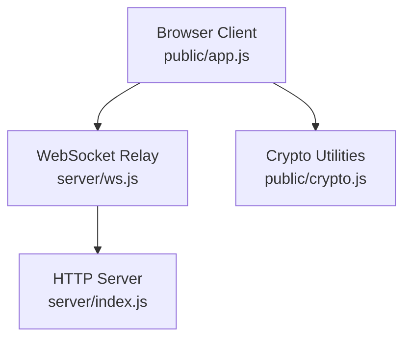
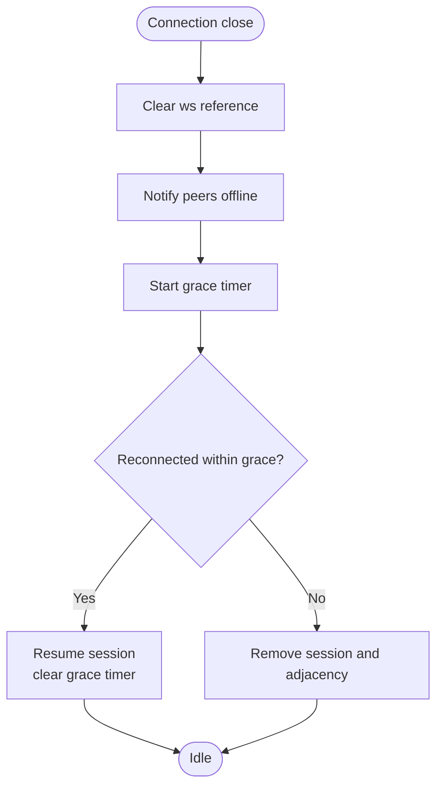
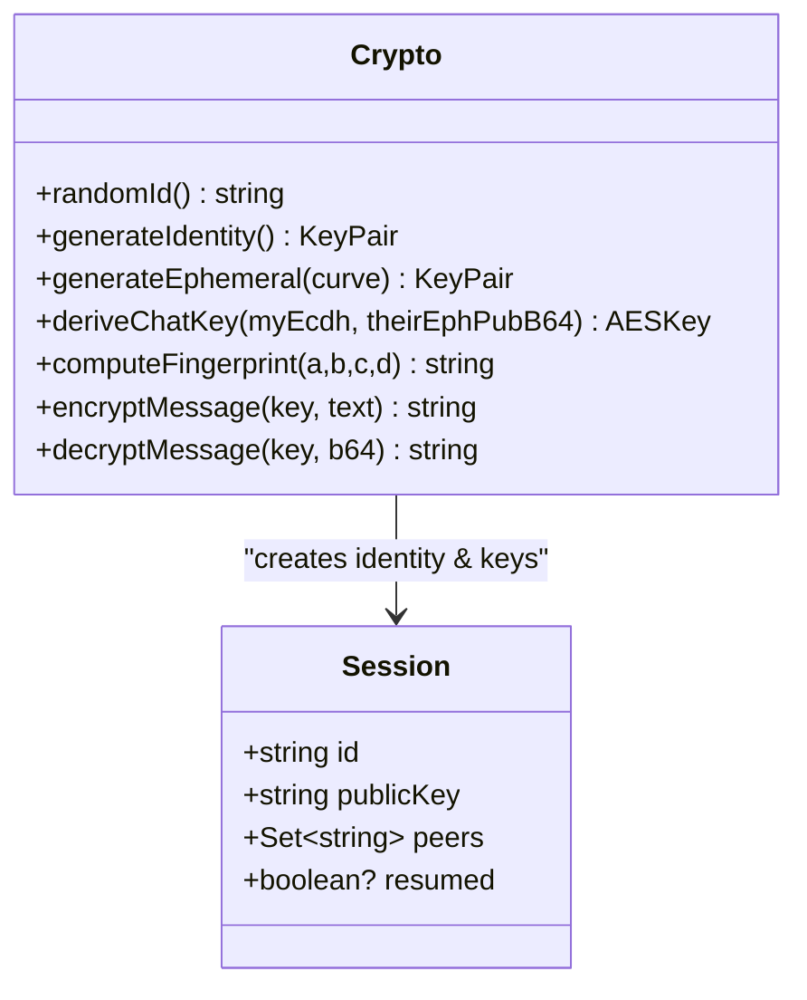
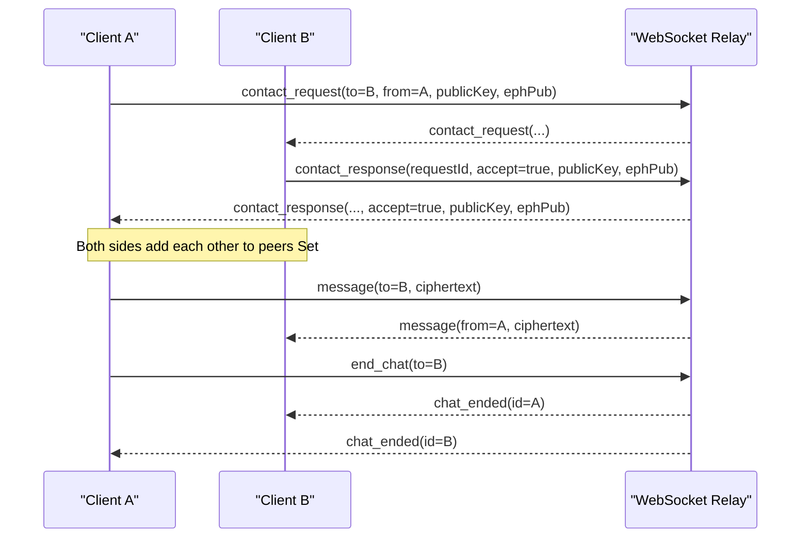
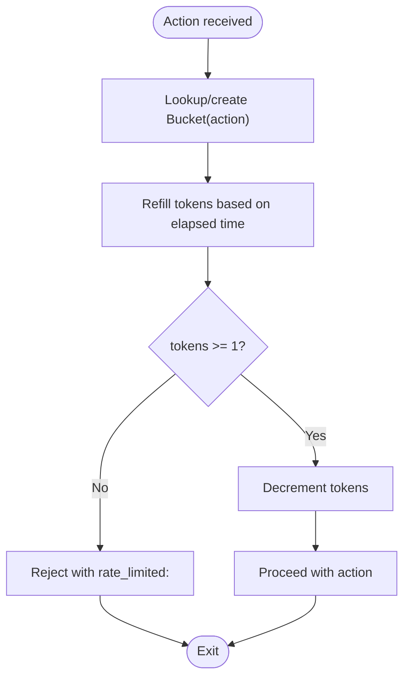
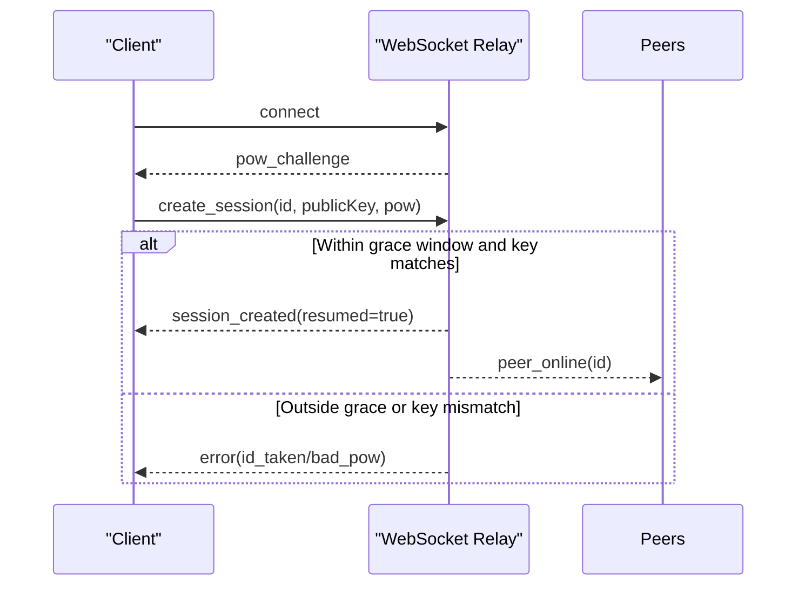
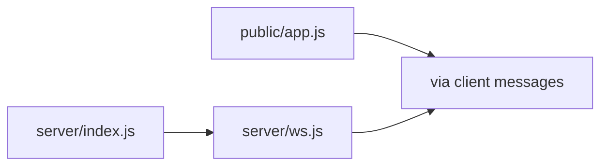

# Session Management

<cite>
**Referenced Files in This Document**
- [server/index.js](file://server/index.js)
- [server/ws.js](file://server/ws.js)
- [public/app.js](file://public/app.js)
- [public/crypto.js](file://public/crypto.js)
- [package.json](file://package.json)
</cite>

## Table of Contents
1. Introduction
2. Project Structure
3. Core Components
4. Architecture Overview
5. Detailed Component Analysis
6. Dependency Analysis
7. Performance Considerations
8. Troubleshooting Guide
9. Conclusion
10. Appendices

## Introduction
This document explains the session management system for anonymous, end-to-end encrypted messaging. It focuses on how user state and connections are tracked in memory, how identities are generated to preserve anonymity, how peer relationships are maintained, how rate limiting is enforced per action type, and how sessions can be recovered within a grace period after reconnection. It also covers memory considerations, scalability limits of in-memory storage, and migration paths to persistent backends.

## Project Structure
The application consists of:
- A Node.js HTTP server that serves static assets and upgrades WebSocket connections.
- A WebSocket relay module that manages in-memory sessions, peers, requests, and rate limiting.
- A browser client that handles UI, cryptographic operations, and WebSocket protocol flows.



**Diagram sources**
- [server/index.js:73-115](file://server/index.js#L73-L115)
- [server/ws.js:258-312](file://server/ws.js#L258-L312)
- [public/app.js:75-120](file://public/app.js#L75-L120)
- [public/crypto.js:167-241](file://public/crypto.js#L167-L241)

**Section sources**
- [server/index.js:1-116](file://server/index.js#L1-L116)
- [server/ws.js:1-313](file://server/ws.js#L1-L313)
- [public/app.js:1-624](file://public/app.js#L1-L624)
- [public/crypto.js:1-242](file://public/crypto.js#L1-L242)
- [package.json:1-19](file://package.json#L1-L19)

## Core Components
- In-memory session storage using Maps for O(1) lookups by ID and by socket.
- Session lifecycle from creation, presence updates, to cleanup with a grace window.
- Identity generation system producing random base32 identifiers and ephemeral keys for anonymity and forward secrecy.
- Peer relationship tracking maintaining chat adjacency, online status, and connection metadata.
- Rate limiting via token buckets per action type (search, contact, message, create).
- Session recovery allowing reconnection within a grace period without losing identity.

**Section sources**
- [server/ws.js:23-34](file://server/ws.js#L23-L34)
- [server/ws.js:122-179](file://server/ws.js#L122-L179)
- [public/crypto.js:39-45](file://public/crypto.js#L39-L45)
- [public/crypto.js:167-172](file://public/crypto.js#L167-L172)
- [server/ws.js:15-21](file://server/ws.js#L15-L21)
- [server/ws.js:37-65](file://server/ws.js#L37-L65)

## Architecture Overview
The server exposes an HTTP endpoint serving static files and upgrading to WebSocket. The WebSocket relay maintains all runtime state in RAM and forwards only ciphertext between peers. Clients generate identities and per-chat ephemeral keys locally; the server never sees plaintext or private keys.

```mermaid
sequenceDiagram
participant C as "Client"
participant S as "HTTP Server"
participant W as "WebSocket Relay"
participant P as "Peer"
C->>S : GET /index.html
S-->>C : Static assets
C->>S : Upgrade to WebSocket
S->>W : connection(ws, req)
W-->>C : pow_challenge
C->>W : create_session(id, publicKey, pow)
W-->>C : session_created(resumed?)
C->>W : search(targetId)
W-->>C : search_result(found)
C->>W : contact_request(to, fromId, publicKey, ephPub)
W-->>P : contact_request(...)
P-->>W : contact_response(requestId, accept, ...)
W-->>C : contact_response(...)
C->>W : message(to, ciphertext)
W-->>P : message(from, ciphertext)
Note over W,P : No store-and-forward; offline peers do not receive messages
```

**Diagram sources**
- [server/index.js:91-109](file://server/index.js#L91-L109)
- [server/ws.js:94-105](file://server/ws.js#L94-L105)
- [server/ws.js:150-179](file://server/ws.js#L150-L179)
- [server/ws.js:181-240](file://server/ws.js#L181-L240)
- [public/app.js:99-120](file://public/app.js#L99-L120)

## Detailed Component Analysis

### In-Memory Session Storage and Lifecycle
- Global Maps:
  - byId: maps session id to session object.
  - bySocket: maps WebSocket instance to connection metadata.
  - requests: maps requestId to request metadata with expiry.
- Session object fields include id, publicKey, ws reference, peers Set, and optional graceTimer.
- Lifecycle:
  - Creation validates inputs, enforces rate limits, verifies proof-of-work, and either resumes an existing session within the grace window or creates a new one.
  - Presence: on disconnect, the session’s ws is cleared and peers are notified offline; a grace timer schedules teardown if no reconnect occurs.
  - Teardown removes the session from byId and cleans adjacency from peers’ sets.



**Diagram sources**
- [server/ws.js:133-148](file://server/ws.js#L133-L148)
- [server/ws.js:122-131](file://server/ws.js#L122-L131)

**Section sources**
- [server/ws.js:23-34](file://server/ws.js#L23-L34)
- [server/ws.js:122-179](file://server/ws.js#L122-L179)

### Identity Generation and Anonymity
- Random base32 identifiers are generated client-side using cryptographically secure randomness.
- Each session has an identity keypair (X25519 or P-256 fallback), used to establish trust and derive per-chat keys.
- Per-chat ephemeral keypairs provide forward secrecy; shared secrets are derived via ECDH + HKDF.
- Fingerprints combine identity and ephemeral public keys for out-of-band verification.



**Diagram sources**
- [public/crypto.js:39-45](file://public/crypto.js#L39-L45)
- [public/crypto.js:167-172](file://public/crypto.js#L167-L172)
- [public/crypto.js:191-221](file://public/crypto.js#L191-L221)
- [public/crypto.js:223-241](file://public/crypto.js#L223-L241)
- [server/ws.js:150-179](file://server/ws.js#L150-L179)

**Section sources**
- [public/crypto.js:39-45](file://public/crypto.js#L39-L45)
- [public/crypto.js:167-172](file://public/crypto.js#L167-L172)
- [public/crypto.js:191-221](file://public/crypto.js#L191-L221)
- [public/crypto.js:223-241](file://public/crypto.js#L223-L241)

### Peer Relationship Tracking
- Adjacency: when a contact request is accepted, both sides add each other to their peers Set.
- Presence: on disconnect, the server notifies all peers that the user is offline; on reconnect, it notifies peers they are online.
- Chat end: both sides remove adjacency and notify each other to reset UI state.



**Diagram sources**
- [server/ws.js:188-229](file://server/ws.js#L188-L229)
- [server/ws.js:231-255](file://server/ws.js#L231-L255)

**Section sources**
- [server/ws.js:188-255](file://server/ws.js#L188-L255)

### Rate Limiting with Token Buckets
- Per-action token buckets enforce burst and steady-state limits:
  - search: anti enumeration
  - contact: anti spam
  - message: burst then steady
  - create: account creation throttling
- Each connection maintains its own buckets map keyed by action type.
- Enforcement returns explicit error codes prefixed with “rate_limited:<action>”.



**Diagram sources**
- [server/ws.js:15-21](file://server/ws.js#L15-L21)
- [server/ws.js:37-65](file://server/ws.js#L37-L65)

**Section sources**
- [server/ws.js:15-21](file://server/ws.js#L15-L21)
- [server/ws.js:37-65](file://server/ws.js#L37-L65)

### Session Recovery Process
- On disconnect, the server clears the session’s ws and starts a grace timer.
- If the same client reconnects with the same id and matching public key within the grace window, the server resumes the session, clears the grace timer, and notifies peers online.
- If no reconnect occurs before the grace period expires, the session is torn down and adjacency cleaned.



**Diagram sources**
- [server/ws.js:133-179](file://server/ws.js#L133-L179)

**Section sources**
- [server/ws.js:133-179](file://server/ws.js#L133-L179)

### Code Examples (by reference)
- Session creation: see [server/ws.js:150-179](file://server/ws.js#L150-L179) for validation, rate limiting, PoW verification, resume logic, and response.
- Peer management: see [server/ws.js:188-255](file://server/ws.js#L188-L255) for contact request/response and adjacency updates, and [server/ws.js:231-255](file://server/ws.js#L231-L255) for message relay and chat end.
- Cleanup procedures: see [server/ws.js:122-148](file://server/ws.js#L122-L148) for disconnect handling, grace timer, and teardown.

**Section sources**
- [server/ws.js:122-179](file://server/ws.js#L122-L179)
- [server/ws.js:188-255](file://server/ws.js#L188-L255)

## Dependency Analysis
- The HTTP server wires WebSocket upgrades and attaches the relay module.
- The relay depends on crypto for nonce-based challenges and uses in-memory Maps for state.
- The client depends on crypto utilities for identity and message encryption/decryption.



**Diagram sources**
- [server/index.js:91-109](file://server/index.js#L91-L109)
- [public/app.js:4-8](file://public/app.js#L4-L8)

**Section sources**
- [server/index.js:91-109](file://server/index.js#L91-L109)
- [public/app.js:4-8](file://public/app.js#L4-L8)

## Performance Considerations
- Time complexity:
  - Session lookup by id: O(1) average due to Map.
  - Peer notification: O(n) where n is number of peers for a given session.
  - Rate limiting: O(1) per action due to bucket lookup and arithmetic.
- Space complexity:
  - Linear in number of active sessions and connections.
  - Requests map grows with pending contact requests; pruned periodically.
- Message size limit:
  - Enforced server-side to prevent oversized payloads.
- Grace period:
  - Limits memory retention for disconnected clients while enabling seamless reconnection.

[No sources needed since this section provides general guidance]

## Troubleshooting Guide
Common errors and their meanings:
- rate_limited:create/contact/search/message: Action exceeded configured limits; wait and retry.
- too_large: Message exceeds maximum allowed size.
- id_taken: Another session holds the id or key mismatch during resume.
- bad_pow: Proof-of-work challenge invalid or expired.
- no_session: Action attempted without an established session.

Client-side handling displays user-friendly toasts for these cases.

**Section sources**
- [server/ws.js:89-91](file://server/ws.js#L89-L91)
- [server/ws.js:150-186](file://server/ws.js#L150-L186)
- [public/app.js:178-193](file://public/app.js#L178-L193)

## Conclusion
The session management system leverages in-memory Maps for fast lookups and minimal overhead, supports graceful reconnection within a short grace window, and enforces robust rate limiting per action type. Identities and per-chat keys are generated client-side to preserve anonymity and forward secrecy. While efficient for small-scale deployments, the in-memory design does not persist across restarts and scales linearly with active sessions. For production use, consider migrating to a persistent backend and distributed coordination layer.

[No sources needed since this section summarizes without analyzing specific files]

## Appendices

### Memory Management Considerations
- All state resides in RAM; process restart loses all sessions.
- Grace timers ensure timely cleanup of disconnected sessions.
- Periodic pruning of expired pending requests prevents unbounded growth.

**Section sources**
- [server/ws.js:305-312](file://server/ws.js#L305-L312)
- [server/ws.js:133-148](file://server/ws.js#L133-L148)

### Scalability Limitations of In-Memory Storage
- Single-process memory constraints cap concurrent sessions and connections.
- No replication or sharding; horizontal scaling requires sticky sessions or external coordination.
- Rate limiting is per-connection; global enforcement would need a shared store.

[No sources needed since this section provides general guidance]

### Migration Paths to Persistent Storage
- Replace Maps with a database-backed store:
  - Sessions: relational or document store keyed by id with fields for publicKey, ws handle, peers set, grace timer.
  - Connections: track active ws handles per session; invalidate on disconnect.
  - Requests: store with TTL and periodic cleanup jobs.
- Add persistence hooks:
  - On create_session: write session record.
  - On resume: update ws handle and clear grace timer.
  - On teardown: delete session and clean adjacency records.
- Externalize rate limiting:
  - Use Redis or similar for per-IP or per-session counters with configurable windows.
- Horizontal scaling:
  - Use a message bus or pub/sub to propagate presence and adjacency changes across nodes.
  - Sticky sessions or centralized routing to ensure messages reach the correct node.

[No sources needed since this section provides general guidance]