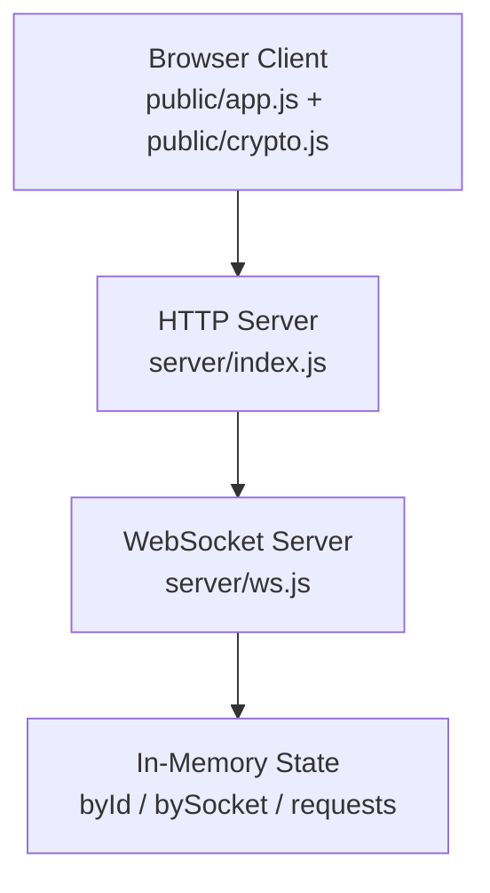
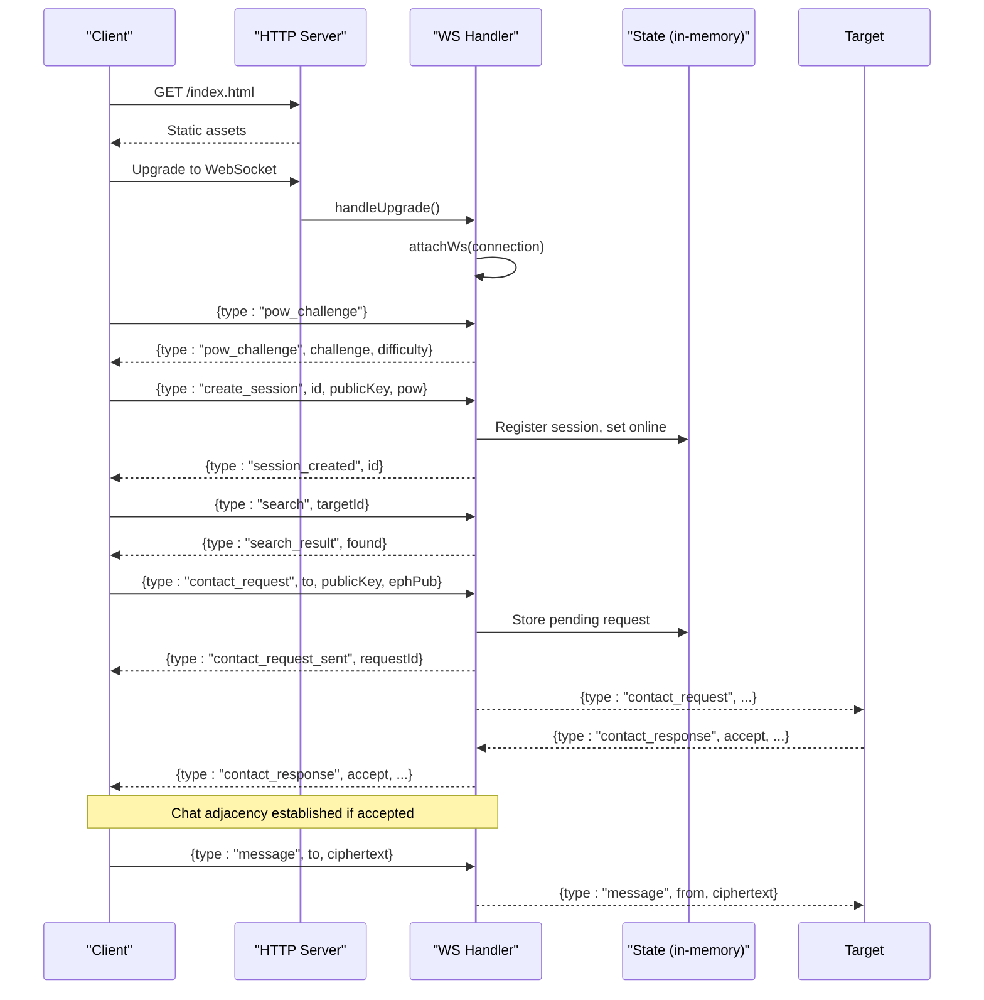
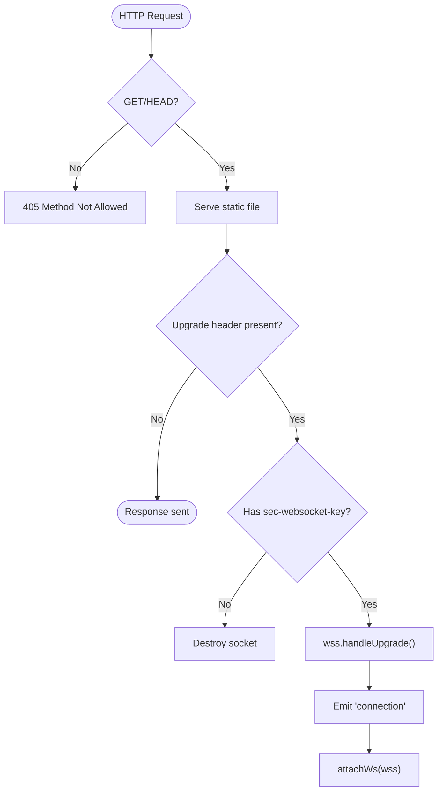
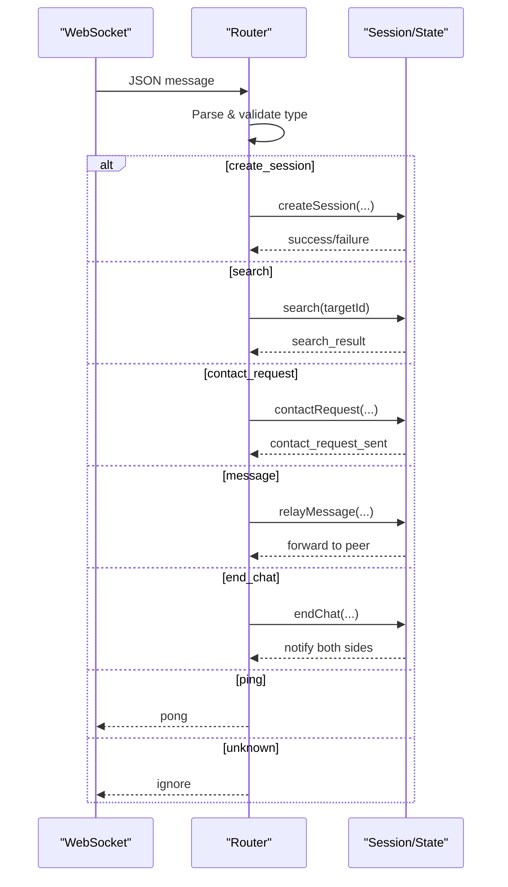
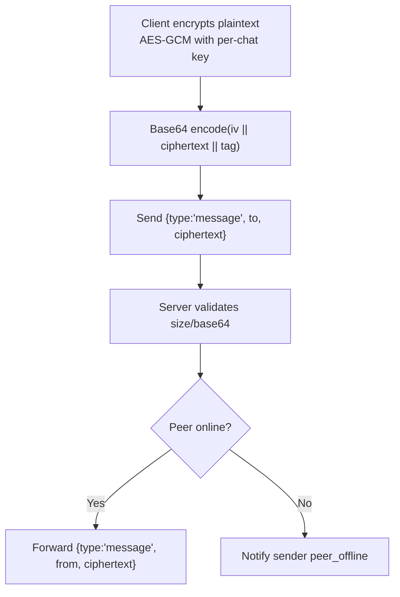
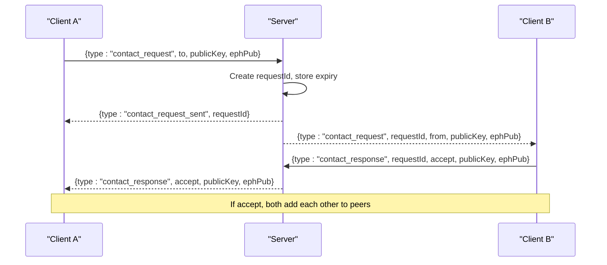
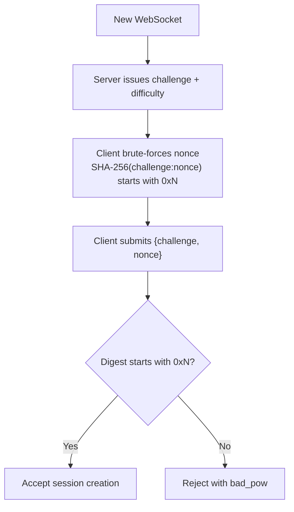
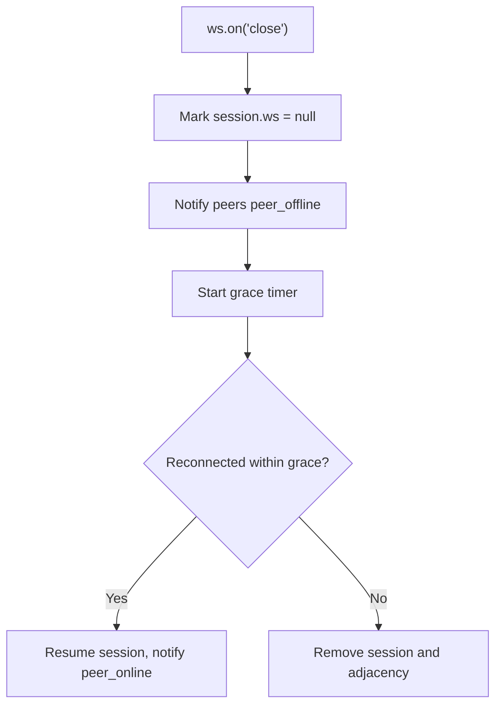
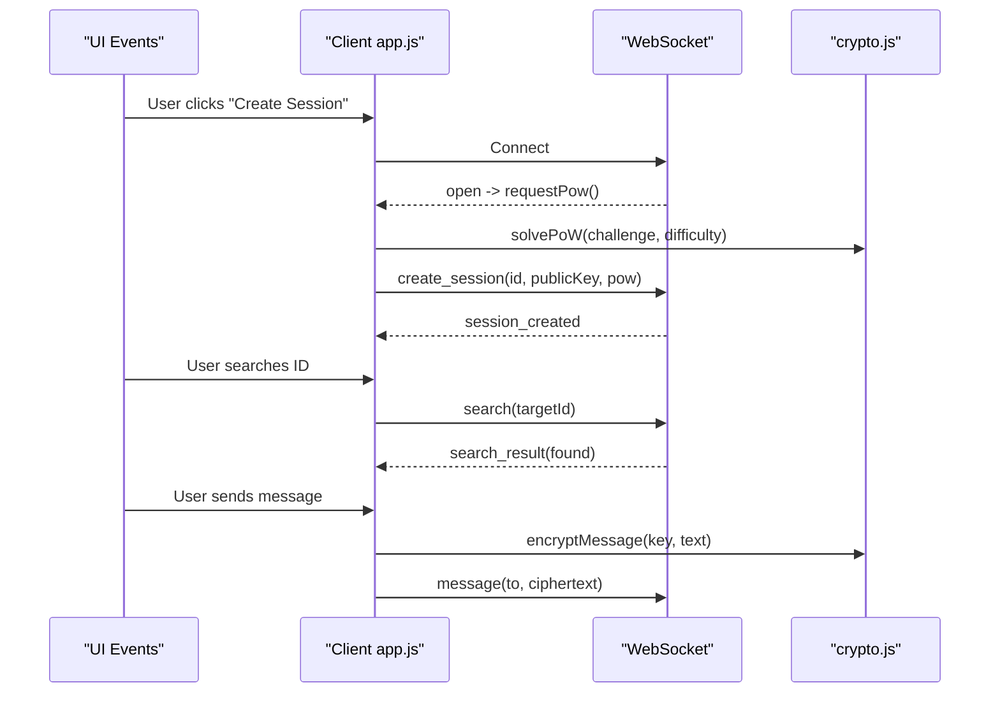
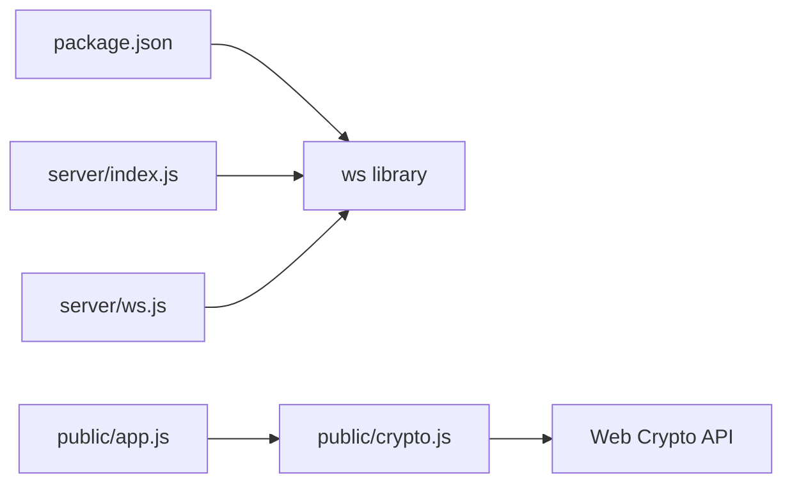

# WebSocket Protocol

<cite>
**Referenced Files in This Document**
- [server/index.js](file://server/index.js)
- [server/ws.js](file://server/ws.js)
- [public/app.js](file://public/app.js)
- [public/crypto.js](file://public/crypto.js)
- [package.json](file://package.json)
</cite>

## Table of Contents
1. [Introduction](#introduction)
2. [Project Structure](#project-structure)
3. [Core Components](#core-components)
4. [Architecture Overview](#architecture-overview)
5. [Detailed Component Analysis](#detailed-component-analysis)
6. [Dependency Analysis](#dependency-analysis)
7. [Performance Considerations](#performance-considerations)
8. [Troubleshooting Guide](#troubleshooting-guide)
9. [Conclusion](#conclusion)
10. [Appendices](#appendices)

## Introduction
This document describes the end-to-end WebSocket protocol used for real-time, encrypted messaging. It covers server initialization with the ws library, connection upgrade handling, message routing, binary payload format, peer discovery via ID-based search, contact request/response workflow, proof-of-work challenge-response anti-spam mechanism, error handling, and event-driven patterns on both client and server sides.

## Project Structure
The application consists of a Node.js HTTP server that serves static assets and upgrades to WebSocket connections, and a browser client that performs all cryptographic operations locally. The server maintains ephemeral in-memory state only (no logs or disk persistence).



**Diagram sources**
- [server/index.js:73-115](file://server/index.js#L73-L115)
- [server/ws.js:258-312](file://server/ws.js#L258-L312)

**Section sources**
- [server/index.js:1-116](file://server/index.js#L1-L116)
- [server/ws.js:1-313](file://server/ws.js#L1-L313)
- [public/app.js:1-624](file://public/app.js#L1-L624)
- [public/crypto.js:1-242](file://public/crypto.js#L1-L242)
- [package.json:1-19](file://package.json#L1-L19)

## Core Components
- WebSocket server initialization and upgrade wiring using the ws library.
- Connection lifecycle management with per-connection rate limiting and token buckets.
- Proof-of-work challenge issuance and verification to mitigate spam.
- Peer discovery via ID presence checks.
- Contact request/response handshake establishing chat adjacency.
- End-to-end encryption with AES-GCM and ECDH key derivation; server relays opaque ciphertext only.
- Graceful disconnection with presence propagation and cleanup.

**Section sources**
- [server/index.js:91-109](file://server/index.js#L91-L109)
- [server/ws.js:5-21](file://server/ws.js#L5-L21)
- [server/ws.js:93-105](file://server/ws.js#L93-L105)
- [server/ws.js:181-239](file://server/ws.js#L181-L239)
- [public/app.js:74-120](file://public/app.js#L74-L120)
- [public/crypto.js:129-241](file://public/crypto.js#L129-L241)

## Architecture Overview
The server runs an HTTP server that serves static files and handles WebSocket upgrades. On upgrade, it delegates to the WebSocket handler module which manages sessions, rate limits, and message routing. The client connects over ws/wss, solves a PoW challenge, creates a session, discovers peers by ID, exchanges contact requests/responses, and then sends encrypted messages through the server relay.



**Diagram sources**
- [server/index.js:91-109](file://server/index.js#L91-L109)
- [server/ws.js:258-312](file://server/ws.js#L258-L312)
- [public/app.js:99-120](file://public/app.js#L99-L120)
- [public/app.js:227-310](file://public/app.js#L227-L310)

## Detailed Component Analysis

### WebSocket Server Initialization and Upgrade
- The HTTP server sets strict security headers and serves static assets from the public directory.
- A WebSocketServer is created with noServer mode to integrate with the existing HTTP server.
- The upgrade handler validates the presence of the WebSocket key and forwards valid upgrades to the ws instance.
- The attachWs function registers connection handlers and routes messages.



**Diagram sources**
- [server/index.js:73-109](file://server/index.js#L73-L109)

**Section sources**
- [server/index.js:24-89](file://server/index.js#L24-L89)
- [server/index.js:91-109](file://server/index.js#L91-L109)

### Message Routing and Event Handling
- Each incoming message is parsed as JSON and dispatched by type.
- Supported types include pow_challenge, create_session, search, contact_request, contact_response, message, end_chat, ping, and error responses.
- Unknown or malformed messages are ignored silently to avoid leaking information.



**Diagram sources**
- [server/ws.js:258-312](file://server/ws.js#L258-L312)

**Section sources**
- [server/ws.js:258-312](file://server/ws.js#L258-L312)

### Binary Message Format and Encryption
- All chat payloads are base64-encoded ciphertexts produced by the client’s crypto module.
- The server enforces size constraints and validates base64 structure without inspecting content.
- Plaintext never leaves the client; the server only relays opaque strings.



**Diagram sources**
- [public/crypto.js:223-241](file://public/crypto.js#L223-L241)
- [server/ws.js:231-239](file://server/ws.js#L231-L239)

**Section sources**
- [public/crypto.js:223-241](file://public/crypto.js#L223-L241)
- [server/ws.js:111-120](file://server/ws.js#L111-L120)
- [server/ws.js:231-239](file://server/ws.js#L231-L239)

### Peer Discovery via ID-Based Search
- Clients send a search request with a target ID.
- The server checks if the target exists and is currently connected, returning a boolean result without exposing additional metadata.

```mermaid
sequenceDiagram
participant C as "Client A"
participant S as "Server"
participant T as "Client B"
C->>S : {type : "search", targetId}
S->>S : Lookup byId[targetId] && ws active?
S-->>C : {type : "search_result", targetId, found}
Note over S,T : Only presence exposed; no other info leaked
```

**Diagram sources**
- [server/ws.js:181-186](file://server/ws.js#L181-L186)
- [public/app.js:596-603](file://public/app.js#L596-L603)

**Section sources**
- [server/ws.js:181-186](file://server/ws.js#L181-L186)
- [public/app.js:596-603](file://public/app.js#L596-L603)

### Contact Request/Response Workflow
- Initiator generates an ephemeral keypair and sends a contact_request including its identity public key and ephemeral public key.
- Server stores a short-lived request record and forwards the request to the recipient.
- Recipient responds with accept/reject; if accepted, both sides establish chat adjacency and derive a shared key using their ephemeral keys.



**Diagram sources**
- [server/ws.js:188-229](file://server/ws.js#L188-L229)
- [public/app.js:237-310](file://public/app.js#L237-L310)

**Section sources**
- [server/ws.js:188-229](file://server/ws.js#L188-L229)
- [public/app.js:237-310](file://public/app.js#L237-L310)

### Proof-of-Work Challenge-Response
- On connect, the server issues a challenge with a difficulty level indicating required leading zeros.
- The client computes SHA-256(challenge:nonce) until the prefix matches, respecting a maximum nonce bound.
- The server verifies the nonce against the issued challenge and difficulty.



**Diagram sources**
- [server/ws.js:93-105](file://server/ws.js#L93-L105)
- [public/crypto.js:113-127](file://public/crypto.js#L113-L127)

**Section sources**
- [server/ws.js:5-7](file://server/ws.js#L5-L7)
- [server/ws.js:93-105](file://server/ws.js#L93-L105)
- [public/crypto.js:113-127](file://public/crypto.js#L113-L127)

### Error Handling and Graceful Disconnection
- Malformed messages are dropped silently.
- Rate limiting returns structured error codes for search, contact, message, and create actions.
- On disconnect, the server marks the session offline, notifies peers, and schedules teardown after a grace period to allow reconnection within the same identity window.



**Diagram sources**
- [server/ws.js:123-148](file://server/ws.js#L123-L148)
- [server/ws.js:150-179](file://server/ws.js#L150-L179)

**Section sources**
- [server/ws.js:123-148](file://server/ws.js#L123-L148)
- [server/ws.js:150-179](file://server/ws.js#L150-L179)
- [server/ws.js:258-312](file://server/ws.js#L258-L312)

### Event-Driven Patterns
- Server-side: event emitter pattern via ws events (connection, message, close, error) drives state transitions and message routing.
- Client-side: DOM events trigger UI actions; WebSocket events drive authentication, messaging, and presence updates.



**Diagram sources**
- [public/app.js:74-120](file://public/app.js#L74-L120)
- [public/app.js:227-310](file://public/app.js#L227-L310)
- [public/app.js:324-359](file://public/app.js#L324-L359)
- [public/crypto.js:113-127](file://public/crypto.js#L113-L127)
- [public/crypto.js:191-241](file://public/crypto.js#L191-L241)

**Section sources**
- [public/app.js:74-120](file://public/app.js#L74-L120)
- [public/app.js:227-310](file://public/app.js#L227-L310)
- [public/app.js:324-359](file://public/app.js#L324-L359)
- [public/crypto.js:113-127](file://public/crypto.js#L113-L127)
- [public/crypto.js:191-241](file://public/crypto.js#L191-L241)

## Dependency Analysis
- The server depends on the ws library for WebSocket functionality and Node built-ins for crypto and filesystem access.
- The client depends on Web Crypto API for ECDH, HKDF, AES-GCM, and SHA-256.
- The server has no external dependencies beyond ws; the client has no npm dependencies.



**Diagram sources**
- [package.json:14-16](file://package.json#L14-L16)
- [server/index.js:8-9](file://server/index.js#L8-L9)
- [server/ws.js:3](file://server/ws.js#L3)
- [public/app.js:4-8](file://public/app.js#L4-L8)
- [public/crypto.js:129-241](file://public/crypto.js#L129-L241)

**Section sources**
- [package.json:1-19](file://package.json#L1-L19)
- [server/index.js:1-116](file://server/index.js#L1-L116)
- [server/ws.js:1-313](file://server/ws.js#L1-L313)
- [public/app.js:1-624](file://public/app.js#L1-L624)
- [public/crypto.js:1-242](file://public/crypto.js#L1-L242)

## Performance Considerations
- Rate limiting uses token buckets to prevent abuse and maintain fairness across search, contact, message, and create actions.
- Maximum payload sizes are enforced to protect memory and bandwidth.
- Grace periods reduce churn during tab refreshes and transient network issues.
- Client-side PoW yields to the event loop periodically to keep the UI responsive while solving challenges.

[No sources needed since this section provides general guidance]

## Troubleshooting Guide
Common errors and their meanings:
- rate_limited:search/contact/message/create — too many actions; wait before retrying.
- too_large — message exceeds the allowed size limit.
- id_taken — requested identifier is already in use or mismatched during reconnect.
- bad_key — invalid public key format or length.
- bad_pow — proof-of-work verification failed; re-solve and retry.
- no_session — action attempted before session creation; authenticate first.

Client-side handling displays user-friendly toasts and resets UI states appropriately.

**Section sources**
- [server/ws.js:89-91](file://server/ws.js#L89-L91)
- [server/ws.js:150-179](file://server/ws.js#L150-L179)
- [server/ws.js:181-239](file://server/ws.js#L181-L239)
- [public/app.js:178-193](file://public/app.js#L178-L193)

## Conclusion
The protocol implements secure, real-time messaging with minimal server trust: the server only relays opaque ciphertext and enforces rate limits and size constraints. Authentication is secured via proof-of-work, and end-to-end encryption ensures confidentiality and integrity. The design emphasizes privacy (no logs, no storage), resilience (graceful reconnection), and usability (event-driven flows and clear error feedback).

[No sources needed since this section summarizes without analyzing specific files]

## Appendices

### Message Types Reference
- pow_challenge: Server-initiated challenge with difficulty.
- create_session: Client authenticates with id, publicKey, and solved pow.
- search: Presence check for a target ID.
- contact_request: Initiates a chat with identity and ephemeral public keys.
- contact_request_sent: Acknowledges delivery of a contact request.
- contact_request_failed: Indicates failure reason (e.g., offline).
- contact_response: Accept or reject a contact request with optional keys.
- message: Encrypted payload to a peer.
- chat_ended: Terminates a chat adjacency on both sides.
- peer_online / peer_offline: Presence updates.
- error: General error response with a code string.

**Section sources**
- [server/ws.js:93-105](file://server/ws.js#L93-L105)
- [server/ws.js:150-255](file://server/ws.js#L150-L255)
- [public/app.js:124-176](file://public/app.js#L124-L176)