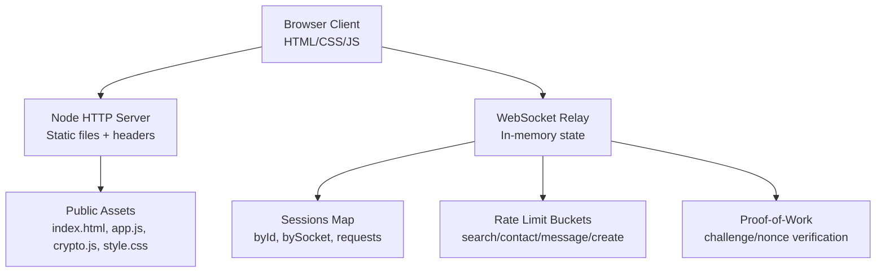
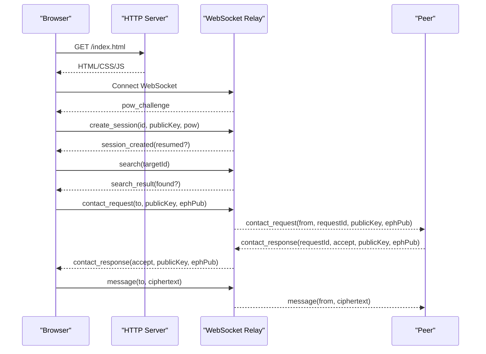
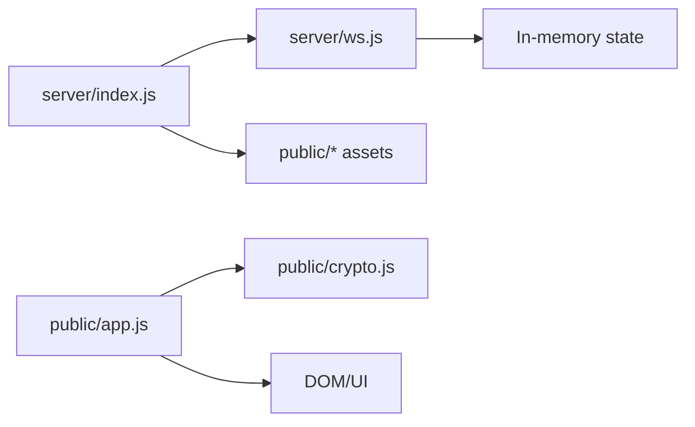

# Troubleshooting

<cite>
**Referenced Files in This Document**
- [package.json](file://package.json)
- [server/index.js](file://server/index.js)
- [server/ws.js](file://server/ws.js)
- [public/index.html](file://public/index.html)
- [public/app.js](file://public/app.js)
- [public/crypto.js](file://public/crypto.js)
- [public/style.css](file://public/style.css)
- [.gitignore](file://.gitignore)
</cite>

## Table of Contents
1. [Introduction](#introduction)
2. [Project Structure](#project-structure)
3. [Core Components](#core-components)
4. [Architecture Overview](#architecture-overview)
5. [Detailed Component Analysis](#detailed-component-analysis)
6. [Dependency Analysis](#dependency-analysis)
7. [Performance Considerations](#performance-considerations)
8. [Troubleshooting Guide](#troubleshooting-guide)
9. [Conclusion](#conclusion)
10. [Appendices](#appendices)

## Introduction
This document provides comprehensive troubleshooting guidance for Shh V1.0, an anonymous real-time end-to-end encrypted messaging application. It focuses on diagnosing and resolving connection problems, cryptographic errors, performance issues, rate limiting triggers, spam prevention behavior, and common user-facing failures such as message delivery, contact discovery, and session recovery. It also includes debugging techniques for both client and server sides, browser developer tools usage, diagnostic strategies, testing approaches, known limitations, and platform-specific workarounds.

## Project Structure
Shh V1.0 is a Node.js HTTP + WebSocket server serving static frontend assets. The frontend implements the full E2EE protocol in the browser using Web Crypto API. There is no database or persistent logs; all state lives in memory.

**Diagram sources**
- [server/index.js:73-115](file://server/index.js#L73-L115)
- [server/ws.js:23-21](file://server/ws.js#L23-L21)
- [public/index.html:103-103](file://public/index.html#L103-L103)

**Section sources**
- [package.json:1-19](file://package.json#L1-L19)
- [server/index.js:1-116](file://server/index.js#L1-L116)
- [public/index.html:1-106](file://public/index.html#L1-L106)

## Core Components
- HTTP server with strict security headers and CSP that allows same-origin assets and ws/wss connections.
- WebSocket relay that forwards ciphertext only, never plaintext or keys.
- In-memory session management with grace periods for reconnects.
- Proof-of-work challenge to mitigate abuse.
- Client-side cryptography using Web Crypto API (ECDH key exchange, HKDF, AES-GCM).
- UI-driven flows for search, contact requests, chat establishment, and messaging.

Key responsibilities:
- Connection lifecycle and upgrade handling.
- Message routing and presence updates.
- Rate limiting per action type.
- Client authentication via proof-of-work and identity key validation.
- End-to-end encryption and decryption in the browser.

**Section sources**
- [server/index.js:24-84](file://server/index.js#L24-L84)
- [server/ws.js:1-21](file://server/ws.js#L1-L21)
- [public/crypto.js:1-10](file://public/crypto.js#L1-L10)

## Architecture Overview
The system uses a minimal architecture:
- Browser loads index.html and runs app.js and crypto.js.
- On “Create session,” the client connects over WebSocket, solves a proof-of-work challenge, and authenticates with its public key.
- The server validates inputs, enforces rate limits, and establishes sessions in memory.
- Clients discover peers by ID, exchange ephemeral keys, derive shared secrets, and establish chats.
- Messages are encrypted with AES-GCM and relayed without server visibility into content.

**Diagram sources**
- [public/app.js:75-120](file://public/app.js#L75-L120)
- [server/ws.js:258-303](file://server/ws.js#L258-L303)

## Detailed Component Analysis

### Connection Problems
Common symptoms:
- WebSocket handshake fails immediately.
- Connection drops after establishing but before session creation.
- Reconnect loops or does not resume session.

Likely causes:
- TLS termination at a reverse proxy or hosting platform (e.g., Railway) causing ws vs wss mismatch.
- Strict Content-Security-Policy blocking connect-src or script-src.
- Non-standard ports or proxies stripping required headers.
- Invalid sec-websocket-key leading to silent rejection.

Diagnostic steps:
- Inspect Network tab for WebSocket upgrade request/response and status codes.
- Verify CSP headers include connect-src allowing ws: and wss:.
- Confirm the client constructs the correct URL based on location.protocol (https -> wss, http -> ws).
- Check server logs for startup confirmation and port binding.

Resolution tips:
- Ensure deployment terminates TLS and routes ws/wss correctly.
- Keep CSP connect-src 'self' ws: wss: to allow WebSocket upgrades.
- Avoid custom middleware that strips or modifies WebSocket upgrade headers.
- If behind a proxy, ensure it preserves Upgrade and Sec-WebSocket-* headers.

**Section sources**
- [server/index.js:91-107](file://server/index.js#L91-L107)
- [server/index.js:24-39](file://server/index.js#L24-L39)
- [public/app.js:37-84](file://public/app.js#L37-L84)

### Certificate Issues
Symptoms:
- Mixed content warnings when loading assets over HTTPS but connecting via ws.
- Browser blocks WebSocket due to invalid or untrusted certificate.
- HSTS policy prevents fallback to insecure connections.

Diagnostics:
- Validate certificate chain and expiration in browser security panel.
- Confirm HSTS header is set appropriately for production deployments.
- Ensure all assets are served over HTTPS and no mixed-content resources exist.

Resolutions:
- Use valid certificates from trusted CAs.
- Do not disable HSTS in production; instead fix upstream TLS configuration.
- Serve all static assets over HTTPS and avoid external fonts/scripts.

**Section sources**
- [server/index.js:73-84](file://server/index.js#L73-L84)
- [public/index.html:1-10](file://public/index.html#L1-L10)

### Network Connectivity Problems
Symptoms:
- Frequent disconnects or timeouts.
- Slow connection establishment.
- Intermittent message delivery failures.

Diagnostics:
- Monitor WebSocket frames and ping/pong behavior.
- Check for network-level throttling or firewall rules blocking ws/wss.
- Validate server availability and port exposure.

Resolutions:
- Tune proxy timeouts and keep-alive settings if applicable.
- Ensure server listens on expected PORT environment variable.
- Reduce concurrent operations during high latency conditions.

**Section sources**
- [server/ws.js:292-293](file://server/ws.js#L292-L293)
- [server/index.js:111-115](file://server/index.js#L111-L115)

### Cryptographic Errors
Symptoms:
- Key exchange failures.
- Decryption errors showing “[не удалось расшифровать]”.
- Browser reports unsupported ECDH curves.

Causes:
- Web Crypto API not supporting X25519 or P-256.
- Curve negotiation mismatch between peers.
- Corrupted or malformed base64 public keys.
- Mismatched chat keys due to different curve selection.

Diagnostics:
- Check detectCurve result and whether preferredCurve is null.
- Validate public key lengths (X25519 raw = 32 bytes, P-256 uncompressed point = 65 bytes).
- Compare fingerprints out-of-band to rule out MITM.

Resolutions:
- Update browser to one supporting required curves.
- Ensure both peers use the same curve implied by ephemeral key length.
- Regenerate identities and ephemeral keys if corruption suspected.
- Use fingerprint comparison feature to verify authenticity.

**Section sources**
- [public/crypto.js:135-157](file://public/crypto.js#L135-L157)
- [public/crypto.js:174-186](file://public/crypto.js#L174-L186)
- [public/crypto.js:191-211](file://public/crypto.js#L191-L211)
- [public/app.js:559-567](file://public/app.js#L559-L567)
- [public/app.js:325-342](file://public/app.js#L325-L342)

### Browser Compatibility with Web Crypto API
Symptoms:
- Create button disabled with hint about missing ECDH support.
- Toast messages indicating unsupported cryptography.

Diagnostics:
- Run detectCurve and inspect returned curve.
- Test in multiple browsers to confirm compatibility.

Resolutions:
- Use modern browsers with Web Crypto API support for X25519/P-256.
- Fallback to P-256 if X25519 is unavailable.
- Provide user guidance to update browser.

**Section sources**
- [public/crypto.js:150-157](file://public/crypto.js#L150-L157)
- [public/app.js:559-567](file://public/app.js#L559-L567)

### Performance Issues
Symptoms:
- UI freezes during proof-of-work solving.
- High CPU usage while computing SHA-256 nonces.
- Memory growth due to many open sockets or large message queues.

Root causes:
- Brute-force nonce loop up to 5,000,000 iterations.
- Large payloads exceeding limits.
- Many concurrent WebSocket connections.

Mitigations:
- The PoW solver yields to the event loop periodically to keep UI responsive.
- Enforce max payload size and message size checks.
- Limit concurrent operations and monitor connection counts.

Optimization opportunities:
- Adjust POW_DIFFICULTY and POW_NONCE_MAX to balance security and performance.
- Implement background workers for heavy computations if needed.
- Monitor memory usage and prune inactive sessions promptly.

**Section sources**
- [public/crypto.js:113-127](file://public/crypto.js#L113-L127)
- [server/ws.js:6-10](file://server/ws.js#L6-L10)
- [server/index.js:91-95](file://server/index.js#L91-L95)

### WebSocket Connection Limits
Symptoms:
- New connections rejected or delayed under load.
- Existing connections drop unexpectedly.

Diagnostics:
- Count active sockets and sessions.
- Review server resource utilization (CPU, memory).
- Inspect error events and close reasons.

Resolutions:
- Scale horizontally if necessary.
- Tune server configurations for maximum concurrent connections.
- Gracefully handle disconnects and clean up sessions.

**Section sources**
- [server/ws.js:23-26](file://server/ws.js#L23-L26)
- [server/ws.js:133-148](file://server/ws.js#L133-L148)

### Debugging Techniques
Client-side:
- Use browser DevTools Network tab to inspect WebSocket frames.
- Monitor console for errors and toast notifications.
- Check profile panel for masked identity and public key values.
- Validate fingerprint comparison between peers.

Server-side:
- Observe startup log line confirming listening port.
- No request/connection logging is written intentionally; rely on client diagnostics.
- Use process monitoring tools to track CPU/memory usage.

Best practices:
- Reproduce issues in incognito mode to avoid cached state.
- Clear local state by resetting the app (logout) to isolate problems.
- Capture screenshots of error toasts and UI states.

**Section sources**
- [public/app.js:178-193](file://public/app.js#L178-L193)
- [server/index.js:111-115](file://server/index.js#L111-L115)

### Server Log Analysis
Observations:
- The server intentionally writes no request or connection logs to preserve privacy.
- Only a startup confirmation is logged.

Implications:
- Rely on client-side diagnostics and operational metrics (CPU, memory, uptime).
- Use infrastructure-level monitoring (hosting platform logs, APM tools) if available.
- Avoid enabling verbose logging unless necessary and secure.

**Section sources**
- [server/index.js:1-2](file://server/index.js#L1-L2)
- [server/index.js:111-115](file://server/index.js#L111-L115)

### Rate Limiting and Spam Prevention
Symptoms:
- Toast messages indicating too many searches, contact requests, messages, or session creations.
- Actions blocked temporarily.

Mechanism:
- Token bucket rate limiters per action type: search, contact, message, create.
- Limits defined with capacity and refill rates.

Diagnostics:
- Identify which action triggered rate limiting via error code prefix.
- Check frequency of actions relative to configured limits.

Resolutions:
- Space out actions to stay within limits.
- Adjust LIMITS constants if appropriate for your deployment context.
- Educate users about rate limits and anti-spam protections.

**Section sources**
- [server/ws.js:15-21](file://server/ws.js#L15-L21)
- [server/ws.js:37-65](file://server/ws.js#L37-L65)
- [public/app.js:178-193](file://public/app.js#L178-L193)

### Common User-Facing Problems
Message delivery failures:
- Cause: Peer offline or rate-limited sender.
- Behavior: No store-and-forward; messages are not queued.
- Resolution: Ensure peer is online; retry later; check rate limits.

Contact discovery issues:
- Cause: Invalid ID format or target not online.
- Behavior: Search returns found=false if target not present.
- Resolution: Verify ID format (base32, 12+ chars); ensure target is connected.

Session recovery problems:
- Cause: Identity key mismatch or grace period expired.
- Behavior: Resume only allowed if same identity key within grace window.
- Resolution: Reuse same identity; reconnect quickly; regenerate if necessary.

**Section sources**
- [server/ws.js:150-179](file://server/ws.js#L150-L179)
- [server/ws.js:181-186](file://server/ws.js#L181-L186)
- [server/ws.js:231-240](file://server/ws.js#L231-L240)
- [public/app.js:227-249](file://public/app.js#L227-L249)

### Diagnostic Tools and Testing Strategies
Tools:
- Browser Developer Tools (Network, Console, Application tabs).
- Process monitors (top, htop, PM2, Docker stats).
- Infrastructure dashboards (CPU, memory, uptime).

Testing strategies:
- Simulate PoW difficulty changes and observe UI responsiveness.
- Test curve detection across browsers (X25519 vs P-256).
- Validate message size limits and encryption/decryption flows.
- Stress test with multiple concurrent WebSocket connections.

Reproduction methods:
- Open multiple tabs to simulate multiple sessions.
- Force disconnects to test grace periods and reconnection logic.
- Inject malformed messages to verify robustness.

**Section sources**
- [public/crypto.js:113-127](file://public/crypto.js#L113-L127)
- [public/crypto.js:150-157](file://public/crypto.js#L150-L157)
- [server/ws.js:305-312](file://server/ws.js#L305-L312)

### Known Limitations and Platform Constraints
Limitations:
- No persistence: closing the tab ends the session and loses all data.
- No store-and-forward: offline peers do not receive queued messages.
- No logs: intentional design for privacy; debugging relies on client-side tools.
- Max message size: 2 KB plaintext cap enforced client and server side.

Platform constraints:
- Requires Node.js >= 18.
- Depends on Web Crypto API support for ECDH curves.
- CSP restricts external scripts/fonts/workers.

Workarounds:
- Use modern browsers with full Web Crypto support.
- Avoid relying on message persistence; design workflows accordingly.
- Respect CSP and serve only same-origin assets.

**Section sources**
- [package.json:1-19](file://package.json#L1-L19)
- [public/crypto.js:14-14](file://public/crypto.js#L14-L14)
- [server/index.js:24-39](file://server/index.js#L24-L39)

## Dependency Analysis
External dependencies:
- ws: WebSocket server implementation.
- Node built-ins: http, crypto, fs, path, url.

Internal module relationships:
- server/index.js serves static assets and wires WebSocket upgrade.
- server/ws.js handles WebSocket protocol, rate limiting, sessions, and PoW.
- public/app.js manages UI, WebSocket lifecycle, and message flow.
- public/crypto.js implements cryptographic primitives and key management.

**Diagram sources**
- [server/index.js:1-116](file://server/index.js#L1-L116)
- [server/ws.js:1-313](file://server/ws.js#L1-L313)
- [public/app.js:1-624](file://public/app.js#L1-L624)
- [public/crypto.js:1-242](file://public/crypto.js#L1-L242)

**Section sources**
- [package.json:14-16](file://package.json#L14-L16)
- [server/index.js:1-116](file://server/index.js#L1-L116)
- [server/ws.js:1-313](file://server/ws.js#L1-L313)
- [public/app.js:1-624](file://public/app.js#L1-L624)
- [public/crypto.js:1-242](file://public/crypto.js#L1-L242)

## Performance Considerations
- Proof-of-work difficulty impacts CPU usage; adjust POW_DIFFICULTY carefully.
- Message size limits prevent excessive memory consumption.
- WebSocket payload caps protect against oversized frames.
- Grace periods reduce churn but may retain state briefly.

Recommendations:
- Monitor CPU spikes during PoW solving.
- Profile memory usage under load.
- Consider scaling horizontally for high concurrency.
- Tune rate limits based on expected usage patterns.

[No sources needed since this section provides general guidance]

## Troubleshooting Guide

### Connection Problems
- Verify WebSocket upgrade success and CSP allowances.
- Check TLS termination and HSTS configuration.
- Ensure correct ws/wss URL construction.

**Section sources**
- [server/index.js:91-107](file://server/index.js#L91-L107)
- [public/app.js:37-84](file://public/app.js#L37-L84)

### Cryptographic Errors
- Validate curve support and key lengths.
- Compare fingerprints to rule out MITM.
- Regenerate keys if corruption suspected.

**Section sources**
- [public/crypto.js:135-157](file://public/crypto.js#L135-L157)
- [public/crypto.js:174-186](file://public/crypto.js#L174-L186)
- [public/app.js:325-342](file://public/app.js#L325-L342)

### Performance Issues
- Monitor PoW solver responsiveness.
- Enforce message size limits.
- Track connection counts and resource usage.

**Section sources**
- [public/crypto.js:113-127](file://public/crypto.js#L113-L127)
- [server/ws.js:6-10](file://server/ws.js#L6-L10)

### Rate Limiting and Spam Prevention
- Identify rate-limited actions via error codes.
- Space out actions to comply with limits.
- Adjust LIMITS constants if necessary.

**Section sources**
- [server/ws.js:15-21](file://server/ws.js#L15-L21)
- [server/ws.js:37-65](file://server/ws.js#L37-L65)
- [public/app.js:178-193](file://public/app.js#L178-L193)

### User-Facing Problems
- Message delivery: ensure peer online and within rate limits.
- Contact discovery: validate ID format and target presence.
- Session recovery: reuse identity key and reconnect quickly.

**Section sources**
- [server/ws.js:150-179](file://server/ws.js#L150-L179)
- [server/ws.js:181-186](file://server/ws.js#L181-L186)
- [server/ws.js:231-240](file://server/ws.js#L231-L240)

### Debugging Techniques
- Use browser DevTools for Network and Console inspection.
- Leverage process monitoring for server health.
- Reproduce issues with controlled scenarios.

**Section sources**
- [public/app.js:178-193](file://public/app.js#L178-L193)
- [server/index.js:111-115](file://server/index.js#L111-L115)

### Server Log Analysis
- Rely on client-side diagnostics due to no server logs.
- Use infrastructure monitoring for operational insights.

**Section sources**
- [server/index.js:1-2](file://server/index.js#L1-L2)
- [server/index.js:111-115](file://server/index.js#L111-L115)

## Conclusion
Shh V1.0 prioritizes privacy and simplicity by avoiding persistent storage and logs. Troubleshooting should focus on client-side diagnostics, browser compatibility, and operational monitoring. Understanding the cryptographic flows, rate limiting mechanisms, and connection lifecycle will help resolve most issues efficiently. For platform constraints, ensure modern browser support and proper TLS configuration.

[No sources needed since this section summarizes without analyzing specific files]

## Appendices

### Configuration Parameters
- POW_DIFFICULTY: Controls proof-of-work complexity.
- POW_NONCE_MAX: Upper bound for brute-force attempts.
- GRACE_MS: Reconnect window duration.
- CIPHER_MAX_BYTES: Maximum ciphertext size.
- LIMITS: Per-action rate limits (capacity, refill rate).

Adjust these parameters cautiously based on deployment needs and user experience goals.

**Section sources**
- [server/ws.js:6-10](file://server/ws.js#L6-L10)
- [server/ws.js:15-21](file://server/ws.js#L15-L21)

### Security Headers and CSP
- Strict CSP restricts external resources and allows ws/wss.
- Additional headers enhance security posture.

Ensure these headers remain intact when deploying behind proxies or CDNs.

**Section sources**
- [server/index.js:24-39](file://server/index.js#L24-L39)
- [server/index.js:73-84](file://server/index.js#L73-L84)